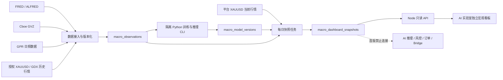

# AI 交易实验室独立宏观看板正式实施方案

## 1. 文档状态

- 文档类型：正式实施方案，尚未开始功能实现
- 方案基线：`D:\dev_codex\wall-street-skill-local`
- 基线分支：`main`
- 基线提交：`21b52b62ed5463a2d5f85fb8060dcf57b861134b`
- 编写日期：2026-08-13
- 需求来源：在 AI 交易实验室增加一个独立的黄金宏观看板，参考 Gold Monitor 的多因子信号强度、SHAP 归因瀑布图和体制切换预测
- 实施授权边界：本文件只授权保存方案，不授权编码、安装 Python 依赖、获取或购买数据、执行迁移、启动任务、部署、回填、发布或把宏观结果接入交易链路
- 当前结论：方案完成两轮复审后可作为实施基线；开始编码前仍需完成第 24 节的实施门槛

## 2. 需求结论与产品定位

### 2.1 最终需求

在 `/ai/` 内新增一个与 AI 分析师、AI 交易员、AI 风控师、AI 策略师和 AI 复盘师并列但业务独立的“宏观看板”模块，用统一、可追溯的数据回答三个问题：

1. 当前黄金主要受哪些宏观和市场因子推动；
2. 每个因子对模型预测产生了多少向上或向下的贡献；
3. 当前处于什么宏观体制，未来短期发生体制切换的概率是多少。

### 2.2 产品定位

首版定位为“黄金宏观研究与解释模块”，不是交易信号发生器，也不是第二套 AI 分析师。

- 面向 Plus、Pro 和管理员用户展示同一份平台级宏观结果；
- 不读取用户账号、余额、权益、持仓、挂单、手数或风险额度；
- 不调用 Bridge 执行，不生成 `order_intents`，不进入风险审批；
- 不改变现有策略、自动推理、共享信号、复盘或记忆库输入；
- 首版所有结果固定携带 `actionable:false`，用户文案使用“宏观偏向”而不是“买入/卖出”；
- 用户手动刷新只重新读取服务器最近快照，不触发外部数据抓取、模型训练或重新计算。

### 2.3 成功标准

用户进入页面后，应在 10 秒内回答：

- 当前黄金宏观环境偏多、偏空还是不确定；
- 最主要的三个驱动因子是什么；
- 数据截至何时，是否存在缺失或延迟；
- 模型目前健康、降级还是休眠；
- 当前体制及其切换风险是什么。

系统层面必须做到：

- 所有历史训练和回测只使用当时已经可知的数据；
- SHAP 基准值加全部贡献值能够还原模型预测；
- 模型失效或数据过期时不继续展示高置信度方向；
- 页面读取失败、外部数据失败和模型失败不影响现有 AI、交易、风控或 Bridge 链路；
- 任一页面结果可以追溯到数据版本、特征版本、模型版本和快照哈希。

## 3. 已验证现状

### 3.1 当前 AI 实验室

已从当前代码确认：

- AI 实验室前端由 `public/ai/index.html`、`public/ai/app.js`、`public/ai/styles.css` 和 `public/ai/responsive.css` 组成，没有独立前端构建步骤；
- 主导航已经按 AI 团队角色组织，页面切换通过 `data-tab` 和 `setTab()` 完成；
- `refreshTabData()` 已实现只加载当前页面数据的入口；
- 已内置 Chart.js 和 Lightweight Charts，可以复用；
- `observer-access.js` 同时控制 Plus/Pro 的页面白名单、HTTP GET 白名单和 WebSocket 只读能力；
- `/api` 与 `/aurum-api` 同时挂载 AI 路由，新增接口必须保持兼容；
- 静态资源使用显式查询参数作为缓存键，新增或修改入口资源时必须同步更新；
- 前端 `app.js` 和 `styles.css` 已很大，新模块继续全部写入主文件会增加维护和回归风险。

### 3.2 当前后端可复用能力

可以复用设计和基础设施，但不能直接复用业务表：

- `market_data_sources` 与 `market_candles` 可提供平台观摩源的 XAUUSD 当前价格和部分历史事实；
- `inference_snapshots` 证明系统已有冻结证据与内容哈希模式；
- `ai_model_tasks`、周期复盘和记忆任务已经实现租约、fencing token、幂等、重试和未知结果处理，可复用模式；
- 现有 Chart.js 懒加载、页面切换、统一会话、套餐权限和错误本地化可以直接复用；
- 统一管理后台固定为 `/admin/`，宏观数据和模型运维不得在 AI 实验室再建一套管理员界面。

### 3.3 当前缺口

当前仓库没有：

- FRED/ALFRED、Cboe GVZ、GPR 或授权证券日线的数据接入；
- 宏观序列的 `observation_at`、`available_at` 和 vintage 存储；
- Python、XGBoost、SHAP、HMM 或等价的确定性量化运行环境；
- 宏观特征版本、模型版本、训练报告和不可变看板快照；
- 宏观看板读取 API、前端页面、套餐白名单和自动化测试。

### 3.4 参考资料的使用边界

参考网站和用户提供的 PDF 只作为需求、信息架构与研究方法参考：

- 不复制参考站的模型参数、实时数值、回测结果、持仓、账户或交易推广；
- 不把参考站当前标记为 `SIMULATED` 的示例数据当作生产依据；
- 不把“100% 置信度”“强烈买入”等表达带入 AURUM；
- PDF 中的 IC、CPCV、Bootstrap、因子精简和模型冬眠思想需要重新复现，不能把文档声称的结果视为已验证；
- 参考站的账户净值、持仓、仓位和回测账户不进入本模块，它们在 AURUM 已有明确业务归属。

## 4. 目标与非目标

### 4.1 目标

1. 新增独立、只读、平台级的黄金宏观看板。
2. 建立可追溯的宏观数据接入、版本化、特征计算和快照链路。
3. 建立真实的 XGBoost 预测、SHAP 归因和概率型体制识别。
4. 建立模型健康门控，数据或模型不可靠时自动降级或休眠。
5. 复用 AURUM 现有会话、导航、视觉系统、Chart.js、套餐权限和部署方式。
6. 为未来可选的“宏观证据进入 AI 分析”保留稳定快照合同，但首版不接入。

### 4.2 非目标

首版明确不做：

- 自动下单、交易建议确认、风险审批或持仓管理；
- 用户自定义因子、任意公式、任意数据源或上传模型；
- 浏览器直接访问 FRED、Cboe、GPR 或行情供应商；
- 在请求期间实时训练模型；
- 用 LLM 生成 SHAP、因子值、概率或统计指标；
- 复制参考站的净值曲线、Kelly 仓位、账户统计和开户入口；
- 为每个用户训练个性化宏观模型；
- 支持黄金以外的品种；
- 修改 Bridge、MT4 EA、MT5 Worker 或本地 SQLite；
- 修改现有策略输出合同、信号结构、风控规则和订单链路；
- 在 AI 实验室提供数据源密钥、模型发布或任务重试管理。

## 5. 固定业务边界

### 5.1 全局结果，不按用户或账户变化

宏观看板是一份平台级研究结果。所有符合权限的用户读取同一个已发布快照：

- 不接受 `user_id`、交易账号、观摩频道或终端作为模型输入；
- 不因为用户切换观摩频道而改变宏观看板；
- 当前 XAUUSD 展示价格可以读取平台统一行情源，但必须标记该价格来源；
- 训练目标使用经过批准的统一历史行情源，禁止把不同经纪商历史静默拼接成一条训练序列。

### 5.2 与 AI 推理和交易隔离

首版数据流在 `macro_dashboard_snapshots` 终止：

- 不写入 `ai_signals`；
- 不创建或复用 `inference_snapshots`；
- 不使用 `ai_model_tasks`，因为宏观模型不是 LLM 供应商请求；
- 不写入策略记忆库；
- 不进入 period review、trade review 或 signal outcome；
- 不向 Bridge 发送任何命令。

### 5.3 未来集成边界

只有后续单独获得授权，并完成至少一个稳定观察周期后，才允许评估把宏观快照作为“只读证据”加入 AI 分析。未来集成仍必须满足：

- 默认关闭，按策略显式启用；
- 冻结快照 ID、模型版本和数据截止时间；
- 宏观证据缺失不能改变原策略的可执行性；
- 不允许模型把宏观偏向直接转换为绝对手数或绕过风控；
- 历史信号重放必须恢复当时宏观快照，不能使用当前快照。

## 6. 总体架构



### 6.1 职责分层

| 层 | 职责 | 明确禁止 |
|---|---|---|
| 数据接入 | 拉取、校验、保存原始观测与 vintage | 计算交易建议 |
| 特征层 | 按冻结公式生成 point-in-time 特征 | 使用未来修订值 |
| 训练层 | walk-forward/CPCV、训练、评测、产物哈希 | 自动发布不合格模型 |
| 快照层 | 加载已激活模型，生成当日预测、SHAP、体制和健康状态 | 请求期间训练 |
| API 层 | 权限、只读响应、ETag、错误与新鲜度 | 暴露密钥、原始供应商错误 |
| 前端层 | 解释、可视化、渐进披露、状态提示 | 重新计算核心统计或触发模型任务 |

### 6.2 运行形态

推荐使用“Node 编排 + 隔离 Python CLI”，不引入常驻 Python HTTP 服务：

- Node 后台任务负责租约、幂等、超时、重试、日志和数据库状态；
- Node 使用固定可执行路径和固定参数启动 Python，不拼接用户输入；
- Python CLI 负责 pandas/numpy/xgboost/shap/hmmlearn 或经批准的等价库；
- Python 只输出符合冻结 JSON Schema 的结果文件或标准输出；
- Node 校验 schema、大小、哈希、模型版本和租约后才写入最终快照；
- Python 环境使用独立 `pyproject.toml` 与锁文件，不写入全局 Python；
- 生产使用 `MACRO_PYTHON_BIN` 指向固定虚拟环境，禁止从网页修改。

如果生产服务器不能安全提供 Python 运行时，则停止在阶段 0，不得用 LLM、浏览器脚本或未经验证的纯 JS 近似替代 XGBoost/SHAP/HMM。

## 7. 数据源与许可门槛

### 7.1 推荐来源

| 数据 | 首选来源 | 用途 | 主要边界 |
|---|---|---|---|
| 10 年实际利率 | FRED/ALFRED `DFII10` | 利率与机会成本 | 保存实时期和修订版本 |
| 10 年盈亏平衡通胀 | FRED/ALFRED `T10YIE` | 通胀预期 | 保存实时期和修订版本 |
| 广义美元指数 | FRED/ALFRED `DTWEXBGS` | 美元水平与动量 | 页面名称必须写“广义美元指数”，不冒充 ICE DXY |
| 黄金波动率 | Cboe GVZ 历史数据 | 波动水平与动量 | 上线前复核展示与再分发条款 |
| 地缘政治风险 | Caldara-Iacoviello 日频 GPR | 地缘风险 | 保存下载日期和 vintage，遵守 CC BY 署名 |
| XAUUSD 日线 | 经批准的统一历史供应商 | 训练目标和黄金动量 | 禁止用不连续的用户终端历史拼接训练 |
| GDX 日线 | 经批准的统一历史供应商 | 黄金/矿业股背离 | 未完成授权时禁用该因子而不是伪造或替代 |
| 当前 XAUUSD | 平台市场源或经批准行情源 | 页面当前价格 | 与训练目标来源分开标注 |

#### 7.1.1 官方核验入口（2026-08-13）

- FRED `DFII10`：<https://fred.stlouisfed.org/series/DFII10>
- FRED `T10YIE`：<https://fred.stlouisfed.org/series/T10YIE>
- FRED `DTWEXBGS`：<https://fred.stlouisfed.org/series/DTWEXBGS>
- FRED/ALFRED observations 与 vintage 参数：<https://fred.stlouisfed.org/docs/api/fred/series_observations.html>
- Cboe 官方波动率历史数据页（包含 GVZ）：<https://www.cboe.com/tradable-products/vix/vix-historical-data>
- Caldara-Iacoviello GPR 官方入口：<https://www.matteoiacoviello.com/gpr.htm>
- 本需求参考站：<https://gold-monitor-delta.vercel.app/>

这些入口只证明系列和官方获取路径存在，不等于已经完成商业展示、缓存、再分发或衍生结果许可。阶段 0 仍需保存当时有效的条款、署名要求和批准记录；链接或条款变化时重新审查。

### 7.2 许可与可用性停止条件

实现前必须形成数据源登记表，记录：

- 供应商、接口、系列 ID、频率、时区、许可、署名要求；
- 历史起点、当前延迟、修订规则、缺失值规则和限流；
- 是否允许服务端存储、内部训练、向付费用户展示和缓存；
- 数据源退出或不可用时的替代和历史连续性策略。

以下任一项不明确时不得上线相应因子：

- 没有长期 XAUUSD 历史数据的合法使用权；
- GDX 数据只来自未承诺稳定性的非官方接口；
- GVZ 再展示条款未确认；
- FRED API Key 或供应商密钥需要下发浏览器；
- 训练历史存在无法解释的来源切换或价格断点。

### 7.3 数据源适配器

服务端适配器统一返回：

```json
{
  "series_key": "real_yield_10y",
  "provider": "fred",
  "provider_series_id": "DFII10",
  "observation_at_utc_msc": 0,
  "available_at_utc_msc": 0,
  "value": 0.0,
  "vintage_key": "YYYY-MM-DD",
  "source_revision": "optional-provider-revision",
  "source_hash": "sha256",
  "quality_status": "valid"
}
```

适配器不直接写最终快照。所有值先落入原始观测表，再由 point-in-time 查询生成特征。

## 8. 时间语义与防未来函数

### 8.1 三种时间必须分开

每个观测至少保存：

- `observation_at_utc_msc`：数据描述的经济或市场时点；
- `available_at_utc_msc`：该值最早可以被系统使用的时点；
- `ingested_at_utc_msc`：AURUM 实际取得该值的时点。

训练某个历史样本时，只允许选择 `available_at_utc_msc <= feature_cutoff_utc_msc` 的最高已知 vintage。禁止用当前修订后的全历史覆盖过去。

### 8.2 日界线

- 宏观快照使用 `America/New_York` 业务日定义并保存对应 UTC 截止时间，自动处理夏令时；
- 默认在纽约工作日结束、已等待主要日频来源更新后运行，实际运行时间在数据源预检后冻结；
- XAUUSD 训练目标使用统一行情供应商的明确日线 close 语义；
- 页面展示当前价格可以更实时，但不得把实时价格混入已冻结的日频特征；
- API 必须同时返回 `as_of_business_date`、`data_cutoff_utc_msc`、`generated_at_utc_msc` 和来源时区说明。

### 8.3 缺失和前向填充

每个系列有独立的最大填充期限：

- 美国利率、通胀和美元日频：最多跨 3 个对应市场工作日；
- GVZ：最多跨 3 个 Cboe 交易日；
- 日频 GPR：最多跨其正式更新周期加 1 天；
- XAUUSD/GDX：训练日必须有有效 close，禁止跨交易日伪造；
- 超出期限后特征状态为 `stale`，不得继续计算完整模型信号。

周末和市场假期不是自动缺失。日历判断必须区分“计划无数据”和“应有但缺失”。

## 9. 特征合同 V1

### 9.1 候选特征

首个研究版本冻结以下候选特征，最终激活集合由样本外验证决定：

| Key | 中文名称 | 计算口径 |
|---|---|---|
| `xau_momentum_20_60` | 黄金 20/60 日动量 | 20 日与 60 日对数收益的冻结组合 |
| `broad_usd_level_z` | 广义美元指数 | point-in-time 252 日 Z-Score |
| `broad_usd_momentum_20` | 美元 20 日动量 | 广义美元指数 20 日对数变化 |
| `breakeven_10y_z` | 10 年通胀预期 | T10YIE 的 point-in-time Z-Score |
| `real_inflation_spread_z` | 实际利率-通胀利差 | `DFII10 - T10YIE` 后再标准化 |
| `gpr_recent_z` | 地缘政治风险 | 日频 Recent GPR 的冻结 Z-Score |
| `gvz_level_z` | 黄金波动率 | GVZ 的冻结 Z-Score |
| `gvz_momentum_20` | 波动率动量 | GVZ 20 日变化或收益，公式在研究阶段二选一后冻结 |
| `gold_miners_divergence_20` | 黄金-矿业股背离 | XAU 与 GDX 20 日收益差，仅在授权与完整性通过后启用 |

### 9.2 标准化

- 默认窗口为向后 252 个有效观测，不包含当前观测之后的数据；
- 同时评估 126、252、504 窗口的方向稳定性；
- 窗口不是为了把负 IC 修成正 IC，方向长期反转必须视为因子语义或体制问题；
- Z-Score 分母过小、样本不足或窗口缺失时输出 `unavailable`；
- Winsorize 或极值裁剪的阈值必须在训练折内拟合，不能用全样本阈值；
- 所有特征公式、窗口、填充和裁剪规则进入 `feature_schema_json` 和 schema hash。

### 9.3 冗余和删因子规则

- 先计算训练折内 Spearman 相关矩阵；
- `|r| > 0.8` 只产生候选冗余警告，不自动删除；
- 通过消融实验比较“有该因子”和“无该因子”的样本外结果；
- 单因子 IC 为正不等于模型必须保留，单因子 IC 为负也不等于模型必须删除；
- 删除或恢复因子必须产生新的 feature schema 和模型版本，禁止原地改变已发布模型。

## 10. 预测目标与输出语义

### 10.1 回归目标

```text
y_reg(t) = log(XAU_close(t + 20 trading days) / XAU_close(t))
```

XGBoost 回归器输出未来 20 个交易日的预期对数收益。模型展示时可以转换为百分比，但原始输出和 SHAP 计算保持同一加法空间。

### 10.2 方向概率

使用独立分类器预测 `y_reg > 0` 的概率，并在纯样本外结果上执行概率校准。不得：

- 把 XGBoost 原始 score 当作置信度；
- 用训练集准确率生成方向概率；
- 把回归预测值机械映射成“100%”；
- 在校准样本不足时展示精确概率。

### 10.3 用户可见方向

用户可见方向由回归预测、校准概率和模型健康共同决定：

| 结果 | 条件原则 | 用户文案 |
|---|---|---|
| `bullish_strong` | 正收益、方向概率高、健康门控通过 | 明显偏多 |
| `bullish` | 正收益、概率通过一般阈值 | 偏多 |
| `neutral` | 收益接近 0 或概率不明确 | 中性 |
| `bearish` | 负收益、概率通过一般阈值 | 偏空 |
| `bearish_strong` | 负收益、方向概率高、健康门控通过 | 明显偏空 |
| `unavailable` | 数据或模型门控失败 | 暂不判断 |

精确阈值通过历史校准确定并存入模型版本，禁止散落在前端。所有状态都固定 `actionable:false`。

### 10.4 不确定区间

- 优先使用样本外残差或共形预测生成 20 日预测区间；
- 区间算法必须只使用训练折和已完成的样本外残差；
- 样本不足时返回 `null`，不以固定正负百分比伪造区间。

## 11. XGBoost 训练与验证

### 11.1 训练原则

- 训练、校准和最终测试按时间顺序隔离；
- 目标重叠 20 个交易日，训练与验证之间至少保留 20 个交易日净化间隙；
- 超参数搜索只在训练折内完成；
- 首版保持浅树、较高 `min_child_weight`、低学习率、行列采样和早停；
- 不以提高训练集 Sharpe 或拟合完整历史为目标；
- 所有随机种子、依赖版本、CPU 线程数和输入哈希进入训练报告。

### 11.2 验证体系

至少包含：

1. 扩展窗口或滚动窗口 walk-forward；
2. 带 purge/embargo 的组合净化交叉验证；
3. 样本外 Spearman IC、ICIR 和方向准确率；
4. 分类概率 Brier score、ECE 或等价校准指标；
5. Bootstrap 置信区间；
6. 各因子消融与相关性报告；
7. 不同历史窗口和主要市场阶段的稳定性；
8. 与简单基线比较：零收益、历史均值、黄金动量和 GLD/XAU buy-and-hold。

### 11.3 模型发布门槛

模型训练完成不等于激活。候选模型必须：

- 通过全部 point-in-time 与数据泄漏测试；
- 在冻结的最终测试区间优于简单预测基线；
- CPCV/walk-forward 指标不存在由单一路径完全驱动的情况；
- SHAP additivity 测试通过；
- 概率校准达到模型版本冻结的验收线；
- 最大特征依赖、极端值和缺失情况可解释；
- 训练报告、模型文件和 feature schema 哈希一致；
- 由明确的人工发布步骤将状态从 `candidate` 改为 `active`。

如果没有模型通过，前端仍可展示原始因子和数据质量，但方向、SHAP 与切换预测显示“研究验证中”。禁止为了完成页面而降低门槛。

## 12. SHAP 归因合同

### 12.1 加法语义

首版 SHAP 只解释回归模型，单位与回归原始输出一致：

```text
base_value + sum(shap_contributions) = predicted_20d_log_return
```

API 同时返回原始小数和格式化所需精度，前端不得重新计算 SHAP。

### 12.2 每个贡献项

```json
{
  "factor_key": "real_inflation_spread_z",
  "label": "实际利率-通胀利差",
  "raw_value": 0.0,
  "z_score": 0.0,
  "contribution": 0.0,
  "direction": "bullish",
  "rank": 1,
  "quality_status": "valid",
  "observation_at_utc_msc": 0,
  "available_at_utc_msc": 0,
  "source_key": "fred:DFII10+T10YIE"
}
```

### 12.3 展示规则

- 按绝对贡献降序展示；
- 同时展示正贡献合计和负贡献合计；
- 中文交易语境保持“偏多/上涨”为红、“偏空/下跌”为绿；
- 每个颜色必须同时有正负号、方向文字或图标，不能只靠颜色；
- 贡献表示“模型为何得出该预测”，不表示因果关系；
- 页面必须显示“SHAP 是模型归因，不是经济因果证明”。

## 13. 体制识别与切换概率

### 13.1 目标

体制模型解释当前驱动结构，不直接预测交易方向。首版采用三状态概率模型：

1. 实际利率与美元主导；
2. 通胀与避险主导；
3. 中性或高波动过渡。

### 13.2 模型

- 首选 Gaussian HMM 或经研究确认的 Markov switching 模型；
- 输入使用冻结的宏观特征子集和必要的黄金波动/趋势统计；
- 状态数固定为 3，除非离线研究证明 2 或 4 状态显著更稳定；
- 每次训练后按状态中心和经济特征进行确定性重标记，防止 label switching；
- 模型版本保存状态中心、转移矩阵、标签映射和训练窗口。

### 13.3 输出

API 返回：

- 当前三个状态的后验概率；
- 当前最高概率状态；
- 下一交易日转移概率；
- 未来 5 个交易日“维持当前状态”和“离开当前状态”的概率；
- 最近 180 个有效交易日的状态概率轨迹；
- 当前置信度和 `uncertain` 标记。

未来 5 日概率由当前后验和冻结转移矩阵推导，不使用 LLM。最大概率低于模型版本阈值时，页面显示“体制不确定”，不强行归类。

### 13.4 稳定性门槛

- 不允许状态一天内因缺失值来回跳动；
- 状态标签跨重训必须通过中心匹配和历史重叠检查；
- 切换预测必须与简单持久性基线比较；
- 如果 HMM 不优于持久性基线，页面只展示当前宏观象限，不展示切换概率。

## 14. 模型健康与自动休眠

### 14.1 健康状态

| 状态 | 含义 | 页面行为 |
|---|---|---|
| `healthy` | 数据完整，滚动指标与校准正常 | 展示方向、区间、SHAP 和体制 |
| `degraded` | 指标接近下限或部分非关键数据延迟 | 展示结果但明确降级原因，不显示“明显偏多/偏空” |
| `sleeping` | 模型预测力低于冻结门槛 | 隐藏方向强度，只展示因子与历史健康 |
| `data_stale` | 关键输入过期 | 不生成新预测，展示上一快照及过期提示 |
| `unavailable` | 没有可用模型或快照 | 教学型空状态，不展示模拟值 |

### 14.2 门控指标

模型版本必须冻结：

- 滚动 60 个已实现目标样本的 OOS IC；
- 20 日均值 IC 或经研究确定的稳定窗口；
- ICIR；
- Brier/ECE；
- 数据覆盖率和最大延迟；
- 最近预测误差；
- SHAP additivity；
- 体制模型稳定性。

默认研究原则是滚动 IC 低于 0.05 进入降级观察；持续低于版本的睡眠门槛、置信区间失效或方向明显反转时进入 `sleeping`。最终阈值由历史研究冻结在模型版本，不能在前端修改。

### 14.3 防抖和恢复

- 单日异常优先降级，不立即频繁切换健康/休眠；
- 连续 N 个完成目标样本低于门槛才休眠，N 在模型版本中冻结；
- 恢复必须重新满足门槛并经过人工或明确的自动恢复规则；
- 休眠不会删除旧快照、模型和观测；
- 页面永远显示触发原因、触发时间和下一次评估条件。

## 15. 数据库设计

### 15.1 迁移原则

- 只追加新 migration，不修改任何已发布 migration；
- 实现时先重新读取 `server/migrations.js` 的最后 ID，再选择唯一新 ID；
- 所有表使用 `utf8mb4`，时间主字段使用 UTC 毫秒 BIGINT；
- 数据回填不得放进 migration；
- migration 只建空表和索引，外部数据由受控任务分批写入；
- 首版不删除、不重命名、不收窄现有列；
- 旧应用版本完全忽略新表，新版本在表未就绪时不得启动宏观 worker。

### 15.2 `macro_observations`

```sql
CREATE TABLE macro_observations (
  id BIGINT UNSIGNED NOT NULL AUTO_INCREMENT PRIMARY KEY,
  series_key VARCHAR(64) NOT NULL,
  provider VARCHAR(32) NOT NULL,
  provider_series_id VARCHAR(128) NOT NULL,
  observation_at_utc_msc BIGINT NOT NULL,
  available_at_utc_msc BIGINT NOT NULL,
  ingested_at_utc_msc BIGINT NOT NULL,
  value DECIMAL(30,12) DEFAULT NULL,
  vintage_key VARCHAR(64) NOT NULL,
  source_revision VARCHAR(128) DEFAULT NULL,
  quality_status VARCHAR(32) NOT NULL,
  quality_reason VARCHAR(128) DEFAULT NULL,
  source_hash CHAR(64) NOT NULL,
  raw_metadata_json TEXT DEFAULT NULL,
  UNIQUE KEY uk_macro_observation_vintage
    (series_key, observation_at_utc_msc, vintage_key),
  KEY idx_macro_observation_asof
    (series_key, available_at_utc_msc, observation_at_utc_msc),
  KEY idx_macro_observation_ingested (ingested_at_utc_msc)
);
```

`raw_metadata_json` 只保存非敏感来源元数据，不保存 API Key、完整响应正文或用户数据。

### 15.3 `macro_model_versions`

核心字段：

- `id`、`model_key`、`version_no`、`status`；
- `feature_schema_version`、`feature_schema_hash`、`feature_schema_json`；
- `training_start_utc_msc`、`training_end_utc_msc`、`data_cutoff_utc_msc`；
- `training_data_hash`、`artifact_hash`、`artifact_path`；
- `regression_metrics_json`、`classification_metrics_json`、`regime_metrics_json`；
- `health_thresholds_json`、`dependency_versions_json`、`random_seed`；
- `created_at_utc_msc`、`activated_at_utc_msc`、`retired_at_utc_msc`；
- 唯一索引 `(model_key, version_no)`；
- 同一 `model_key` 最多一个 `active` 版本，由事务和应用锁保证。

数据库只存受控相对 artifact 标识，不存任意用户路径。模型文件必须位于固定服务器目录并校验 SHA-256。

### 15.4 `macro_pipeline_jobs`

核心字段：

- `id`、`job_kind`、`idempotency_key`；
- `status`：`queued/leased/succeeded/failed/status_unknown/cancelled`；
- `scheduled_at_utc_msc`、`deadline_at_utc_msc`；
- `attempt_count`、`max_attempts`、`next_attempt_at_utc_msc`；
- `lease_token`、`fencing_token`、`lease_owner`、`lease_expires_at_utc_msc`；
- `input_hash`、`result_hash`、`result_ref`；
- `error_code`、`error_message`；
- `created_at_utc_msc`、`updated_at_utc_msc`、`completed_at_utc_msc`；
- 唯一索引 `(job_kind, idempotency_key)`；
- claim 索引 `(job_kind, status, next_attempt_at_utc_msc, scheduled_at_utc_msc)`。

`job_kind` 首版仅允许：

- `macro_ingest`；
- `macro_train`；
- `macro_snapshot`；
- `macro_health_refresh`。

### 15.5 `macro_dashboard_snapshots`

核心字段：

- `id`、`snapshot_key`、`schema_version`；
- `as_of_business_date`、`data_cutoff_utc_msc`；
- `model_version_id`、`feature_schema_hash`、`input_data_hash`；
- `status`、`freshness_status`、`health_status`；
- `summary_json`、`factors_json`、`shap_json`、`regime_json`、`health_json`、`sources_json`；
- `content_hash`、`byte_size`；
- `generated_at_utc_msc`、`published_at_utc_msc`；
- 唯一索引 `snapshot_key`；
- 查询索引 `(status, as_of_business_date, published_at_utc_msc)`。

快照发布后不可原地修改。更正数据、模型或解释必须生成新快照并保留旧快照。

### 15.6 容量与保留

- 原始观测长期保留，用于复现 point-in-time 训练；
- 快照长期保留，至少覆盖全部已对用户展示的版本；
- 任务事件和失败记录按运营审计策略保留，不由用户删除；
- 原始供应商完整响应不入主数据库；必要时只保存加密对象存储引用和哈希，并另行评估许可；
- 每个快照 JSON 软目标不超过 128 KiB，硬上限 512 KiB；超限必须缩减历史数组或拆历史接口，不能静默截断核心贡献。

## 16. 后台任务设计

### 16.1 调度

- `macro_ingest`：按来源频率调度，彼此隔离；
- `macro_snapshot`：纽约业务日结束并满足关键来源水位后每天一次；
- `macro_health_refresh`：在 20 日目标实现后刷新滚动模型健康；
- `macro_train`：默认人工排队或低频计划任务，不随每次页面访问运行。

### 16.2 幂等键

示例：

- 数据接入：`provider:series_key:expected_vintage`；
- 训练：`model_key:feature_schema_hash:training_cutoff:config_hash`；
- 快照：`as_of_business_date:model_version_id:input_data_hash`；
- 健康刷新：`model_version_id:last_realized_target_date`。

### 16.3 租约与 fencing

- claim 必须在事务中检查状态和过期租约；
- 每次重新 claim 递增 fencing token；
- Python 返回后，Node 在事务中再次校验 lease token 和 fencing token；
- 旧进程晚到结果不得覆盖新结果；
- 任务超时后先标记 `status_unknown`，只有能证明子进程已停止且没有最终结果时才允许重试；
- `macro_snapshot` 最终插入和任务成功更新放在同一事务或使用可恢复的 result_ref。

### 16.4 失败和 last-known-good

- 新数据接入失败不删除旧观测；
- 新模型训练失败不影响当前 active 模型；
- 当日快照失败继续提供最近已发布快照，并明确标记过期时长；
- 关键数据超出期限后不使用旧值生成“新快照”；
- 只有非关键因子缺失且该模型明确支持该缺失模式时，才允许 `degraded` 快照；
- 所有失败使用稳定中文可映射错误码，日志不写 API Key、完整供应商响应或模型输入全集。

## 17. API 合同

### 17.1 读取接口

首版提供：

```text
GET /api/ai/macro-dashboard/latest
GET /aurum-api/ai/macro-dashboard/latest

GET /api/ai/macro-dashboard/history?days=180
GET /aurum-api/ai/macro-dashboard/history?days=180
```

规则：

- `latest` 返回完整当前快照；
- `history` 只返回绘图所需的有界时间、方向、预测、健康和体制概率；
- `days` 白名单范围为 30、90、180、365，默认 180；
- 不接受任意 series、SQL、模型路径、用户 ID、账号或供应商参数；
- 支持 `ETag`/`If-None-Match`，ETag 使用快照 content hash；
- GET 不触发外部调用、Python 或数据库写入。

### 17.2 `latest` 响应草案

```json
{
  "ok": true,
  "schema_version": 1,
  "snapshot_id": 1,
  "content_hash": "sha256",
  "as_of_business_date": "2026-08-12",
  "data_cutoff_utc_msc": 0,
  "generated_at_utc_msc": 0,
  "published_at_utc_msc": 0,
  "status": "ready",
  "freshness": {
    "status": "fresh",
    "age_seconds": 0,
    "next_expected_refresh_utc_msc": 0
  },
  "summary": {
    "direction": "neutral",
    "direction_label": "中性",
    "strength": 0.0,
    "predicted_return_20d": 0.0,
    "prediction_interval": null,
    "up_probability": null,
    "actionable": false,
    "top_driver_labels": []
  },
  "factors": [],
  "shap": {
    "base_value": 0.0,
    "predicted_value": 0.0,
    "contributions": [],
    "additivity_error": 0.0
  },
  "regime": {
    "status": "ready",
    "current_state": "transition",
    "current_label": "中性或高波动过渡",
    "probabilities": [],
    "stay_probability_5d": 0.0,
    "switch_probability_5d": 0.0,
    "uncertain": true
  },
  "health": {
    "status": "degraded",
    "reason_codes": [],
    "rolling_oos_ic": null,
    "icir": null,
    "brier_score": null,
    "model_version": "gold-macro-v1"
  },
  "sources": []
}
```

### 17.3 HTTP 状态

- 有最近快照但已过期：HTTP 200，`freshness.status = stale`；
- 模型休眠：HTTP 200，`health.status = sleeping`，方向字段为 `unavailable`；
- 没有任何可发布快照：HTTP 503，稳定错误码 `macro_dashboard_unavailable`；
- 无套餐权限：沿用现有 AI access middleware 的 403；
- 功能开关关闭：HTTP 404 或稳定的 `macro_dashboard_disabled`，前端同时隐藏入口；
- 内部异常：不向用户暴露 Python 栈、供应商 URL、数据库错误或密钥。

### 17.4 管理接口

首版用户页面没有写接口。确需任务查看和人工排队时，只能进入统一管理后台并使用 `/api/admin/...`：

- 查看数据水位、任务、模型版本和最近错误；
- 创建训练或补算任务前必须二次确认；
- 激活模型必须记录操作者、旧版本、新版本、指标摘要和回滚版本；
- 数据删除、历史重写和批量回填不包含在本方案授权内。

## 18. 权限与套餐

### 18.1 页面权限

推荐：

| 用户 | 访问 | 数据 |
|---|---|---|
| 免费/过期 | 不可访问 | 无 |
| Plus | 可只读访问 | 平台宏观快照 |
| Pro，Bridge 离线 | 可只读访问 | 平台宏观快照 |
| Pro，Bridge 在线 | 可只读访问 | 平台宏观快照 |
| 管理员 | 可访问 | 平台宏观快照；运维入口仍在 `/admin/` |

### 18.2 代码调整点

- `PLUS_OBSERVER_TABS` 增加 `macro-dashboard`；
- `PRO_OBSERVER_TABS` 增加 `macro-dashboard`；
- Plus/Pro observer HTTP GET 白名单增加两个宏观看板接口；
- 前端 `canAccessTab()` 和现有导航隐藏逻辑继续作为表现层；
- 后端 access middleware 继续作为权威边界；
- 宏观看板不加入 `OBSERVER_WS_READ_ACTIONS`，因为首版只使用 HTTP GET。

### 18.3 功能开关

使用服务端硬开关 `MACRO_DASHBOARD_ENABLED`：

- 默认关闭；
- 关闭时不启动 worker，不暴露页面入口，不提供读取结果；
- 开启前必须确认 migration、Python 运行时、数据源、active 模型和首个快照；
- 开关只控制宏观看板，不改变任何现有 AI 或交易行为。

首版不增加复杂的按用户百分比灰度。需要灰度时优先先管理员、再 Plus/Pro 全量，而不是写隐蔽用户名单。

## 19. 前端实施设计

### 19.1 文件边界

建议新增：

```text
public/ai/macro-dashboard.js
public/ai/macro-dashboard.css
```

主文件只做薄接入：

- `index.html`：导航入口、`<section id="macro-dashboard">` 容器和资源引用；
- `app.js`：`setTab`/`refreshTabData` 接入 `window.MacroDashboard.refresh()`，离开页面调用必要的 `dispose()`；
- `responsive.css`：只有跨页面共用的断点规则才写入；
- `macro-dashboard.js`：状态、API 读取、渲染、图表生命周期和局部事件；
- `macro-dashboard.css`：全部使用 `.macro-dashboard-*` 命名空间，复用现有 CSS 变量。

不引入 Vue、React、PrimeVue、D3 或新的构建工具。

### 19.2 导航

桌面侧边栏新增独立分组：

```text
市场洞察
└─ 宏观看板
```

- 不放进“AI 交易团队”，避免用户误以为它会执行交易；
- 移动端放入“更多”抽屉，不挤占首页、分析、交易和风控四个主入口；
- `data-tab="macro-dashboard"`，页面标题“宏观看板”；
- 旧链接和 `signals` 兼容跳转不改变。

### 19.3 页面信息层级

```text
宏观看板
黄金当前主要在涨/跌什么？                      数据截至时间 / 模型状态

宏观结论带
方向 + 20 日预测区间 + 上涨概率 + 不可交易提示

主要驱动
紧凑因子列表：值 / Z-Score / 贡献 / 新鲜度 / 展开解释

SHAP 因子归因瀑布图                 体制切换
基准 → 因子贡献 → 预测               当前概率 + 5 日切换 + 180 日轨迹

模型健康（默认收起）
IC / ICIR / 校准 / 数据覆盖 / 相关性 / 模型版本 / 来源
```

### 19.4 视觉方向

遵循现有 PRODUCT.md 和 DESIGN.md：

- 长时间盯盘的深蓝黑工作面；
- 协作金只用于当前导航、焦点和关键说明；
- 红色表示偏多/上涨，绿色表示偏空/下跌；
- 系统健康使用青绿，故障使用系统红，避免与交易方向混用；
- 不使用参考站的大量同级卡片、霓虹、玻璃、炫光或渐变文字；
- 信息密度可以高，但首屏只有一个首要结论；
- 因子使用列表行和分隔，不做八张相同卡片；
- 面板最多两层，技术指标进入折叠区或行内展开。

### 19.5 图表

复用 Chart.js：

- SHAP：水平浮动条或自定义 waterfall 数据集；
- 体制概率：三条概率面积/折线，默认只突出当前状态；
- 健康：滚动 IC 折线与阈值线；
- 历史只请求当前选定范围；
- 进入页面时创建，离开或重建前 destroy，禁止重复实例和内存泄漏；
- 动画 150-250ms，只表达数据状态；
- `prefers-reduced-motion` 下关闭图表动画。

### 19.6 关键状态

| 状态 | 页面要求 |
|---|---|
| 首次加载 | 保留稳定骨架，不显示伪造数字 |
| 正常 | 结论优先，详细证据渐进披露 |
| 数据延迟 | 顶部明确“数据更新延迟”，显示最后有效时间 |
| 模型降级 | 降低方向强调，列出原因和下一评估条件 |
| 模型休眠 | 不显示方向强度，保留因子和健康历史 |
| 无模型 | 教学型空状态：“模型仍在研究验证中” |
| 部分因子缺失 | 明确缺失项；只有模型支持时才展示降级结果 |
| API 失败 | 中文错误和重试读取按钮，不触发后台计算 |
| 功能关闭 | 不显示入口 |

### 19.7 因子解释

每个因子行展开后展示：

- 通俗解释：“它通常如何影响黄金”；
- 当前值、标准化值和贡献；
- 数据源、观测日期、可知日期和刷新状态；
- 本模型中的当前方向；
- “相关不是因果”的说明；
- 技术名词中文优先，英文缩写作为补充。

### 19.8 响应式与无障碍

- 桌面目标宽度：1280-1920；
- 820px 以下收敛为单列；
- 390px 宽度下不得横向溢出整个页面，复杂图表允许自身有明确的横向滚动容器；
- 因子行触摸目标至少 44px；
- 所有展开、范围切换和重试支持键盘；
- 状态使用文字、图标和颜色共同表达；
- 文本和控件达到 WCAG 2.1 AA；
- 图表提供可访问摘要和数据表替代；
- 价格、概率和贡献使用等宽数字，正文保持 Noto Sans SC 体系。

### 19.9 静态缓存

- 新 JS/CSS 使用明确版本查询参数；
- 修改 `app.js`、`index.html` 或共享 CSS 时同步更新其入口缓存键；
- 发布后检查公共 HTML 实际引用的新键；
- 浏览器验证不能只依赖本地无缓存刷新。

## 20. 性能与容量预算

### 20.1 读取路径

- GET 请求只读已发布快照，不访问外部来源，不启动 Python；
- `latest` 数据库冷读 P95 目标小于 500ms，应用缓存命中 P95 目标小于 200ms；
- `latest` 非压缩响应软目标小于 128 KiB；
- `history` 默认 180 日，非压缩响应软目标小于 256 KiB；
- 单用户连续刷新复用 ETag/304；
- 页面隐藏或离开后不保留轮询；
- 首版不做秒级实时更新，日频快照只需在页面进入和用户手动刷新时读取。

### 20.2 后台路径

- 每个 job kind 固定并发 1；
- 数据源接入并发受供应商限流控制；
- 训练和快照任务使用独立超时，训练不得阻塞 Node 事件循环；
- Python stdout/stderr 有字节上限，超限视为失败并保存截断后的脱敏摘要；
- 模型训练使用固定最大线程数，避免与 Node/数据库争抢全部 CPU；
- 回填按系列和时间分批，每批提交并记录水位。

### 20.3 缓存

- 内存缓存键为快照 content hash；
- Redis 可作为可选读取缓存，但 MySQL 快照仍是权威来源；
- 发布新快照后按 content hash 自然失效；
- 禁止用缓存中的部分旧因子拼成新结果。

## 21. 安全与合规

- 数据供应商密钥只存在服务端环境，不写数据库、前端、日志或训练报告；
- 外部 URL 固定白名单，禁止用户传入 URL、series ID 或文件路径；
- 下载大小、内容类型、重定向次数和超时有硬限制；
- CSV/XLSX 解析前校验大小、列名和数据类型；
- Python 进程不使用 shell 拼接命令，不接受浏览器输入；
- artifact 路径必须解析后位于固定模型目录；
- artifact、训练数据输入、快照均校验 SHA-256；
- SQL 全部参数化；
- 前端动态文本使用现有 escape 规则或 textContent，不插入供应商 HTML；
- 日志只记录 series key、任务 ID、状态、耗时、行数、哈希前缀和稳定错误码；
- 页面展示数据来源、许可要求的署名和“研究工具、非投资建议”；
- 不记录用户浏览的具体因子展开行为到模型数据，除非未来另行定义隐私合规的产品分析。

## 22. 测试与验收

### 22.1 数据测试

- FRED/ALFRED vintage 选择只使用截止时点可知值；
- 发布延迟、修订、`.` 缺失值和限流；
- GVZ/GPR 格式变化、空文件、重复日期和回退版本；
- 美国假日、Cboe 交易日、周末和 DST；
- 统一 XAUUSD/GDX 日线连续性、拆分/复权和来源切换；
- 前向填充期限、过期和计划无数据区别；
- 重复接入幂等，历史 vintage 不被覆盖。

### 22.2 特征与模型测试

- 所有滚动窗口只向后看；
- scaler、winsorize 和缺失处理只在训练折拟合；
- 20 日 purge/embargo 生效；
- 特征 schema/hash 和输入数据 hash 可复现；
- 固定随机种子重复训练结果在允许误差内一致；
- SHAP additivity 误差小于冻结容差；
- 分类概率在 `[0,1]`，体制概率和为 1；
- HMM label mapping 在重训后稳定；
- 消融、基线比较、CPCV、Bootstrap 和最终测试报告完整；
- 不合格模型不能激活。

### 22.3 数据库与任务测试

- migration 独立幂等、ID 唯一、索引存在；
- migration 不回填、不访问外网；
- 相同幂等键只创建一个任务；
- 租约过期、旧 fencing 结果、子进程晚到、超时和重试；
- active 模型切换事务与回滚；
- 快照不可变、content hash 稳定；
- 失败保留 last-known-good；
- worker 关闭时现有 AI 系统正常运行。

### 22.4 API 与权限测试

- `/api` 与 `/aurum-api` 响应合同一致；
- Plus、Pro 离线、Pro 在线和管理员均按方案可读；
- 免费和过期用户不可读；
- observer GET 白名单只开放指定接口；
- 任何写请求继续被 observer middleware 拒绝；
- 不接受任意 days、series、user、account、URL 或 path；
- ETag/304、stale 200、sleeping 200、无快照 503 和功能关闭；
- 错误响应不泄露供应商、Python、SQL 或密钥。

### 22.5 前端自动化测试

新增静态合同测试，至少覆盖：

- 独立导航、移动“更多”入口和 tab ID；
- `refreshTabData('macro-dashboard')` 只调用宏观看板读取；
- 离开页面销毁图表；
- loading、ready、stale、degraded、sleeping、unavailable、error；
- `actionable:false` 和非投资建议始终可见；
- 无“强烈买入/卖出”“100% 置信度”和绝对仓位文案；
- 颜色之外存在文字/符号；
- 新资源和共享入口缓存键更新；
- Plus/Pro 白名单与前端导航一致。

### 22.6 浏览器验收

必须使用真实浏览器检查：

- 管理员、Plus、Pro Bridge 离线、Pro Bridge 在线；
- 1440x900、1920x1080、820px 和 390x844；
- 深色主题、键盘导航、焦点、屏幕缩放 125%/150%；
- 减少动态效果；
- 网络慢、API 500、无快照、旧快照、模型休眠；
- Chart.js 创建/销毁、切页往返、长时间停留和浏览器恢复；
- 控制台无错误，网络无重复重型请求；
- 公共服务器静态缓存键和接口响应与目标提交一致。

### 22.7 实现后的最低验证命令

文件名可随实现落点调整，但至少执行等价命令：

```powershell
node --check public/ai/app.js
node --check public/ai/macro-dashboard.js
node --check server/routes/ai/macro-dashboard.js
node --check server/routes/ai/macro-dashboard-worker.js

npx vitest run tests/ai/macro-dashboard-data.test.js `
  tests/ai/macro-dashboard-api.test.js `
  tests/ai/macro-dashboard-worker.test.js `
  tests/ai/macro-dashboard-frontend.test.js `
  tests/ai/observer-access.test.js `
  tests/ai/frontend-governance.test.js

& $env:MACRO_PYTHON_BIN -m pytest scripts/macro-dashboard/tests
& $env:MACRO_PYTHON_BIN -m macro_dashboard validate-fixtures

npm test
```

涉及服务运行链路时，按仓库要求使用可见 PowerShell 控制台启动 3000 端口，并验证 `/health`。实现完成不等于允许部署。

## 23. 分阶段实施、提交与验收

### 阶段 0：冻结外部前置条件

工作：

- 批准 XAUUSD/GDX 历史数据源和许可；
- 复核 FRED、Cboe、GPR 的使用与署名条款；
- 检查开发、测试和生产 Python 版本及可安装依赖；
- 冻结纽约日界线、运行时间、系列 ID 和数据登记表；
- 建立最小脱敏 fixture，不使用生产密钥。

验收：所有关键数据和 Python 运行时都有明确负责人、来源、许可、时点和停止条件。阶段 0 未通过不得进入模型实现。

### 阶段 1：数据合同与追加迁移

工作：

- 新增原始观测、模型版本、任务和快照表；
- 建立数据适配器合同、稳定错误码和 fixture；
- 建立 point-in-time 查询和 hash；
- 增加 migration/schema 测试。

提交建议：`feat(ai-macro): add point-in-time data contracts and storage`

验收：migration 幂等，无外网和回填；历史 vintage 可并存；现有测试不回归。

### 阶段 2：数据接入与有界回填

工作：

- 分来源实现 FRED/ALFRED、GVZ、GPR、XAUUSD/GDX 适配器；
- 实现限流、断点、水位、重复去重和数据质量；
- 分批回填，不在 Web 请求中执行；
- 产出覆盖率、缺失、修订和连续性报告。

提交建议：`feat(ai-macro): ingest and version macro research data`

验收：每个系列可以按任意历史 cutoff 重建当时可知值；数据源失败不影响现有服务。

### 阶段 3：离线研究、模型与报告

工作：

- 建立 Python 锁定环境；
- 实现特征 V1、walk-forward、CPCV、Bootstrap、基线和消融；
- 训练回归、分类校准和 HMM；
- 实现 SHAP、健康阈值、artifact 和训练报告；
- 人工决定是否激活首个模型。

提交建议：`feat(ai-macro): add reproducible gold macro model pipeline`

验收：防泄漏、复现、SHAP、校准和体制稳定性通过；不合格时允许没有 active 模型。

### 阶段 4：后台任务与只读 API

工作：

- 实现租约/fencing worker；
- 实现每日快照、健康刷新和 last-known-good；
- 实现 `/api`、`/aurum-api` 只读接口、ETag 和限界历史；
- 更新 observer access 白名单和功能开关。

提交建议：`feat(ai-macro): publish leased snapshot API`

验收：GET 不触发计算；并发、晚到、超时和 stale 行为可证明；关闭开关不影响现有系统。

### 阶段 5：独立前端模块

工作：

- 新增导航、页面容器、独立 JS/CSS；
- 实现结论带、因子列表、SHAP、体制和健康区；
- 完成关键状态、移动端、无障碍和图表生命周期；
- 更新缓存键和使用手册。

提交建议：`feat(ai-macro): add read-only macro dashboard workspace`

验收：所有角色和状态通过自动化与真实浏览器；没有交易暗示和重复请求。

### 阶段 6：影子运行与发布

工作：

- 先仅管理员可见，验证数据水位、快照、错误和资源；
- 观察至少 20 个交易日的日常运行稳定性；
- 对照供应商原值、模型输出、SHAP 和体制轨迹；
- 满足门槛后再向 Plus/Pro 开放；
- 部署使用网站发布流程，不构建或发布 Bridge。

验收：无数据泄漏、跨日漂移、任务重复、错误增长或现有 AI 性能回归；公共主机提交、静态资源和健康检查一致。

### 阶段 7：可选的 AI 证据集成

不属于首版实施。必须另写方案并获得授权，覆盖策略开关、历史快照恢复、prompt 合同、模型 token 成本、回测、风控边界和回滚。

## 24. 发布、监控、回滚与停止条件

### 24.1 发布边界

- 本方案提交不等于授权实现；
- 实现不等于授权安装生产依赖、迁移、回填或部署；
- 网站部署不包含 Bridge 构建、上传或发布；
- 生产数据库变更前必须重新检查 migration、目标提交和备份/回滚条件；
- 公开发布前必须确认实际公共主机、运行目录、分支、提交和静态缓存键。

### 24.2 监控

至少记录：

- 各来源最近成功时间、观测水位、延迟、缺失和修订数；
- job 排队、租约、重试、超时、状态未知和耗时；
- Python exit code、资源峰值和输出大小，不记录敏感内容；
- active 模型、快照、content hash 和发布时间；
- 模型健康、滚动 IC、校准、睡眠和恢复事件；
- API 请求数、304 比例、P50/P95/P99、响应字节和错误率；
- 前端错误和静态版本错位；
- 宏观看板启用前后现有 AI 请求延迟和 Node 资源变化。

### 24.3 回滚

1. 设置 `MACRO_DASHBOARD_ENABLED=0`，停止 worker 并隐藏入口。
2. 如果仅新模型异常，将 active 模型切回上一个已验证版本并生成新快照，不修改旧快照。
3. 如果 API/前端异常，回滚网站提交；追加表可以保留，不清库。
4. 如果 Python 环境异常，停止宏观任务；Node 主服务继续运行。
5. 如果数据源异常，冻结最近有效快照并标记 stale，不用模拟数据补齐。
6. 回滚不得删除原始 vintage、模型报告、任务证据或已展示快照。

### 24.4 自动停止扩大流量

出现任一情况，停止向更多用户开放：

- point-in-time 检查发现未来数据或历史修订泄漏；
- SHAP 无法还原预测或模型 artifact/hash 不一致；
- 数据来源、许可或署名不满足要求；
- 同一业务日产生无法解释的冲突快照；
- 租约/fencing 失效导致旧任务覆盖新结果；
- 宏观看板导致现有 AI、数据库或 Node 服务明显退化；
- 页面把降级、休眠或 stale 结果显示为强方向；
- Plus/Pro/免费权限出现越权；
- Python 依赖或静态资源无法可靠部署和回滚；
- 模型不优于简单基线或实时健康持续低于门槛。

## 25. 第一轮复审：需求覆盖、业务边界与最小改动

### 25.1 复审结论

- 需求覆盖：多因子强度、SHAP 瀑布和体制切换三个核心需求均有数据、模型、API 和 UI 落点；
- 独立模块：新增独立导航和文件，不塞入 AI 分析师，不依赖用户账号或 Bridge；
- 现有能力复用：复用会话、access middleware、Chart.js、tab 加载、视觉令牌、任务模式、MySQL migration 和部署入口；
- 最小改动：现有 AI 信号、风控、订单、复盘、记忆和 Bridge 合同全部不变；
- 过度设计检查：首版不做多品种、个性化模型、用户公式、实时训练、交易按钮、第二套管理后台或常驻 Python 服务。

### 25.2 第一轮发现与调整

1. 将参考站的账户净值、持仓、Kelly 仓位、回测账户和交易推广全部移出范围。
2. 将模块从“AI 分析师的子页”调整为“市场洞察”独立分组，防止宏观研究与单条 AI 信号混淆。
3. 将首版输出固定为 `actionable:false`，移除“强烈买入/卖出”和绝对置信度文案。
4. 不继续扩张 1.45 万行 `app.js` 与主 CSS，改为独立 JS/CSS 和主文件薄接入。
5. 不引入新前端框架，继续复用 Chart.js 与现有静态前端。
6. 不复用 `ai_model_tasks`，避免把确定性量化任务错误纳入 LLM token、供应商和结果语义。
7. 将 GDX 背离设为有许可和完整数据才启用的条件因子，禁止为了凑齐因子使用不稳定接口。
8. 将“当前价格”和“训练目标历史”来源分开，防止把平台实时行情与不一致历史混为一体。

### 25.3 第一轮剩余风险

- 生产可用的长期 XAUUSD/GDX 数据源尚未批准；
- 公开服务器 Python/XGBoost 运行条件尚未验证；
- 当前平台 `market_candles` 对长期宏观训练的覆盖和连续性未验证；
- 最终因子集合和健康阈值需要离线研究，不能在方案阶段证明；
- 参考 PDF 和网站的模型结论尚未独立复现。

第一轮结论：需求、边界和最小改动闭环，已经去除交易、账户和管理扩张，可以进入第二轮风险复审。

## 26. 第二轮复审：兼容、数据、并发、异常、时间、安全、测试与回滚

### 26.1 兼容性

- `/api` 与 `/aurum-api` 同时提供合同；
- 新 tab 不改变旧 tab ID、`signals` 兼容跳转或移动主入口；
- Plus/Pro 白名单和 HTTP GET 白名单同步更新；
- 关闭功能开关时旧行为完全保持；
- 旧应用忽略追加表，新应用不要求 Bridge 升级；
- 新静态资源纳入显式缓存键检查。

### 26.2 数据与迁移

- migration 只建表和索引，不访问外网、不回填、不修改旧表语义；
- 原始观测保存 observation/available/ingested 三时间和 vintage；
- 回填与模型训练通过任务执行，不延长服务启动 migration；
- 快照不可变，错误更正创建新快照；
- 模型 artifact 与数据库记录通过 hash 绑定；
- 大历史回填分批，先测索引和数据库增长。

### 26.3 并发与幂等

- 四类任务使用独立稳定幂等键；
- claim、续租、fencing 和最终提交都有事务检查；
- Python 旧进程晚到结果无法覆盖新任务；
- 同一业务日、同一模型和同一输入最多一个相同快照；
- 页面 GET 不创建任务，避免刷新风暴。

### 26.4 异常恢复

- 数据接入、训练、快照和健康刷新彼此隔离；
- 新模型失败保留 active 模型；
- 当日快照失败保留 last-known-good 并标记 stale；
- 关键数据过期不生成伪新快照；
- Python 不可用不会使 Node 主服务退出；
- status unknown 和晚到结果有明确处理，不把未知伪装成失败或成功。

### 26.5 时间语义

- 纽约业务日与 UTC 截止时间同时保存，DST 自动处理；
- 训练日线 close 由统一供应商合同定义；
- 当前价格与冻结日频特征分离；
- available_at 防止 FRED/GPR 修订和发布延迟造成未来函数；
- 市场假期与真实缺失分开；
- 20 日目标的 purge/embargo 明确。

### 26.6 安全与权限

- 所有外部来源和系列为服务端白名单；
- 密钥不下发、不入库、不入日志；
- Python 使用固定路径、固定参数和输出 schema；
- artifact 路径和 hash 校验；
- observer 只开放指定 GET；
- 快照不含用户、账户或持仓信息；
- 统一管理后台继续承担运维，不在用户页复制管理能力。

### 26.7 测试与性能

- 自动化覆盖数据时点、模型、SHAP、HMM、migration、任务、API、权限和前端状态；
- 真实浏览器覆盖角色、断点、长时间切页和公共静态缓存；
- GET 路径没有外部网络或 Python，性能预算可控；
- worker 单并发、固定线程和输出上限，降低对 Node 的影响；
- 模拟和 fixture 不能替代真实供应商、真实 MySQL、真实 Python 和公共主机验收。

### 26.8 回滚

- 一个硬开关可以同时停止 worker、隐藏入口和关闭 API；
- 模型可切回前一版本，快照不原地覆盖；
- 网站代码可回滚，追加表无需删除；
- 数据问题冻结 last-known-good，不清库、不伪造；
- Bridge 和交易链路不在变更范围内，因此不需要客户端回滚。

### 26.9 第二轮发现与调整

1. 增加 `available_at_utc_msc`，明确所有训练必须使用 point-in-time vintage。
2. 将纽约业务日和供应商日线 close 语义写入合同，避免直接使用北京时间或经纪商不一致日界线。
3. 将 daily snapshot 与模型训练拆成不同任务，页面请求永不训练。
4. 增加 `status_unknown`、fencing token 和 Python 晚到结果检查，防止重复任务覆盖。
5. 增加 last-known-good 但禁止关键数据过期时生成伪新快照。
6. 将 HMM 切换预测与简单持久性基线比较；不优于基线时不展示切换概率。
7. 增加 SHAP additivity 和“模型归因不是因果”的合同与文案。
8. 增加模型人工激活、artifact hash 和快速回滚版本。
9. 增加响应大小、GET 延迟、worker 并发和 Python 输出上限。
10. 增加数据许可、署名、下载大小和外部 URL 白名单。
11. 增加静态资源缓存键、Plus/Pro observer GET 白名单和 `/api`/`/aurum-api` 双路径验收。
12. 把 AI 证据集成移动到阶段 7，明确不属于首版授权。

### 26.10 第二轮剩余风险

- 没有真实数据和原型，模型指标、训练时间、响应大小和资源预算仍是实施验收目标；
- FRED、Cboe、GPR 与行情供应商的实际发布时刻和节假日差异需要用真实运行数据校准；
- GPR 最新值可能修订，必须验证 vintage 下载和更新时间是否稳定可自动化；
- Python 包在公开 Linux 主机的安装、原生依赖、内存和升级回滚尚未验证；
- XGBoost 在不同原生库版本或线程数下的细微差异需要通过 artifact 固化和容差管理；
- 20 日重叠目标有效独立样本少，历史指标可能比表面样本量乐观；
- HMM 状态具有统计不确定性，经济标签可能随样本改变；
- 宏观看板即使只读，也可能被用户误当交易建议，必须持续检查文案和视觉强调；
- 影子运行 20 个交易日只能验证运营稳定性，不能单独证明长期 alpha。

第二轮结论：方案已覆盖兼容、数据与迁移、并发与幂等、异常恢复、时间语义、安全、测试、性能和回滚；调整后可以作为正式实施基线。外部数据许可、生产 Python 条件和真实模型有效性仍必须在阶段 0-3 以证据确认。

## 27. 最终实施门槛

只有同时满足以下条件才可以开始编码：

1. 用户明确授权开始实施，而不是只授权保存本方案；
2. 重新确认目标分支、HEAD、上游和工作区，隔离其他未提交文件；
3. 完成数据源登记和 XAUUSD/GDX 许可决策；
4. 验证开发、测试和生产 Python 运行时与依赖锁定方案；
5. 冻结特征 V1、数据截止时间、日线 close 语义和 JSON Schema；
6. 确认 migration 新 ID、表容量、回填批次和数据库回滚方式；
7. 确认模型研究负责人、人工激活人、影子观察人和回滚人；
8. 确认功能开关默认关闭且关闭时不启动 worker；
9. 确认首版不会接入 AI 推理、策略、风控、订单、复盘、记忆或 Bridge；
10. 实现、生产依赖安装、数据回填、数据库迁移、网站部署和对用户开放继续分别授权。

在以上门槛满足前，本方案状态保持“正式方案已完成，功能尚未实施”。
