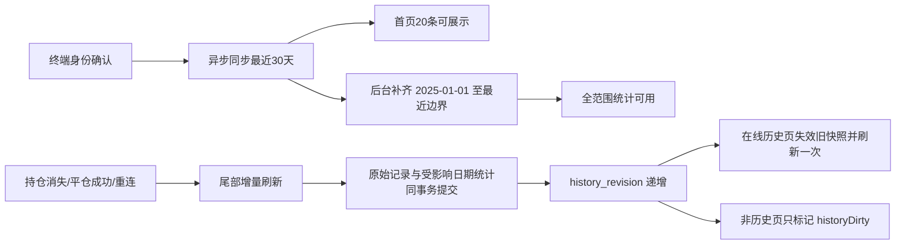

# Bridge 交易历史“响应快、数据准”最终优化方案

> 状态：代码实施与自动化验证已完成，待真实 MT4/MT5 和发布验收
> 日期：2026-08-09
> 适用版本：Bridge 3.0.0 后续重构批次
> 历史有效下限：`2025-01-01T00:00:00Z`（`1735689600000`）

## 1. 目标与验收口径

本方案只围绕两个不可妥协的目标：

1. **响应快**：用户进入“交易记录”时，只读取首页少量明细和已经准备好的统计，不扫描或传输全量历史。
2. **数据准**：持仓已经平掉且 MT4/MT5 历史源已经出现新记录后，前端必须及时看到该记录；不得因为旧快照、已完成覆盖标记或缓存而长期显示旧数据。

首次同步范围统一为：

```text
[2025-01-01 00:00:00 UTC, 当前固定时间点)
```

不再默认同步 2000 年以来的数据。已有 SQLite 中早于 2025 年的数据不删除，但默认查询、补齐、统计和导出均不再纳入。

核心验收指标：

- 已缓存首页：浏览器端到端 P95 小于 500ms。
- 后续游标页：浏览器端到端 P95 小于 300ms。
- 最新 30 天首批历史：终端身份确认后 3 秒内可展示，极端密集账户允许进入明确的“同步中”状态。
- MT4/MT5 历史源出现新平仓记录后：前端 P95 3 秒内可见，正常情况下硬上限 10 秒。
- 首次全量补齐在后台异步进行，不阻塞实时行情、持仓、交易命令和前端其他页面。
- 未完成的全量统计不得显示为“0 笔/0.00”，必须显示“统计准备中”。

## 2. 本方案取代的旧决策

本方案仅在以下方面取代此前历史优化文档中的相关设计：

- 历史下限由 2000-01-01 改为 2025-01-01。
- “覆盖完成”不再等同于“数据最新”。
- 默认首页不再等待整个范围补齐后才能看到最新记录。
- 统计不再长期依赖请求时扫描原始 JSON。
- 平仓后的刷新不再依赖用户手工刷新、重连或重新打开软件。

已有的双 Worker 隔离、Archive Worker、SQLite WAL、精确范围、游标分页、幂等写入和 MT4 可见历史限制继续保留。

## 3. 当前性能与准确性问题

### 3.1 首页明细已经是小数据量，但首次统计仍偏重

现有 `history_page` 默认只返回 20 条，游标续页采用 keyset 查询，并不是把所有交易记录传给前端。真正偏重的是首次快照创建时：

- 对原始历史表执行总数统计；
- 从 JSON 字段中计算盈利、亏损、入金、出金、信用等统计；
- 图表还会发起独立请求并再次聚合原始历史。

因此“前端只收到 20 条”是成立的，但“后端只做了 20 条工作”目前不成立。

### 3.2 覆盖完整与最新鲜度混在了一起

已有覆盖区间只能证明某个时间段曾经同步完成，不能证明：

- 刚刚平掉的持仓已经进入本地 SQLite；
- 券商稍晚出现的成交、佣金或 swap 已被读取；
- 当前首页快照没有落后于最新数据库版本。

如果一个精确范围早已标记完成，当前刷新流程可能只唤醒调度器，却不真正重跑已完成任务。这是“MT5 已有历史，但前端仍看不到”的关键风险。

### 3.3 前端刷新时机早于历史落库

持仓数量下降后，前端会很快刷新交易记录。但终端历史源和 Archive Worker 可能尚未完成读取与持久化。此时创建的首页快照是旧的，如果没有明确的历史版本变化通知，页面可能继续使用旧快照。

### 3.4 MT4 与 MT5 的事实来源不同

MT5 可以按时间范围读取 deals/orders；MT4 只能读取终端“账户历史”当前可见范围。两者可以共享异步、增量和统计架构，但 MT4 不得声称获得了券商全量历史，必须保留可见历史提示与 fail-closed 状态。

## 4. 最终数据流



## 5. 统一历史范围

### 5.1 单一常量

所有层统一使用：

```text
HISTORY_COVERAGE_START_UTC_MSC = 1735689600000
```

需要同步修改：

- Bridge Store 的范围校验、覆盖计算和迁移测试；
- MT5 recent/backfill/on-demand planner；
- MT4 首次扫描和重新扫描起点；
- Core 的精确范围准备逻辑；
- Server 的 `all`、`platform` 和 `custom` 范围解析；
- 前端说明、导出和测试基线。

### 5.2 范围语义

- “全部账户历史”：固定为 `[2025-01-01, captured_now)`。
- “平台接入后”：`[max(2025-01-01, 用户注册时间), captured_now)`。
- “自定义”：必须同时提供起止时间，起点早于 2025-01-01 时明确拒绝并提示，不静默截断。
- 重绑账号不改变该 MT4/MT5 账号已归属用户的历史事实；仍按账号路由、平台和用户权限严格校验。

## 6. 首次同步：最近优先、全量异步

### 6.1 启动时机

终端账号、broker、platform 和连接代次确认后立即启动历史初始化，不等待用户进入交易记录页面。

初始化只运行在 Archive Worker，不占用 Live Worker：

- 实时行情、持仓与订单采集继续运行；
- 交易命令与对账不等待历史同步；
- 前端其他页面不被阻塞。

### 6.2 两阶段顺序

第一阶段：高优先级同步最近 30 天，使首页尽快出现最新记录。

第二阶段：后台从 2025-01-01 补齐到最近 30 天的边界，完成后才将全范围统计标记为准确可用。

首次同步参数建议：

- 初始时间窗从 1 天提高到 7 天；
- 成功后自适应扩大，最大仍为 30 天；
- 单批明细上限继续保持 250，避免 IPC 包过大；
- 每个 Bridge 进程仍只允许一个 Archive 同步并发；
- `too_dense`、timeout、evidence pending 继续采用现有缩窗、重试和阻断语义。

不再仅因为账户有活动持仓就暂停普通历史补齐。只有 Live Worker 降级、命令对账待处理、终端源繁忙或 Archive 预算不可用时才让路。

### 6.3 展示边界

- 最近 30 天完成后，将 `head_ready=true`，允许立即展示这一已覆盖尾部中的准确最新 20 条。
- 2025 年以来的基线未完成时，全范围统计显示“历史同步中，统计尚未完成”。
- 不允许把局部统计伪装成完整统计。
- `head_ready` 不等于 `coverage_complete`：基线未完成时不返回全范围 `total_count`，也不允许游标翻入未覆盖区间。
- 用户可以浏览已经完成覆盖的最新明细；完整翻页和导出必须等目标范围完整。

## 7. 平仓后必达的尾部增量刷新

### 7.1 触发源

以下事件必须调度 `tail_refresh`，不能只清前端缓存：

- 持仓数量下降或某个 position ticket 消失；
- 手工交易或 AI 交易的平仓命令成功；
- 挂单成交、撤销或状态转换；
- 终端断线重连后重新 ready；
- 用户手工点击刷新；
- 每 30 秒一次低成本安全核对，用于捕获外部平仓、入出金、信用、延迟佣金和 swap。

### 7.2 刷新窗口

普通尾部刷新读取：

```text
[max(2025-01-01, min(last_successful_tail_end - 5分钟, 当前时间 - 48小时)), captured_now)
```

采用重叠窗口和幂等 upsert，避免边界时间、券商延迟和事件修订造成漏单。

若上次成功刷新早于 48 小时，先读取缺失的尾部区间而不是直接跳过；超出单次窗口上限时由 planner 拆为连续子任务。

平仓命令驱动时携带期望的 position/order/deal 引用。刷新后必须确认对应历史证据已经出现，才把该次刷新标记为 `fresh`。

建议退避：1 秒、2 秒、5 秒、10 秒；总等待不超过 30 秒。若终端历史源仍未出现记录，状态保持 `refreshing` 或 `stale`，不得返回“已是最新”。

### 7.3 任务模型

覆盖任务与尾部刷新任务必须分离：

- `coverage/backfill`：填补历史空洞，可完成并保持不可变。
- `tail_refresh`：允许在相同范围上反复运行，带刷新代次或时间桶。
- 已完成 coverage 不得阻止 tail refresh。
- 尾部刷新不得通过清空 coverage 来实现，否则会破坏全量完成语义。
- 同一账号同一 captured endpoint 的多个触发合并为一个 tail refresh flight；更晚触发只扩展 endpoint 或附加待确认证据，不并行重复读取。
- MT5 deal 已出现但关联 order/evidence 尚未可读时，保持同一 Archive Worker 和窗口继续有界重试，不先发布字段不完整的“成功记录”。

## 8. 覆盖、鲜度与版本分离

每个 terminal/account/platform 范围新增或持久化以下状态，禁止使用跨账号的全局 revision：

- `head_ready`：最新尾部是否已形成可展示的准确首页；
- `coverage_complete`：请求范围是否无历史空洞；
- `freshness_state`：`fresh | refreshing | stale | blocked`；
- `fresh_through_utc_msc`：历史源最近一次成功核对到的时间；
- `history_revision`：原始历史或相关统计实际发生变化后递增；
- `summary_revision`：物化统计对应的历史版本。

规则：

1. 查询成功但没有数据变化，可以推进 `fresh_through_utc_msc`，不必递增 `history_revision`。
2. 新增、修订或删除语义的历史项与统计必须在同一事务中提交，提交成功后才递增版本。
3. 事务失败时版本不变，前端不会误以为已经刷新。
4. `coverage_complete=true` 且 `freshness_state=stale` 是合法状态，不能混为一个布尔值。
5. `head_ready=true` 且 `coverage_complete=false` 也是合法状态，只能展示已覆盖尾部明细，不能声称全范围统计完整。

## 9. 统计与图表物化

### 9.1 原始表规范化

保留原始 payload 用于证据与兼容，同时为高频查询增加标量列：

- `event_time_msc`、`entry_time_msc`、`close_time_msc`；
- `direction`、`volume`、`net_profit`；
- `capital_kind`（deposit/withdrawal/credit）；
- `outcome_bucket`（profit/loss/breakeven）；
- 账号、platform、broker/login 和稳定 item id。

避免每次统计都对大量行执行 `json_extract()`。

### 9.2 每日汇总表

新增本地 SQLite `history_daily_summary`，按账号范围、platform、UTC 日期、方向和结果桶保存：

- 交易数、盈利数、亏损数、盈亏合计；
- 盈利总额、亏损总额、净利润；
- 入金、出金、信用；
- 手数与图表所需日度数据；
- 对应 `summary_revision`。

为防止重复同步或券商修订导致重复计数，不采用简单“收到一条就 +1”。每次原始 upsert 前读取旧行，收集旧日期与新日期，并在同一事务中从规范化行重新计算所有受影响日期的汇总；记录从一天修订到另一天时，两天都必须重算。

日期范围统计由完整 UTC 日的每日汇总加上最多两个边界日的规范化明细组成；任意半开范围也不需要扫描全量 JSON。

### 9.3 迁移与重建

- 只做 Bridge 本地 SQLite 的附加迁移，不删除原始数据。
- 对 2025-01-01 以后的既有原始行后台重建规范化列和每日汇总。
- 重建过程可恢复、可重复执行，并记录 checkpoint。
- 重建写入独立 build generation；完成全量校验并补上重建期间发生的 tail revision 后，再原子切换 active summary generation，崩溃时旧代次仍可读。
- 重建未完成时返回 `summary_status=rebuilding`，不得返回伪造的零统计。

## 10. 最小响应合同

首页 `history_page` 一次响应只包含：

- 默认最多 20 条明细；
- `next_cursor`、`has_more`；
- 精确总数和统计（仅在 `summary_status=ready` 时）；
- 2025 年以来最多约 600～700 个日度图表点；
- `history_revision`、`summary_revision`；
- `coverage_complete`、`freshness_state`、`fresh_through_utc_msc`；
- `head_ready`；
- 固定 `range_start_utc_msc`、`range_end_utc_msc`；
- `summary_status`。

首页不传输全量交易明细。建议将当前独立的 `history_chart_data` 首屏请求合并进 `history_page`，使用同一范围、同一版本和同一快照，减少一次 WebSocket 往返和一次数据库聚合。

导出仍走独立分页，不与首页响应混合。

前端范围文案必须显示“全部可用历史（2025 年起）”，不能只写“全部账户历史”而让用户误以为包含 2024 年以前的数据。

## 11. 游标、快照与缓存一致性

历史快照必须绑定：

- terminal/account/platform；
- 精确范围与筛选条件；
- page size；
- SQLite rowid 高水位；
- `history_revision` 与 `summary_revision`。

同一快照的后续分页保持内部一致。若新平仓导致版本递增：

- 已经翻页中的旧快照仍可完成原序列；
- 前端收到新 revision 后废弃旧首页快照并刷新一次；
- 不允许旧快照覆盖新结果。

复用现有 `bridge_data_changed` 推送，增加可选的账号路由绑定 `history_revision` 和 `freshness_state`，无需额外创造一套 WebSocket 消息。

前端行为：

- 当前正在历史页：版本变化后合并抖动，刷新首页一次；
- 不在历史页：只设置 `historyDirty=true`，不后台请求表格和图表；
- 尾部刷新中：保留现有行并提示“正在核对最新平仓记录”，不把表格清空；
- 切换账号、platform 或范围时取消旧请求和旧 retry。

同一 revision 的重复推送必须去重；连续多个 revision 在短时间内到达时只刷新最新版本，避免重新形成请求风暴。

## 12. SQLite 性能优化

### 必做

- 为规范化明细列和每日汇总键建立覆盖索引。
- 批量 upsert 使用缓存 prepared statement，减少每条记录重复解析 SQL。
- 保留 WAL 与独立只读连接。
- 首页游标继续使用 `(event_time_msc, item_id)` keyset，不使用 OFFSET 深分页。
- 统计与图表只扫描每日汇总，不扫描原始 JSON。

### 按指标决定

在完成物化统计后采集锁等待数据。如果首页和 evidence 请求仍互相阻塞，再把历史只读连接扩展为最多两个连接的小池；不预先引入大型连接池。

## 13. MT4 同等修复边界

MT4 必须同步完成以下能力：

- 首次从 2025-01-01 起异步扫描；
- 最近 30 天优先，随后后台补齐；
- 持仓消失、平仓命令成功和周期核对触发尾部重叠刷新；
- 每次平仓不再从 2025-01-01 全量重扫；
- revision、summary 和前端失效逻辑与 MT5 相同。

但 MT4 仍只能证明“终端当前可见的 Account History 已扫描完”，必须保留：

- `terminal_visible_history_complete`；
- `history_source_complete=false`；
- 引导用户将 MT4 Account History 设置为 All History 的提示。

不得把 MT4 的可见范围完成显示为券商全量完成。

## 14. 日志、指标与故障语义

新增脱敏指标：

- `history_source_sync_duration_msc`；
- `history_page_db_duration_msc`；
- `history_summary_db_duration_msc`；
- `history_response_rows`、`history_response_bytes`；
- `history_revision_lag_msc`；
- `close_to_history_visible_msc`；
- 快照命中/失效原因；
- tail refresh 次数、空结果次数、证据等待次数。

日志不得记录账号、broker、路径、订单完整 payload。稳定错误至少区分：

- 源尚未出现平仓证据；
- 范围补齐中；
- 统计重建中；
- MT4 可见历史不完整；
- Archive Worker/SQLite 真实故障。

这些历史次级状态不得把实时在线状态误判为断线。

## 15. 实施阶段

### 阶段 A：时间下限与状态合同

- 全链路改为 2025-01-01。
- 增加 coverage/freshness/revision/summary 状态。
- 保持旧字段的同版本内部迁移，但不兼容旧安装包行为。

### 阶段 B：尾部刷新与平仓证据

- 新增可重复 `tail_refresh`。
- 接入持仓消失、命令成功、重连、手工刷新和周期核对。
- 完成 revision 推送与旧快照失效。

### 阶段 C：规范化明细与物化统计

- 增加标量列、每日汇总、重建 checkpoint。
- 同事务处理原始 upsert、受影响日期重算和 revision。
- 统计/图表切换为汇总读取。

### 阶段 D：首屏最小响应

- 合并首页明细、统计和日度图表。
- 去除首屏独立 chart 请求。
- 非历史页只标 dirty，不主动拉取。

### 阶段 E：MT4 对齐

- 2025 起点、最近优先、增量尾刷、revision 和 summary。
- 保持 Account History 可见范围的真实提示。

### 阶段 F：压力与真实终端验收

- 本地构造 10 万、50 万历史记录压测。
- Windows 真 MT5 和 MT4 平仓可见性验收。
- 记录 P50/P95/P99、payload 和锁等待。

### 阶段 G：发布

全部验收通过后，另行执行 Bridge 3.0.0 构建、签名、安装修复演练、七牛云上传、下载元数据切换、虚拟机与公网部署。本方案本身不授权发布或线上数据库操作。

## 16. 测试矩阵

### Bridge Store

- 2025 起点边界、早于边界拒绝、固定半开区间。
- 重复批次不重复统计；历史修订后受影响日期重算准确。
- 原始写入或汇总失败时 revision 不递增。
- summary rebuild 中不返回伪零。
- 游标绑定 revision/highwater；旧快照不能覆盖新首页。
- 10 万/50 万记录下首页、统计和分页基准。

### Session / Worker

- 最近 30 天优先，基线异步补齐。
- 手工平仓、AI 平仓、外部平仓、挂单变化、延迟佣金/swap。
- 平仓历史源延迟出现时按退避重试并最终刷新。
- completed coverage 不阻止 tail refresh。
- Archive 同步不影响实时采集、命令和对账。
- 重连、Worker 重启、任务租约恢复、SQLite 崩溃恢复。

### Server / Frontend

- 默认只返回 20 条，不加载全量明细。
- 首页只发一次历史请求，不再紧跟独立 chart 请求。
- inactive tab 收到 revision 只标 dirty。
- active tab 收到 revision 刷新一次，无重连风暴。
- syncing/rebuilding 时保留现有数据并显示正确状态。
- 切账号、筛选、游标、范围后旧响应不能覆盖新上下文。

### 真机验收

1. 启动一个从未初始化的 MT5 账号。
2. 验证最近 30 天先出现，2025 基线继续后台同步。
3. 平掉一个持仓，等待 MT5 History 中出现记录。
4. 验证前端无需重连、无需重复点击，在 3 秒目标/10 秒上限内出现。
5. 验证总数、净利润、胜率和图表只增加一次。
6. MT4 重复同一流程，并验证 Account History 范围不足时提示真实、不会假装完整。

## 17. 兼容、迁移与回滚

- 不删除 SQLite 中 2025 年以前的原始数据。
- 新 schema 使用附加迁移，迁移与汇总重建均可重复和断点恢复。
- 汇总代次切换、checkpoint 和 active generation 必须事务化；进程在任意批次退出后都只能看到旧完整代次或新完整代次。
- 可通过内部开关暂时回退到原始表统计读取，但不得回退到伪零或 2000 起点。
- tail refresh 和 revision 推送可单独停用，coverage/backfill 数据不受影响。
- 若每日汇总校验失败，前端显示 `summary_status=unavailable`，明细仍可读取。
- 平台账号路由和用户权限校验继续 fail-closed。

## 18. 第一轮复审记录：需求、范围与过度设计

复审结论：方案方向符合“快、准、2025 起、异步同步”，但初稿存在四个需要收紧的点，均已调整：

1. **最新优先原本不能真正加快默认全范围首页。** 初稿仍隐含“范围完整后才能创建快照”。现已拆分 `head_ready` 与 `coverage_complete`：最新 30 天可先形成准确首页，全范围总数、统计、完整翻页和导出继续等待基线完成。
2. **尾部刷新公式会漏掉长时间离线后的缺口。** 原公式会在上次刷新超过 48 小时时直接跳过较早缺口；现已改为先取较早的刷新起点，再由 planner 按窗口拆分。
3. **没有必要创建新的历史 WebSocket 事件族。** 继续复用现有 `bridge_data_changed`，只增加可选的 history revision/freshness 字段，降低协议面和重连风险。
4. **不应为了本地同步速度无限扩大 IPC 批量或并发。** 保留单 Archive Worker、批量 250 和最大 30 天窗口，只把初始窗口调到 7 天并在 Live 健康时持续运行；这样利用本地性能，同时保留已有密集范围与超时保护。

第一轮后剩余风险：`head_ready` 的 UI 与 cursor 合同必须明确阻止翻页进入未覆盖区间；该风险已加入测试矩阵和最终完成定义。

## 19. 第二轮复审记录：一致性、并发、恢复与测试

复审结论：第一轮后的功能范围合理，但要满足“持仓平掉后绝不长期漏记录”，还必须落实以下一致性约束，均已写入方案：

1. **coverage 与 freshness 必须分表意。** 已覆盖范围仍可能落后；尾部刷新使用独立可重复任务，不能因为旧 coverage 已完成而跳过。
2. **统计修订不能只重算新日期。** 历史记录的时间、类型或盈亏可能被券商修订；现要求 upsert 前读取旧行，同时重算旧日期和新日期，避免旧日残留与双重计数。
3. **汇总重建不能与实时增量互相覆盖。** 已改为 build generation + tail revision catch-up + 原子 active generation 切换，保证崩溃后不会暴露半张汇总表。
4. **同一平仓事件可能触发多条通知。** 已要求同账号、同 endpoint 的 tail flight 合并，保留更晚 endpoint 和全部待确认证据，避免并发 Archive 请求与重复前端刷新。
5. **deal/order 可能分时出现。** MT5 必须在同一 Archive Worker/同一窗口内等待关联证据，不能为了快而发布字段不完整的成交记录。
6. **旧游标与新 revision 必须隔离。** 快照绑定账号、范围、highwater、history revision 和 summary revision；旧响应永远不能覆盖新首页。
7. **MT4 的来源上限不能被软件推断突破。** 即使本地同步和统计都完成，仍只声明终端可见历史完整，不声称券商全量完整。
8. **权限不能因账号重绑优化而放宽。** 账号历史可延续，但每次请求仍按当前 terminal/account/platform/user 路由校验，revision 也按该 scope 隔离。

第二轮后剩余风险：券商终端可能超过 30 秒才暴露新历史；MT4 用户可能没有选择 All History；超大密集账户的实际 P95 仍需真机测量。方案对此采用 `stale/blocked` 明示、脱敏延迟指标和 MT4 来源提示，不用伪造“最新”来掩盖。

## 20. 最终完成定义

只有同时满足以下条件，才视为优化完成：

- 首次同步范围确实固定为 2025-01-01 至当前快照时间；
- 最近历史先出现，基线同步不阻塞实时业务；
- `head_ready` 与全范围完整性严格分开，未覆盖区间不能翻页或导出；
- 新平仓记录在源可见后能自动进入 SQLite、统计和前端；
- 首页只传少量明细与有界汇总，不扫描全量 JSON；
- MT4 与 MT5 均通过真实终端验收；
- 所有统计都有 revision 和完整性状态，不把局部或未完成数据显示成准确总数；
- Rust、Python、Node 定向与全量回归、安装升级和发布验证全部通过。

## 21. 本轮实施记录（2026-08-09）

已完成的代码范围：

- 历史产品起点统一为 `2025-01-01T00:00:00Z`，2025 年以前的本地明细保留但不进入查询、统计和导出合同。
- MT5 首次同步改为最近 30 天 P2 优先、2025 起的其余范围 P3 后台补齐；Archive 仍保持单 Worker、批量 250、动态有界窗口。
- 新增可重复尾部刷新：手工刷新、命令完成唤醒和 30 秒安全核对都会规划带重叠区间的尾刷，旧 coverage 不再阻止检查新平仓、佣金、swap、入金和提款。
- SQLite 新增账号/平台级 freshness、coverage、history revision、summary revision 和 summary status；只有明细实际新增或关键字段变化时才递增 history revision，重复批次保持幂等。
- 历史明细新增规范化查询列；旧库使用附加迁移和 JSON 回填，不删除旧数据。
- 新增 generation-safe 每日物化汇总。重建完成并校验后才原子切换 active generation；失败保留旧完整代次并标记 unavailable，不返回伪零。
- 统计和图表读取完整 UTC 日的物化汇总，边界不足一天的部分使用规范化明细精确计算；筛选、任意毫秒半开范围和 MT4/MT5 scope 均保持准确。
- 游标首页一次返回少量订单、统计和 `chart_data`；续页不重复图表，也不使用 OFFSET 深分页或重复 COUNT。
- 前端只在交易记录页读取历史。持仓减少、history revision 或 stale/refreshing 状态只触发单飞、有界退避刷新；切页、切账号和离开历史页会取消旧任务。
- MT4 保留“终端 Account History 可见范围”的真实性边界，并补齐 MT4 `deal_type` 6/7 的入金、提款和信用统计。

已验证：

- Rust 格式、Clippy `-D warnings`、Store/Session/Core 单元测试通过。
- Core connected process 串行回归通过（4 passed，8 个真实终端用例按测试定义 ignored）。
- Foundation startup、Core bin、Node 语法检查和历史相关 Vitest 回归通过。
- SQLite 迁移、重复批次、跨 UTC 日修订、重建失败保留旧代次、任意毫秒边界、summary pending、游标首屏和 MT4/MT5 隔离均有确定性回归。

尚未宣称完成的验收：

- 尚未使用真实 Windows MT5/MT4 终端完成手工平仓、外部平仓、延迟佣金/swap 和 Account History 范围变化的端到端计时。
- 尚未完成 10 万/50 万历史记录的 P50/P95/P99 基准。
- 尚未执行 Bridge 3.0.0 构建、签名、安装升级演练、七牛云上传或虚拟机/公网部署；这些仍属于独立发布阶段。
