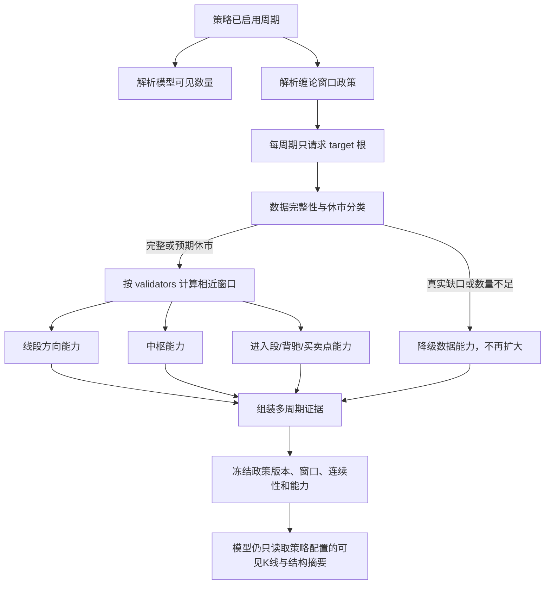

# 缠论多周期历史窗口与结构可靠性优化实施方案

## 文档信息

- 文档状态：已完成两轮复审，可进入实施；当前尚未修改程序
- 编制日期：2026-08-11
- 本地基线：`D:\dev_codex\wall-street-skill-local`，分支 `dev_codex`，提交 `0d2ade4eab9cb10ddcc896895a45a4f89b4d95cf`
- 虚拟机基线：`/www/wwwroot/aurum-ai`，提交 `70de6d6f`
- 一致性说明：本地与虚拟机的 `market-data.js`、`strategy.js`、`utils.js`、`platform-market-data.js` 在两个提交之间无内容差异；本地文件哈希差异来自工作区换行格式
- 线上证据：道诚信号 `#11261`，冻结快照 `4538`，XAUUSD，M5/M15/H1/H4 各 2000 根
- 审计验证：`tests/ai/chan.test.js`、`strategy.test.js`、`platform-market-data.test.js` 共 215 项通过
- 方案性质：专项业务逻辑和运行性能优化，不授权编码、提交、推送、部署、数据库操作或策略配置修改
- 发布选择：用户已明确要求不做线上影子验证；实施与离线验收通过后直接正式运行 v6

## 1. 结论与目标

当前实现把“缠论结构不存在”“结构尚未锚定”和“行情历史不足”混为同一种扩容条件。在没有可信结构锚点时，各周期会从 300 根自动扩大到 2000 根；一旦扩大，同一进程后续会持续请求 2000 根。更多历史又会改变滚动窗口左边界，导致包含处理、分型、笔、线段和中枢重新分解，因此结果并不随 K 线数量单调变稳定。

本方案采用以下最终方向：

1. 取消所有周期统一 2000 根和进程级永久扩容提示。
2. 为当前道诚 XAUUSD 策略设置分周期固定计算上限：M5 800、M15 1000、H1 1200、H4 800。
3. 只在相近窗口之间验证结构，不再让 300 根和 2000 根跨越不同市场尺度互相投票。
4. 把“数据完整性”“线段方向”“中枢结构”“进入段/背驰/买卖点”拆成分层能力；没有中枢不再等于数据不足。
5. 保持无可信进入段时失败关闭，绝不因为缩短窗口而放宽背驰、买卖点或交易安全条件。
6. 对已验证的节假日休市做确定性分类，不补造 K 线，不把未知工作日长缺口静默视为休市。
7. 通过冻结快照回放、自动测试和离线性能基准完成上线前验收，随后直接正式切换 v6，不增加线上影子阶段。

## 2. 范围与非目标

### 2.1 实施范围

- 缠论历史数量解析和行情请求数量；
- `computeChan()` 的最大计算窗口和跨窗口候选集合；
- 缠论结构充足性判断和结构能力分层；
- 结构锚点建立、命中、失效和算法版本隔离；
- XAUUSD/外汇贵金属节假日休市的连续性分类；
- 冻结推理快照中的窗口政策、连续性细节和能力字段；
- 历史信号模型对比对冻结算法与窗口政策的恢复；
- 缠论单元测试、策略上下文测试、行情连续性测试、冻结回放和正式运行验收。

### 2.2 明确不做

- 不重写包含处理、分型、新笔、特征序列、线段、中枢和 MACD 背驰的理论规则；
- 不改变策略提示词、输出 JSON 合同、风控、订单、Bridge 交易发送或自动执行开关；
- 不自动修改任何 `strategy_policy_json`、策略周期勾选或策略归属；
- 不新增外部行情或节假日 API，不引入新服务；
- 不补造、插值或人工写入缺失 K 线；
- 不删除旧信号、旧快照、旧锚点或市场历史；
- 第一阶段不增加管理后台配置页面，不做全平台可视化配置系统；
- 不在本方案授权下运行 SQL、迁移、部署或真实交易测试。

## 3. 已验证现状与问题映射

### 3.1 历史窗口被强制放大

当前常量为：

- 普通策略可见数量：H4 50、H1 80、M15 100、M5 60；
- 缠论初始历史：300；
- 缠论最大历史：2000；
- 缠论计算最少原始 K 线：30；
- 中枢跨窗口前置上下文：150。

`chanNeedsMoreHistory()` 在没有可信锚点时，只要 `source_history_count < 2000` 就要求补取。因此 300 根不是一个能够正常结束的默认计算窗口，而只是 2000 根之前的第一次请求。

### 3.2 结构存在性与数据充分性混淆

当前以下任一情况都会要求补取最大历史：

- 原始历史少于 2000；
- `segment_count === 0`；
- `center_count === 0`；
- 中枢进入段缺失；
- 推荐锚点缺失。

其中只有“实际返回少于请求数量”能够直接证明数据不足。没有线段或中枢可能是当前市场结构，也可能是窗口起点不稳定，不能自动解释为行情缺失。

### 3.3 扩大历史不保证结构收敛

对 `#11261` 的真实冻结快照分别截取 300、400、500、600、800、1000、1200、1500、2000 根重算，观察到：

- M5 在 800/1000 根可确认结构，1200/1500 根反而失去确认，2000 根输出另一结构；
- M15 在 500～800 根已能确认方向，1000 根以上出现不同中枢相位；
- H1 在 1200 根开始持续确认，1500/2000 根的阶段方向发生变化；
- H4 在 500～1000 根为上涨结构，1200 根为区间，1500/2000 根又回到上涨结构。

这证明当前主要风险是窗口左边界依赖，不是 K 线数量绝对不足。

### 3.4 进程级扩容提示没有正常生命周期

`_chanMaxHistoryHints` 按“用户 + 品种 + 周期”记录是否使用过 2000 根；除了测试辅助清空和超出 512 项时淘汰最旧项，没有成功锚定后的删除、时间过期或行情状态失效机制。一次扩大可能持续到服务重启。

### 3.5 节假日误判阻断锚点

快照 4538 的 2000 根 H4 中有两个被判为内部缺口的区间：

| 节点 | MT5 服务器时间 | UTC 时间 | 当前误判 |
|---|---|---|---|
| 圣诞节 | 2025-12-24 20:00 → 2025-12-26 00:00 | 2025-12-24 17:00 → 2025-12-25 21:00 | 理论缺失 6 根 H4 |
| 元旦 | 2025-12-31 20:00 → 2026-01-02 00:00 | 2025-12-31 17:00 → 2026-01-01 21:00 | 理论缺失 6 根 H4 |

当前检测器只把周末和不超过 4 小时的跨日休市视为正常，缺少节假日分类。`cache_internal_gap_unresolved=true` 又会禁止锚点保存，最终形成“2000 根包含节假日 → 缺口 → 不能锚定 → 继续 2000 根”的循环。

### 3.6 计算和证据体积被同步放大

2000 根会生成 14 个后缀计算窗口；满足中枢身份条件时还会增加两个固定左边界的收盘截面计算。四周期单次推理最多约进行 64 次完整窗口缠论计算，并在快照中冻结最多 8000 根 K 线。模型可见原始 K 线没有扩大，但服务器 CPU、Bridge/缓存读取、连续性扫描和快照体积均被放大。

## 4. 目标窗口政策

### 4.1 两类数量必须继续隔离

模型可见 K 线继续由策略 `MTF/ATF` 标签和行情方案决定，不因本次优化改变：

| 周期 | 当前模型可见数量 | 保持不变 |
|---|---:|---|
| M5 | 60 | 是 |
| M15 | 100 | 是 |
| H1 | 80 | 是 |
| H4 | 100（当前道诚行情方案） | 是 |

缠论内部另使用下表的固定政策：

| 周期 | 当前道诚职责 | 目标原始窗口 | 结构验证窗口 | 硬上限 | 近似覆盖 | 9 个历史截点稳定率 |
|---|---|---:|---|---:|---|---:|
| M5 | 入场时机 | 800 | 600、700、800 | 800 | 约 3 个交易日 | 8/9 |
| M15 | 方向确认 | 1000 | 800、900、1000 | 1000 | 约 11 个交易日 | 9/9 |
| H1 | 主判断 | 1200 | 1000、1100、1200 | 1200 | 约 10 周 | 9/9 |
| H4 | 趋势降级参考 | 800 | 600、700、800 | 800 | 约 6 个月 | 9/9 |

近似覆盖按 XAUUSD 常见交易时段估算，只用于理解尺度，不参与时间计算或休市判断。

### 4.2 政策表示

新增纯代码政策模块，例如 `server/routes/ai/chan-window-policy.js`。政策按显式版本注册，不把当前道诚参数直接设成所有策略的无条件全局默认：

```js
export const CHAN_WINDOW_POLICIES = Object.freeze({
  dao_xau_v1: Object.freeze({
    M5:  { target:800,  validators:[600, 700, 800] },
    M15: { target:1000, validators:[800, 900, 1000] },
    H1:  { target:1200, validators:[1000, 1100, 1200] },
    H4:  { target:800,  validators:[600, 700, 800] },
  }),
})
```

约束：

- `target` 同时是该周期的硬上限，运行时不得继续隐式扩大；
- `validators` 必须升序、唯一、全部不大于 `target`，并包含 `target`；
- v6 只对明确激活的策略和已列周期生效；未列周期不得静默回退到 800，应继续使用 legacy v5 或阻止该策略启用 v6 并给出明确诊断；
- 第一阶段集中配置，不增加后台 UI；
- 后续若允许策略级覆盖，必须由管理员显式保存并进入策略版本快照，禁止自动修改策略。
- 激活映射必须是显式运行配置或受审查的代码常量，不改变策略记录；正式启用前再决定是否把政策固化为策略版本字段。

### 4.3 为什么不把所有周期统一设为 800

- M5 和 H4 在 800 根的真实回放中已经达到最优或足够稳定；
- M15 在 800 根只有 6/9 个截点确认，1000 根为 9/9；
- H1 在 800/1000 根仍有截点不能确认，1200 根为 9/9；
- 统一 800 会降低 H1 主周期证据，统一 1200 又会无必要地扩大 M5/H4；
- 分周期政策比单一全局常量更符合策略实际职责。

## 5. 目标计算流程



### 5.1 行情请求

1. `buildStrategyContextFromTags()` 根据周期取得目标政策。
2. `historyCount = max(策略可见数量, 指标实际需要量, chanPolicy.target)`。
3. 一个周期一轮最多发起一次目标窗口请求；不再先请求 300 再请求 2000。
4. Bridge/缓存实际返回少于目标数量时，保留现有失败关闭语义，输出 `history_bars_below_requested`。
5. 达到目标数量但结构不存在时，不发起第二次更大请求。

### 5.2 计算窗口

`computeChan()` 接收显式参数：

```js
{
  requestedHistoryCount,
  maximumHistoryCount,
  validationWindowCounts,
  windowPolicyVersion,
  dataQuality,
  trustedStructureAnchor,
}
```

行为约束：

- 输入多于 `maximumHistoryCount` 时只取最后目标窗口；
- 候选窗口严格使用 `validationWindowCounts`，不再从目标值循环下降到 300；
- 最长目标窗口仍是权威输出，较短窗口只投票确认末端结构；
- 三个连续已收盘截面的时间稳定性验证继续保留；
- MACD 每个候选窗口独立暖机，前 40 根不可用于背驰力度比较；
- 包含处理、分型、笔、线段和中枢核心算法不在本次修改中重写。

### 5.3 结构能力分层

新增兼容性的附加字段，不删除当前字段：

```js
evidence_capabilities: {
  data_complete: true,
  segment_direction_usable: true,
  center_structure_usable: false,
  entry_structure_usable: false,
  divergence_usable: false,
  reason_codes: ['no_confirmed_segment_center'],
}
```

判定建议：

#### 数据完整能力

`data_complete=true` 必须同时满足：

- 实际历史数量达到请求值；
- 已收盘历史数量达到请求值减未收盘柱；
- 时间键严格递增；
- 行情源和时钟满足现有可信要求；
- 不存在未解决真实内部缺口。

#### 线段方向能力

`segment_direction_usable=true` 必须满足：

- `data_complete=true`；
- `window_stable=true`；
- 至少一条跨窗口确认线段，并且权威末端链确认；
- 当前趋势方向不是 `unknown`；
- 不要求存在中枢或持久锚点。

该能力供 H4 趋势降级、M15 方向确认和多周期方向一致性使用。

#### 中枢能力

`center_structure_usable=true` 必须满足：

- 线段方向能力成立；
- 存在线段级中枢；
- 中枢核心获得相近窗口严格多数；
- `structure_topology_reliable=true`。

没有中枢时输出“当前无确认中枢”，不得输出“数据缺失”。

#### 进入段、背驰和买卖点能力

继续保持最严格条件：

- 中枢能力成立；
- 进入段身份已通过连续三个已收盘截面和跨窗口确认；
- 持久锚点已经在后续计算中精确命中；
- 背驰 MACD 引用完整且未过期；
- 买卖点不超过现有 20 根新鲜度限制。

窗口优化不得放宽这部分安全边界。

### 5.4 `reliability` 与文案

保留 `high/medium/low`，但文案根据能力解释：

- 数据完整、线段方向稳定、暂无中枢：`medium`，文案为“方向结构可用，当前没有确认中枢”；
- 数据完整、中枢稳定、进入段尚未命中：`medium`，文案为“中枢可用，背驰和买卖点仍在确认”；
- 真实缺口、历史不足或线段窗口未收敛：`low`；
- 禁止把 `medium` 自动改写成“结构可靠性较低”；
- `cache_internal_gap_unresolved` 只能在真实未解决缺口时出现。

## 6. 锚点生命周期优化

### 6.1 算法版本隔离

- v6 路径使用 `chan_structure_v6`，未激活策略仍保持 `chan_structure_v5`；
- v6 只改变窗口政策、能力分层和休市分类，不修改理论构造规则；
- 现有查询已经按 `algorithm_version` 读取，因此 v6 不会误用 v5 锚点；
- 第一阶段不删除 v5 锚点，不运行数据库迁移；
- 当前唯一键不包含算法版本，v6 首次保存会覆盖同一来源/品种/周期行中的 v5 内容。因此同一 `source_id + standard_symbol + timeframe` 不得同时存在 v5/v6 正式锚点写入者。正式切换前必须清点共享该行情源的全部启用缠论策略：要么在同一次正式发布中切换到同一 v6 政策，要么停止发布。回滚到 v5 时需要重新冷启动锚点，这是已知回滚成本，不影响行情和订单数据。

### 6.2 建立条件

把当前硬编码的 `source_history_count >= 2000` 改为：

```text
source_history_count >= policy.target
且 calculation_window_count == policy.target
```

其他安全条件继续保留：

- 历史和已收盘数量完整；
- 时间键可靠；
- 无真实内部缺口；
- 权威末端链确认；
- 连续三个已收盘截面身份一致；
- 中枢 core 和进入段 ID 一致；
- 首次保存后当前轮仍不开放依赖进入段的证据，下一轮精确命中才开放。

### 6.3 失效和重建

以下情况视为锚点不可用，但不扩大历史：

- 算法版本不同；
- 行情源身份变化；
- 品种或周期变化；
- 锚点不在当前目标窗口内；
- 结构 ID 不匹配或最后确认线段回退；
- 真实历史缺口或时钟失去可信状态。

失效后按固定目标窗口重新计算。若当前无可确认中枢，只关闭进入段能力，不把方向能力一并关闭。

### 6.4 删除永久扩容提示

- 删除 `_chanMaxHistoryHints`、`rememberChanMaxHistory()` 和对应解析分支；
- `resolveChanHistoryCount()` 改为纯函数，根据周期政策、策略可见数量和指标需要量返回固定目标；
- 不以进程重启作为恢复正常窗口的手段；
- 不新增另一套 TTL 提示缓存，避免把旧设计换成更复杂的状态机。

## 7. 行情连续性与节假日

### 7.1 分类层次

连续性检查返回三类结果：

1. `continuous`：间隔等于周期；
2. `expected_market_closure`：周末、正常每日休市或确定性节假日休市；
3. `suspicious_gap`：无法由确定性规则解释的工作日长缺口、重复开盘时间或时间倒退。

### 7.2 确定性休市规则

新增小型纯函数模块，例如 `market-session-calendar.js`：

- 标准品种先映射到资产类别，XAUUSD 属于 `fx_metals`；
- 保留现有周末和每日休市规则；
- 首批只加入可由日期规则确定、已通过真实快照验证的圣诞节和元旦全天休市；
- 后续增加耶稣受难日等规则必须有真实经纪商样本和单元测试；
- 规则输入同时包含标准品种、经纪商时间、UTC、周期和间隔；
- 只负责分类，不生成任何缺失柱；
- 未知节假日、异常服务器停机和无法识别的工作日缺口继续失败关闭。

### 7.3 快照证据

冻结以下非敏感细节：

```js
market_data_quality: {
  continuity_status,
  expected_closure_count,
  suspicious_gap_count,
  gap_details: [{ from_utc_msc, to_utc_msc, missing_bar_count, classification }],
  session_calendar_version,
}
```

前端只展示中文解释和时间，不暴露账户、经纪商登录或缓存内部键。

## 8. 冻结快照、历史比较与兼容性

### 8.1 新快照必须冻结

- `chan_algorithm_version`；
- `chan_window_policy_version`；
- 每周期 `target` 和实际验证窗口；
- 请求、返回、已收盘和实际计算数量；
- `evidence_capabilities`；
- 连续性分类版本和缺口细节；
- 是否命中可信锚点及锚点算法版本。

这些内容写入现有 JSON 快照，不增加数据库列。

### 8.2 旧快照兼容

- 缺少 `chan_window_policy_version` 的快照标记为 `legacy_chan_window_v5`；
- 旧信号详情继续读取原始冻结结构，不用 v6 重新解释成当时不存在的能力；
- 历史模型对比优先使用快照冻结 K 线、算法版本和策略运行时；
- 若旧快照无法恢复旧算法，只能标记为兼容回放，不能称为完全同口径；
- 不修改旧快照内容和内容哈希。

### 8.3 快照体积目标

当前四周期最多冻结 8000 根；新政策合计 3800 根，理论下降约 52.5%。验收要求：

- 四周期 K 线总数不超过 3800；
- 不因压缩预算再截断低于目标窗口；
- `evidence_status` 仍为 `complete`；
- 图表接口继续按需返回最后 500 根，不因内部窗口变化扩大前端响应。

## 9. 文件级实施清单

| 文件 | 修改内容 | 受保护合同 |
|---|---|---|
| `server/routes/ai/chan-window-policy.js`（新增） | 窗口政策、验证、默认解析 | 纯函数，不读取数据库或用户状态 |
| `server/routes/ai/utils.js` | 移除统一 300/2000 业务常量或仅保留旧兼容名称 | 策略可见周期数量不变 |
| `server/routes/ai/strategy.js` | 一周期一次固定请求；删除永久扩容提示；注入政策 | 手动/自动推理继续共用同一上下文构造器 |
| `server/routes/ai/market-data.js` | 参数化最大窗口和候选窗口；增加能力分层；v6 版本 | 分型、笔、线段、中枢、背驰理论规则不重写 |
| `server/routes/ai/platform-market-data.js` | 使用休市分类；返回完整连续性证据 | 来源身份、时钟、缓存隔离不放宽 |
| `server/routes/ai/market-session-calendar.js`（新增） | 确定性 FX/贵金属休市规则 | 不补造 K 线、不外调 API |
| `server/routes/ai/inference-snapshots.js` | 冻结政策、能力和连续性元数据 | 提示词、账户私密数据继续清洗 |
| `server/routes/ai/analyze-compare.js`及调用链 | 恢复冻结政策或标记旧兼容口径 | 不混用当前策略和历史快照 |
| `server/routes/ai/llm.js` | 能力字段中文解释和降级文案 | 输出 schema、风险和交易合同不变 |
| `tests/ai/chan.test.js` | 固定窗口、候选窗口、能力和窗口外历史不变性 | 保留理论结构不变量测试 |
| `tests/ai/strategy.test.js` | 删除 2000 粘性断言，验证分周期一次请求 | 模型可见 K 线数量不变 |
| `tests/ai/platform-market-data.test.js` | 节假日/真实缺口/重复时间测试 | 未知缺口仍失败关闭 |
| `tests/ai/inference-snapshots.test.js` | 3800 根及政策版本冻结 | gzip/普通 JSON 兼容不变 |
| `docs/chan-theory-specification.md` | 更新窗口和能力语义 | 明确仍是保守版缠论 |
| `docs/ai-trading-runtime-flow.md` | 更新运行链路和连续性规则 | 不改变调度和交易链路 |

实施前必须再次通过 `rg` 确认历史模型对比的真实文件名和调用入口，不能仅依据本文候选文件名直接修改。

## 10. 分阶段实施

### 阶段 A：政策与纯函数测试

1. 新增窗口政策解析和校验；
2. 将 `computeChan()` 最大窗口和候选窗口参数化；
3. 保持线上调用仍使用旧政策，先让测试能够分别运行 v5 和候选 v6；
4. 增加“输入前面再增加旧 K 线，但目标窗口相同，结果完全一致”的不变量测试。

验收门槛：

- v5 现有测试全部通过；
- v6 对任意超过目标数量的输入只使用最后目标窗口；
- 候选窗口只包含政策定义值；
- 任何周期均不会突破硬上限。

### 阶段 B：策略请求和能力分层

1. 策略上下文改为各周期一次请求；
2. 删除永久 2000 提示；
3. `chanNeedsMoreHistory()` 改为数据完整性判断，或删除该函数；
4. 增加方向、中枢、进入段能力；
5. 调整中文解释，不改变模型输出 schema。

验收门槛：

- M5/M15/H1/H4 请求数量分别为 800/1000/1200/800；
- 没有中枢不会触发第二次行情请求；
- 没有中枢时方向能力可以独立成立；
- 无锚点时背驰和买卖点仍不可用；
- 模型可见 K 线仍为策略配置数量。

### 阶段 C：休市分类和锚点 v6

1. 加入确定性节假日分类；
2. 升级算法版本；
3. 锚点建立条件改用周期目标窗口；
4. 快照冻结新元数据；
5. 历史比较区分 v5/v6。

验收门槛：

- 快照 4538 的圣诞节和元旦间隔归类为预期休市；
- 人工构造的普通工作日 8 小时、24 小时和重复时间仍为可疑缺口；
- 不生成任何休市 K 线；
- v6 不读取 v5 锚点；
- 第一轮只保存锚点，后续精确命中才开放进入段能力。

### 阶段 D：冻结回放和正式切换前验收

1. 编写只读回放脚本，读取已有冻结快照并输出 v5/v6 差异；
2. 至少覆盖趋势、震荡、结构不足、节假日、真实缺口五类样本；
3. 使用冻结行情离线记录结构方向、能力、计算耗时、窗口数和快照估算体积；
4. 对每个差异输出窗口、线段、中枢、能力和连续性原因，不进行第二次模型推理；
5. 生成正式切换前验收报告，确认代码提交、测试结果、活动缠论策略清单和回滚提交。

验收门槛：

- 所有冻结回放均不出现统一 2000 请求；
- 结构计算耗时 p95 相对 v5 下降至少 35%；
- 冻结 K 线数量和原始 JSON 体积下降至少 45%；
- 离线回放没有新的 `history_bars_below_requested`、时钟错误或跨来源污染；
- 所有方向差异均能归因到固定窗口尺度，不存在计算异常或字段丢失。

### 阶段 E：直接正式启用和运行观察

1. 阶段 A～D 全部通过后，按批准的实施提交直接部署并正式启用 v6，不部署双算、旁路或隐藏影子分支；
2. 切换前核对同一行情源、品种和周期是否存在其他启用缠论策略；没有其他写入者时启用道诚，有共享写入者时必须在同次发布中使用 v6，否则停止发布；
3. 正式切换通过一次可见服务重启原子生效，旧进程退出后才启动 v6，禁止 v5/v6 两个 Node 进程并存；
4. 正式启用后的信号直接使用 v6 结构进入现有模型、保存、发布和交易链路；自动执行和风控配置保持当前值，不为此次优化静默开关；
5. 首批至少检查 20 个已完成道诚信号，并持续观察首个完整交易日的信号详情、服务日志、快照数量、模型请求、Bridge 状态和锚点命中；
6. 任一回滚条件命中时立即恢复 v5 提交并重新启动，不等待观察期结束；
7. 正式运行稳定后再决定是否把政策扩展到其他缠论策略。

## 11. 测试与验收矩阵

### 11.1 单元测试

- 政策表合法性、未知周期回退和输入不可变；
- 各周期目标值、验证窗口和硬上限；
- 超出目标的旧 K 线不会改变结果；
- `center_count=0` 不触发扩容；
- 锚点缺失不触发扩容；
- 返回数量不足正确降级；
- 方向能力与中枢/进入段能力分离；
- 休市、周末、每日休市、未知工作日缺口和重复时间；
- v5/v6 锚点隔离；
- 快照政策版本、数量和 gzip 解析。

### 11.2 集成测试

- 手动推理和自动推理使用相同政策；
- 平台行情源与用户 Bridge 回退均使用正确来源锚点；
- MT4 当前偏移与 MT5 verified 时钟语义不变；
- 带后缀品种归一化后使用同一政策和休市分类；
- 策略含其他指标时，指标实际历史需要量不得被错误截短；如指标需要量超过缠论目标，缠论仍只取最后目标窗口计算；
- 历史模型对比不使用当前窗口政策覆盖旧快照；
- 模型 payload 不包含完整 800/1000/1200 根原始 K 线。

### 11.3 回归命令

```powershell
node --check server/routes/ai/chan-window-policy.js
node --check server/routes/ai/market-session-calendar.js
node --check server/routes/ai/market-data.js
node --check server/routes/ai/strategy.js
node --check server/routes/ai/platform-market-data.js
npx vitest run tests/ai/chan.test.js tests/ai/strategy.test.js tests/ai/platform-market-data.test.js tests/ai/inference-snapshots.test.js tests/ai/analyze-compare.test.js
npm test
git diff --check
```

### 11.4 线上只读验收

- 线上代码提交、Node 进程和健康状态明确；
- 道诚每周期实际请求数量符合政策；
- 最新冻结快照的 `timeframe_counts` 合计不超过 3800；
- H4 最早时间不再回到 2025 年节假日区间；
- 圣诞节/元旦不再产生 `cache_internal_gap_unresolved`；
- 未知真实缺口仍会使相应能力失败关闭；
- 模型叙述不再把 `medium` 自动说成“结构可靠性较低”；
- 不触发额外模型推理、不修改策略、不发送交易测试单。

## 12. 发布与回滚

### 12.1 发布边界

- 本方案完成不等于授权部署；
- 本地实现、Gitee 推送、虚拟机部署和公共生产部署分别需要对应授权；
- 不涉及 Bridge 安装包、Bridge 更新清单或公开网站部署；
- 不涉及数据库迁移，部署前不得运行 SQL；
- 若后续决定修改锚点唯一键，必须另写数据库迁移方案并取得明确确认。

### 12.2 回滚触发条件

出现以下任一情况立即回滚到 v5：

- 任一周期超过政策硬上限或重复请求；
- 真实完整行情被错误判为缺失；
- 未知工作日缺口被错误放行；
- 无锚点时背驰或买卖点被开放；
- 模型可见 K 线、策略提示词、风险或订单合同发生非预期变化；
- 手动与自动推理口径不同；
- 历史对比混用当前政策；
- Node 异常、计算耗时或内存显著恶化；
- 信号方向差异无法通过冻结回放解释。

### 12.3 回滚方式

- 使用单一职责 Git 提交回退代码，不清库、不删快照；
- v6 正式启用后可能覆盖同一来源/品种/周期的 v5 锚点，回滚后允许 v5 重新冷启动；
- 回滚后验证 `/health`、最新信号快照、周期数量和服务日志；
- 不通过修改策略提示词或关闭风控掩盖结构问题。

## 13. 风险与待验证项

| 风险 | 当前控制 | 剩余验证 |
|---|---|---|
| 样本仅为 XAUUSD 道诚快照 | 首次只对道诚启用 | 其他品种/策略需独立回放后再设政策 |
| 9 个截点来自同一 2000 根历史 | 加入多行情阶段冻结样本 | 至少补趋势、震荡、急涨跌和低波动样本 |
| H4 800 可能没有线段级中枢 | 允许方向能力独立成立 | 确认策略只把 H4 用作方向降级，而非精确入场 |
| 节假日规则随市场和经纪商变化 | 只放行确定性规则 | 耶稣受难日、提前休市等需真实样本 |
| v6 覆盖 v5 锚点行 | 回滚可重新冷启动 | 若需要无冷启动回滚，再评估唯一键迁移 |
| 同一来源同时运行 v5/v6 锚点写入 | 正式启用前清点并禁止混跑 | 多缠论策略共用同一平台行情源时必须同批切换 |
| 固定窗口仍可能遇到结构不收敛 | 达到上限后降级，不继续扩大 | 统计低可靠率是否可接受 |
| 方向变化影响模型决策 | 上线前冻结回放逐项解释；正式切换后检查首批 20 个信号 | 直接正式运行会立即影响模型证据和可能的交易结果 |
| 性能收益可能被其他推理耗时掩盖 | 单独记录缠论耗时和窗口数 | 线上 p50/p95 对比 |

## 14. 第一轮复审：需求覆盖、业务边界与过度设计

### 14.1 复审结论

初稿覆盖了统一 2000 根、结构与数据混淆、节假日缺口、锚点循环和计算开销，但最初倾向同时建设策略级后台配置、通用交易日历服务和增量缠论状态机，超出了“合理减少 K 线、不再过度放大”的核心需求。方案已收敛为集中政策、纯函数休市分类和现有锚点复用。

### 14.2 发现与调整

| 初稿设想 | 复审判断 | 最终调整 |
|---|---|---|
| 所有周期统一降为 800 | 会削弱当前 H1/M15 的结构确认 | 调整为 M5 800、M15 1000、H1 1200、H4 800 |
| 新增后台窗口配置 UI | 第一阶段过度设计，容易让未经验证参数直接影响信号 | 使用集中默认政策；未来覆盖必须显式保存并版本化 |
| 新建外部节假日服务 | 增加外部依赖和故障面 | 使用小型确定性规则模块，未知缺口继续失败关闭 |
| 立即实现增量缠论状态机 | 会重写核心算法和持久化语义 | 保留现有全窗口计算，只缩小并固定窗口集合 |
| 没有中枢时继续扩大一次 | 仍然把结构存在性当成数据充分性 | 达到固定窗口后直接表达“无确认中枢” |
| 直接修改策略提示词弱化 H4 | 会污染人类控制的策略逻辑 | 不改提示词，后端提供精确能力与中文解释 |
| 全平台一次性切换 | 影响范围不可控 | 先冻结回放；正式发布只覆盖已清点且批准的启用缠论策略 |
| 未配置周期统一回退 800 | 会把未经验证的周期静默带入新口径 | 未配置周期保留 legacy 或阻止 v6，必须明确诊断 |

### 14.3 第一轮确认的最小边界

- 不改理论构造核心；
- 不改数据库结构；
- 不改策略配置和提示词；
- 不改模型输出、交易和风控合同；
- 不引入新服务；
- 只新增两个小型纯函数模块；
- 先解决当前道诚 XAUUSD，再决定是否推广。

第一轮复审通过。

### 14.4 第一轮剩余风险

- 固定窗口数来自当前真实样本，但不是所有品种的数学常数；
- 能力分层是附加合同，必须验证模型清洗和前端展示不会误把缺失字段当成可用；
- H4 无中枢时允许方向能力，必须确保任何入场候选仍要求中枢和锚点。

## 15. 第二轮复审：兼容性、数据、并发、恢复、时间、安全与测试

### 15.1 兼容性

- 模型可见 K 线和策略周期标签不变；
- 手动/自动推理继续走同一个上下文构造器；
- 新字段全部为附加字段，旧前端和旧模型清洗逻辑可忽略；
- `/api`、`/aurum-api`、Bridge 命令和行情响应合同不变；
- 算法版本升级隔离旧锚点；
- 旧快照没有政策版本时保持 legacy 解释。
- 同一来源/品种/周期禁止正式 v5/v6 锚点写入混跑；正式切换必须通过单一进程重启原子完成。

### 15.2 数据与迁移

- 不新增表和列，不修改已有迁移；
- 不读取或修改生产数据库结构；
- 新证据写入已有 JSON 快照；
- 旧快照、旧锚点和旧信号不删除；
- 由于锚点唯一键不含算法版本，正式 v6 保存会覆盖 v5 行，已明确记录为回滚冷启动成本。

### 15.3 并发与幂等

- 每周期一轮只发一个固定目标请求，避免 300+2000 双请求；
- 现有行情请求键已经包含数量，实施时还需确认政策切换期间不会把不同数量错误合并；
- 离线回放只读取冻结行情，不发 Bridge 请求、不保存 v6 锚点；
- 正式运行每周期只发一次目标窗口请求，不保留双算分支；
- 锚点保存继续使用现有时间单调更新保护，旧观察不能覆盖新观察。

### 15.4 时间和休市语义

- 内部排序、结构稳定 ID 和缺口定位继续使用 UTC；
- 展示和交易业务时间继续保留 MT5 服务器时间；
- MT4 偏移可信边界不放宽；
- 节假日规则只分类已有时间间隔，不转换或补造时间；
- 无法确定的工作日长缺口继续失败关闭。

### 15.5 异常恢复

- 返回不足目标数量时降级，不重试更大窗口；
- 可信锚点不在窗口内时重新用固定窗口计算，不扩大；
- 服务重启不再改变窗口政策；
- 策略切换、来源切换和时钟失信会使锚点不可用，但不会影响原始行情缓存和订单；
- v6 回滚允许重新冷启动 v5 锚点，不清理数据。

### 15.6 安全与交易边界

- 方向能力不能直接成为订单；
- 无中枢/锚点时背驰和买卖点保持不可用；
- 不修改自动执行、风险额度、仓位档位、止损止盈或 Bridge 发送；
- 离线回放不调用模型、不写策略、不发交易；正式运行直接进入现有模型和交易链路，但不改变自动执行和风控配置；
- 日志和快照不增加账户、登录、余额、持仓或提示词暴露。

### 15.7 第二轮发现与调整

第二轮发现四个实质风险并完成调整：

1. **算法版本切换会影响历史比较。** 初稿只计划修改常量，可能让旧信号被当前政策重新解释。最终方案要求快照冻结政策版本，并将无版本快照标记为 legacy。
2. **用户明确不接受线上影子验证。** 最终方案删除双算、旁路、隐藏输出和影子开关，只保留冻结快照离线回放；阶段 A～D 通过后通过一次服务重启直接正式切换。
3. **把 H4 方向能力从中枢能力中拆出可能被误用于入场。** 最终方案明确只有 `segment_direction_usable` 可用于趋势/对齐；背驰、买卖点和进入段必须继续要求中枢、锚点和时间稳定。
4. **现有锚点唯一键不包含算法版本。** 如果道诚 v6 与其他策略 v5 共用同一来源/品种/周期并同时保存，会互相覆盖。最终方案禁止正式混跑：启用前清点共享写入者，通过一次正式发布和单一进程重启同批切换，否则停止发布；第一阶段仍不扩大为数据库迁移。

调整后，方案在不扩大架构的前提下覆盖了窗口、结构语义、休市、锚点、快照、历史比较、性能、回滚和交易安全。第二轮复审通过，方案可实施。

### 15.8 第二轮剩余风险

- 不同经纪商的 XAUUSD 节假日时段可能不同，确定性规则仍需按实际来源验证；
- 当前样本不足以直接推广到外汇、指数、加密货币和其他主周期策略；
- v6 正式信号可能与 v5 方向不同，这属于预期的口径变化，上线前必须在冻结回放报告中逐条可解释；
- 不做数据库迁移意味着无法同时长期保留 v5/v6 两套锚点，回滚会有一次冷启动成本；
- 用户选择直接正式运行，因此真实长期低可靠率、CPU p95、内存和交易影响只能在正式切换后观察；首批 20 个信号和首个完整交易日是强制观察门槛，但不能消除直接切换风险。

## 16. 最终实施判定

本方案已满足：

- 取消统一 2000 根和永久扩容；
- 给出当前道诚各周期明确目标、验证窗口和硬上限；
- 不把没有中枢误判为历史缺失；
- 保持进入段、背驰、买卖点的失败关闭；
- 修复已验证节假日误判但不放宽未知缺口；
- 不修改策略、提示词、交易、风控和数据库结构；
- 提供冻结回放、离线量化验收、直接正式切换和可恢复回滚；
- 完成两轮独立复审并记录调整与剩余风险。

下一步只有在用户明确要求开始实施后，才能修改代码。届时按阶段 A～D 完成实现和离线验收后直接进入阶段 E 正式运行，不设置线上影子阶段；本次只修改方案，尚未实施或部署。
