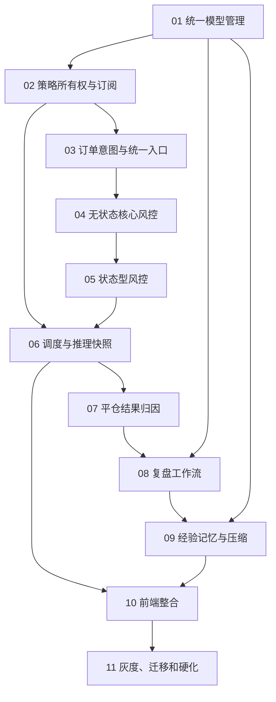

# AURUM 私有策略、风控、复盘与经验记忆 Mimo 实施总计划

> 状态：可拆分交给 Mimo，禁止单次全量实施
> 分支：`dev_codex`
> 日期：2026-07-15
> 设计基线：`docs/compose/specs/2026-07-15-private-strategy-shared-signal-risk-gate-design.md` v1.3

## 1. 执行原则

本项目涉及模型密钥、策略权限、自动交易、MT5 网络调用、账户风控、交易复盘和反馈记忆，不能作为一个无检查点的大任务执行。

Mimo 必须遵守：

1. 每次只执行一个阶段任务文件。
2. 每个阶段独立提交并推送 `dev_codex`。
3. 每个阶段写独立结果文件，包含 commit、文件、测试和风险。
4. 下一阶段开始前，由 Codex 或人工审查上一阶段 diff 和测试。
5. 不修改、删除或提交与任务无关的未跟踪文件。
6. 不把 API Key、Token、密码、`.env` 内容写入任务、结果、日志或提交。
7. 数据库变更必须使用 `server/migrations.js` 的后续编号迁移，并具备重复执行安全检查。
8. 兼容期保持现有 `auto_scheduler` 与 `user_bridge_settings` 双写，直到对应阶段明确切换。
9. 任一安全状态无法确认时禁止新增订单，但不得阻止平仓、减仓和撤单。
10. 不得使用 `git add .`；只暂存本阶段代码、本阶段任务文件和结果文件，其他阶段任务及既有未跟踪文件保持原样。

## 2. 完整复审结论

### P0：实施前必须处理

| 问题 | 后果 | 落地阶段 |
|---|---|---|
| 多条新增订单路径直接调用 Bridge | 可绕过统一风控 | 03 |
| 只有查询校验，没有账户级预占 | 并发穿透次数和敞口 | 03、05 |
| MT5 超时无法保证恰好一次 | 自动重试可能重复下单 | 03 |
| 共享推理读取管理员账户和仓位 | 共享信号被管理员状态污染 | 06 |
| 手动共享模型可能覆盖用户已有模型 | 不符合用户优先 | 01 |
| `api_key_encrypted` 实际未加密 | 数据库泄露会暴露模型密钥 | 01、11 |
| 私有策略没有 owner/model 服务端解析 | 越权和错用额度 | 01、02 |
| 风控与模型配置混合 | 换模型可能改变执行安全线 | 04 |
| 删除用户会删除交易审计 | 违反不可变审计 | 04、11 |
| Netting 多信号合并仓位 | 盈亏无法可靠归因 | 07 |
| 没有实际提示词快照 | 复盘无法复现历史推理 | 06 |
| 个人记忆注入共享信号 | 泄露个人数据并破坏共享语义 | 09 |

### P1：功能上线前必须处理

| 问题 | 修正 |
|---|---|
| Redis 可选 | DB 是锁、队列、熔断和任务最终来源 |
| Migration 失败只记录日志 | 每阶段增加 Schema readiness；关键功能未就绪不启用 |
| 部分平仓和外部干预 | deal 明细表、position 聚合、external_intervention |
| 快照体积无限增长 | 紧凑快照、哈希、Schema 版本、保留策略和对象引用 |
| 复盘内容与交易问题混淆 | 分离 review_content_status 与 trade_process_issue_status |
| 用户模型失败静默切平台 | 仅“未配置”允许兜底，运行失败不切换 |
| 记忆递归复制 | ancestor IDs、内容哈希和重复候选 |
| 撤销经验后摘要仍有效 | 摘要来源失效传播和重新压缩 |
| 压缩时来源发生变化 | source-set hash，旧结果标 stale |
| Shadow 含义不清 | retrieval shadow 与 paired inference 分离 |

### P2：产品可用性

- 模型配置独立页面，手动和私有自动推理共用用户默认模型。
- 用户风控中心与管理员全局风控分离。
- 用户必须看到 AI 建议手数、风险允许上限和最终手数。
- 复盘证据不可编辑，复盘正文可版本化编辑。
- 平台共享策略使用个人记忆时，必须明确提示将转为逐用户推理并增加模型成本。

## 3. 不可变架构决策

1. 平台共享开仓信号只使用账户无关市场数据。
2. AI 建议手数必须在平台品种上下限中；最终手数只可向下缩小。
3. 模型、策略、风控、订单意图、复盘和记忆分表分服务。
4. 用户无模型时才允许管理员共享模型兜底；用户模型调用失败不静默兜底。
5. 所有新增订单通过统一订单意图服务；Bridge 超时进入 uncertain，只对账不重发。
6. 用户个人记忆只进入手动、私有或逐用户推理，不进入平台共享推理。
7. 只有用户确认的复盘版本能生成个人经验。
8. 压缩不删除原始复盘和原子经验，所有摘要可追溯、可失效、可回滚。
9. V1 不实施基于盈亏自动放大仓位或自动修改置信度权重。

## 4. 阶段依赖



## 5. 阶段任务

| 阶段 | 任务文件 | 核心产物 | 进入下一阶段条件 |
|---|---|---|---|
| 01 | `20260715-mimo-01-model-management.md` | 模型表、统一解析器、共享开关 | 用户模型优先测试通过 |
| 02 | `20260715-mimo-02-strategy-ownership.md` | scope/owner、订阅和权限 API | 越权测试通过 |
| 03 | `20260715-mimo-03-order-intent-gateway.md` | 订单意图、幂等、统一 Bridge 入口 | 无开仓旁路、uncertain 测试通过 |
| 04 | `20260715-mimo-04-core-risk-gate.md` | 风控策略骨架、L1/L4/L5 | 核心硬规则测试通过 |
| 05 | `20260715-mimo-05-stateful-risk.md` | L2/L3/L6、预占、熔断 | 并发和重启测试通过 |
| 06 | `20260715-mimo-06-scheduler-snapshots.md` | 市场共享/私有调度、推理快照 | 管理员仓位不影响共享信号 |
| 07 | `20260715-mimo-07-outcome-attribution.md` | outcome monitor、deal 聚合 | Hedging 正确，Netting 歧义拒绝 |
| 08 | `20260715-mimo-08-review-workflow.md` | 复盘队列、版本、编辑确认 | 未确认内容不能进记忆 |
| 09 | `20260715-mimo-09-memory-system.md` | 检索、注入、压缩、回滚 | 共享隔离、撤销传播测试通过 |
| 10 | `20260715-mimo-10-frontend-integration.md` | 模型、策略、风控、复盘 UI | 权限与有效值展示通过 |
| 11 | `20260715-mimo-11-rollout-hardening.md` | 影子模式、迁移、监控、文档 | 全量回归和启动验证通过 |

## 6. 通用验证

每个阶段至少执行：

```powershell
npm test
```

涉及服务启动、迁移或路由的阶段还要执行：

```powershell
npm run dev
```

启动验证应启动服务、观察日志、确认结果后主动停止进程，不能让 watch 进程遗留。确认没有 `[FATAL]`、迁移失败、重复监听器和未处理 Promise。若本地缺少数据库、JWT_SECRET 或 Bridge，结果文件必须明确写“未验证”的原因，不能声称通过。

关键静态检查：

```powershell
rg -n "mt5Bridge.*'(open|pending)'" server
rg -n 'mt5Bridge.*"(open|pending)"' server
rg -n "api_key_encrypted|Authorization|Bearer" server docs/agent-results
```

第一条只允许命中统一执行适配层和测试；第二条用于人工检查，不得把密钥值写入日志或结果。

## 7. 兼容与切换

1. 新表和新服务先上线，旧路径继续读取。
2. 使用双读或 Shadow 对比旧结果与新结果。
3. 开仓路径完成收拢后，禁止旧入口直接 Bridge。
4. 风控可调规则逐条从 Shadow 切 Enforce；强制 SL、方向、Schema、幂等始终 Enforce。
5. 推理快照从部署日起开始积累，旧信号没有快照时不自动复盘。
6. 经验检索先 retrieval shadow，再由用户开启真实注入。
7. paired inference 需要独立开关和成本配额。
8. 任一阶段回滚不能删除新表历史数据或关闭硬风控。

## 8. Mimo 结果文件要求

每个结果文件必须包含：

```text
任务名称
起始 commit
完成 commit
推送分支
修改文件清单
数据库迁移
实现摘要
运行的测试和结果
未运行的验证及原因
已知风险
兼容性说明
下一阶段前必须处理的问题
```

Mimo 不得只写“完成”或只给测试数量。

## 9. 执行顺序

严格按 01 → 11 运行。不得把 03–05、07–09 合并成一个提交。每个阶段完成后停止，等待审查。若上一阶段结果文件缺失、测试失败、工作树包含不明修改或未推送 `dev_codex`，不得开始下一阶段。
