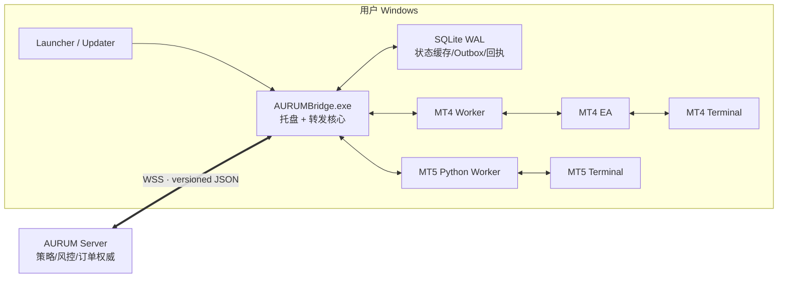

# AURUM MT4/MT5 桥接软件最终方案

> 状态：最终实施基线
>
> 日期：2026-07-25
>
> 产品原则：内部可靠，用户简单；桥接只做连接、转发、执行、回传和自动恢复。

## 1. 最终结论

AURUM Bridge 定位为一个轻量、可靠的 MT4/MT5 本地代理，不是策略平台、风控中心或交易分析软件。

它只承担五项核心职责：

1. 连接指定的 MT4/MT5 终端和账户。
2. 采集账户、行情、订单、持仓和成交数据并发送服务器。
3. 接收服务器下发的交易指令。
4. 调用 MT 执行指令并回传原生结果。
5. 自动启动、重连、自恢复和更新。

最终技术结构：

```text
AURUMBridge.exe
├─ 托盘与极简状态界面
├─ 服务器 WSS 长连接
├─ SQLite 本地状态缓存
├─ MT5 Python Worker（一个终端一个）
├─ MT4 Worker + MQL4 EA（一个终端一个）
└─ Launcher/Updater（签名下载、切换、回滚）
```

MT5 默认继续使用官方 Python `MetaTrader5` 包；MT4 使用轻量 EA。无需为了“换语言”重写全部 MT5 逻辑。

## 2. 产品边界

### 2.1 桥接负责

- 自动发现和连接 MT 终端。
- 确认平台、终端路径、Broker Server 和登录账号。
- 向服务器持续同步最新数据。
- 接收、执行并回传服务器指令。
- 检测重复命令、过期命令和错误账户。
- 对“已发给 MT 但结果不明确”的请求提供查询证据。
- 网络或终端断开后自动重连和补充同步。
- 后台自动下载签名更新，失败自动回滚。
- 显示简单状态、可读错误和日志。

### 2.2 桥接不负责

- AI、策略、信号分析和交易决策。
- 手工交易行为分析或干预判断。
- 复杂风控计算、仓位计算和风险中心界面。
- 交易复盘、绩效报表和运营后台。
- 本地插件市场或第三方任意代码。
- 在离线状态下自行决定执行旧命令。
- 自动管理或修改用户手工仓位。

策略、风控、权限、订单意图、人工复核和报表全部留在服务器。

桥接仍需保留少量“传输正确性保护”，例如账号匹配、命令幂等、命令期限、连接 epoch 和结果复核。这些不是业务功能，而是防止指令发错、重复执行或错误回报的基础保障。

## 3. 最终技术选型

| 部分 | 最终选择 | 说明 |
|---|---|---|
| 主程序 | C# / 当前 .NET LTS | Windows 托盘、异步网络、进程监管、Named Pipe、DPAPI 和更新支持成熟 |
| MT5 | Python Worker + 官方 `MetaTrader5` 包 | 用户无需安装 Python或 EA；一终端一 Worker |
| MT4 | MQL4 EA + 本机 Named Pipe + Worker | 第一版不依赖 DLL，不要求配置远程 URL 白名单 |
| 服务器通信 | 单条 WSS 长连接 + 两个逻辑优先队列 | 首版保持简单；交易控制消息优先于数据和历史消息 |
| 消息格式 | 带版本号的紧凑 JSON | 先通过差量和小消息解决性能；实测需要时再升级 MessagePack/Protobuf |
| 本地存储 | SQLite WAL，Bridge 主进程单写 | 保存最新状态、待上传数据和有限执行回执，不作为订单权威数据库 |
| 本地 IPC | Windows Named Pipe | 仅允许当前用户访问，不开放本机 TCP 端口 |
| 更新 | 稳定 Launcher + 签名 Manifest + 版本目录 | 后台下载、原子切换、健康检查、自动回滚 |

首版不建设通用插件平台。模块化只用于 AURUM 官方内部包：

- `core`
- `adapter.mt5.python`
- `adapter.mt4`
- `data.symbol-map`

用户不需要查看、选择或管理这些模块。

## 4. 用户最终使用方式

### 4.1 MT5 用户首次安装

1. 用户从官网下载签名安装器。
2. 安装器下载并校验当前稳定版本。
3. Bridge 启动浏览器完成账户配对。
4. 自动扫描本机 MT5 终端。
5. 用户选择要连接的终端和账号。
6. Bridge 完成只读自检和首次数据同步。
7. 页面显示“已就绪”。

用户不需要：

- 安装 Python；
- 执行 pip；
- 配置端口；
- 安装 MT5 EA；
- 理解 Worker、SQLite、WSS 或模块版本。

### 4.2 MT4 用户首次安装

MT4 用户只比 MT5 多一次设置：

1. 安装器将签名 EX4 复制到 MT4 的 `MQL4/Experts/AURUM`。
2. 用户打开或重启 MT4。
3. 将 `AURUM Bridge EA` 挂到一个专用图表。
4. 开启 AutoTrading。
5. Bridge 自动完成本机管道连接和数据同步。

第一版不要求启用 DLL。

### 4.3 日常使用

- 登录 Windows 后自动启动。
- MT 终端正常运行并已登录即可。
- 网络断开后自动重连。
- MT 重启后自动重新识别并同步。
- 更新自动下载，在没有在途指令时自动应用。
- 首次浏览器授权是设备级长期授权，不设置固定到期登录；只有用户在 Bridge 内主动退出，或账号删除、密码重置、退出所有设备等明确安全撤销后，才需要重新授权。
- 无法自动修复时只显示原因和“重新检测”。

### 4.4 极简界面

```text
┌─────────────────────────────────────┐
│ AURUM Bridge                        │
│                                     │
│ MT5 · Broker-Server · ****1234      │
│ 状态：已就绪                        │
│ 数据：刚刚同步                      │
│ 服务器：已连接                      │
│ 版本：最新                          │
│                                     │
│ [重新检测] [查看日志] [停止桥接]    │
└─────────────────────────────────────┘
```

多终端时只增加多张同样的连接卡片，不增加复杂控制台。

“关闭窗口”只隐藏到托盘；“停止桥接”才真正停止程序，并明确提示：停止桥接不会撤单、不会平仓、不会关闭 MT。

## 5. 最终整体结构



### 5.1 组件职责

| 组件 | 职责 |
|---|---|
| `AURUMBridge.exe` | 托盘、配对、WSS、数据转发、指令路由、SQLite、状态显示、Worker 监管 |
| MT5 Worker | 连接一台 MT5，读取数据，机械执行指令，返回 MT5 原生结果 |
| MT4 Worker | 连接一套 MT4 EA，转换本地消息，返回 MT4 原生结果 |
| MT4 EA | 在 MT4 内采集、执行和回传，不保存服务器令牌 |
| Launcher/Updater | 下载、校验、启动、版本切换和回滚，不参与交易 |
| Server | 策略、风控、权限、命令账本、订单意图、最终状态和人工处置 |

一个 MT 终端对应一个 Worker。单个 Worker 卡死或崩溃，只影响对应终端。

## 6. 数据同步方案

### 6.1 数据路径

```text
MT4/MT5
  → Worker 内存最新状态
  → AURUMBridge
  → SQLite 事务更新 + Outbox
  → WSS 增量推送
  → 服务器 Redis/MySQL 读模型
  → 页面、策略和业务 API
```

服务器不能直接访问用户电脑的 SQLite，也不应在每次页面查询时临时穿透到 MT。Bridge 持续推送变化，服务器读取自己的缓存和数据库。

### 6.2 数据分级

| 数据 | 客户端处理 | 服务器处理 |
|---|---|---|
| 账户 | 内存 + SQLite 最新状态 | Redis 最新值 + MySQL 快照 |
| 持仓 | 差量 upsert/delete + 周期快照 | 最新状态和历史变化 |
| 挂单 | 差量 upsert/delete + 周期快照 | 最新状态和历史变化 |
| 成交/历史 | 按游标增量读取 | MySQL 持久保存 |
| 品种元数据 | 本地缓存，连接/变化时刷新 | 按 Broker/账号保存 |
| 最新报价 | 主要保存在内存，合并过期值 | Redis/内存最新值 |
| K 线 | 按需或新 K 线时读取 | 服务器缓存或持久化 |

### 6.3 推荐刷新方式

不再每秒执行一次固定全量采集。采用：

- 变化优先；
- 自适应轮询；
- 交易指令执行后立即刷新；
- 重连后完整同步；
- 每 5–15 秒做一次轻量完整校准。

初始参考值：

- 最新报价：100–250 ms 采样，只发送变化后的最新值；
- 订单/持仓：活跃期 200–500 ms，空闲期约 1 s；
- 账户：约 1 s；
- 历史：按需分块读取；
- K 线：按需或新 K 线形成时读取。

这些是初始参数，不是固定业务规则，必须由 M0 性能基线调整。

每次数据更新携带：

```text
terminal_instance_id
account_ref
connection_epoch
revision
observed_at_utc_msc
source_time_msc
```

服务器发现 revision 缺口或数据过期时，可以请求完整快照。

## 7. SQLite 的最终定位

SQLite 是本地缓存和断线恢复工具，不是 MT/Broker 交易事实，也不是服务器订单权威。

Bridge 主进程是唯一写入者，避免多个 Worker 同时写数据库。

建议表：

```text
terminal_bindings
account_latest
positions_latest
orders_latest
history_cursors
outbox_messages
execution_receipts
module_versions
update_state
```

规则：

- `outbox_messages` 保存断网期间尚未上传的数据和执行结果。
- `execution_receipts` 只保存有限期限的 command ID、原生结果和查询证据，用于重复请求识别。
- Bridge 重启后不会自行执行一条尚未执行的旧命令；由服务器 command ledger 决定是否以同一 command ID 重发。
- 若 MT 可能已经接受命令但回包丢失，Bridge 只负责查询活动订单、持仓和历史并回传证据，最终状态由服务器确定。
- Quote 不逐 Tick 写核心 SQLite，避免写放大。
- 日志、Outbox 和回执都设置大小及保留期上限。
- SQLite 不保存 MT 主密码、refresh token 或设备私钥。

## 8. 服务器指令执行方案

### 8.1 指令路径

```text
服务器写入 command ledger
  → 通过 WSS 发送 command
  → Bridge 校验不可变路由字段
  → 放入对应 Worker 的高优先级队列
  → Worker 调用 MT
  → 返回原生 retcode/ticket/deal/order
  → Bridge 保存有限回执并上传
  → 服务器确认最终状态
```

### 8.2 Bridge 只做最低限度校验

- `command_id` 是否存在且格式正确；
- 是否发给当前 `terminal_instance_id`；
- Broker Server 和登录账号是否匹配；
- `connection_epoch` 是否仍有效；
- 命令是否超过 `deadline`；
- 相同 command ID 是否已经处理；
- MT 当前是否允许对应交易动作；
- 指令参数是否满足 MT API 的基本格式和 Broker 合约约束。

Bridge 不重新计算策略、风险或仓位，不擅自修改服务器指令。

### 8.3 优先级

Worker 内只有两级即可：

1. 高优先级：开仓、平仓、撤单、改单、指令结果查询。
2. 普通优先级：账户、报价、K 线、历史和健康查询。

历史查询必须分块，并在块之间让出执行权。行情拥塞时只保留最新值；交易命令和执行结果不可丢弃。

### 8.4 结果不明确

如果出现超时、断线或 MT 返回值不足以判断最终结果：

```text
Bridge 返回 uncertain + 原生证据
→ 服务器请求 reconcile(command_id)
→ Bridge 查询 MT 当前订单/持仓/历史
→ 返回查询结果
→ 服务器确定最终状态或人工处理
```

禁止 Bridge 自动重发未知结果命令。

## 9. MT5 实现

### 9.1 保留 Python

MetaQuotes 官方 `MetaTrader5` Python 包通过本机 IPC 连接 MT5，并提供账户、行情、订单、持仓、历史和交易调用。它仍是普通 MT5 用户最方便的接入方式。

Python 仅存在于 MT5 Worker，不再承载 GUI、更新、服务器业务或复杂流程。

### 9.2 一终端一 Worker

- 每个 Worker 明确指定 MT5 EXE 路径。
- 初始化后读取实际账号和 Server。
- 账号不匹配时停止执行并提示用户重新检测。
- 所有 MT5 API 调用在 Worker 内串行执行。
- 单 Worker 崩溃后自动重启，不影响其他终端。
- 用户不安装系统 Python；Worker 自带固定 runtime 和 `MetaTrader5` wheel。

### 9.3 当前优化重点

当时的旧版 Python GUI 将交易命令和数据采集放在同一 MT5 锁与串行循环中。该实现已在 3.0 原生重构完成后删除；本段仅保留为重构背景，不再对应当前可执行源码。

重构首先解决：

- 交易命令优先；
- 不再固定全量轮询；
- 品种信息缓存；
- K 线和历史按需；
- 数据差量发送；
- 一终端一进程隔离。

只有这些优化完成后仍不能达到性能指标，才评估 MQL5 EA Adapter。MT5 EA 不是首发范围。

## 10. MT4 实现

MT4 没有同等级官方 Python 包，因此使用：

```text
MT4 Terminal
  ↕
AURUM Bridge EA.ex4
  ↕ Named Pipe
MT4 Worker
  ↕
AURUMBridge.exe
```

EA 只负责：

- 读取账号、订单、持仓、成交和报价；
- 接收本机指令；
- 调用 MQL4 交易函数；
- 返回 ticket、错误码和最新状态；
- 发送心跳。

EA 不负责：

- 连接 AURUM 云端；
- 保存服务器 token；
- 运行策略或风控；
- 分析用户手工交易；
- 自动更新自身。

MQL4 使用 `OnTick` 和 `OnTimer` 做轻量采集，通过 `OrdersTotal/OrderSelect` 和历史游标获得差量。定期完整快照用于校准。

第一版通过 MQL4 官方支持的 Named Pipe 通信，不启用 DLL。只有真实压测证明不能满足要求，才单独评估签名 32 位 DLL。

## 11. 安装、模块和自动更新

### 11.1 安装器

用户只下载一次 `AURUMBridgeSetup.exe`。安装器包含稳定根公钥和最小下载逻辑，实时获取当前版本。

“长期不需要重新下载安装器”是目标，但不承诺安装器永远不变；根密钥轮换、Windows 兼容或安全漏洞可能要求极少量更新。

必须同时提供离线完整安装包，防止 CDN、代理或企业网络导致首次安装失败。

### 11.2 更新包

```text
release.json
├─ core
├─ adapter.mt5.python
├─ adapter.mt4
└─ data.symbol-map
```

每个包包含版本、大小、SHA-256、兼容范围和签名。EXE、DLL、EX4 同时使用 Authenticode 签名。

### 11.3 更新流程

1. 后台下载到 staging。
2. 校验 Manifest 签名、文件 hash 和系统兼容性。
3. 等待没有在途指令。
4. 暂停接收新指令。
5. 干净停止需要更新的进程。
6. 切换版本目录指针。
7. 启动并执行只读健康检查。
8. 连接终端并完成数据同步。
9. 成功后标记 last-known-good；失败则恢复旧版。

更新服务器或下载失败不能影响当前正在运行的版本。更新器不得强杀仍在执行 MT 调用的 Worker。

## 12. 安全与后台可靠性

这些能力必须存在，但不暴露为复杂用户功能：

- WSS 使用短期一次性连接 ticket。
- refresh token 和设备密钥使用 DPAPI/CNG 保护。
- 长期 token 不进入安装 URL、日志或普通配置。
- Named Pipe 仅允许当前 Windows 用户访问。
- 每次连接生成新的 connection epoch，旧 Worker 不能继续执行。
- 一个终端只有一个活动 Worker 和一个执行权连接。
- Worker 崩溃使用指数退避重启；连续失败后只停止该终端。
- 所有队列有容量上限；数据可合并，交易结果不可丢弃。
- 启动、重连、更新后先完整同步，再恢复接收新指令。
- 日志自动轮转和脱敏，磁盘不足时优先保留执行回执。
- “重新检测”只执行只读检查，不使用真实订单测试连接。

## 13. 服务器需要配合的改造

服务器是订单和业务权威，应负责：

- 持久化 `command_ledger`；
- 为每条命令生成唯一 `command_id`；
- 决定命令是否发送、重发、过期或人工处理；
- 保存最终订单、成交、持仓和风险状态；
- 处理 Bridge 返回的 `uncertain` 和 reconcile 证据；
- 把 Bridge 增量数据写入 Redis/MySQL 读模型；
- 保存终端在线状态、最后数据时间和 connection epoch。

当前服务器仍使用进程内 `pendingCommands` Map，见 [bridge-ws.js](../../../server/bridge-ws.js#L23)。重构后 Map 只能作为等待当前请求的短期优化，不能成为命令状态权威。

首版不引入 Kafka。现有 MySQL 作为权威存储，Redis只做在线状态和快速读取。

## 14. 建议代码结构

```text
bridge/
  app/
    AurumBridge/                 # C# 托盘与转发核心
  launcher/
    AurumBridge.Launcher/
  adapters/
    mt5-python/
    mt4-worker/
    mt4-ea/
  protocol/
    v3-json-schema/
  packaging/
    manifests/
    signing/
  tests/
    contracts/
    integration/
    fault-injection/

server/
  bridge-v3/
    gateway/
    command-ledger/
    read-model/

public/ai/                       # 旧 Bridge v2，迁移期间保留
```

## 15. 实施顺序

不做大爆炸重写。每一阶段都可以回退旧版。

| 阶段 | 内容 | 完成条件 |
|---|---|---|
| M0 基线 | 测量当前 MT 调用、命令延迟、CPU、内存、网络和重连 | 指标可重复，旧协议有契约测试 |
| M1 契约 | 定义 v3 JSON schema、command ID、账户身份、revision 和 epoch | 模拟终端可跑通数据与指令闭环 |
| M2 MT5 | C# Bridge + SQLite + 单 MT5 Python Worker | demo 账号连续 72 小时稳定 |
| M3 服务器 | command ledger、增量 read model、重连和 uncertain 查询 | 重启/断线后无重复执行和数据串号 |
| M4 更新与多终端 | 签名安装、模块下载、回滚、一终端一 Worker | 更新故障注入和 1/5/20 终端测试通过 |
| M5 MT4 | MT4 EA + Named Pipe + Worker | 完整 demo 交易矩阵通过 |
| M6 灰度 | internal → 5% → 25% → 100% | 各阶段达到停止线后再扩大 |

迁移过程中，同一账户任何时刻只能有一个拥有执行权的 Bridge。新版首先只读同步，与旧版数据比较；确认一致后再切换唯一执行权。

## 16. 验收指标

### 16.1 用户体验

- 90% 新用户在 5 分钟内完成 MT5 首次连接。
- 用户电脑无需系统 Python、pip 或开发工具。
- 常见断线、终端重启和 token 刷新自动恢复。
- 账号、Server 或终端不匹配时给出明确中文提示。
- 点击“停止桥接”前明确说明不会自动撤单或平仓。

### 16.2 数据

- 正常网络下，订单/持仓变化上报 p95 ≤ 500 ms、p99 ≤ 1 s。
- revision 缺口检测率 100%，发现缺口后自动请求完整快照。
- 断网期间已进入 Outbox 的数据丢失数为 0。
- 多终端之间数据串联数为 0。

### 16.3 指令

- 10,000 次重复、超时、断线和进程重启故障注入中，重复执行命令数为 0。
- 跨账号、跨终端执行数为 0。
- 已发送 MT 但结果不明确的命令不得自动重发。
- 本地 Host → Worker IPC p99 ≤ 10 ms。
- 不含公网、MT 和 Broker 的 Bridge 附加延迟 p99 ≤ 50 ms。
- 历史或行情查询不得阻塞交易指令超过当前单次 MT 调用边界。

### 16.4 稳定与更新

- 单 Worker 崩溃不影响其他终端。
- Worker 自动恢复 ≤ 30 s，Bridge 恢复 ≤ 60 s。
- 7 天持续运行后预热内存增长 ≤ 5%。
- 无效签名、篡改包和降级包拒绝率 100%。
- 更新失败后恢复 last-known-good ≤ 60 s。
- 明文密码、token 和设备私钥检出数为 0。

## 17. 灰度停止线

出现任一情况立即停止发布并回退：

- 重复执行交易指令；
- 命令发到错误账号或终端；
- Bridge 擅自执行服务器未重新授权的旧命令；
- 已知执行结果被错误报告；
- 密钥或 token 泄露；
- 更新无法恢复旧版；
- 新版崩溃率达到旧版两倍；
- p99 指令延迟比旧版恶化超过 10%。

## 18. 最终批准项

1. Bridge 产品保持极简，只做连接、转发、执行、回传、恢复和更新。
2. C# 承载主程序，Python 只用于 MT5 Worker。
3. MT5 用户无需 EA；MT4 使用一次性挂载的轻量 EA。
4. 首版一条 WSS、紧凑 JSON、两个逻辑优先级，不提前复杂化。
5. SQLite 只做状态缓存、Outbox 和有限回执，不成为订单权威。
6. 服务端保存 command ledger 并决定重发和最终状态。
7. 模块化只服务官方内部更新，不建设插件平台。
8. 安装一次后正常功能通过签名模块自动更新，保留离线完整包。
9. 不加入手工干预分析、复杂本地风控、报表和策略功能。
10. 先完成 MT5 v3，再上线 MT4；MQL5 EA 和 MT4 DLL 只在数据证明必要时评估。

## 19. 官方能力依据

- [MetaTrader 5 Python Integration](https://www.mql5.com/en/docs/python_metatrader5)
- [MetaTrader5 initialize](https://www.mql5.com/en/docs/python_metatrader5/mt5initialize_py)
- [MQL4 FileOpen / Named Pipe](https://docs.mql4.com/files/fileopen)
- [MQL4 Event Handling](https://docs.mql4.com/en/basis/function/events)
- [Velopack Windows](https://docs.velopack.io/packaging/operating-systems/windows)
- [Velopack Delta Updates](https://docs.velopack.io/packaging/deltas)

这份方案的判断标准只有两个：服务器是否能稳定、准确地收到 MT 数据并控制 MT 执行，以及普通用户是否能在几分钟内完成安装后几乎不再管理它。
