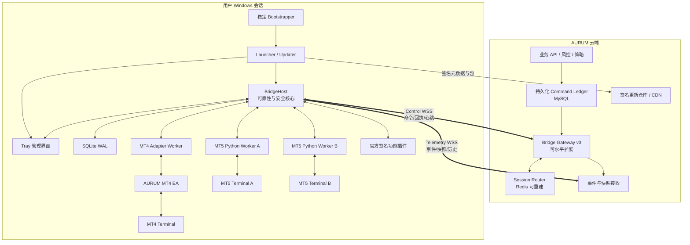
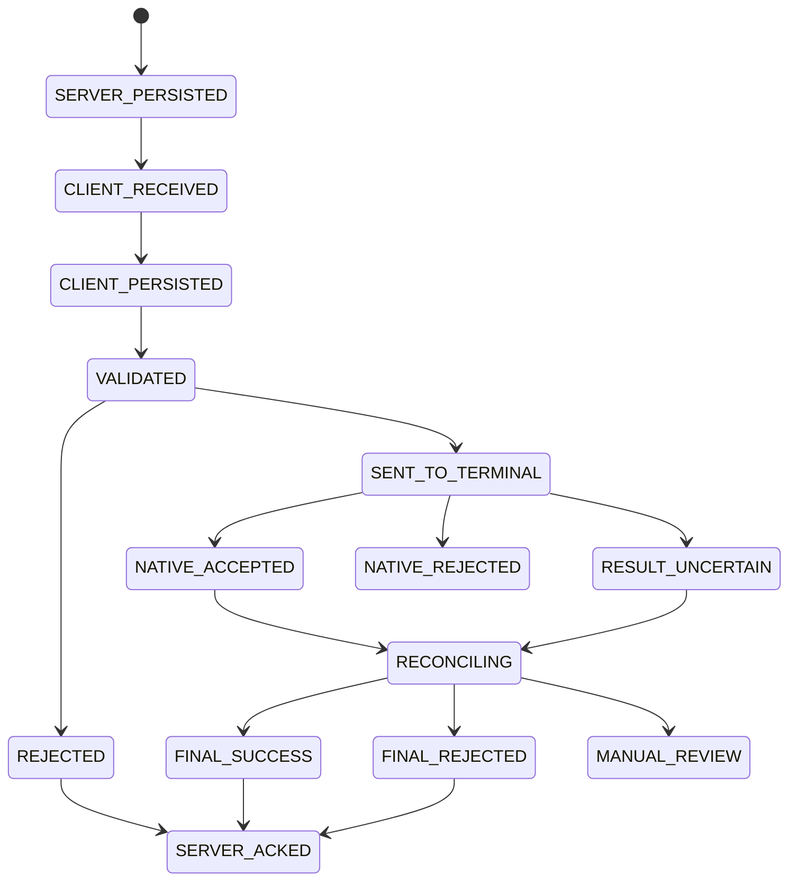
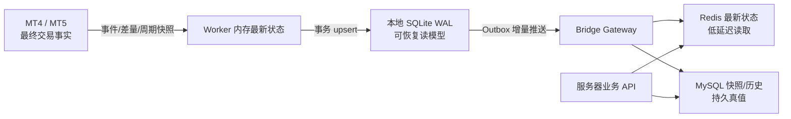

# AURUM 桥接软件最终重构方案

> 状态：最终目标架构与实施基线
>
> 日期：2026-07-25
>
> 范围：Windows 客户端桥接、服务器指令链路、MT5、MT4、模块化更新、安装与运维
>
> 结论性质：本文件确定目标方向；性能阈值必须在 M0 基线测试后复核，但不得降低交易正确性和安全门槛。

## 1. 最终结论

本项目不应把桥接软件简单地从 Python 改写成另一种语言，也不应继续扩展当前的单体 Python GUI。最终方案是：

1. 建立一个稳定的原生 `BridgeHost`，负责服务器连接、认证、可靠队列、订单幂等、故障对账、配置、密钥和进程监管。
2. MT5 默认继续使用 MetaQuotes 官方 `MetaTrader5` Python 包，但将其隔离为“一台 MT5 终端一个独立 Worker”。用户不需要安装 Python，也不需要安装 EA。
3. MT4 使用一个极薄的 MQL4 EA，通过本机 Windows Named Pipe 连接独立 `MT4 Adapter Worker`。第一版不要求 DLL，也不要求配置远程 URL 白名单。
4. 所有终端适配器实现统一的语义协议。未来可以增加 MQL5 EA、Broker REST/WebSocket/FIX、Manager API 或托管终端适配器，而不改服务器交易业务。
5. 核心与功能插件彻底分离。普通插件进程外运行、只能使用声明的能力、只能安装官方签名包；交易安全不变量永远不插件化。
6. 安装改为“稳定薄安装器 + 在线签名包 + 离线完整包”。后续功能通过模块包下载，按最小范围重启后生效。
7. 更新必须支持暂存、签名校验、安全停机、原子切换、健康检查和自动回滚。交易代码不做同进程热替换，不允许更新器强杀正在执行交易的进程。
8. 交易链路采用“至少一次投递 + 幂等执行 + 最终对账”，不宣称无法真正保证的端到端 exactly-once。
9. 面向普通零售 MT 账号，本机桥接无法彻底取消。只有获得券商级 API/Manager 权限，或改为托管 Windows 终端，才能真正做到用户电脑零安装。

最终产品形态可以概括为：

```text
一个用户可见的 AURUM Bridge
├─ 一个稳定 Host
├─ 一个托盘管理界面
├─ 每台 MT5 一个 Python Adapter Worker（默认、无需 EA）
├─ 每台 MT4 一个 Adapter Worker + 一个薄 EA
├─ 若干官方签名功能插件
└─ 一个支持签名、灰度和回滚的 Launcher/Updater
```

## 2. 关键技术取舍

| 决策项 | 最终选择 | 原因 |
|---|---|---|
| 客户端核心 | C# / 当前 .NET LTS | Windows 进程管理、Named Pipe、DPAPI/CNG、托盘 UI、异步网络和更新生态成熟；开发与维护成本低于 C++，交付速度优于全 Rust |
| MT5 接入 | 官方 Python 包，独立 Worker | 普通用户无需 EA；接口完整；现有业务可迁移；主要瓶颈可通过架构消除 |
| MT4 接入 | MQL4 EA + 本机 Named Pipe + Worker | MT4 没有同等级官方 Python 包；无需 DLL、无需远程白名单，部署风险最低 |
| MT5 低延迟备选 | MQL5 EA Adapter，暂不作为默认 | 事件驱动更快，但增加 EA 安装、授权、兼容和支持成本；只有实测不达标才投入 |
| 本地 IPC | ACL 限制的 Windows Named Pipe | 低延迟、无端口暴露、适合 C#/Python/MQL 本机通信 |
| 远端协议 | 两条 WSS 长连接，二进制 Protobuf 帧 | 控制与遥测互不阻塞；跨语言、可版本化、负载小 |
| 本地可靠存储 | SQLite WAL | 适合单机命令 inbox/outbox、执行日志、升级状态与崩溃恢复 |
| 服务端权威存储 | 现有 MySQL 命令账本；Redis 只做路由加速 | 不新增不必要的 Kafka；Redis 故障不能决定订单真值 |
| 更新基础 | 稳定 Bootstrapper + Velopack 发布/增量能力 + AURUM 签名模块清单 | 获得版本目录、稳定入口和差分包，同时由 AURUM 控制交易安全停机与回滚 |
| 插件模型 | 官方签名、进程外、能力受限 | 插件崩溃不拖垮 Host；避免 Python/C ABI 成为长期插件契约 |
| 默认运行方式 | 当前 Windows 用户会话，登录时自启动 | MT 终端属于交互式用户会话；不把交易核心错误地放入 Session 0 服务 |

MT5 继续使用 Python，不代表 Python 比 MQL5 本地执行更快。MQL5 在终端内部事件驱动，理论上的本地延迟更低；选择 Python 是因为它在“性能足够、无需 EA、官方接口、安装便利、已有代码复用”之间综合最优。重构后的适配器边界允许未来按数据决定是否替换。

## 3. 方案前提与实时性定义

本方案基于以下业务前提：

- 主要服务对象是不同券商的普通 MT4/MT5 零售账号，而不是拥有 MetaTrader Server/Manager 权限的券商。
- 客户端主要运行在 Windows 10/11 或 Windows VPS。
- 服务器现有 Node.js、MySQL 和 WebSocket 业务继续使用，逐步升级而非一次性更换。
- “实时精准”首先指订单、成交、持仓、账户和风险状态可追踪、可恢复、可对账，而不是默认永久保存每一个原始 Tick。

数据按可靠性分为三类：

| 数据 | 语义 | 丢失策略 |
|---|---|---|
| 交易命令、订单、成交、持仓、风控状态 | 事件 + 周期全量快照 | 不允许静默丢失；落盘、重试、幂等、对账 |
| 账户状态、品种元数据、K 线 | 最新状态或按需查询 | 缓存、差量、定期校准 |
| 报价展示 | latest-state，可合并 | 网络拥塞时保留最新值，不堆积过时报价 |
| 原始 Tick 审计（可选） | 游标化 Tick journal | 独立模块、独立磁盘预算和上传通道 |

如果业务要求“每一个 Tick 都不能丢”，必须显式开启 Tick Journal。MT5 可按时间/游标增量补取；MT4 零售 EA 路线仍不能承诺交易所级无损，届时应优先评估券商 DataFeed/Server API。

## 4. 当前实现的主要问题

以下证据基于 2026-07-25 当前工作树，行号以后续修改为准：

1. MT5 Python 扩展被认为不是线程安全的，采集和交易命令共用同一个 `RLock`；整个命令处理都在锁内。见 [aurum_bridge_gui.py](../../../public/ai/aurum_bridge_gui.py#L655) 和 [aurum_bridge_gui.py](../../../public/ai/aurum_bridge_gui.py#L1449)。
2. 当前发送循环每秒采集一次，并对完整对象做 JSON 排序序列化后再去重。去重只省下网络发送，没有省下 MT5 IPC、全量读取和序列化。见 [aurum_bridge_gui.py](../../../public/ai/aurum_bridge_gui.py#L3078) 和 [aurum_bridge_gui.py](../../../public/ai/aurum_bridge_gui.py#L3136)。
3. 每次采集串行读取账户、终端、品种、最新 Tick、全部持仓和 M1 数据。见 [aurum_bridge_gui.py](../../../public/ai/aurum_bridge_gui.py#L3171)。
4. 服务端的桥接连接和待回执命令主要保存在单个 Node 进程内存中，直接横向扩容会依赖粘性路由，进程重启也会丢失待回执上下文。见 [bridge-ws.js](../../../server/bridge-ws.js#L18) 和 [bridge-ws.js](../../../server/bridge-ws.js#L2553)。
5. 旧安装路由把令牌读取自查询参数，并再次放入 EXE 下载 URL；Base64 配置不是加密，下载过程也没有完成签名清单校验。见 [server/index.js](../../../server/index.js#L253)。
6. 自动更新接口目前正确地保持关闭，原因是缺少签名更新清单，下载 URL、大小和哈希为空。见 [server/routes/ai/index.js](../../../server/routes/ai/index.js#L61)。
7. 项目已有多 profile、路径占用、命名互斥量和 DPAPI 密钥存储基础。见 [bridge_profile_runtime.py](../../../public/ai/bridge_profile_runtime.py#L43) 和 [bridge_secret_store.py](../../../public/ai/bridge_secret_store.py#L9)。这些能力应迁移，不应重写丢失。
8. 项目已有订单执行引用、桥接侧幂等检索和未知结果对账基础。见 [order-intents.js](../../../server/routes/ai/order-intents.js#L245) 和 [bridge_order_idempotency.py](../../../public/ai/bridge_order_idempotency.py#L110)。新架构必须保留并升级这些合同。

因此，当前性能和可靠性的首要矛盾是共享锁、全量轮询、长任务与交易命令混跑、单体进程耦合，以及服务器命令状态不够持久化，而不是 Python 解释器本身。

## 5. 最终整体架构



### 5.1 客户端进程职责

| 组件 | 主要职责 | 不负责 |
|---|---|---|
| Bootstrapper | 首次获取可信 Launcher、根密钥轮换、自身极少量更新 | 交易、账号认证、插件业务 |
| Launcher/Updater | 选择版本、下载、校验、暂存、启动、切换和回滚 | 决定订单结果 |
| BridgeHost | WSS、认证、命令落盘、优先队列、幂等、对账、fencing、配置、密钥、进程监管 | 直接调用 MT API、复杂 UI |
| Tray | 登录配对、终端绑定、状态、诊断、更新提示 | 持有交易真值、维持桥接生命周期 |
| MT5 Worker | 连接一台指定 MT5、串行调用官方 Python API、差量采集、执行交易、终端对账 | 服务器认证、全局插件管理 |
| MT4 Worker | 与一套 MT4 EA 会话通信、协议转换、命令账本和对账 | 直接向远端服务器暴露 EA |
| MT4 EA | 在 MT4 内读取状态、执行命令、返回原生结果 | 保存服务器令牌、直接更新自身 |
| 功能插件 | 历史同步、诊断、报表、符号映射、非关键转换等 | 认证、密钥、核心风控、订单幂等 |

`Tray` 关闭不应停止桥接。`Host` 和终端 Worker 在当前用户会话中由登录启动项或计划任务启动。Windows 服务如需存在，只能作为窄权限文件更新代理，不得连接 MT，也不得读取用户交易凭据。

### 5.2 建议代码结构

```text
bridge/
  protocol/
    bridge-v3.proto
    schemas/
  host/
    Aurum.Bridge.Host/
    Aurum.Bridge.Core/
    Aurum.Bridge.Storage/
    Aurum.Bridge.Security/
  tray/
    Aurum.Bridge.Tray/
  launcher/
    Aurum.Bridge.Launcher/
    Aurum.Bridge.Bootstrap/
  adapters/
    mt5-python/
      worker/
      embedded-runtime/
      tests/
    mt4/
      worker/
      ea/
      tests/
    mt5-mql5/                 # 后续可选，不在首发范围
  plugins/
    sdk/
    official/
  packaging/
    manifests/
    signing/
    release/
  tests/
    contracts/
    fault-injection/
    soak/

server/
  bridge-v3/
    gateway/
    command-ledger/
    session-router/
    telemetry/
    update-metadata/

public/ai/                    # 旧版 v2，迁移期保留并可回退
```

## 6. MT5 Adapter 最终设计

### 6.1 为什么保留 Python

MetaQuotes 官方 Python 包通过进程间通信连接本机 MT5 终端，可通过 `initialize(path=...)` 明确绑定终端，并提供账户、行情、订单、持仓、历史和交易函数。它适合普通终端用户，不需要用户安装 EA。

保留 Python 的边界是“终端驱动”，不是“整个产品仍由 Python 单体承载”。服务器连接、可靠性、更新、UI 和插件监管全部移出 Python。

### 6.2 一终端一 Worker

每个 MT5 Worker 只允许绑定一个组合：

```text
terminal_instance_id = hash(
  normalized_terminal_exe_path,
  terminal_data_path,
  broker_server,
  login
)
```

初始化后必须重新读取 `terminal_info()` 和 `account_info()`。EXE 路径、数据目录、账号或服务器与绑定配置任一不一致时：

- 状态变为 `ACCOUNT_MISMATCH`；
- 禁止执行普通开仓、改单和撤单；
- 仅允许受策略明确授权的紧急减仓/平仓流程；
- 通知服务器和用户重新确认绑定。

每个 Worker 有独立进程、Named Mutex、日志、SQLite 命令分区、连接 epoch 和崩溃重启策略。一台终端崩溃不能阻塞其他终端。

### 6.3 调度与轮询策略

Worker 内仍需串行调用 MT5 API，但不再用一个“大锁”包住不相关业务。使用一个拥有 API 所有权的调度线程，按优先级逐个执行小任务：

| 优先级 | 内容 | 调度规则 |
|---|---|---|
| P0 | 紧急平仓、撤单、禁开仓 | 最高优先；下一个 MT 调用边界立即抢占 |
| P1 | 开仓、改单、普通平仓、交易后复核 | 不被行情、历史和 UI 请求阻塞 |
| P2 | 订单/持仓/账户差量、风险快照 | 自适应轮询，变化或交易后加速 |
| P3 | 报价展示、K 线、历史、诊断 | 可合并、可取消、分块执行 |

推荐初始采集策略，M0 后按实测调整：

- 报价：100–250 ms 采样，仅在值或时间变化时上报；拥塞时保留最新值。
- 订单/持仓：活跃交易期约 200–500 ms，空闲期约 1 s；交易后立即复核。
- 账户：约 1 s，发生交易或保证金风险时立即刷新。
- 完整对账：每 5–15 s、重连后、Worker 重启后、账号切换后、任何 `uncertain` 结果后。
- 品种元数据：连接时加载并缓存，品种切换、终端配置变化或较长周期后刷新。
- K 线：按需或新 K 线形成时读取，不再每秒固定调用 `copy_rates_from_pos()`。
- 历史：低优先级分块读取，每块之间允许 P0/P1 抢占。

MT5 包没有提供等价于 MQL5 `OnTradeTransaction` 的 Python 事件回调，所以轮询不能完全消失；目标是让轮询轻量、差量、可抢占、可对账，而不是盲目全量采集。

### 6.4 打包方式

- 用户电脑不执行 `pip install`，也不依赖系统 Python。
- 发布包固定 Python runtime、`MetaTrader5` wheel 和所有依赖的精确版本。
- Worker 使用自包含的 embedded CPython runtime；入口可由 Nuitka standalone 包装，但不能把整个产品重新塞入单个 one-file EXE。
- Runtime 与 Adapter 作为一个经过测试的系统模块发布，升级只重启对应 Worker。
- 若杀毒软件、终端 build 或 MetaTrader5 wheel 兼容性异常，模块清单可以将该用户回退到上一个已验证组合。

### 6.5 何时才开发 MQL5 EA Adapter

只有满足以下任一条件才批准 MQL5 EA 投入：

- 隔离、差量和调度优化后，本地桥接附加延迟仍持续不满足 SLO；
- 产品必须使用 `OnTradeTransaction` 做更细粒度的交易事件采集；
- 产品明确要求更高频率的 Tick 采集，并接受 EA 安装成本；
- 特定券商或终端环境的 Python IPC 不稳定。

即使使用 MQL5 EA，事件处理函数也只能快速入本地队列。官方文档明确说明交易事件到达顺序不保证，队列长度为 1024，处理过慢可能被新事件覆盖，所以仍然必须周期全量对账。

## 7. MT4 最终支持方案

### 7.1 产品形态

MT4 没有可依赖的同等级官方 Python 终端包。首发方案固定为：

```text
MT4 Terminal
  └─ AURUM Bridge EA.ex4
       ⇅ 本机 Named Pipe（无远程 URL、无服务器令牌）
     MT4 Adapter Worker
       ⇅ 版本化本地 IPC
     BridgeHost
       ⇅ WSS
     AURUM Server
```

MQL4 官方 `FileOpen` 支持访问 `\\.\pipe\...` 命名管道，因此第一版不需要 DLL。MQL4 端使用简单、长度前缀化的 UTF-8 JSON 帧；MT4 Worker 负责校验、限流并转换成内部 Protobuf，避免在 MQL4 内实现复杂的 Protobuf 运行时。

### 7.2 EA 行为

- `OnInit`：验证账号、服务器、AutoTrading、管道握手和协议版本。
- `OnTick`：触发最新报价更新和一次非阻塞状态检查，不执行远程网络请求。
- `OnTimer`：读取本地命令、扫描当前订单、扫描历史差量、发送心跳。
- 默认使用毫秒级 Timer；实际频率根据 CPU 和券商终端稳定性调优。
- 下单、改单、撤单、平仓和部分平仓均返回 MT4 原生 ticket、错误码和最终复核状态。
- 每条命令验证 `account_ref`、`deadline`、`connection_epoch`、`idempotency_key` 和 `expected_state`。

MT4 没有 MT5 的 `OnTradeTransaction`。EA 必须用 `OrdersTotal/OrderSelect`、活动订单快照和历史订单差量推导事件，并定期发送完整对账快照。推导事件只能作为快速通知，最终真值以完整状态和历史对账为准。

### 7.3 MT4 幂等

- Worker 持久化 `intent_id -> ticket / order state` 映射。
- magic number 和短 comment 前缀作为辅助线索，但不能把 broker comment 当成唯一真值。
- 若发送后连接中断，禁止直接重复发送；先查活动订单、历史订单、成交和预期状态。
- “订单已不存在”“仓位已经关闭”等已达到目标状态的情况按幂等成功返回，同时保留 `already_applied=true`。

### 7.4 用户首次设置

安装器自动将签名 EX4 复制到检测到的 `MQL4/Experts/AURUM` 目录，但不通过修改 MT4 私有配置来强行挂载 EA。用户只需完成一次向导：

1. 打开或重启 MT4；
2. 在任意专用图表挂载 `AURUM Bridge EA`；
3. 开启 AutoTrading；
4. 回到 AURUM Tray，看到“MT4 已绑定 / 交易就绪”。

第一版不要求“允许 DLL 导入”，也不要求把 AURUM 域名加入 WebRequest 白名单。若真实压测证明 Named Pipe 或 MQL4 本身无法满足专业低延迟档位，再单独评审签名 32 位 DLL；不能把 DLL 作为所有用户的默认依赖。

## 8. 统一终端适配器合同

终端适配器必须实现以下语义接口：

```text
discover()
connect(binding)
disconnect()
health()
capabilities()
get_account()
get_instruments(symbols)
get_snapshot(scope)
stream_events(cursor)
execute(trade_intent)
reconcile(intent_id | native_ref)
shutdown(deadline)
```

统一模型包括：

- `AccountRef(platform, broker, server, login)`
- `TerminalInstanceId`
- `Instrument`：原始券商 symbol、标准 symbol、digits、point、tick size/value、volume min/step/max、stop/freeze level
- `TradeIntent`
- `ExecutionReport`
- `TerminalEvent`
- `ReconciliationSnapshot`
- `NativeOrderRef / NativeDealRef / NativePositionRef`
- `CapabilitySet`

统一协议不能抹平 MT4 和 MT5 差异：

- MT4 以 ticket/order 模型为主；MT5 区分 order、deal、position。
- MT5 可能是 netting 或 hedging；MT4 的持仓和订单语义不同。
- 不同券商有 symbol 后缀、digits、最小手数、步长、stop/freeze level 和 filling mode 差异。
- 所有协议对象保留 `native_fields` 和原始错误码，便于审计和兼容。

价格、手数和金额在协议与数据库中使用 decimal string 或带 scale 的整数。时间使用 UTC 毫秒，同时保留终端原始时间和已校准偏移。不得把二进制浮点数当成跨系统业务真值。

## 9. 服务器到终端的可靠交易链路

### 9.1 两条连接

- `Control WSS`：认证、心跳、命令、接收确认、执行报告、fencing。小消息、最高优先级、严格限制帧大小。
- `Telemetry WSS`：报价、账户、订单/持仓事件、快照、历史和诊断。支持批量、压缩和背压。

这样大历史响应或密集行情不能阻塞平仓、撤单和下单命令。若 Telemetry 断开，Control 仍能用于心跳和紧急命令，但普通开仓必须由服务器根据状态新鲜度决定是否 fail closed。

### 9.2 命令 Envelope

每条交易命令至少包含：

```text
protocol_major / protocol_minor
command_id
intent_id / idempotency_key
payload_hash
user_id
account_ref
terminal_instance_id
connection_epoch
action
expected_state
deadline_utc_msc
created_at_utc_msc
trace_id
```

`command_id` 标识一次投递，`intent_id` 标识一次业务意图。相同 `intent_id + payload_hash` 重投只能返回已有结果；相同 `intent_id` 携带不同 payload 必须拒绝并报警。

### 9.3 命令状态机



“终端接受请求”不等于“最终完全成交”。`ExecutionReport` 必须区分 placed、partial、filled、canceled、rejected、expired 和 uncertain。

### 9.4 可靠性规则

1. 服务器先把命令写入 MySQL `command_ledger`，提交成功后才能发送。
2. Host 收到命令后先写 SQLite inbox，再回复 `CLIENT_PERSISTED`。
3. 已落盘且未过 deadline 的命令，即使 Control WSS 随后断开，也继续按照既定策略执行并把结果写入 outbox。
4. Worker 发送请求后若结果未知，先查询终端和历史，再决定结果；禁止盲目重发。
5. 服务器只有收到最终执行报告并持久化后才标记完成。
6. 重连时先交换 cursor 和 connection epoch，再补传 outbox，完成全量对账后才进入 `trade_ready`。
7. 旧连接、旧 Host 或旧 Worker 的 epoch 过期后，所有普通交易命令都必须被 fencing 拒绝。
8. 命令超过 deadline 后不得新执行；若已发送到终端，则继续对账而不是改写事实。

### 9.5 服务端可扩展性

现有 `bridges` 与 `pendingCommands` 内存 Map 应被拆分为：

- MySQL：命令、状态转换、最终结果、session epoch 的权威记录。
- Redis：`terminal_instance_id -> gateway_instance_id` 路由、短期 presence 和通知；数据可重建。
- Gateway 实例：无长期订单真值，可水平扩容。
- 定时 reconciler：处理超时、未知结果和服务器重启后的恢复。

第一阶段不引入 Kafka。只有遥测吞吐经压测证明 MySQL/现有 ingest 无法满足，才增加专用消息系统。

## 10. 本地存储与故障恢复

SQLite WAL 至少包含：

- `inbox_commands`
- `command_transitions`
- `execution_reports`
- `outbox_messages`
- `terminal_bindings`
- `terminal_cursors`
- `reconciliation_snapshots`
- `module_versions`
- `update_transactions`

### 10.1 SQLite 账户状态缓存

SQLite 可以并且应该保存终端账户的最近状态，这会显著减少服务器临时向 MT4/MT5 发起查询的次数。但它的定位是“客户端本地读模型、断线缓存和对账依据”，MT 终端/券商才是交易事实源。

推荐数据流：



服务器不应直接访问用户电脑的 SQLite，也不应在每次页面或策略查询时通过 WebSocket 现查 MT。Bridge 持续把变化推到服务器，服务器从自己的 Redis/MySQL 读取；只有下单前置校验、结果未知、状态过期或人工强制刷新等强一致场景，才向指定终端发起实时查询。

账户缓存建议拆分为：

| 本地数据 | 存储位置 | 更新方式 |
|---|---|---|
| `account_latest` | 内存 + SQLite 单行 upsert | 约 1 s；保证金风险或交易后立即刷新 |
| `positions_latest` | 内存 + SQLite 按 position key upsert/delete | 200–500 ms 活跃轮询、交易后立即刷新、周期全量校准 |
| `orders_latest` | 内存 + SQLite 按 order key upsert/delete | 同持仓；MT4 由 EA 快照差量推导 |
| `deals_cursor` / `orders_history_cursor` | SQLite | 按游标增量读取，重连后补洞 |
| `instrument_metadata` | 内存 + SQLite | 连接时、配置变化时和长周期刷新 |
| `quote_latest` | 主要保存在内存 | 100–250 ms 采样并合并；通常不逐 Tick 写 SQLite |
| Tick Journal（可选） | 独立分区/文件，不与核心 DB 混写 | 游标化批量落盘、配额和保留期管理 |

不能只使用一个固定周期更新全部数据。最终策略是“变化触发/增量优先 + 自适应轮询 + 周期完整快照”：

- MT5 Python：轻量差量轮询；交易后立即复核；每 5–15 s 完整对账。
- MT4 EA：`OnTick/OnTimer` 快速发现变化；当前订单和历史差量；周期完整对账。
- 每次完整快照在一个 SQLite 事务中更新，并生成单调递增 `revision`、`snapshot_id` 和 `observed_at_utc_msc`。
- 每个增量携带 `terminal_instance_id`、`account_ref`、`connection_epoch`、`revision` 和 source timestamp；服务器拒绝旧 epoch，并可发现 revision 缺口后请求快照。
- 服务器读模型带 `freshness`：例如普通展示可接受 1–2 s，自动开仓风控要求更短，状态超时则 fail closed；紧急平仓按独立安全策略处理。

SQLite 不保存 MT 主密码。refresh token、设备私钥等秘密继续放在 DPAPI/CNG/Credential Manager；SQLite 文件使用当前用户 ACL。若产品的本地隐私模型要求数据库静态加密，可再引入 SQLCipher，但它不能替代密钥隔离和日志脱敏。

写入规则：

- 命令确认、执行结果和 outbox 必须事务落盘。
- Quote latest-state 不进入无限增长的 WAL。
- 历史/Tick 模块有独立配额、保留期和磁盘告警。
- 数据库迁移采用 expand → migrate → contract；不可逆删除不得和可自动回滚版本一起发布。
- 数据损坏时进入安全模式：停止新开仓，保留可验证的紧急退出通道，提示导出诊断并重建非关键缓存。

## 11. 模块化与插件边界

### 11.1 不可插件化核心

以下能力必须编译进可信核心或作为特权系统模块发布：

- 服务器认证、令牌刷新、设备绑定
- DPAPI/CNG/Credential Manager 密钥访问
- 命令 inbox/outbox、状态机和审计日志
- 订单幂等、未知结果对账、connection epoch/fencing
- 账号绑定和交易权限检查
- 更新根信任、签名校验、版本选择和回滚
- Host 与 Worker IPC、进程监管、健康检查
- 核心风险 Gate

### 11.2 可以模块化的部分

| 模块 | 类型 | 失败影响 | 生效方式 |
|---|---|---|---|
| MT5 Python Adapter | 特权系统模块 | 单 MT5 不可用 | 重启对应 Worker |
| MT4 Adapter/EA | 特权系统模块 | 单 MT4 不可用 | 重启 Worker；EA 更新时重新加载 EA |
| 符号映射 | 签名数据包 | 个别 symbol 映射失败 | 原子热加载 |
| 历史同步 | 功能插件 | 历史暂不可用 | 进程蓝绿切换 |
| Tick Journal | 功能插件 | 原始 Tick 审计暂停 | 进程蓝绿切换 |
| 报表/诊断 | 功能插件 | 不影响交易 | 进程蓝绿切换 |
| Tray UI | 独立模块 | 仅界面不可见 | 单独重启 Tray |
| Host 核心 | 核心版本 | 全局桥接短暂停止 | 协调重启与完整对账 |

功能插件通过带 ACL 的 Named Pipe 调用 Host 暴露的能力，不直接读取 refresh token、SQLite 核心表或更新密钥。第一阶段只允许运行 AURUM 官方签名插件；没有 WASM/AppContainer 等真正沙箱前，不开放第三方插件市场。

### 11.3 版本合同

版本分别管理，不能只用一个应用版本号：

- 产品 release 版本
- Host API 版本
- Protobuf protocol major/minor
- Adapter capability 版本
- 配置 schema 版本
- SQLite schema 版本
- 插件 SemVer

规则：

- protocol major 不兼容：拒绝启动该模块。
- minor 版本：通过 capability negotiation 兼容。
- Protobuf 字段编号永久不复用，未知字段忽略。
- 正式 release 用 lock 文件固定所有模块精确版本。
- 客户端禁止运行任意 `postinstall`、`pip install` 或 `npm install`。

示例模块清单：

```json
{
  "manifest_schema": 1,
  "id": "adapter.mt5.python",
  "version": "3.2.1",
  "kind": "terminal-adapter",
  "entrypoint": "AurumMt5Worker.exe",
  "host_api": ">=3.1.0 <4.0.0",
  "protocol": { "major": 3, "min_minor": 0, "max_minor": 4 },
  "capabilities": ["terminal.read", "trade.execute", "trade.reconcile"],
  "restart_scope": "worker",
  "files": [
    { "path": "AurumMt5Worker.exe", "size": 123456, "sha256": "..." }
  ]
}
```

清单内容规范化后由发布密钥签名；签名不嵌入待签名字段自身。

## 12. 安装器与自动更新

### 12.1 用户要求是否可行

“安装一次，以后新增功能自动下载模块、重启后生效”完全可行，也是本方案的目标。

但“安装器打包一次后永远不变”不能作为安全承诺。Windows 兼容、根密钥轮换、代理/TLS 变化或 Bootstrapper 漏洞都可能要求极少量更新。正确目标是：

- 安装器长期稳定、极少变化；
- Launcher 和业务包正常自动更新；
- Bootstrapper 支持可信的 A/B 自更新；
- 永远保留新签名离线完整包作为灾备。

### 12.2 首次安装流程

1. 用户从官网下载安装经 Authenticode 签名的 `AURUMBridgeSetup.exe`。
2. Setup 校验系统与架构，读取内置根公钥，获取签名 `root/timestamp/snapshot/targets` 元数据。
3. 下载 Launcher 和当前稳定 release 到 staging；逐文件校验长度、SHA-256、元数据签名和 Authenticode。
4. 解压到版本目录，禁止路径穿越、包炸弹和安装脚本。
5. 启动 Tray，并打开浏览器进行短期 device-code 配对。
6. 服务器把安装设备公钥绑定到用户；refresh token 使用 DPAPI/CNG 保护后保存。
7. 扫描 MT 终端并由用户确认账号绑定。
8. 完成只读自检、时钟校准和全量对账后显示 `交易就绪`。

安装和 EXE 下载不再携带长期 token 查询参数。Setup 本身不包含用户 access token。

### 12.3 目录布局

```text
%LOCALAPPDATA%\AURUMBridge\
  bootstrap\
  launcher\
  releases\<release-id>\
  modules\<module-id>\<version>\
  packages\
  staging\
  rollback\
  data\bridge.db
  logs\
  crash\
  current.json
```

配置与状态和二进制版本目录分离，更新不能覆盖用户 profile、SQLite、日志或密钥。

### 12.4 更新流程

```text
检查签名元数据
  → 选择 stable/beta/internal 与灰度版本
  → 后台断点下载
  → staging 解压与全量校验
  → 兼容性/磁盘/schema 预检
  → 请求服务器进入 maintenance handshake
  → 等待无在途命令并完成当前对账
  → 暂停新普通命令
  → 干净停止受影响进程
  → 原子切换 current.json / 版本目录
  → 启动新版
  → readiness + terminal binding + full reconcile
  → 恢复 trade_ready
  → 观察期后标记 last-known-good
```

更新可在有持仓时进行，但不能在有在途命令时切换。若切换前收到 P0 紧急命令，立即取消更新并恢复旧版处理。更新框架不得强杀仍在执行交易的 Host/Worker；无法获得干净退出时，本次更新失败并延后。

新版出现本地启动失败、协议不兼容、持续崩溃或绑定失败时，在 60 秒内切回 last-known-good。单纯互联网故障不应触发软件版本回滚。

### 12.5 更新安全

- EXE、DLL、EX4 和 MSI 使用 Authenticode 代码签名与可信时间戳。
- 更新元数据采用 TUF 风格 root/targets/snapshot/timestamp 分角色签名、过期时间和防降级检查。
- 根公钥内置于 Bootstrapper；根轮换需旧根和新根建立连续信任。
- CDN 文件按内容哈希命名且不可变。
- 发布密钥离线或存放于硬件保护环境；CI 不持有长期根私钥。
- 构建锁定依赖并输出 SBOM、构建来源和恶意软件扫描结果。
- 灰度支持 internal → 5% → 25% → 100%，可按版本、用户、Broker、MT build 停止。
- 保留最近两个已验证版本和一个安全模式版本。

Velopack 用于稳定入口、版本目录和差分包，但只在 BridgeHost 已干净退出后执行 apply。若检测到锁文件，AURUM 包装层必须选择“中止更新”，不得采用强制杀进程策略。

## 13. 用户最终使用方式

### 13.1 MT5 用户

首次：

1. 安装 AURUM Bridge；
2. 浏览器登录并配对；
3. Tray 自动发现 MT5；
4. 用户确认“这台终端 / 这个账号”；
5. 自检通过后开始运行。

用户不需要安装 Python、执行命令行、配置依赖或挂载 EA。

日常：

- 登录 Windows 后自动启动；
- MT5 正常运行并已登录即可；
- Tray 只显示 `云端 / Host / MT5 / 账号 / 交易就绪` 五层状态；
- 更新在后台下载，在安全窗口最小范围重启；
- 异常时提供“一键诊断包”，自动脱敏。

### 13.2 MT4 用户

首次安装步骤比 MT5 多一次“挂载 EA + 开启 AutoTrading”。完成后日常体验相同。Tray 应明确区分：

- EA 未安装；
- EA 已安装但未挂载；
- AutoTrading 未开启；
- 管道已连接但账号不匹配；
- 已连接但尚未完成对账；
- 交易就绪。

### 13.3 多终端用户

用户仍只安装一个 AURUM Bridge。Tray 中每个终端是一张独立卡片：

```text
MT5-ICMarkets-10001    交易就绪
MT5-Exness-20002       MT5 未运行
MT4-Doo-30003          EA 未挂载
```

启动、重启、更新、日志和错误都按终端隔离。任何时刻，一个账户只能有一个拥有交易权的活动 epoch，防止旧桥接和新桥接同时下单。

## 14. 安全设计

- 普通安装、运行和更新默认不要求管理员权限。
- 用户令牌、刷新令牌和设备私钥使用 DPAPI/CNG 或 Windows Credential Manager；延续现有 DPAPI 安全边界。
- WSS 使用短期一次性 ticket；设备密钥对 challenge 签名，长期 token 不进入 URL。
- Named Pipe 使用当前用户 SID ACL、随机实例名、session nonce 和握手版本。
- Host 启动 Worker 时传递短期 capability token，不把服务器 refresh token传给 Worker。
- 日志、崩溃转储和诊断包统一脱敏；明文 token、密码和私钥检出必须为零。
- 插件只能访问 Host 明确代理的能力；不允许任意文件系统、网络或终端访问。
- 交易命令验证账号、平台、server、terminal、deadline、epoch、权限、风控和 expected state。
- 更新服务即使以高权限运行，也只能移动已经验证的文件，不能运行包内任意脚本，也不能读取用户 DPAPI 凭据。

## 15. 可观测性与运维

每条命令贯穿同一个 `trace_id / intent_id / command_id`。本地和服务器记录结构化事件，不记录敏感 payload。

关键指标：

- Control/Telemetry 连接状态、RTT、重连次数
- command queue depth、各优先级等待时间
- `received → persisted → terminal → reconciled → server ack` 各阶段耗时
- 重复命令命中、uncertain 数量、人工复核数量
- MT API 单函数耗时和超时分布
- Worker CPU、内存、句柄、线程、SQLite WAL 大小
- 上报事件数、合并 Quote 数、丢弃低优先级消息数
- 更新下载、校验、切换、回滚与失败原因
- 每个 terminal_instance 的 binding 和 epoch

健康状态分层：

1. `liveness`：进程与事件循环正常；
2. `readiness`：IPC、配置和 SQLite 正常；
3. `terminal_ready`：连接到预期终端和账号；
4. `server_ready`：认证和协议协商成功；
5. `reconciled`：状态补齐、无未决未知结果；
6. `trade_ready`：全部交易 Gate 通过。

健康检查只做只读查询，绝不通过真实下单判断健康。

## 16. 性能与正确性验收指标

以下是首版 Gate；M0 可以把指标收紧，不能以“测试困难”为理由取消正确性指标。

### 16.1 交易正确性

- 10,000 次重复投递、超时、断线、进程重启和更新故障注入中，重复执行订单数为 `0`。
- 已持久化交易命令丢失数为 `0`。
- 所有 `uncertain` 最终进入“已对账”或“明确人工处理”，不得自动猜测成功或失败。
- 终端路径、账号或 server 任一不匹配时，普通交易拦截率为 `100%`。
- 旧 epoch/僵尸 Worker 接受普通命令数为 `0`。
- 相同 intent、不同 payload 的冲突拦截率为 `100%`。

### 16.2 性能与稳定性

- Host → Worker 本地 IPC p99 ≤ 10 ms。
- 不含公网、MT 终端和券商执行时间的本地桥接附加延迟 p99 ≤ 50 ms。
- Control 命令到达 Host 后的本地持久化确认 p99 ≤ 100 ms。
- 正常网络下，订单/持仓变化上报 p95 ≤ 500 ms、p99 ≤ 1 s；交易后的主动复核优先于周期轮询。
- 峰值测试使用生产观测峰值的 2 倍，并保留至少 30% 吞吐余量。
- 单 Worker 崩溃时其他终端中断时间为 0；Worker 自动恢复 ≤ 30 s；Host 恢复并完成对账 ≤ 60 s。
- 7 天 soak 后，预热完成后的持续内存增长 ≤ 5%，无持续句柄、线程或队列泄漏。
- 1、5、20 台终端矩阵测试中不得出现串号、跨账户执行或单 Worker 拖垮全局。

### 16.3 更新与安全

- 无效签名、过期元数据、降级包和文件篡改拒绝率为 `100%`。
- 在下载、解压、切换和首启各阶段杀进程/断电，旧版本可恢复率为 `100%`。
- 新版启动失败后自动恢复 last-known-good ≤ 60 s。
- 生产自动更新成功率目标 ≥ 99.5%；任一灰度档失败率 > 1% 立即暂停。
- 配置、日志和诊断包中的明文 token、密码、私钥检出数为 `0`。

## 17. 测试矩阵

必须覆盖：

- MT5 hedging、MT5 netting、MT4；
- 至少 3 类 Broker 和常见 symbol 前后缀；
- 不同 digits、tick size/value、volume min/step/max、filling mode、stop/freeze level；
- 市价、挂单、改单、撤单、平仓、部分成交、部分平仓、拒绝、requote、market closed；
- 服务器断线、终端断线、账号切换、Worker 崩溃、Host 崩溃、Windows 重启；
- 命令发送后结果未知、回执丢失、重复投递、乱序事件、过期命令；
- 下载中断、磁盘满、包篡改、签名错误、版本不兼容、更新切换中断；
- 单终端、多终端和持续 7 天 soak；
- Windows Defender 和主流企业代理环境。

上线顺序：模拟适配器 → MT demo 账号 → 内部受控 live 小额账号 → 5% → 25% → 100%。任何真实资金测试必须使用隔离账号、最小交易量、预设最大亏损和人工确认。

## 18. 迁移计划

不做大爆炸式重写。旧版 v2 与 v3 在迁移期并存，但同一账号任何时刻只能有一个交易权威。

| 阶段 | 交付物 | 进入下一阶段 Gate |
|---|---|---|
| M0 基线 | 当前延迟、CPU、内存、调用耗时、重连、命令正确性基线；冻结 v2 协议契约 | 指标可重复，关键行为有自动化测试 |
| M1 协议与领域层 | Protobuf v3、统一模型、command ledger、模拟 Terminal Adapter | 无真实 MT 也能完整跑通故障注入状态机 |
| M2 MT5 Pilot | C# Host、Tray、SQLite、单 MT5 Python Worker、旧配置迁移 | demo 账号 72 小时稳定，快照与 v2 对比无语义差异 |
| M3 可靠性与多实例 | 双 WSS、优先队列、fencing、对账、Supervisor、1/5/20 终端 | 10,000 次故障注入零重复下单、零串号 |
| M4 安装与更新 | 薄安装器、签名元数据、版本目录、差分包、灰度、回滚 | 所有更新故障注入通过后才可开启自动更新 |
| M5 模块平台 | Manifest、能力协商、官方插件、最小范围重启 | 插件崩溃不影响 Host/其他终端 |
| M6 MT4 | MQL4 EA、MT4 Worker、安装向导、完整交易矩阵 | demo 与受控 live 验证通过；不依赖 DLL |
| M7 灰度迁移 | v2 执行 + v3 shadow，随后切换单一交易权威 | 每档 24/48/72 小时满足停止线 |

建议 shadow 方式：

1. v2 继续执行，v3 只读采集并比较账户、订单、持仓和品种元数据；
2. v3 接收命令但只做 dry-run 验证，不发送到 MT；
3. 对单一 demo/内部账户切换 v3 为唯一执行者，v2 变只读；
4. 达到 Gate 后逐步扩大；
5. 保留一键回退 v2，但回退前必须换 epoch 并确认旧进程没有交易权。

资源粗估，不构成工期承诺：3 名熟悉 C#、Python/MT 和 Node 的工程人员加测试支持，生产级 MT5 v3、更新与 MT4 全部交付约 14–18 周；单人顺序开发通常需要更长。M0 完成后应依据真实基线重新排期。

## 19. 灰度停止线

出现任一情况立即停止扩量并回滚：

- 任意重复下单、错账号执行、权限绕过或密钥泄露；
- 新版严重崩溃率达到旧版 2 倍，或本地 p99 延迟恶化超过 10%；
- 更新不能保证签名验证、干净退出、原子切换或回滚；
- 数据库迁移不可逆且会破坏旧版读取；
- 多终端出现路径、账号或 epoch 串联；
- 任一真实交易安全不变量尚未自动化验证；
- Python 经隔离和差量优化后并非主要瓶颈，却仍以“更快”为理由推进全 MQL5/C++ 重写；
- 无法真正限制第三方插件权限，却准备开放第三方插件市场。

## 20. 不做的事情

- 不继续把所有功能塞入一个 Python GUI/EXE。
- 不仅为了换语言而全量重写 MT5 逻辑。
- 不让用户安装 Python、pip 包或开发环境。
- 不把长期 token 放进 URL、脚本或明文配置。
- 不在交易进程内使用 `importlib.reload` 或类似方式热替换代码。
- 不在每个 Tick/交易事件中执行同步远程 HTTP。
- 不让历史查询、大 JSON 或 UI 请求阻塞交易命令。
- 不把 Redis、内存 Map 或 WebSocket 连接状态当作订单最终真值。
- 不对未知结果盲目重试。
- 不让更新器强杀正在执行交易的进程。
- 不把 `order_send` 被接受当成最终完全成交。
- 不在没有沙箱时开放第三方任意代码插件。

## 21. 可替代桥接的长期路线

| 路线 | 是否真正取消用户本机桥接 | 适用条件 | 决策 |
|---|---|---|---|
| Broker REST/WebSocket/FIX | 是 | 每个 Broker 提供且允许交易 | 作为优先的服务器端 Adapter 扩展 |
| MetaTrader Manager/Web/Server API | 是 | AURUM 是 Broker/White Label 或获得正式授权 | 若取得权限，这是最佳路线 |
| AURUM 托管 Windows VPS/Terminal | 用户侧是，平台侧否 | 接受托管成本、凭据与合规责任 | 可做高级托管产品 |
| 第三方云 MT API | 是 | 接受供应商、费用、凭据和合规风险 | 仅可选通道/快速验证，不作为唯一核心 |
| MQL 直接连接云端 | 否，只是把桥接塞进 EA | 接受用户配置白名单和 EA 网络复杂度 | 不作为默认架构 |

最终统一 `TradingTerminalAdapter` 后，服务器端 Broker Adapter 与本地 MT Adapter 可以并存。AURUM 可优先选择无本机程序的 Broker API；只有没有 Broker API 时才回退到本地 MT 通道。

## 22. 官方能力依据

- [MetaTrader 5 Python Integration](https://www.mql5.com/en/docs/python_metatrader5)：官方 Python 模块通过进程间通信连接 MT5，并提供行情、订单、持仓、历史和交易函数。
- [MetaTrader5 initialize](https://www.mql5.com/en/docs/python_metatrader5/mt5initialize_py)：可指定终端 EXE 路径进行连接。
- [MQL5 OnTradeTransaction](https://www.mql5.com/en/docs/event_handlers/ontradetransaction)：事件到达顺序不保证，队列为 1024，处理过慢可能覆盖旧事件。
- [MQL5 FileOpen / Named Pipe](https://www.mql5.com/en/docs/files/fileopen) 与 [MQL4 FileOpen / Named Pipe](https://docs.mql4.com/files/fileopen)：MQL 可通过 `FileOpen` 访问本机命名管道。
- [MQL4 Event Handling](https://docs.mql4.com/en/basis/function/events)：MT4 EA 可使用 `OnTick` 和 `OnTimer`。
- [MetaTrader 5 for Brokers](https://www.metatrader5.com/en/brokers)：后端与各类 API 属于 Broker 平台能力，不是普通零售账号的通用接口。
- [The Update Framework Specification](https://theupdateframework.github.io/specification/latest/)：分角色签名、根密钥轮换、过期和防回滚的更新信任模型。
- [Velopack Windows](https://docs.velopack.io/packaging/operating-systems/windows) 与 [Delta Updates](https://docs.velopack.io/packaging/deltas)：稳定执行入口、版本目录与差分更新能力。
- [Microsoft MSIX 自动更新说明](https://learn.microsoft.com/en-us/windows/msix/app-installer/auto-update-and-repair--overview)：可作为企业部署备选，但默认消费级 Win32 Bridge 采用上述 Bootstrapper/Velopack 方案。

## 23. 最终批准项

本方案批准以下实施方向：

1. 立即开展 M0，不先做语言重写。
2. 新建 C# BridgeHost/Tray/Launcher 和 Bridge Protocol v3。
3. 将现有 MT5 Python 逻辑迁入独立 Worker，优先消除共享大锁、全量轮询和命令队头阻塞。
4. 将服务端命令状态迁入持久 command ledger，保留 Redis 作为可重建路由层。
5. 完成签名、原子更新和回滚前，继续保持当前自动更新开关关闭。
6. MT5 v3 稳定后开发 MT4 EA + Named Pipe Adapter。
7. 只有性能数据证明必要时，才开发 MQL5 EA 或 MT4 32 位 DLL 低延迟档。
8. 只有获得 Broker 正式 API 权限时，才以服务器直连替代本地桥接。

这套结构同时满足三个核心目标：交易正确性优先、普通用户尽量零配置、后续功能可以模块化持续交付。
