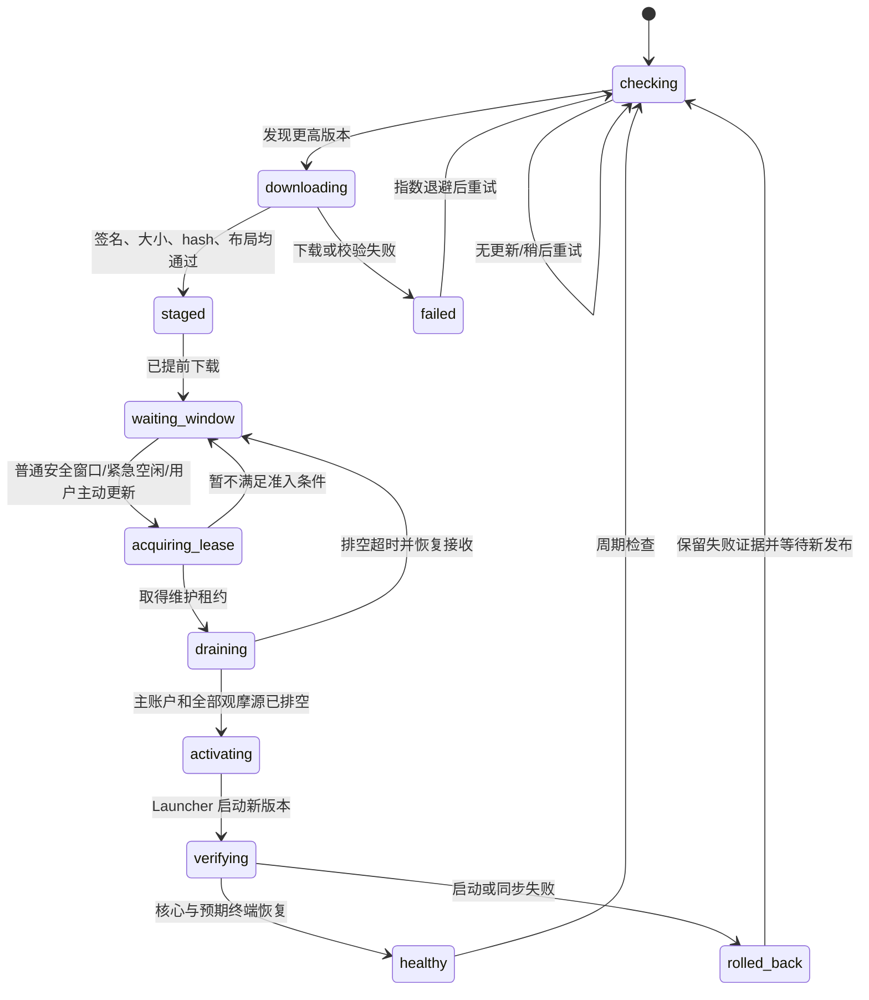

# 量见智桥自动更新链路最终方案

> 状态：最终设计，尚未开始实现  
> 日期：2026-07-28  
> 适用分支：`refactor/aurum-bridge-v3`  
> 产品原则：提前下载、安全准入、最小中断、失败回滚；普通用户更新不得影响共享平台策略。

## 1. 最终结论

量见智桥的自动更新采用“后台提前下载 + 分级等待 + 服务器维护租约 + 本地全终端排空 + Launcher 原子切换与回滚”的方式。

更新分为两级：

- `normal`：普通更新。随时检测、校验和下载，默认在每日可靠休市窗口或周末安全窗口重启应用。
- `urgent`：紧急 Bug 修复。随时检测、校验和下载，在最早的安全空闲窗口重启应用，不等待休市。

用户可通过量见智桥顶部更新条幅主动点击“重启更新”。该操作可以把普通更新提前到最早安全空闲窗口，但不能绕过签名校验、服务器维护租约、在途指令排空和回滚保护。

普通用户订阅平台策略时，更新只暂停该用户账户的交易执行通道，不暂停共享平台分析调度器，也不影响其他订阅用户。平台信号可以继续生成和保存，但更新期间不向该用户补发迟到交易。

## 2. 范围与非目标

### 2.1 本方案负责

- 检测、签名校验、下载、暂存和版本兼容性验证。
- 决定普通更新与紧急更新何时可以安全重启。
- 更新期间按安装实例、用户和终端隔离交易指令。
- 排空主账户及全部观摩源的在途命令。
- 原子版本切换、健康检查、完整同步和失败回滚。
- 在量见智桥界面提供简洁、可解释的更新状态与主动更新入口。
- 提供灰度发布、审计、指标和停止线。

### 2.2 本方案不负责

- 不建设第三方插件市场。
- 不允许未签名模块或任意脚本进入更新目录。
- 不因更新自动平仓、撤单或关闭 MT4/MT5。
- 不强杀仍在执行 MT 调用的 Worker。
- 不在重连后盲目补发更新期间错过的旧交易信号。
- 第一阶段不实现 Launcher 自更新和根公钥自动轮换。

## 3. 当前链路核对结果

当前代码已经具备以下基础，后续应在其上扩展，不重新建设一套更新器：

| 能力 | 当前实现 | 结论 |
|---|---|---|
| Manifest 与包签名 | `ReleaseManifestVerifier` | 已有 ECDSA Manifest 和包级签名校验 |
| 文件完整性 | `ReleaseStager` | 已校验大小和 SHA-256，并防止 ZIP 路径穿越 |
| 版本暂存 | `ReleaseInstaller.StageAsync` | 已下载到 staging，验证后移动到独立版本目录 |
| 原子激活 | `ReleaseActivationStore` | 已通过 `current.json` 切换 active/last-known-good |
| 启动与回滚 | `LauncherEngine` | 已有新版本健康检查、启动等待和旧版本回滚 |
| 服务器发布入口 | `server/routes/bridge-release.js` | 已能提供有边界的静态 Manifest |
| 更新检查 | `BridgeApplicationContext.ObserveUpdatesAsync` | 当前首次等待一分钟，之后每六小时检查 |
| 更新应用 | `ApplyStagedUpdateAsync` | 当前下载后立即排空主控制器并重启 |

当前必须补齐的缺口：

1. 下载后没有普通/紧急更新等待策略，会立即重启。
2. 更新检查间隔六小时，无法快速响应紧急修复。
3. 没有服务器维护租约，停止 Bridge 前仍可能产生新交易指令。
4. 当前只排空主控制器，没有排空全部观摩源控制器。
5. Launcher 的 ready 条件主要以主桥接 Online 为准，未核验更新前正常的观摩源是否恢复。
6. Manifest V1 没有更新等级、过期时间、灰度范围和安全窗口参数。
7. 没有持久化的更新等待状态和用户主动更新请求。
8. 界面没有新版本条幅、重启更新按钮和更新失败反馈。

## 4. 目标组件结构

```text
发布侧
  Build + Test
    -> Immutable Packages
    -> Offline/Protected Signer
    -> CDN/Object Storage
    -> Signed Manifest Pointer

服务器
  Bridge Release API
  Update Admission Service
  Scheduler Maintenance Guard
  Bridge Gateway Maintenance Guard
  Command Ledger / Audit / Metrics

用户 Windows
  AURUMBridge.Launcher.exe
  current.json
  update-state.json
  versions/<version>/
  staging/
  AURUMBridge.exe
    -> Update Coordinator
    -> Primary Controller
    -> Observer Controllers
    -> MT4/MT5 Workers
```

Launcher 保持稳定，只负责版本指针、健康检查、启动和回滚；Bridge Update Coordinator 负责发现、下载、等待和申请更新准入；服务器负责判断是否允许该安装实例进入维护状态。

## 5. 更新状态机



状态持久化到安装根目录原子文件 `update-state.json`，Launcher 和 Bridge 均可读取。业务 SQLite 不作为更新状态唯一来源，避免 Bridge 停止或数据库锁定时 Launcher 无法判断。

建议字段：

```json
{
  "schema_version": 1,
  "state": "waiting_window",
  "target_version": "3.1.0",
  "priority": "normal",
  "manual_activation_requested": false,
  "staged_at_utc_msc": 0,
  "next_retry_at_utc_msc": 0,
  "last_error_code": null,
  "updated_at_utc_msc": 0
}
```

不得保存下载凭据、设备令牌、Manifest 私钥或 MT 密码。

## 6. 更新等级与默认时机

### 6.1 普通更新 `normal`

普通更新随时下载，但默认只在以下条件之一成立时申请维护租约：

- 工作日进入该 Broker Server 配置的每日维护窗口。
- 周末市场已经休市，且周末清仓任务已结束。
- 用户在顶部条幅主动点击“重启更新”。

普通更新的自动重启不能只依赖本机时钟或单次行情停滞。可靠的工作日窗口必须同时满足：

1. 当前时间位于服务器配置的 Broker/平台维护窗口。
2. 对应终端服务器时间可用。
3. 关联品种行情连续停止至少 90 秒。
4. 剩余维护窗口不少于 3 分钟。
5. 当前账户没有在途交易命令。
6. 周末清仓或其他系统级交易任务未运行。

如果某个 Broker 没有配置可靠的每日维护窗口，普通更新只在周末或用户主动请求时应用，不能猜测休市。

### 6.2 紧急更新 `urgent`

紧急修复不等待休市，在最早安全空闲窗口申请维护租约。默认条件：

1. 受影响账户没有在途交易命令。
2. 本地所有相关 Dispatcher 已经排空。
3. 周末清仓等账户级任务未运行。
4. 对需要暂停的调度器，当前轮已完成且新一轮尚未开始。
5. 预计安全空闲时间不少于 120 秒。

紧急更新也不得无条件强制关闭 Worker。若安全条件长期不满足，应持续显示原因、上报后台并等待，不得以牺牲交易一致性换取更新速度。

## 7. 调度器与账户隔离规则

更新准入必须根据策略类型和桥接角色决定，不允许使用一个全局“暂停所有调度器”开关。

| 场景 | 分析调度 | 交易执行 | 更新准入 |
|---|---|---|---|
| 普通用户 + 平台策略 | 共享平台调度继续运行 | 只暂停当前用户账户 | 不等待共享调度器空闲，只等待该用户交易通道排空 |
| 普通用户 + 私人策略 | 暂停该用户启动新一轮 | 暂停当前用户账户 | 等待当前私人策略轮次结束 |
| 管理员 + 默认观摩源 | 受影响的平台调度器暂停启动新一轮 | 按关联账户隔离 | 等待当前共享轮次结束和行情读取释放 |
| 管理员 + 非默认观摩源 | 只影响使用该来源的策略 | 按关联账户隔离 | 仅协调对应来源 |
| 普通用户 + 手动交易 | 无需暂停平台分析 | 暂停当前用户账户的新交易发送 | 等待该用户已有命令完成 |

普通用户使用平台策略时，如果更新期间产生新平台信号：

- 信号、推理快照和平台分析结果正常保存。
- 其他用户正常接收和执行。
- 当前用户的交付记录标记为 `bridge_maintenance`。
- 重连后不盲目补发旧信号，避免价格变化后迟到成交。
- 当前用户等待下一轮仍在有效期内的新信号。

## 8. 服务器维护租约

### 8.1 目的

本地排空只能确认 Bridge 当前没有正在执行的 Worker 调用，不能防止服务器在下一毫秒发送新指令。因此必须先由服务器建立维护屏障，再执行本地排空。

### 8.2 申请内容

```json
{
  "installation_id": "stable-device-installation-id",
  "target_version": "3.1.0",
  "priority": "normal",
  "manual_request": true,
  "terminal_instance_ids": ["terminal-a", "terminal-b"],
  "observer_bridge_user_ids": [29],
  "expected_downtime_seconds": 60
}
```

服务器必须校验终端归属、管理员观摩源权限和目标版本，客户端不能通过提交任意 user ID 扩大维护范围。

### 8.3 准入检查

服务器原子检查并执行：

1. 根据场景确定需要暂停的用户交付通道和调度器范围。
2. 阻止目标终端接收新的交易指令。
3. 检查 Command Ledger 中是否仍有未完成的已分发命令。
4. 检查账户级周末任务和私人策略轮次。
5. 满足条件后返回带 TTL 的维护租约。
6. 不满足时返回中文可解释原因和建议重试时间。

维护租约默认 TTL 建议 90 秒，并允许 Launcher 在激活期间有限续租。TTL 到期自动解除，避免 Bridge 崩溃后账户永久停在维护状态。

### 8.4 维护期间网关行为

- 新的自动或手动交易命令不进入 Bridge 指令队列。
- 浏览器手动交易返回“量见智桥正在安全更新，请稍后重试”，不能表现为普通请求超时。
- 已经取得 command ID 并进入执行的命令必须完成或进入 `uncertain` 对账状态。
- 数据同步请求可以在切换前停止，交易结果和回执不可丢弃。

## 9. 本地排空与激活

取得维护租约后，Bridge 按以下顺序执行：

1. 把更新状态切换为 `draining`。
2. 暂停主账户 Dispatcher 接收新命令。
3. 暂停所有已启用观摩源 Dispatcher 接收新命令。
4. 等待全部在途命令完成，默认排空上限 30 秒。
5. 排空失败时恢复所有 Dispatcher、释放维护租约并返回等待状态。
6. 全部排空后写入 `current.json` 的 pending 版本。
7. 通知观摩源停止并干净关闭所有 Worker。
8. 启动稳定 Launcher，退出旧版 Bridge。

必须把主控制器和观摩源控制器视为同一安装实例的更新边界。不能只排空主账户后直接终止观摩源。

## 10. Launcher 健康检查与回滚

Launcher 继续使用 active/last-known-good 指针，但 ready 验收需要扩展。

### 10.1 新版本通过条件

- 可执行文件只读健康检查通过。
- Bridge 主进程在限定时间内保持存活。
- 服务器连接恢复。
- 主账户完成 account、positions、orders 初始同步。
- 更新前处于正常运行状态的观摩源恢复到 Online。
- MT4/MT5 Worker 没有出现连续启动失败。
- 新版本号与目标版本一致。

更新前已经离线或未配置的观摩源不应导致无条件回滚，但必须保留其原有状态；更新前正常、更新后异常的来源应触发回滚。

### 10.2 回滚规则

- 新版本健康检查失败，立即恢复 last-known-good。
- 新版本未在启动时限内完成预期同步，恢复 last-known-good。
- 回滚版也必须执行只读健康检查和完整同步。
- 回滚不能重放历史交易命令。
- 回滚成功后解除维护租约并上报失败版本、阶段和错误码。
- 回滚失败时保持交易发送关闭，显示明确恢复指引，不能假装在线。

目标：更新失败后 60 秒内恢复上一健康版本。

## 11. Manifest V2

Manifest V1 保持兼容读取；新调度能力使用 V2，不能在 V1 中添加未签名的旁路策略字段。

建议结构：

```json
{
  "schema_version": 2,
  "release_id": "bridge-3.1.0-20260728.1",
  "release_version": "3.1.0",
  "priority": "normal",
  "published_at_utc_msc": 0,
  "expires_at_utc_msc": 0,
  "minimum_launcher_version": "1.0.0",
  "minimum_idle_seconds": 120,
  "activation_deadline_utc_msc": null,
  "rollout_channel": "stable",
  "rollout_percentage": 10,
  "packages": [],
  "signature": ""
}
```

以下字段必须全部进入规范化签名内容：

- release ID 与版本。
- 更新等级。
- 发布时间和过期时间。
- Launcher 最低版本。
- 空闲时间要求和激活截止时间。
- 灰度通道与比例。
- 所有包的版本、URL、大小、SHA-256、兼容范围和包签名。

Manifest 过期、签名无效、版本降级、未知模块、Launcher 不兼容或包布局不完整时必须失败关闭，当前运行版本不受影响。

## 12. 检查、下载与缓存

更新检查策略：

- Bridge 启动后一分钟检查一次。
- 正常运行时每 15 分钟检查一次。
- 服务器通过现有 WSS 发送 `release_available` 后立即进行一次 HTTP 校验检查。
- 失败使用指数退避并加入随机抖动，避免集中重试。
- 服务器返回 ETag 时使用条件请求，减少带宽。

下载策略：

- 下载在后台执行，不阻塞数据和交易通道。
- 下载前检查磁盘空间，至少覆盖包大小、解压临时空间和安全余量。
- 使用 `.part` 临时文件，完成大小和 hash 校验后原子改名。
- 包按 SHA-256 做内容缓存；未变化的 MT4/MT5 模块不重复下载。
- 下载失败只影响更新状态，不影响当前 Bridge 运行。

## 13. 顶部更新条幅

条幅位于产品名称/说明下方、平台选择区域上方，进入正常布局，不覆盖账户列表。默认横向排列，窄窗口时文案与按钮自动换行。

普通用户和管理员都显示；整个安装实例只由主窗口显示一次，后台观摩源不重复弹窗。

| 状态 | 条幅文案 | 主按钮 |
|---|---|---|
| downloading | 发现新版本，正在后台下载 | `下载中…`，禁用 |
| staged normal | 新版本 3.1.0 已准备好，将在休市时自动更新 | `重启更新` |
| staged urgent | 紧急修复 3.1.1 已准备好，建议尽快更新 | `尽快重启更新` |
| waiting | 已安排更新，正在等待当前交易任务完成 | `等待安全窗口`，禁用 |
| activating | 正在安装新版本，预计一分钟内恢复 | `正在更新…`，禁用 |
| rolled back | 新版本启动失败，已恢复上一版本 | `重新尝试` |
| healthy | 已更新到 3.1.0，短暂显示后隐藏 | 无 |

交互规则：

- 普通更新使用中性信息色；紧急修复使用警示色；失败才使用错误色。
- 状态同时依靠图标、中文结论和颜色，不只依赖红绿。
- “重启更新”是明确操作，不再弹二次确认窗口。
- 点击后立即禁用，写入持久化主动更新请求，防止重复点击。
- 主动更新只改变执行时机，不绕过任何安全条件。
- 管理员存在观摩源时补充“将短暂重启主账户及观摩源连接”。
- 可提供低强调度的“查看更新内容”，但不暴露 Manifest、hash 或内部错误码。

普通用户使用平台策略且正在更新时，条幅显示：

> 正在安全更新，平台分析仍在运行；更新期间不会向当前账户发送交易指令。

## 14. MT4 EA 更新边界

Bridge、MT5 Python Worker 和 MT4 Worker 可以由 Launcher 完全自动切换。MT4 EA 已加载进图表后，替换磁盘上的 EX4 不会让内存中的旧 EA 自动重新加载。

处理规则：

1. 更新器自动把签名包内的 EX4 部署到全部已配置 MT4 数据目录。
2. 不自动关闭或重启用户 MT4。
3. Bridge 与相邻 EA 版本保持协议向后兼容。
4. 兼容旧 EA 时继续运行，并提示“EA 已更新，重启 MT4 后生效”。
5. 不兼容时只停止对应 MT4 终端的交易发送，显示“需要重新加载 EA”和“安装/修复 EA”按钮。
6. 一个 MT4 来源的 EA 版本异常不得影响 MT5 或其他观摩源。

为了保持自动更新体验，大多数修复应优先落在 Bridge/Worker，尽量减少必须重新加载 EA 的发布。

## 15. 发布、安全与灰度

发布私钥不得进入网站服务器、管理后台、安装包普通资源或 CI 日志。

标准发布流程：

1. 固定依赖并构建完整版本。
2. 运行 Node、.NET、Python 和 MT4 合约测试。
3. 生成不可变包及 SHA-256。
4. 在隔离或受保护的签名环境签署包和 Manifest。
5. 先上传包并验证可下载性。
6. 最后原子发布当前 Manifest 指针。
7. 按 internal → 5% → 25% → 100% 灰度。
8. 每一阶段满足观察期和停止线后再扩大。

EXE 和 Launcher 额外使用 Windows 代码签名；EA 文件至少受外层包签名和 SHA-256 完整保护。

稳定 Launcher 第一阶段不自更新。Launcher 漏洞、根密钥轮换或重大 Windows 兼容变化，允许极少量要求重新运行签名安装器。

## 16. 可观测性与审计

客户端日志事件建议：

```text
update_manifest_checked
update_release_discovered
update_download_started
update_download_completed
update_waiting_window
update_manual_activation_requested
update_admission_denied
update_lease_acquired
update_drain_started
update_drain_completed
update_activation_prepared
update_startup_verified
update_healthy
update_rolled_back
update_failed
```

日志包含 release ID、目标版本、阶段、等待原因、耗时和终端数量，不记录令牌、签名私钥、完整下载鉴权 URL 或账户密码。

服务器指标：

- 版本覆盖率和各版本在线数量。
- 检测、下载、等待、更新、回滚各阶段耗时。
- 更新成功率、回滚率、回滚原因。
- 普通更新从 staged 到应用的等待时间。
- 紧急更新从发布到应用的等待时间。
- 维护期间被阻止的手动/自动交易请求数。
- 更新前后 Bridge 连接恢复和初始同步耗时。

## 17. 实施阶段

### 阶段 A：Manifest V2 与只下载状态机

- 新增 V2 模型、签名规范、过期时间和更新等级。
- 新增 `update-state.json` 原子状态存储。
- 更新检查调整为 15 分钟，并支持 WSS 提醒后立即检查。
- 实现下载、缓存、暂存和顶部条幅。
- 此阶段不自动重启，只进入 `waiting_window`。

验收门：发现、下载、校验和等待不能影响当前交易与数据同步；重启 Bridge 后能恢复已暂存状态。

### 阶段 B：服务器维护租约与用户隔离

- 新增 Update Admission Service。
- 网关按 installation/user/terminal 阻止新交易指令。
- 调度器按平台策略、私人策略、默认观摩源分别隔离。
- 页面手动交易获得明确维护提示。
- 更新期间的平台策略信号对该用户标记为 `bridge_maintenance`，不迟到补发。

验收门：一个普通用户更新不能暂停共享平台调度器或影响其他用户执行。

### 阶段 C：安全窗口与主动更新

- 实现 Broker 日常维护窗口配置。
- 实现周末窗口并排除周末清仓任务。
- 实现紧急空闲窗口和用户“重启更新”。
- 所有准入判断失败均返回可解释原因和重试时间。

验收门：普通更新交易时段不自动重启；紧急或主动更新只在账户交易通道排空后执行。

### 阶段 D：全终端排空、Launcher 与回滚强化

- 同时排空主控制器和所有观摩源控制器。
- ready 文件携带预期终端恢复摘要。
- Launcher 验证更新前健康来源的恢复情况。
- 完善回滚、维护租约释放和失败提示。

验收门：任一观摩源存在在途命令时不得切换版本；新版本故障能在 60 秒内恢复上一版。

### 阶段 E：MT4 EA、灰度发布和运营观测

- 自动部署新版 EX4，并实现协议兼容提示。
- 提供发布签名工具和不可变产物校验。
- 实现 internal/5%/25%/100% 灰度。
- 完成更新指标、后台版本覆盖率和停止线。

验收门：EA 更新不自动关闭 MT4；单一 EA 异常不影响其他终端；灰度可随时停止且不要求客户端降级。

## 18. 必测场景

1. 市场交易中发现普通更新：完成下载，但不自动重启。
2. 进入可靠日常休市窗口：取得租约并更新。
3. 周末清仓仍在运行：即使周末也不得更新。
4. 周末清仓结束：普通更新可随时应用。
5. 紧急更新遇到正在推理、保存或交易：等待当前阶段完整结束。
6. 普通用户使用平台策略更新：共享调度继续，其他用户不受影响。
7. 更新期间平台信号生成：当前用户不执行，重连后不迟到补发。
8. 普通用户使用私人策略更新：暂停该用户新轮次，当前轮结束后更新。
9. 手动下单与维护租约并发：命令要么先完成，要么明确被维护屏障拒绝，不能丢失或超时不明。
10. 主账户空闲、观摩源仍有命令：不得切换版本。
11. 下载中断、断网、磁盘不足、包损坏：当前版本持续运行。
12. Manifest 或包签名被篡改：拒绝率 100%。
13. 更新进程在每个状态节点断电：重启后指针和状态可恢复。
14. 新版本只读健康检查失败：自动回滚。
15. 新版本主账户不能同步：自动回滚。
16. 更新前健康观摩源在新版本失败：自动回滚。
17. 回滚后服务器完整同步，历史命令不重复执行。
18. 1、5、20 个终端/观摩源更新隔离验证。
19. MT4 EA 仍为旧协议：兼容继续或单终端失败关闭，不影响 MT5。
20. 用户连续点击“重启更新”：只生成一个主动更新请求。

## 19. 上线指标与停止线

上线目标：

- 无效签名、篡改包和降级包拒绝率 100%。
- 正常更新成功率不低于 99.5%。
- 更新或回滚过程中重复下单为 0。
- 更新失败后恢复 last-known-good 不超过 60 秒。
- 普通用户更新导致共享平台调度停止的次数为 0。
- 更新维护期间前端未知超时为 0，必须返回明确状态。

立即停止灰度的条件：

- 发现重复下单、错账户路由或命令丢失。
- 新版本无法自动回滚。
- 更新造成主账户或健康观摩源持续离线。
- 维护锁影响未在目标范围内的用户或策略。
- 更新期间服务器继续向目标终端投递交易命令。
- Manifest 签名、版本指针或安装目录边界存在绕过。

## 20. 推荐实施决策

以下决策作为第一版默认，不再等待额外产品选择：

- 普通更新自动应用：可靠每日休市窗口或周末安全窗口。
- 紧急更新自动应用：最早账户级安全空闲窗口。
- 用户主动更新：最早账户级安全空闲窗口，不强制中断。
- 普通用户平台策略：共享调度不停，只暂停该用户交易执行。
- 更新维护租约：默认 90 秒，可由 Launcher 有限续租。
- 本地排空上限：30 秒，失败则恢复并重试。
- 预计安全空闲时间：至少 120 秒。
- 新版本/回滚总体恢复目标：60 秒以内。
- 检查周期：15 分钟，WSS 提醒后立即检查。
- 更新期间错过的交易信号：不补发，等待下一轮有效信号。
- MT4：自动部署 EA 文件，但不自动重启 MT4。
- Launcher：第一版保持稳定，不自更新。

## 21. 最终用户体验

普通用户只需要看到：

1. “发现新版本，正在后台下载”。
2. “新版本已准备好，将在休市时自动更新”。
3. 如需提前更新，点击“重启更新”。
4. 系统等待正在执行的交易完成，并在安全时自动重启。
5. 一分钟内恢复；失败自动回到上一版本。

用户不需要理解签名、版本指针、维护租约、调度器、Worker 或观摩源进程。复杂性全部留在内部，界面只说明当前状态、是否影响交易以及下一步。

