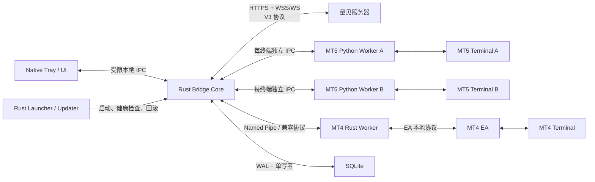
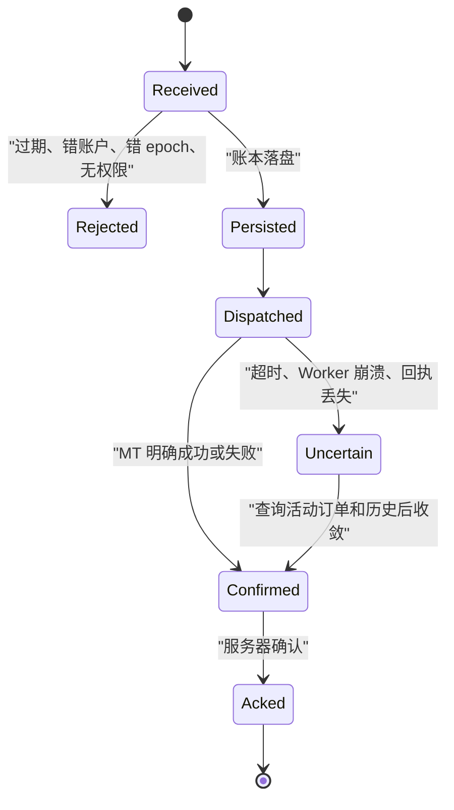

# 量见智桥 3.0.0 Rust Native 详细重构方案

> 文档状态：实施基线 1.0
>
> 基线分支：`refactor/aurum-bridge-v3`
>
> 产品版本：Rust Native 直接作为正式 3.0.0；现有 .NET Bridge 仅作功能与协议对照
>
> 当前进度：阶段 0 / 1 / 2 已完成；阶段 3 已完成 MT5 Python Worker、增量投影、Profile 准备、服务器/Worker 共同生命周期、端点权威源与 Core 正式入口；阶段 4 已接通正式 MT5 Dispatcher、主动执行核对和真实 MT5 管理动作矩阵，审计展示及休市等外部故障验收仍待实施

## 1. 结论

3.0.0 采用“Rust 原生总控 + 独立平台 Worker”的架构：

- Rust 接管总控、服务器通信、命令账本、SQLite、进程监管、托盘界面、安装和更新。
- MT5 暂时保留官方 Python `MetaTrader5` 接口，但从大体量 GUI 程序中剥离成一个终端一个 Worker。
- MT4 保留 EA，EA 只负责终端内采集和交易，Rust Worker 负责本地通信、缓存、路由和恢复。
- 现有服务器 V3 协议、账户绑定、授权方式、普通用户单账户、管理员观摩源、默认行情源等业务合同保持不变。
- Rust Native 是唯一正式客户端目标，不设计与旧 .NET Bridge 双栈运行、生产迁移接管或回退；旧实现只用于核对功能和服务器合同。

这不是把 Python 全部翻译成 Rust。当前主要性能问题来自共享锁、串行全量采集、全量 JSON、交易与历史共用队列及进程耦合，仅替换语言无法解决这些问题。

## 2. 重构目标

### 2.1 产品目标

- 用户安装一次，以后通过受信任的模块化更新持续升级。
- 首次授权打开浏览器一次；除非主动退出或授权被撤销，以后无需再次登录。
- 用户选择 MT4 或 MT5 后直接连接，不出现浏览器二次确认。
- 普通用户只管理一个当前交易账户；管理员才显示并管理多个观摩源。
- 软件内直接查看状态、日志、更新、开机自启和 MT4 EA 安装指引。
- 窗口关闭后托盘运行；Core、Worker 或网络异常能够自动恢复。

### 2.2 工程目标

- 原生 Core 不依赖用户预装 .NET、Python、VC++ 或 OpenSSL。
- 正式支持 Windows 10 22H2 和 Windows 11 x64；更老系统只做尽力兼容，不牺牲安全合同。
- 标准离线安装包目标 35–50 MiB；可另外提供小型联网安装器，但不能成为唯一安装途径。
- Core 空闲 CPU 目标低于 1%，Core 常驻内存目标低于 50 MiB，最终数值以实测为准。
- 本地收到 Worker 数据后到进入发送队列的 P95 目标低于 20 ms；网络和 Broker 延迟单独统计。
- 单个 Worker 崩溃、卡死或终端重启不能影响其他账户。
- 任何未知执行结果都不得自动重复下单。

### 2.3 安全和保护目标

- 凭据使用 Windows DPAPI CurrentUser 保存，不写入 SQLite、日志或更新包。
- 更新 Manifest 使用独立离线私钥签名；SHA-256 只负责完整性，不能替代签名。
- Rust Release 使用 LTO、符号裁剪和最少导出，增加静态逆向成本。
- 授权、管理员权限、策略权限和交易权限仍由服务器判定，客户端不保存可绕过的商业秘密。
- 不追求“不可破解”。原生化只能提高成本，真正的安全边界必须在协议、密钥和服务器授权上。

## 3. 不变合同

以下内容在 3.0.0 中冻结，除非另开协议版本：

- Bridge 只负责连接、转发、执行、回传、恢复和更新，不承载 AI、策略计算或业务风控。
- 普通用户一个软件只连接一个主账户；管理员可以添加多个相互隔离的观摩源。
- 服务器 V3 JSON 消息类型、字段名称、错误码和 ACK 语义保持兼容。
- MT5 继续使用官方 Python 终端接口；3.0.0 不假设存在可替代它的公开 C++ 客户端 API。
- MT4 继续通过 EA 访问终端能力，用户仍需把 EA 挂载到图表并开启所需权限。
- 一个终端实例对应一个 Worker；同一 Profile 同时只允许一个 Core 持有运行权。
- 命令先持久化再执行；重复、过期、错账户、错平台和错连接 epoch 的命令失败关闭。
- 执行结果不明确时，先查询 MT 当前订单和历史事实，不自动重放。
- SQLite 是可恢复的读模型、Outbox、命令账本和历史缓存，不是 Broker 交易事实。
- 自动交易前使用新鲜的终端事实；过期缓存只能展示，不能放行自动开仓。
- 继续使用签名 Manifest、包哈希、版本目录、健康检查和 last-known-good 回滚。

完整机器可读基线保存在 `bridge/native/contract-baseline.json`。

## 4. 总体架构



### 4.1 进程职责

| 进程 | 职责 | 不允许承担的职责 |
|---|---|---|
| Launcher / Updater | 版本选择、更新下载、签名校验、启动、健康检查、回滚 | 交易、账户数据处理 |
| Bridge Core | 授权、服务器会话、消息路由、命令账本、Outbox、Worker 监管 | 直接调用 MT 库、绘制复杂 UI |
| Tray / UI | 状态展示、平台选择、日志、设置、观摩源控制、更新提示 | 保存明文凭据、直接发交易网络请求 |
| MT5 Worker | 连接一个 MT5 终端、采集数据、执行命令、核对结果 | 多账户共享连接、服务器授权 |
| MT4 Worker | 管理一个 MT4 EA 会话、协议转换、状态和执行回执 | 绕过 EA 或终端权限 |
| MT4 EA | 在终端内读取事实、执行交易、返回原始错误和状态 | 服务器通信、复杂缓存和业务策略 |

### 4.2 为什么 Core 不能做成 Windows Service

Core 运行在当前登录用户会话中，不默认注册为系统服务，原因是：

- MT4/MT5 终端运行在交互用户会话中。
- DPAPI CurrentUser 凭据只能由对应用户安全读取。
- 系统服务与桌面应用跨会话通信会增加权限、UAC 和旧系统兼容问题。
- 开机自启实际采用“用户登录后自动启动 + 托盘运行”。

### 4.3 本地 IPC

- Core 与 UI、Worker 使用命名管道，不开放本机 TCP 端口。
- 管道 ACL 仅允许当前用户和必要的系统主体。
- 每次启动生成随机会话 nonce，Worker 握手时携带 Profile、terminal instance 和协议版本。
- IPC 消息带长度前缀、最大包限制、request id 和超时；拒绝未知版本及超大消息。
- 不使用进程内动态 DLL 插件 ABI，避免一个插件崩溃拖垮 Core，也避免 Rust ABI 升级问题。

## 5. MT5 链路

### 5.1 保留 Python 的原因

MT5 官方 Python 包已经覆盖终端初始化、账户、行情、持仓、订单、历史和交易请求。3.0.0 保留它是终端适配选择，不是继续保留 Python 总控。

Python Worker 只做四件事：

1. 连接指定 `terminal64.exe`。
2. 将 MT 返回值转换为冻结的本地协议。
3. 执行 Core 已授权、已持久化的命令。
4. 对超时或不明确结果执行终端事实核对。

授权、WebSocket、SQLite、更新、管理员功能和 UI 全部移出 Python。

### 5.2 一终端一 Worker

- 每个 Worker 只维护一个 MT5 终端路径和一个活动账户。
- 不再使用跨账户的全局 `RLock`。
- 主账户与每个管理员观摩源使用不同 Profile、进程、SQLite 命名空间和 connection epoch。
- Worker 退出时由 Job Object 清理子进程；连续失败按 1/2/4/8/10 秒退避。
- 稳定运行一段时间后重置退避，避免偶发故障造成长期慢恢复。

### 5.3 数据采集

- Tick 和最新报价保留在内存环形缓冲区，不逐 Tick 写 SQLite。
- 账户、持仓、挂单和品种信息按变化产生 delta，同时定期做全量 reconciliation。
- K 线按 `symbol + timeframe + range` 缓存，先返回缓存，再补齐缺口。
- 历史成交和历史订单首次全量拉取到 SQLite，此后按 watermark 增量更新。
- 服务器请求历史时由 SQLite 按分页上限返回，禁止构造无边界全量 WebSocket payload。

### 5.4 交易执行

- 同一账户的交易命令串行执行，行情和历史请求走独立低优先队列。
- 下单前校验账户、平台、品种映射、命令有效期和 connection epoch。
- 交易结果记录原始 MT 返回码、中文映射和结构化字段，不把 MT4 错误显示为 MT5 错误。
- Worker 超时、进程崩溃或响应丢失时，命令进入 `uncertain`，通过持仓、订单和历史核对后再收敛。

## 6. MT4 链路

### 6.1 EA 的定位

MT4 没有与 MT5 Python 包等价的官方 Python 客户端接口，因此 EA 不是临时拼凑，而是 MT4 终端内最稳妥的执行适配层。

EA 应保持轻量：

- `OnTick` 只采集必要 Tick 或设置脏标记。
- `OnTimer` 处理心跳、delta、命令和低频 reconciliation。
- 下单、撤单、平仓返回 ticket、错误码、时间和原始上下文。
- 禁止在每个 Tick 全量扫描历史或发送大 JSON。

### 6.2 安装与用户引导

- 安装器首次检测常见 MT4 数据目录并复制 EA。
- MT4 页面保留“安装 / 修复 EA”按钮，支持重装 MT4、误删 EA 或新增终端后的恢复。
- 完成复制后明确提示用户：刷新导航器、挂载 EA、开启工具栏自动交易、开启 EA 的允许实时自动交易。
- Bridge 显示简洁的交易权限状态；鼠标悬停再展示是终端全局开关、EA 局部开关、账户权限还是 Broker 返回限制。
- Bridge 不尝试模拟点击或绕过 MT4 安全开关。

### 6.3 多终端和观摩源

- 普通用户只有一个活动主账户，切换平台时停止旧 Worker 后再启动新 Worker。
- 管理员添加观摩源时绑定明确的 Bridge 源记录、MT 安装目录和观摩账户。
- 无需为每个观摩源打开新主窗口；Core 在后台监管多个隔离 Worker，UI 只显示账户卡片和启停控制。
- 每个观摩源有独立 Profile、锁、日志上下文、账户绑定、命令权限和 SQLite 分区。

## 7. 服务器通信

### 7.1 连接流程

1. 读取 DPAPI 凭据；无凭据时进入待授权状态，不自动打开浏览器。
2. 用户点击授权后才打开 AI 交易实验室的配对页面。
3. 使用 refresh token 获取短期 access token。
4. 通过 HTTPS 获取一次性 WebSocket ticket。
5. 连接配置的 WSS/WS 地址，发送 `hello`。
6. 收到严格匹配 message id、session id 和终端集合的 `hello_ack` 后才进入 Ready。
7. 运行接收、优先发送、Outbox 和心跳循环；任一关键循环异常时整体重连。

### 7.2 HTTPS、WSS 和 WS

- 控制接口默认 HTTPS；开发环境只允许 loopback HTTP。
- 实时地址从统一服务器地址自动推导，管理员无需分别配置两个地址。
- 生产默认 WSS，不因错误自动降级为 WS。
- 为兼容确实存在 TLS 问题的受控环境，可以显式配置 WS；界面应标记“未加密”，并由管理员主动确认。
- Rust 网络层不得引入 OpenSSL 或 `native-tls` 隐式依赖；具体库版本在阶段 2 经过依赖审计后固定。

### 7.3 优先级和背压

- P0：交易命令结果、命令 ACK、会话控制。
- P1：心跳、账户/持仓/挂单变化。
- P2：报价、K 线、历史分页和诊断。
- 高优先消息不能被大历史请求阻塞。
- 队列有固定容量；低优先级数据可以合并最新状态，高优先级消息必须进入持久化 Outbox。
- 单条入站消息最大 4 MiB；历史响应必须分页，不能提高上限掩盖问题。

## 8. SQLite 设计

### 8.1 定位

SQLite 仅供本机 Bridge 使用，服务器不能直接访问客户电脑中的数据库。它解决的是：

- 重启后的快速恢复和页面快速首屏。
- 历史订单/成交的分页缓存。
- 尚未被服务器确认的数据 Outbox。
- 命令幂等、执行状态和 uncertain 核对证据。
- 故障诊断所需的有限状态快照。

它不能替代 MT4/MT5 实时事实，也不能用固定周期的旧数据直接批准自动交易。

### 8.2 写入模型

- WAL 模式，单写者任务，读写连接分离。
- 账户、持仓、挂单使用 latest 表和 revision，不重复保存无限快照。
- Tick 默认不落盘；K 线和历史按有限保留策略落盘。
- 高频 delta 合并后批量提交，减少 EA/Worker 和磁盘压力。
- 每个记录包含 `terminal_instance_id`、`account_ref`、`connection_epoch`、单调 `revision`、`snapshot_id` 和 `observed_at_utc_msc`。

### 8.3 建议核心表

| 表 | 用途 |
|---|---|
| `account_latest` | 最新账户快照和新鲜度 |
| `positions_latest` | 当前持仓，按 ticket / position id 更新 |
| `orders_latest` | 当前挂单和活动订单 |
| `history_deals` | 历史成交全量初始导入 + 增量 |
| `history_orders` | 历史订单全量初始导入 + 增量 |
| `bars_cache` | 有界 K 线缓存 |
| `outbox` | 等待服务器 ACK 的可靠数据 |
| `command_ledger` | 命令接收、校验、执行、确认和 uncertain 状态 |
| `worker_checkpoint` | 增量 watermark、epoch 和 reconciliation 位置 |

### 8.4 新鲜度规则

- UI 可以展示缓存，但必须显示“缓存时间”或离线状态。
- 自动开仓前账户、报价和交易权限必须满足各自 freshness 阈值。
- 数据缺失、revision 倒退、epoch 不一致或 Worker 不 Ready 时失败关闭。
- 手动下单不经过 AI 风控参数调整，但仍执行账户绑定、权限、品种、最小手数和终端硬校验。

## 9. 命令可靠性

### 9.1 命令状态机



### 9.2 幂等和隔离

- 幂等键至少包含服务器 `command_id`，并绑定用户、账户、平台、terminal instance 和 epoch。
- 已存在的 command id 只返回已保存结果，不再次调用 MT。
- 账户切换时递增 epoch，旧 epoch 的延迟命令一律拒绝。
- 平仓和撤单同样进入账本，不能因为“不是开仓”而跳过可靠性控制。
- Core 重启后优先恢复未 ACK 结果；对 `uncertain` 只做核对，不直接重试交易。

## 10. 用户界面

### 10.1 技术方案

- UI 与 Core 分进程，UI 崩溃不影响数据和交易链路。
- 界面较简单，优先使用 Rust + Win32 原生窗口和 DirectWrite/系统控件，避免捆绑浏览器内核。
- 不采用 WebView 作为主 UI，可减少包体、内存和旧电脑运行时差异。
- 所有按钮通过受限 IPC 请求 Core，UI 不直接操作数据库或 Worker。

### 10.2 主界面

- 顶部：品牌、当前平台、连接状态、更新条幅。
- 平台区：MT4 / MT5 选择；MT4 显示安装 / 修复 EA。
- 状态区：服务器、终端、账户、数据通道、交易权限、最后同步时间。
- 账户区：默认横向卡片，窗口不足时自动换行或纵向排列。
- 管理员账户才显示添加观摩源、启停、设置和服务器地址。
- 底部：退出桥接、查看日志、重新检测。

### 10.3 状态表达

- 主状态只显示“正常、注意、异常、已暂停”四种清晰级别。
- 交易权限使用小型状态标签，不在卡片中堆叠长文字。
- 悬停详情使用自绘 tooltip：已开启项为绿色，未开启项为红色，未知项为灰色。
- “桥接异常”必须区分服务器断开、Worker 断开、EA 未挂载、交易权限异常和缓存过期。

### 10.4 设置和日志

- 普通用户可以设置开机自启、关闭行为和更新时机。
- 管理员额外显示服务器地址和观摩源管理。
- 默认地址不可用时仍提供本地入口打开连接设置，避免管理员身份尚未识别造成死锁。
- 日志在软件内分页查看、筛选和复制，默认脱敏；只有用户主动点击才打开日志目录。

## 11. 安装、模块和更新

### 11.1 安装包

建议同时提供两种安装入口：

1. 标准离线安装包：包含 Core、UI、Updater、MT4 EA、最小 MT5 Worker 运行时，网络不可用也能安装。
2. 可选联网安装器：只负责环境检测和下载完整签名包，适合官网快速分发。

正式发布以离线安装包为主，避免安装阶段受 DNS、证书、代理或服务器版本影响。

### 11.2 模块边界

| 模块 | 是否可独立更新 | 说明 |
|---|---|---|
| Core | 是，需重启 | 协议、路由、SQLite、进程监管 |
| Native UI | 是，需重启 UI | 不影响运行中的交易 Core |
| MT5 Worker | 是，重启对应 Worker | 内含最小 Python 运行时和固定依赖 |
| MT4 Worker | 是，重启对应 Worker | Core 侧 EA 协议适配 |
| MT4 EA | 是，需复制并由用户刷新/重新挂载 | 不能假装热更新终端内 EA |
| 语言和静态资源 | 是 | 可独立替换 |
| Updater | 受控自更新 | 使用双阶段替换，不能覆盖正在运行的自身 |

核心安全功能不允许以任意第三方脚本插件动态加载。模块化通过独立进程和版本化协议实现，不通过不稳定的 DLL ABI。

### 11.3 更新流程

1. 周期检查签名 Manifest。
2. 校验签名、通道、当前版本、最低兼容版本和目标平台。
3. 下载到 staging，支持断点续传。
4. 校验包 SHA-256 和文件清单。
5. UI 顶部显示“发现新版本”和“重启更新”。
6. 选择安全时间窗口：
   - 普通更新：当日休市窗口；周末可随时。
   - 紧急更新：调度器空闲且没有执行中的交易命令时。
   - 普通用户使用平台策略时，不必因平台调度器暂停更新，但仍要等待本机命令链路空闲。
7. Launcher 停止最小必要进程，原子切换版本目录。
8. 新版本完成健康检查后设为 current。
9. 健康检查失败自动切回 last-known-good。

服务器地址和更新地址都属于签名配置的一部分，可以更新，但不能由未签名响应任意覆盖。

## 12. 包体优化和兼容性

### 12.1 包体控制

- Rust MSVC Release 使用 `lto`、`opt-level=z/s`、`codegen-units=1`、`panic=abort` 和 strip。
- 不捆绑 .NET Desktop Runtime、WebView2 固定运行时、完整 Python、开发工具、测试、PDB、缓存或重复 DLL。
- MT5 Worker 使用最小 Python 标准库白名单，平台二进制按模块压缩。
- 相同文件由一个共享版本目录提供，Profile 目录只保存数据和配置。
- 更新优先发布模块差分包；完整包始终保留用于修复。

### 12.2 兼容原则

- 构建使用 MSVC 和静态 CRT，避免要求用户安装 VC++ Runtime。
- 网络层不依赖 OpenSSL DLL。
- 安装路径、数据路径和 Profile 名称避免非 Unicode API。
- 对旧电脑重点验证 DPI、中文路径、代理、防火墙、Defender、休眠恢复和多终端。
- 不为未经支持的旧系统关闭 TLS 校验、签名校验或文件权限。

## 13. 防逆向边界

Rust/C++ 原生程序相对 Python 源码和普通 .NET IL 更难直接还原，但仍可被反汇编、调试和 Hook。因此采用分层策略：

- Rust Core 中只保存协议和运行逻辑，不内置服务器私钥或永久管理员凭据。
- Python Worker 不包含商业策略，只含 MT5 适配；即使被分析也不能绕过服务器权限。
- Release 去符号、减少字符串和诊断泄露，敏感错误在服务端映射。
- 本地 IPC 使用随机会话凭据和 ACL，拒绝其他用户进程直接伪造 Worker。
- 包和模块由独立 Ed25519 发布密钥签名；发布私钥不进入构建机常驻环境。
- 关键授权、套餐、策略、观摩源权限和风控配置由服务器动态下发。
- 不引入侵入式壳、驱动或激进反调试，避免 Defender 误报和旧电脑不稳定。

未购买 Authenticode 证书时，Windows 仍可能显示“未知发布者”和 SmartScreen 提示；内部 Manifest 签名可以保护更新链，但不能消除系统级信誉提示。

## 14. 分阶段实施

### 阶段 0：合同冻结（已完成）

- 冻结服务器消息、CLI、目录、Profile、DPAPI、SQLite 和退出码。
- 建立 .NET 与 Rust 双向黄金样本。
- 建立“普通用户单主账户、管理员多观摩源”的权限基线。

交付门：合同测试可重复运行，Rust 变更不得悄悄改变 V3 字段。

### 阶段 1：原生基础层（已完成）

- Rust workspace、健康检查、路径、日志和 panic 证据。
- DPAPI CurrentUser 双向兼容。
- SQLite schema / WAL 只读兼容检查。
- 锁文件、激活/退出事件和 Windows Job Object。
- 子进程重启退避和异常运行标记。

阶段 1 的失败关闭占位入口已在阶段 3 被正式生命周期替换。

### 阶段 2：服务器传输

- 已完成统一服务器地址解析及 HTTPS/WSS/WS 推导。
- 已完成 refresh token、ticket、hello / hello_ack 和 heartbeat 合同及 loopback 端到端测试。
- 已完成交易/数据双优先队列、4 MiB 入站限制和二进制帧失败关闭。
- 已完成现有 V3 SQLite Outbox 的原生兼容访问、ACK、重试、gap 抑制和重连状态机。
- 已完成 Native 3.0.0 全新 Profile 的 SQLite 自主建库：完整表与索引在单一事务创建，固定 WAL、`synchronous=FULL` 和外键检查；空文件可恢复初始化，部分 schema 则失败关闭且不做原地修补。
- 已完成 Native 终端绑定仓储：Profile SQLite 作为账户、平台、路径与 epoch 的权威来源；激活原子递增 epoch，非法配置不改变当前绑定，账户切换只清理旧数据同步状态而保留交易回执与审计账本。
- 已完成 Core Profile 启动准备：读取 DPAPI 凭据状态、创建或打开 Profile SQLite、加载 MT4/MT5 绑定；存在 MT5 绑定时才校验安装包内 Python/Worker/终端路径并生成精确 route，服务器运行时未就绪前不提前启动 Worker。
- 已完成 Core 共同生命周期和事件路由：凭据新增/清除触发服务器状态机，网络与所有 MT5 会话共享取消并倒序关闭；gap 严格匹配 terminal/epoch 后请求 full snapshot，真实成功且回执已持久化的命令只触发一次采集唤醒，重复命令读取回执不会重复唤醒。
- 已完成可取消的会话编排：WebSocket 收发、心跳、Outbox 轮询中任一循环结束都会取消整组任务，断线错误不会被通用错误覆盖。
- 已完成安全入站控制路由：`data_ack`、gap 恢复回调、版本通知、心跳和服务器错误均经过严格字段验证；尚未具备账本的交易/数据请求继续失败关闭。
- 已完成凭据变化驱动的连接监督器：保持 1/2/4/8/10 秒退避，授权缺失时只等待用户主动授权，不自动打开浏览器。
- 已完成本地执行回执与交易 Outbox 的 SQLite 同事务兼容写入，并保留未确认回执不得清理的 V3 语义。
- 已完成 `command_result_ack` 的待发送结果/持久化回执双路径核验，账户、终端、epoch 或消息 ID 不一致均失败关闭。
- 已完成命令准入状态机：命令过期、动作、账户、终端、epoch、暂停状态和账户/持仓/挂单初始全量确认均严格校验；Worker 未接入前不会执行命令。
- 已锁定 rustls HTTP / WebSocket 依赖；构建审计必须继续证明目标产物不依赖 OpenSSL 或 native-tls。
- 已完成持久化命令单航班：命令先落盘，重复命令复用同一回执，超时、Worker panic、回执路由错配及进程中断统一进入 `uncertain` 且不得重放。
- 已完成 `command_result_ack` 到 Native 命令账本 `acked` 的同事务闭环，支持服务器重复 ACK 幂等处理。
- 已完成正式 MT5 Dispatcher 接线：服务器命令先经过会话与三类初始全量 ACK 门禁，再依次进入 SQLite 命令账本、`RegistryCommandWorker`、受保护命名管道和 Python Worker；回执与交易 Outbox 同事务保存，服务器 ACK 后账本推进为 `acked`。每次服务器重连都会重新请求并确认本会话的三类全量快照，避免沿用旧会话同步状态或永久锁死交易。Core 独立进程测试覆盖完整闭环及重连后的二次全量同步。
- 已完成首版版本化 Worker IPC：4 MiB 有界帧、随机会话 nonce、能力协商、终端/账户/epoch 路由及 request ID 关联；握手或回包错配失败关闭，I/O 开始后的超时会熔断通道并要求重启 Worker。
- 已将 `query_execution` 固定为独立只读 Worker 操作，并提供 `CommandWorker` 适配层。
- 已完成正式 Windows 命名管道创建：DACL 仅授权当前用户 SID、拒绝远程客户端、首实例防抢占，管道名和会话 nonce 均使用系统 CSPRNG；调试输出不得暴露端点或 nonce。
- 已完成受管单次 Worker 会话：受保护启动环境不可被调用方覆盖，子进程加入 Kill-on-close Job Object，只有进程连接管道并通过 nonce、版本、能力和完整路由握手后才交付客户端；启动失败自动清理子进程树。
- 已完成按 `terminal_instance_id` 隔离的 Worker 注册表：客户端使用全局单调代际号，替换时立即失效旧通道，请求前后都核对代际；重启发生在执行期间时，即使旧 Worker 返回成功也只会得到 `worker_generation_changed`，交由命令账本收敛为 `uncertain`。
- 已完成 supervisor claim：同一终端的新账户/epoch 会原子取代旧 supervisor，旧实例不能重新抢回注册表，也不能删除新实例。
- 已完成异步 Worker supervisor：真实监控进程与通道健康，按 1/2/4/8/10 秒退避重启，稳定运行后清零失败计数，停止、被取代及异常退出均先撤销路由并终止 Job Object。
- 已提供基于注册表的 `CommandWorker` 适配器，并将本地请求超时限制在服务器命令 deadline 以内。
- 已完成最小 MT5 Python 只读 Worker、严格 `snapshot` / `quote` 操作、终端路径受控启动参数、账户身份逐请求复核、经纪商时间校准和注册表数据路由；Rust 测试通过真实 Python 子进程与 Windows 命名管道验证互操作。
- 已完成可由 Core 正式入口托管的轮询/增量同步协调器、凭据存储适配、Worker 路径和账户 epoch 编排；待完成真实服务器故障矩阵。

交付门：断网、乱序、重复 ACK、超大包、HTML 错页和服务器重启不会丢高优先消息。

### 阶段 3：MT5 只读链路

- [进行中] 已拆出一终端一 Python Worker，并完成账户、报价、持仓和挂单只读 IPC；品种、K 线和历史分页留到后续数据批次。
- [已完成] 报价经经纪商时区校准后输出 UTC；时钟未可信、账户改变、终端断开或返回数据无效时失败关闭。
- [已完成] 已完成账户/持仓/挂单 data delta 的 Native 合同、revision/SQLite 最新投影/服务器 Outbox 原子提交，以及从 SQLite 恢复的快照投影器；投影器按 ticket 计算 upsert/delete，支持首次、epoch 变化、主动 reconciliation 和 gap 后 full snapshot。采集协调器按空闲 1 秒、活跃 250 毫秒动态轮询，支持交易后唤醒、Worker 恢复退避、停止取消和投影前账户路由复核。
- Worker 崩溃、MT5 重启、账户切换和路径切换恢复。

交付门：页面数据满足现有服务器和产品功能合同，24 小时运行无串账户、无持续内存增长、历史响应不超限。

### 阶段 4：MT5 交易链路

- [已完成] Core → Worker 交易参数合同按服务器实际映射冻结；六类动作在进入 Python 管道前校验必填字段、票号、数值、管理目标快照与未知字段。
- [已完成] MT5 Python Worker 已实现开仓/挂单、撤单、改单、修改 SL/TP、部分/全部平仓与只读执行核对；交易权限双重复核、`order_check`、目标快照、后置事实核对、回执缓存及 unknown-result 不重放均有模拟 MT5 测试，并通过真实 Python 子进程与 Rust 命名管道交易回执互操作。2026-07-29 已在真实 MT5 demo 完成 0.01 手挂单→改单→撤单，以及 0.02 手开仓→修改保护→部分平仓至 0.01 手→全部平仓→清理复查的完整管理动作矩阵。
- [已完成] 正式 Core 已接通 command ledger、幂等、过期、初始同步门禁和 epoch fencing；独立进程测试证明 WebSocket 命令经 Dispatcher 到 Python Worker，再由交易 Outbox 返回并在服务器 ACK 后落为 `acked`。
- [进行中] 已完成主动核对的 SQLite 单向状态迁移和周期服务：`dispatched` 无回执命令可以直接落最终事实；uncertain 回执必须先获服务器 ACK，随后才能被更新、更晚且同路由的最终事实替换，并产生新的交易优先回执重新等待 ACK。查询无证据、超时、panic 或非法结果均保持待核对，绝不重放原交易。MT5 `query_execution` 适配器优先按原回执票号、否则按 comment/magic 查询事实，每次使用全新查询 ID，并在结算窗口内无证据时继续等待；该服务已接入 Core 启动和周期生命周期，且可随整体退出立即取消。进程级测试证明启动前中断的命令只产生查询和最终 ACK，不会调用第二次 `order_send`。
- [已完成] 开仓、挂单、改单、撤单、部分/全部平仓、修改止损止盈真实 MT5 demo 矩阵；改单在执行前必须匹配完整目标快照，部分平仓只有剩余手数精确符合命令时才成功。
- 原始 MT5 返回码、中文结果和 uncertain reconciliation。

交付门：demo 账户故障注入无重复订单；所有结果可在审计日志闭环。

### 阶段 5：MT4 链路

- 固化 EA 本地协议和状态能力。
- EA 安装 / 修复、账户绑定、权限状态和时间标准化。
- 报价、K 线、账户、持仓、历史分页和增量同步。
- 完整交易矩阵及 MT4 原始错误映射。

交付门：MT4 与 MT5 使用同一服务器业务语义，不再出现平台标签、时间或返回码串用。

### 阶段 6：Native UI 和管理员观摩源

- 托盘、主界面、内置日志、开机自启、授权、退出。
- 自适应账户卡片和权限 tooltip。
- 管理员服务器设置及多个观摩源的后台启停、绑定和隔离。
- 默认观摩源行情规则：普通用户使用平台策略且品种一致时，K 线和平台时间由默认源提供；私人账户数据始终来自本人终端。

交付门：普通用户看不到管理员控件；UI 退出或崩溃不影响 Core。

### 阶段 7：安装与更新

- 标准离线安装器、可选联网安装器、卸载和修复。
- 签名 Manifest、模块包、staging、原子切换和回滚。
- 更新条幅、立即更新、安全窗口和紧急更新调度。

交付门：断电、下载中断、损坏包、签名错误和启动失败均能保留或恢复 last-known-good。

### 阶段 8：包体和保护

- 最小 Python、重复文件清理、压缩参数和动态依赖审计。
- Release 去符号、日志脱敏、IPC ACL、Defender 误报验证。
- 生成 SBOM、第三方许可证和可复现依赖锁。

交付门：干净 Windows 10/11 无预装运行时安装成功，包体达标或有逐项证据说明超出原因。

### 阶段 9：正式验收与发布

- 验收顺序：内部 demo → 管理员观摩源 → 多终端实机 → Windows 10 / 11 干净环境安装。
- 所有交易、长稳、安装、更新和故障注入门通过后，直接构建并发布量见智桥 3.0.0 正式安装器。
- 正式包不包含旧 .NET Core、旧 Launcher 或旧 Python GUI，也不提供切回旧 Bridge 的产品入口。
- 3.0.0 以后模块更新继续使用原子版本目录和 last-known-good，仅用于同一 Rust 产品线更新失败恢复。

## 15. 验证矩阵

### 15.1 自动化

- Rust format、Clippy、单元、集成和模糊测试。
- 现有 .NET Bridge 回归测试与 Node V3 协议测试。
- .NET ↔ Rust DPAPI、单实例事件、SQLite 和 JSON 双向兼容测试。
- 本地模拟服务器进行断线、乱序、重复、延迟、超限和错误状态注入。
- 依赖审计确认不包含 OpenSSL、`native-tls`、调试文件和非必要运行时。

### 15.2 真实环境

- MT4 / MT5 demo：开仓、挂单、撤单、平仓、部分平仓、SL/TP 修改、拒单和休市。
- 切换账户、切换平台、终端升级、终端被关闭、EA 丢失、休眠恢复、网络切换。
- 普通用户、管理员、多观摩源、默认行情源和不同品种。
- 中文用户名、中文路径、低 DPI / 高 DPI、多显示器、代理、防火墙和 Defender。
- 安装、覆盖升级、降级保护、损坏包、无网安装和自动回滚。

### 15.3 最终切换门槛

- 10,000 次关键故障注入无重复执行。
- MT4 / MT5 demo 完整交易矩阵通过。
- 72 小时持续连接无需要人工恢复的断链。
- 7 天压力运行内存增长不超过 5%。
- 历史数据永不构造无上限单包。
- 干净 Windows 10 22H2 / Windows 11 x64 安装和更新通过。
- Native Core、UI 和 Updater 均有 last-known-good 回滚证据。

## 16. 立即停止线

出现以下任一情况，停止 3.0.0 发布并继续修复：

- 重复订单、错账户路由、旧 epoch 命令被执行。
- uncertain 命令未经核对被重放。
- 未 ACK 的交易结果或关键账户变化丢失。
- SQLite 状态机出现不可恢复、跨账户污染或命令账本与终端事实不一致。
- 普通用户获得管理员观摩源能力。
- WSS 在未明确配置时自动降级 WS。
- 更新包未验签即执行，或健康检查失败不能自动回滚。
- UI 或单一 Worker 故障导致全部账户停止。

## 17. 代码目录建议

```text
bridge/native/
  apps/
    bridge-core/          # 后台总控
    bridge-ui/            # 窗口与托盘
    bridge-launcher/      # 启动、更新、回滚
    bridge-compat-probe/  # 开发期合同检查
  crates/
    bridge-contract/      # V3 和本地 IPC 合同
    bridge-foundation/    # 路径、Profile、CLI、健康检查
    bridge-security-win/  # DPAPI、ACL、签名校验
    bridge-observability/ # 日志、脱敏、崩溃证据
    bridge-runtime-win/   # 单实例、Job Object、进程监管
    bridge-transport/     # HTTPS、WS、会话、优先队列
    bridge-store/         # SQLite、Outbox、command ledger
    bridge-terminal-data/ # 快照恢复、差异投影和 full snapshot 协调
    bridge-terminal-session/ # Worker、采集器和账户 epoch 会话编排
    bridge-worker-host/   # Worker 生命周期及本地 IPC
    bridge-update/        # Manifest、下载、切换、回滚
  workers/
    mt5/                  # 最小 MT5 Python 适配器
    mt4-native/           # MT4 EA 协议适配器
  packages/
    mt4-ea/               # EA 源码和构建产物
```

## 18. 每批交付规则

- 一批只解决一个可验证边界，避免 Core、Worker、UI、安装器同时大改。
- 开始前记录当前合同和 Git 提交边界，完成后执行与风险相称的测试。
- 真实交易测试只使用明确授权的 demo 账户。
- 每批形成窄范围提交并推送 Gitee `origin/refactor/aurum-bridge-v3`。
- 未通过交付门的代码只能留在 Native 实验入口，不进入稳定安装清单。
- 更新流程完全完成后，再创建独立发布 Skill，固化构建模块包、签名、上传七牛云、更新接口和回滚验证步骤。

## 19. 当前实施状态

- 已完成 3.0.0 Native workspace、服务器 V3 包络黄金样本、Launcher CLI、路径和健康检查。
- 已完成默认账户及管理员观摩源的隔离 Profile 路径。
- 已完成 DPAPI CurrentUser 凭据保护能力；旧凭据双向读取只作为当前开发验证，不构成正式迁移要求。
- 已完成 `bridge.db` schema / WAL 检查以及 Native 命令账本扩展。
- 已完成脱敏 JSONL、滚动保留、panic 和非正常退出证据。
- 已完成 .NET / Rust 锁文件、激活/退出事件双向互通。
- 已完成 Job Object 子进程托管及 1/2/4/8/10 秒重启退避。
- 已完成 Native V3 端点、refresh / ticket、WebSocket Hello / ACK、Heartbeat、优先队列和重连状态机。
- 已完成 Native Outbox 兼容层，保留 2/4/8/16/30 秒持久化重试、applied / duplicate 删除及 gap 当前会话抑制语义。
- 已完成本地 HTTP + WebSocket 端到端握手和二进制帧拒绝故障测试。
- 已完成首版 Core ↔ Worker IPC 合同和 `CommandWorker` 适配层；`query_execution` 与交易操作物理分离，路由、能力、关联 ID 和超时通道状态均已覆盖测试。
- 已完成当前用户 SID 限定的 Windows 命名管道和受 Job Object 管理的 Worker 启动会话；真实子进程启动、握手、交付及终止已经过本机测试。
- 已完成 Worker 代际注册表、请求前后 fencing、崩溃自动重启及账户切换 supervisor 取代；真实测试覆盖了进程连续崩溃重启、客户端换代和两个账户不争抢同一终端路由。
- Native Core 正式入口已接入 DPAPI 凭据、服务器会话、MT5 数据 Worker 与交易 Dispatcher；只有当前会话的账户、持仓和挂单全量快照均获服务器 ACK 后才允许执行交易命令。
- 已完成 Core 可托管的 MT5 终端会话编排：账户切换要求 epoch 单调递增，旧采集器和 Worker 依次完全停止后才启动新路由；真实 Python Worker 测试验证旧句柄失效、旧路由拒绝和新会话初始投影 Ready。
- 已完成签名包内 `server-endpoints.json` 与管理员 `endpoint-settings.json` 的 Native 地址权威解析：有效管理员覆盖优先，损坏覆盖安全退回包内地址；包内地址缺失时失败关闭，公网明文 HTTP 不会被静默接受。
- 已完成 Core 正式入口：无授权时常驻等待且不打开浏览器、不启动 Worker；授权但无终端时失败关闭；单实例退出信号取消服务器与终端；Launcher ready 仅在服务器连接且期望终端 Ready 后原子写入。主动退出授权会立即关闭当前会话并回到等待授权。
- 已完成 Core 级真实进程回环矩阵：隔离 Python 假 MT5 Worker 经命名管道产生 `data_delta`，本地 refresh/ticket/WebSocket 完成 Hello/ACK、三类初始快照 ACK、命令执行、交易结果 ACK 和 Launcher ready；主动断开首个 WebSocket 后 Core 自动建立第二个会话，退出信号完成 Core 与 Python Worker 进程树清理。
- 下一批补齐 MT5 核验/故障状态的脱敏运维日志与 UI 可消费状态，并继续验证休市、经纪商拒单等依赖外部状态的场景；随后进入 MT4 Native 适配。
