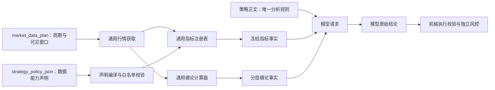

# 声明式指标数据与缠论能力分层修复方案

## 1. 文档状态

- 文档类型：正式实施方案
- 当前状态：已完成两轮独立复审，可进入实施
- 方案日期：2026-08-13
- 本地仓库：`D:\dev_codex\wall-street-skill-local`
- 基线分支：`dev_codex`
- 基线提交：`1c0e9feb235939396ccb2fe34d6ac7e3e854a709`
- 工作树状态：方案编写前干净
- 关联方案：`docs/strategy-authoritative-generic-inference-boundary-fix-plan.md`
- 本文只授权方案文档，不授权修改运行代码、策略数据、历史信号、数据库、交易状态或部署环境。

## 2. 核心需求与不可突破的边界

系统只提供通用工具，策略是模型分析的唯一权威：

1. 策略声明需要哪些周期、K 线和公式指标，服务端按声明准备正确、可追溯的数据；
2. EMA34 与缠论的定位相同，都是通用数据能力，不是服务端内置交易方法；
3. 服务端不得根据策略 ID、名称或当前策略内容新增专用分支；
4. 服务端不得用 EMA34、缠论、中枢、背驰或固定周期职责替模型决定买卖或观望；
5. 服务端可以校验数据声明、公式参数、来源、已收盘状态、JSON、权限、订单机械关系和独立风控；
6. 策略声明的指标缺失时必须明确暴露为数据状态，不能猜测、重算可见窗口或静默替代；
7. 缠论不同层级的能力必须分别表达，不能因进入段或背驰不可用，就把已经独立确认的线段方向一并关闭。

一句话目标：

> **策略声明数据，服务端计算事实，模型依据策略作结论；能力缺失只描述缺失的那一层。**

## 3. 已核实的运行事实

### 3.1 EMA34 声明存在，但运行时被关闭

本地策略 `auto_prompt_types.id=1` 当前保存了：

- `market_data_plan_json`：包含 H1、M5、M15、H4；
- `strategy_policy_json`：合法的 `strategy-policy-v1`；
- 指标声明：`id=entry_ema34`、`kind=ema`、`timeframe=M5`、`period=34`、`bar_scope=closed_only`、`warmup_target_bars=170`；
- `mode=enforce`；
- `use_ema34_filter=1`，但该列当前只应作为旧审计字段。

使用现有 `compileStrategyPolicy()` 对该策略做只读编译可以成功，得到稳定 policy hash，说明通用编译器和指标注册表本身可以表达 EMA34。

实际新信号快照却显示：

- `strategy_policy_mode=off`；
- `strategy_context.indicators={}`；
- 模型没有收到 `entry_ema34`；
- 信号 `#7460` 明确把“服务端未提供 M5 EMA34 证据”列为观望依据。

直接根因位于 `server/routes/ai/strategy-policy.js`：`parseStrategyPolicy()` 当前把 `strategyPolicy` 和 `compiledPolicy` 固定为 `null`，把 `policyMode` 固定为 `off`。这不是模型问题，而是声明式数据链被主动切断。

### 3.2 H1 缠论数据足够，但能力被过度联动关闭

信号 `#7459`、`#7460` 的 H1 冻结证据一致：

- 固定窗口 1200 根已取得；
- `history_sufficient=true`；
- `closed_history_sufficient=true`；
- `cache_internal_gap_unresolved=false`；
- `window_stable=true`；
- `authoritative_terminal_chain_confirmed=true`；
- 已确认 5 条线段；
- `trend_state=structural_decline`、`direction=down`；
- 跨窗口确认中枢为 0；
- 当前行情源没有 H1 `chan_structure_v6` 持久锚点。

当前结果同时给出：

- `time_location_reliable=false`；
- `structure_time_key_reliable=true`；
- `segment_direction_usable=false`；
- `structure_anchor_bootstrap_pending`。

代码与现有说明文档并不一致：`docs/chan-theory-specification.md` 已明确“没有可信结构锚点时，进入段、背驰和买卖点能力继续关闭，但已稳定的线段方向可以独立作为方向证据”。当前实现却因为绝对时间定位不可靠和锚点不可用，把线段方向一起判为不可用。

### 3.3 “锚定未完成”并不准确描述当前 H1 状态

对当前 1200 根 H1 缓存做只读重算：

- 单一完整窗口可以得到 1 个延伸中枢；
- 该中枢从窗口内第一条确认线段开始；
- 因固定窗口之外的进入段不可见，`entry_segment_stable_id=null`；
- 跨窗口保守共识没有确认同一中枢相位，因此公开 `center_count=0`；
- 没有可生成和保存的锚点身份。

这不是“已经存在候选锚点，正在等待下一次确认”，而是“当前固定窗口没有可锚定的进入段中枢”。当前代码无论 `promotionReady` 是否成立都加入 `structure_anchor_bootstrap_pending`，导致模型把一个长期结构边界反复描述为临时等待状态。

### 3.4 推理、交付和执行安全链目前正常

本次修复之后的 `#7459` 至 `#7463`：

- 模型任务均为 `succeeded`；
- provider 完整耗时约 25.9 至 34.5 秒，并非前端所显示的 6 至 8 秒；
- 均创建用户可见 delivery；
- 模型结论均为 `hold`；
- delivery 均为 `execution_status=skipped`；
- 没有订单意图或风险决策；
- 统一策略记忆库 v5 均在 provider 前留下绑定当前任务和信号的注入记录。

因此，本方案不得顺带修改信号可见性、调度周期、交付、执行资格、风控或 Bridge。

## 4. 问题定性

### 4.1 EMA34：通用声明读取回归

现有能力已经包括：

- 白名单策略声明编译器；
- EMA/SMA 通用指标注册表；
- 已收盘 K 线处理；
- 指标预热窗口；
- 来源和证据 hash；
- 策略运行时与推理快照。

缺陷不是“系统没有 EMA34”，而是新鲜推理没有读取并执行策略已保存的数据声明。

### 4.2 缠论：能力层级耦合与状态命名错误

缠论计算已经得到稳定线段方向，但以下概念被错误绑定：

1. 历史与缺口是否完整；
2. 结构稳定键是否可靠；
3. 绝对 UTC 时间定位是否可靠；
4. 线段方向是否可用；
5. 中枢是否跨窗口确认；
6. 进入段锚点是否存在；
7. 背驰和买卖点是否可用。

任何后层失败都不应自动否定所有前层。

## 5. 修复目标

1. 恢复策略声明的通用指标计算，当前策略能够收到正确的 M5 已收盘 EMA34；
2. 不恢复任何服务端写死的 EMA34 交易门禁；
3. 不执行策略 JSON 中的方向、入场或观望约束来改写模型结果；
4. 新鲜推理只把指标证据作为模型输入和冻结审计数据；
5. 缠论能力改为逐层、独立、可解释的事实状态；
6. 已稳定线段方向不再因进入段锚点缺失而被关闭；
7. `structure_anchor_bootstrap_pending` 只用于确有可持久化候选、正在完成两阶段锚定的短暂状态；
8. 没有可锚定进入段时使用准确状态，不谎称正在完成；
9. 保留固定窗口、跨窗口多数、两阶段锚点、缺口失败关闭和旧快照不可变；
10. 不以产生买卖信号为验收目标。

## 6. 明确非目标

- 不针对“道诚实战精选策略”、策略 `#1` 或 XAUUSD 写专用代码；
- 不根据策略自然语言解析并猜测需要哪些指标；
- 不重新引入 `HARDCODED_EMA34_POLICY`；
- 不让 `use_ema34_filter` 单独生成 M5、EMA34 或交易规则；
- 不由服务端执行“价格在 EMA34 上方做多、下方做空”等分析结论；
- 不放宽真实 K 线缺口、错序、身份、已收盘状态和缓存来源校验；
- 不伪造 H1 进入段，不人为延长 Chan v6 固定窗口来追求锚点；
- 不把笔级中枢冒充线段级中枢；
- 不修改历史信号、历史快照或既有锚点行；
- 不调整自动推理周期、模型、token、执行资格、风控或 Bridge；
- 不在本批次建设大型图形化策略编排器。

## 7. 目标调用链



核心隔离：

- `strategy_policy_json.indicators` 只声明需要计算的数据；
- 策略正文决定模型如何使用这些数据；
- `strategy_policy_json.constraints/workflow` 不在新鲜推理中充当第二个服务端交易决策器；
- 机械订单校验和独立风控继续位于模型结论之后。

## 8. 阶段 A：冻结合同并增加失败回归

### 8.1 先写合同测试

在改变生产行为前增加以下失败测试：

1. 保存了合法 `strategy_policy_json.indicators` 的策略必须被编译；
2. 只有 `use_ema34_filter=1`、没有声明式 policy 的策略不得获得 EMA34；
3. 指标声明为 M5/EMA/34/closed_only 时，只由通用注册表计算；
4. 指标证据必须进入 `strategy_context.indicators`；
5. 指标源 K 线可以为预热读取 170 根，但模型可见 M5 K 线仍保持策略声明的 60 根；
6. 新鲜推理不得执行 policy 里的方向约束来改写模型结论；
7. H1 固定窗口已有稳定下行线段、无进入段中枢时，线段方向能力为 true，中枢/进入段/背驰能力分别为 false；
8. 没有候选锚点时不得返回 `structure_anchor_bootstrap_pending`；
9. 真正的两阶段锚点第一阶段仍返回 pending，下一次精确匹配后才可用；
10. 未解决真实缺口继续使相关结构能力失败关闭。

### 8.2 合同版本

本批不修改历史快照。新鲜任务的 `strategy_runtime_json` 应冻结：

- 数据声明 schema 和 hash；
- 启用的指标定义；
- 指标算法版本；
- 每项指标证据 hash；
- Chan 算法与窗口政策版本；
- 分层能力字段。

恢复、重试和模型比较继续复用各自冻结输入，禁止读取最新策略补算。

## 9. 阶段 B：恢复通用声明式指标数据链

### 9.1 正确读取已有声明

修改 `server/routes/ai/strategy-policy.js`：

1. 使用现有 `compileStrategyPolicy()` 编译 `strategy_policy_json`；
2. 编译必须绑定已规范化的 `marketDataPlan`，指标引用未声明周期时稳定拒绝；
3. policy 缺失或 `mode=off` 时不计算指标；
4. policy 非法时在 provider 前失败，返回稳定数据声明错误，不能静默降级为 `off`；
5. `use_ema34_filter` 继续只读，不参与数据声明生成。

### 9.2 数据运行时与策略执行运行时拆开

不要直接恢复当前 `prepareStrategyPolicyRuntime()` 的全部旧行为。应拆成两个明确概念：

- `prepareStrategyDataRuntime()`：读取 `compiledPolicy.indicators`，计算并返回中性数据事实；
- 历史 policy/workflow/constraints：冻结用于审计，但不在新鲜推理中代替模型判断方向、入场或观望。

新鲜推理中：

- 可以调用 `calculatePolicyIndicators()`；
- 可以把 `strategy_context.indicators` 传给模型；
- 可以记录缺失、预热不足、未收盘状态和来源；
- 不调用 `evaluateStrategyConstraints()` 生成策略交易结论；
- 不把 `renderStrategyPolicyPrompt()` 生成的服务端规则插到策略正文之外；
- 不因 EMA 关系改变 `model_decision.signal_type`。

### 9.3 指标历史与可见窗口隔离

继续复用 `buildStrategyContextFromTags()` 已有机制：

- `indicatorRequiredHistory()` 决定内部取数长度；
- `policyIndicatorSources` 保持不可枚举，不把 170 根预热 K 线重复发送给模型；
- `timeframes.M5.klines` 仍只发送策略数据计划声明的 60 根；
- `strategy_context.indicators.entry_ema34` 只发送紧凑证据对象；
- `closed_only` 且最后一根未收盘时，注册表排除该根后再计算；
- `lastBarClosed` 未知、内部缺口未解决、历史不足或时间错序时返回 `ready=false` 和稳定 reason，不猜测。

### 9.4 自动、手动与比较一致

以下入口必须共用同一声明解析与数据运行时：

- 自动分析；
- 手动分析；
- 实时模型对比；
- 新鲜快照样本；
- 日/月复盘需要复用推理证据时的读取路径。

历史快照回放仍使用冻结的 `strategy_runtime_json` 和 prompt，不用当前策略重新计算指标。

## 10. 阶段 C：声明保存与版本边界

### 10.1 API 保存回环

`auto_prompt_types.strategy_policy_json` 已存在，不需要数据库迁移。修改策略服务时应：

1. `createStrategy()` 和 `updateStrategy()` 接受通用 `strategy_policy`；
2. 保存前用 `compileStrategyPolicy()` 校验；
3. 保存规范化 JSON 或明确保留原始声明并冻结 compiled hash，二者口径必须唯一；
4. policy 变化计入 `contentChanged` 并提升策略版本；
5. 更新 market data plan 时同时重新校验 policy 周期引用；
6. 无权限用户不能读取或修改其他策略 policy；
7. 并发保存继续使用现有策略更新边界，不新增隐式覆盖。

### 10.2 前端最小范围

本轮不要求建设完整 DSL 编辑器，但必须避免现有 EMA34 开关继续误导：

- 不能把旧开关展示成“打开后服务端自动创建 EMA34 规则”；
- 当前策略已有声明时，可只读显示“已声明：M5 EMA34（已收盘，预热 170 根）”；
- 新增或编辑任意指标声明的图形化能力另立产品批次；
- 在通用编辑器完成前，不允许后端根据旧开关猜测生成 policy。

### 10.3 兼容既有数据

- 策略 `#1` 的 policy 已能通过当前编译器，不需要数据修复；
- 没有 policy 的其他策略继续不计算声明指标；
- 非法历史 policy 在启用策略执行前应明确报错并要求人工修订；
- 不自动改策略正文；
- 不回填旧信号和旧快照。

## 11. 阶段 D：缠论能力分层

### 11.1 拆开四类质量事实

在 `buildChanEvidenceCapabilities()` 中明确区分：

1. `history_complete`：目标历史和已收盘历史是否满足；
2. `topology_input_complete`：历史完整、无未解决缺口、结构稳定键可靠；
3. `absolute_time_location_reliable`：绝对 UTC 定位是否可信；
4. 各结构层能力：线段、中枢、进入段、背驰。

为兼容现有模型合同，可以保留 `data_complete`，但其语义必须改为“结构计算输入完整”，不能再把绝对 UTC 定位不可靠等同于 K 线数据缺失。绝对时间可靠性使用独立字段表达。

### 11.2 线段方向能力

`segment_direction_usable` 只依赖：

- 固定窗口历史满足；
- 已收盘历史满足；
- 无未解决真实缺口；
- `structure_time_key_reliable=true`；
- `window_stable=true`；
- `authoritative_terminal_chain_confirmed=true`；
- 至少一条确认线段；
- `trend_state.direction` 为 up/down。

它不得依赖：

- 是否存在中枢；
- 是否存在进入段；
- 是否已完成锚定；
- 是否存在背驰或买卖点；
- 绝对 UTC 时间是否可以精确展示。

### 11.3 中枢、进入段和背驰能力

- `center_structure_usable`：在线段方向可用的基础上，要求跨窗口确认中枢和结构拓扑可靠；
- `entry_structure_usable`：要求中枢可用、进入段稳定身份完整、可信锚点命中；
- `divergence_usable`：要求进入段和离开段引用完整、MACD 暖机满足、背驰证据本身可判断；
- 买卖点候选继续保留自身 `usable_for_entry`、新鲜度和时间定位状态；
- `absolute_time_location_reliable=false` 时不得伪造精确 UTC 时间，但不应抹掉价格拓扑和稳定线段方向。

### 11.4 保护函数只关闭依赖层

调整 `protectBootstrapDependentEvidence()`：

- 保留已确认 segments 和独立 `trend_state`；
- 无锚点时只清空依赖进入段的背驰、形成中背驰、历史背驰和买卖点；
- 若中枢本身获得跨窗口确认，可保留中枢事实；
- 不把 `structure_anchor_bootstrap_pending` 写入所有能力层的统一失败原因。

## 12. 阶段 E：锚点状态语义修正

### 12.1 只在真实两阶段提交时使用 pending

`structure_anchor_bootstrap_pending` 只允许在以下条件同时成立时出现：

- 完整目标窗口和验证窗口确认同一结构身份；
- 存在明确的进入段稳定 ID；
- 存在三段核心稳定 ID；
- 三个连续已收盘观察点支持同一身份；
- `recommended_time_utc_msc` 有效；
- 当前结果处于“已推荐/已保存，但尚未在下一次请求精确复核”的两阶段过渡。

### 12.2 没有候选锚点时使用精确状态

当前固定窗口没有进入段中枢时：

- 不保存锚点；
- 不标记 bootstrap pending；
- 中枢不存在使用 `no_confirmed_center`；
- 有中枢但进入段在窗口边界外使用 `center_entry_unconfirmed`；
- 跨窗口相位不一致使用 `center_cross_window_unstable`；
- 线段方向仍按其独立能力提供。

### 12.3 保留固定窗口与两阶段安全

本方案禁止通过以下方式“让锚点赶快完成”：

- 动态扩到 1600/2000/更多历史；
- 复用其他账户、行情源或旧算法锚点；
- 把 legacy anchor 升级为 v6；
- 仅凭单窗口中枢保存锚点；
- 用重复请求累计为三根已收盘支持；
- 在未收盘 K 线上推进锚点。

如果市场后续自然形成满足条件的进入段中枢，现有 v6 两阶段保存流程应自然建立锚点。

## 13. 阶段 F：模型输入和用户文案

### 13.1 模型输入

模型应收到中性事实：

- `strategy_context.indicators.entry_ema34` 的数值、来源、bar、ready、evidence hash 和分析型事实；
- 每周期 `chan.trend_state`；
- 分层 `evidence_capabilities`；
- 中枢、进入段、背驰各自的可用状态；
- 时间定位可靠性；
- 原始 warnings/reason codes。

通用系统提示词只解释字段语义，不规定：

- EMA34 必须如何交易；
- H1/H4/M15/M5 各自职责；
- 哪些证据组合必须买卖或观望；
- 锚点不可用时策略必须做什么。

这些都由当前策略正文决定。

### 13.2 用户文案

- 不再把“无候选锚点”显示成“正在用连续三根确认”；
- 内部状态本地化必须逐一对应真实语义；
- 数据状态不得冒充模型判定依据；
- 模型原文仍原样展示；
- 不恢复已删除的旧版“数据与系统状态”诊断卡。

## 14. 文件级实施范围

### 14.1 预计修改

- `server/routes/ai/strategy-policy.js`
  - 恢复声明编译；拆出数据运行时；停止策略约束执行。
- `server/routes/ai/strategy-policy-compiler.js`
  - 仅在确需补充数据声明校验或稳定错误路径时修改。
- `server/routes/ai/indicator-registry.js`
  - 保持通用 EMA/SMA 公式；补充冻结证据测试，不写 EMA34 专用分支。
- `server/routes/ai/strategy.js`
  - 手动/自动共享上下文接入声明指标；保持可见窗口与预热窗口隔离。
- `server/routes/ai/scheduler.js`
  - 自动分析接入同一数据运行时；不改调度、交付和执行资格。
- `server/routes/ai/inference-snapshots.js`
  - 冻结声明、指标证据和新能力字段。
- `server/routes/ai/market-data.js`
  - 缠论能力分层、保护范围和锚点状态语义。
- `server/routes/ai/strategy-ownership.js`
  - policy 保存、版本和授权回环。
- `server/routes/ai/llm.js`
  - 只更新中性数据字典和错误码本地化，不加入交易规则。
- 对应 `tests/ai/*.test.js`。

### 14.2 原则上不修改

- `server/migrations.js`；
- 风险引擎；
- 订单意图与 Bridge；
- 记忆库正文和压缩；
- 日/月复盘数据；
- 历史信号和历史快照；
- 自动调度等待周期；
- 模型配置和 token 能力。

## 15. 数据、迁移、并发与恢复

### 15.1 数据与迁移

- `strategy_policy_json`、`strategy_runtime_json` 和指标证据所需结构均已存在；
- 本方案首选零数据库迁移；
- 不修改 `chan_structure_anchors` 现有行；
- 不回填 H1 v6 锚点；
- 不更新策略 `#1` 内容；
- 不重算历史信号。

### 15.2 并发与幂等

- 每个推理任务只使用自己的冻结 compiled declaration 和指标证据；
- 不把 compiled policy 或指标结果写回共享策略对象；
- 相同任务重试复用冻结 input hash，不读取最新策略；
- 锚点保存继续按来源、标准品种、周期和算法版本唯一；
- 旧观察不得覆盖新观察；
- 重复读取不能推进锚点票数。

### 15.3 异常恢复

- policy 编译失败：provider 前失败，稳定错误码，不产生假 hold；
- 指标数据不足：模型仍可收到 `ready=false` 的事实，是否继续分析由策略决定；
- 周期完全缺失或来源非法：按既有数据准备错误处理；
- provider 未知结果：继续使用模型任务恢复机制，不重发；
- 锚点保存失败：记录错误但不把未保存锚点当作已完成。

## 16. 测试与验收

### 16.1 声明式指标测试

扩展：

- `tests/ai/strategy-policy.test.js`
- `tests/ai/strategy-policy-engine.test.js`
- `tests/ai/strategy.test.js`
- `tests/ai/scheduler.test.js`
- `tests/ai/inference-snapshots.test.js`
- `tests/ai/llm.test.js`

覆盖：

1. 当前策略同构 policy 能编译出 M5 EMA34；
2. M5 内部读取 170 根、模型可见仍为 60 根；
3. 最后一根未收盘时只用已收盘数据；
4. 证据包含来源、bar、value、analysis、算法版本和 hash；
5. 只有旧开关而无 policy 时不生成指标；
6. policy 引用未声明周期、非法参数或未知指标时 provider 调用次数为 0；
7. policy 缺失时行为与当前普通策略一致；
8. 模型买卖结论不被 policy constraint 改写；
9. 自动、手动和新鲜比较生成相同指标证据 hash；
10. 历史回放不补算当前指标。

### 16.2 缠论测试

扩展：

- `tests/ai/chan.test.js`
- `tests/ai/market-data.test.js`
- 必要时增加冻结快照 fixture 测试。

覆盖：

1. 1200 根、5 条稳定线段、无跨窗口中枢：`segment_direction_usable=true`；
2. 同一场景：center/entry/divergence 分别为 false；
3. `time_location_reliable=false`、`structure_time_key_reliable=true` 不再关闭线段拓扑；
4. 无候选锚点不返回 bootstrap pending；
5. 真候选首次保存后 `current_result_usable=false`；
6. 下一次身份、时间和最后线段均匹配后才变为 true；
7. 锚点身份不匹配、最后线段回退或来源变化继续失败关闭；
8. 真实未解决缺口继续关闭所有依赖结构；
9. 没有中枢是结构事实，不标为历史数据不足；
10. 计算窗口仍严格为 v6 目标和验证窗口。

### 16.3 全链路验收

本地重启后只观察自然产生的新任务，不补跑周期：

1. `/health` 正常；
2. 新快照 `strategy_context.indicators.entry_ema34.ready=true`；
3. 指标 bar 为最后一根已收盘 M5；
4. H1 仍没有中枢时，模型可看到稳定线段方向和独立的中枢缺失；
5. 不再收到错误的“锚点正在完成”状态；
6. 模型可以继续按策略选择 hold，不能把 hold 减少作为成功标准；
7. 每条成功结论均可见；
8. hold/ineligible 继续不创建订单意图；
9. provider 耗时继续以 `ai_model_task_attempts` 为准；
10. 记忆注入、快照、交付和任务 ID 仍能完整关联。

### 16.4 验证命令

```powershell
node --check server/routes/ai/strategy-policy.js
node --check server/routes/ai/indicator-registry.js
node --check server/routes/ai/strategy.js
node --check server/routes/ai/scheduler.js
node --check server/routes/ai/inference-snapshots.js
node --check server/routes/ai/market-data.js
node --check server/routes/ai/strategy-ownership.js
node --check server/routes/ai/llm.js

npx vitest run tests/ai/strategy-policy.test.js tests/ai/strategy-policy-engine.test.js
npx vitest run tests/ai/strategy.test.js tests/ai/scheduler.test.js
npx vitest run tests/ai/inference-snapshots.test.js tests/ai/llm.test.js
npx vitest run tests/ai/chan.test.js tests/ai/market-data.test.js
npx vitest run tests/ai/analyze-compare.test.js tests/ai/scheduler-safety.test.js
npm test
git diff --check
```

## 17. 实施批次与提交边界

### 批次 1：声明式指标数据链

建议提交：`fix(ai): restore declared indicator evidence`

- 编译已保存数据声明；
- 数据运行时与策略约束运行时分离；
- 自动、手动和快照接入；
- policy 保存回环；
- 完成指标定向测试。

### 批次 2：缠论能力分层

建议提交：`fix(ai): decouple chan structure capabilities`

- 线段、中枢、进入段、背驰能力解耦；
- 修正绝对时间与结构稳定键关系；
- 保留固定窗口和缺口失败关闭；
- 完成 Chan 定向测试。

### 批次 3：锚点语义与全链路回归

建议提交：`fix(ai): report chan anchor states precisely`

- pending 只用于真实两阶段提交；
- 更新中性数据字典和本地化；
- 运行全量测试；
- 可见 PowerShell 重启本地服务；
- 观察自然任务并做只读链路验收。

依赖顺序：批次 1 与批次 2 可以独立编码，但必须在批次 3 联合验收后才视为完成。部署另需用户明确授权。

## 18. 发布与回滚

### 18.1 发布前门禁

- 工作树只包含本方案对应改动；
- 当前所有非空 active policy 均能通过编译；
- 没有策略 ID/名称/品种专用分支；
- 没有重新启用服务端 EMA34 方向约束；
- 全量测试通过；
- 本地自然任务指标证据正确；
- hold 仍不进入订单意图。

### 18.2 回滚

- 三个批次保持单一职责，可以按提交回滚；
- 不需要数据库回滚；
- 已保存的新快照字段是加法字段，旧代码可忽略；
- 回滚不得删除新产生的信号、快照或指标审计；
- 如出现无资格信号进入订单意图，立即停止发布并回滚；
- 如出现策略声明缺失却被系统默认指标替代，立即回滚；
- 如 Chan 真实缺口被误标为可用，立即回滚。

## 19. 第一轮方案复审：需求、边界、复用与最小改动

### 19.1 独立检查项

- 是否落实“EMA34 与缠论一样，计算好传给模型”；
- 是否误恢复服务端专用策略；
- 是否复用现有编译器和指标注册表；
- 是否把当前 H1 状态误判成缺历史；
- 是否为了解决锚点扩大固定窗口；
- 是否顺带修改已经修好的信号可见性和执行链。

### 19.2 第一轮发现与调整

1. **发现：直接恢复整个 `prepareStrategyPolicyRuntime()` 会同时恢复 constraints、workflow 和生成式 prompt，服务端可能再次依据 EMA34 拦截或解释模型。**

   **调整：**把“声明式数据运行时”和“策略约束运行时”拆开；新鲜推理只恢复 indicators 数据计算，不执行策略交易约束，不改写模型结论。

2. **发现：只恢复 `use_ema34_filter` 会重新形成一个专用开关，与通用工具原则冲突。**

   **调整：**旧开关保持只读；唯一权威输入是白名单 `strategy_policy_json.indicators`。

3. **发现：把 H1 问题简单归因于 1200 根历史不足不符合实证。**

   **调整：**固定窗口保持不变；修复点改为能力分层和锚点状态语义。

4. **发现：直接放宽中枢共识或伪造进入段会降低缠论证据可靠性。**

   **调整：**不改变中枢、背驰和锚点确认门槛，只恢复已经独立确认的线段方向能力。

5. **发现：信号可见性、delivery 和执行资格在 `#7459` 之后已经正常。**

   **调整：**将 scheduler 修改严格限制为声明指标接线，不碰调度等待、订阅集合、delivery 或执行门禁。

### 19.3 第一轮结论

调整后的方案复用现有通用能力，修复的是声明读取和能力表达，不把某个策略搬进服务端，也不通过放宽算法换取更多信号，符合最小改动方向。

## 20. 第二轮方案复审：兼容、数据、并发、恢复、时间、安全与连带风险

### 20.1 独立检查项

- 非法或旧 policy 如何处理；
- policy 保存是否提升版本并重新校验周期；
- 指标预热是否扩大模型输入和 token；
- 未收盘 K 线、缺口和来源身份是否继续可靠；
- 重试和历史比较是否读取最新策略；
- absolute time 与 topology time 是否会被错误互换；
- 锚点并发保存和观察时间是否仍幂等；
- 是否可能漏掉执行约束并放行真实订单；
- 如何无数据回写回滚。

### 20.2 第二轮发现与修订

1. **发现：active 策略若包含非法 policy，静默按 off 运行会再次造成“策略要数据但模型没收到”。**

   **修订：**非法声明在 provider 前 fail closed；保存时提前校验。当前本地策略 `#1` 已只读证明可编译，策略 `#3` 没有 policy，保持原行为。

2. **发现：指标 warmup 170 根若直接枚举进模型 payload，会增加当前约 36k 输入 token 并重复行情。**

   **修订：**内部源保持不可枚举；模型只收到紧凑指标证据，原可见 M5 仍为 60 根。

3. **发现：`last_bar_closed=false` 时如果取最后一根计算 EMA，会产生实时漂移。**

   **修订：**继续复用 registry 的 `closed_only` 逻辑，排除最后一根；关闭状态未知时返回 `ready=false`。

4. **发现：若把 `time_location_reliable=false` 完全忽略，模型可能把不精确 UTC 当成精确事件时间。**

   **修订：**只把它从线段拓扑资格中拆出，不删除字段；增加独立绝对时间能力，精确定位和相关买卖点继续保守。

5. **发现：如果同时恢复 policy constraints，可能出现服务端依据 EMA34 阻止模型策略允许的交易。**

   **修订：**新鲜推理不运行分析型 constraints；真实执行仍必须通过现有通用参数校验、权限、独立风控和 Bridge 安全。这里不是删除安全门禁。

6. **发现：历史模型比较若按当前声明补算 EMA34，会破坏可重复性。**

   **修订：**历史回放只使用冻结 snapshot；只有新鲜比较任务使用当前冻结策略创建新的指标证据。

7. **发现：`structure_anchor_bootstrap_pending` 如果只改文案而不改触发条件，仍会长期误导。**

   **修订：**状态触发必须绑定真实 recommended anchor 和两阶段提交条件，文案只是最后一步。

8. **发现：新增能力字段可能影响旧模型和旧前端。**

   **修订：**采用加法字段，保留现有字段；旧快照不重写，旧读取器忽略未知字段。现有误导字段只对新鲜计算修正。

9. **发现：策略保存时只改 market plan、不重新校验 policy，会留下悬空指标周期。**

   **修订：**market plan 和 policy 每次更新必须作为一个整体校验；失败不写入、不增加版本。

10. **发现：自然市场仍可能按策略合理地产生连续 hold。**

    **修订：**验收只检查数据是否正确、模型是否收到、结论是否原样保存、执行是否安全，不使用买卖数量衡量成功。

### 20.3 剩余风险

- 修复后模型可能更频繁引用已恢复的 EMA34 或已开放的线段方向，输出分布会变化；这是策略获得完整声明数据后的预期变化，需要观察真实模型遵循度；
- 当前策略正文和 policy JSON 都描述 EMA34，存在重复表达，但二者均属于策略侧；本批不自动改写策略；
- H1 固定窗口可能长期没有带进入段的跨窗口中枢，这是合法结构状态，不保证未来必然生成 v6 锚点；
- MT4 历史绝对 UTC 仍不可靠，修复只允许结构稳定键支持拓扑，不提升绝对时间可信度；
- 单元测试和缓存重算不能证明真实 provider 会如何权衡恢复后的证据，必须用自然新任务做只读验收；
- 本批不提供完整通用指标 UI，未来新增指标声明仍需独立产品设计。

### 20.4 第二轮结论

第二轮已把非法声明、预热 token、未收盘 K 线、历史可重复性、绝对时间、执行安全、策略版本和状态误导等连带风险纳入最终方案。方案不需要迁移或历史回填，具备明确的分批实施、测试、自然任务验收和按提交回滚路径，可以进入实施。

## 21. 最终实施判断

建议按三个批次实施。最关键的四条验收红线是：

1. **只恢复通用指标数据，不恢复服务端 EMA34 交易策略；**
2. **只开放独立确认的缠论能力，不放宽中枢、进入段和背驰门槛；**
3. **真实缺口、未收盘、来源和时间质量继续如实暴露；**
4. **模型结论、执行资格和独立风控继续分层，任何修复不得绕过交易安全。**
