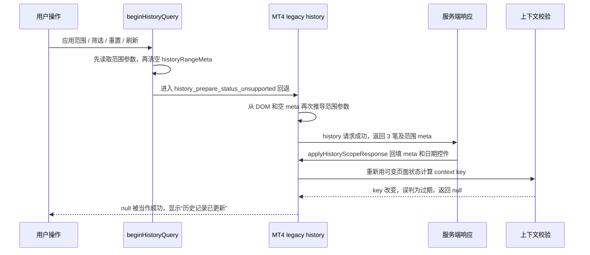
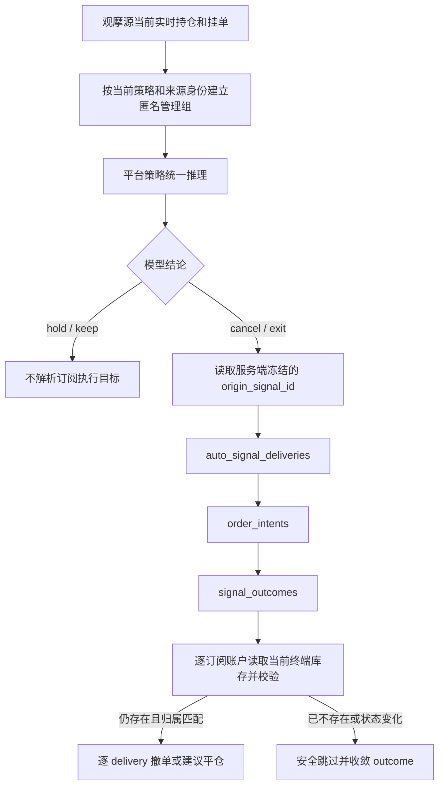

# 虚拟机 MT4 交易记录与平台持仓管理边界纠偏修复方案

> 文档状态：已完成两轮复审，可进入实施
>
> 编写日期：2026-08-17
>
> 本地方案基线：`main` / `dfe1924d3523d9773df1771e7b1aaf2f9dc08cc8`（与 `origin/main`、`origin/dev_codex` 一致）
>
> 虚拟机复现基线：`192.168.1.254:/www/wwwroot/aurum-ai` / `dev_codex` / `4d7b2987c5e6793382530210390733e249ae2e00`
>
> 本文包含两个互相独立的修复轨道：A 为 MT4 交易记录交互后成功响应被丢弃；B 为平台持仓管理推理混入订阅用户旧 outcome 及 outcome 对账 UTC 起点错误。本文只定义实施方案，不授权修改业务代码、交易数据、数据库、Bridge、线上配置或部署运行服务。

## 1. 结论

本次故障不是 MT4 没有返回历史，也不是筛选条件真的筛掉了三笔记录，而是前端同一次查询的“请求身份”依赖了会被响应更新的页面状态：请求发出前和成功响应回填 `historyRangeMeta` 后，前端重新计算出的上下文键不同，于是把当前成功响应误判为过期响应并丢弃；兼容回退层又把这个 `null` 结果当成成功，最终出现“历史记录已更新”但统计、图表和列表全空。

修复采用最小状态机调整：

1. 每次进入交易记录、应用范围、筛选、重置或刷新时，创建不可变的查询快照，冻结账号、查询代次、范围参数和表格筛选。
2. 同一次查询的 MT4 兼容回退、列表和图表请求只使用该快照，不再从已清空或已被响应回填的 DOM / `historyRangeMeta` 重新推导请求身份。
3. 响应是否有效只比较当前查询代次、账号上下文和冻结快照；服务端返回的范围元数据只负责更新展示与后续分页，不得反过来使当前响应失效。
4. 过期响应仍然必须被拦截，但被拦截、未应用或待准备的结果不得显示“历史记录已更新”。
5. 不修改 Bridge 协议、服务端历史接口、MT4 可见历史语义、数据库或真实交易记录。

平台持仓管理另按独立轨道纠偏：模型只读取平台策略关联观摩源当前真实持仓和挂单；只有模型基于该参考组合给出 `cancel/exit` 后，后端才沿原始信号的分发记录解析各订阅用户执行目标。订阅用户库存只用于执行前校验，不能形成模型管理组、补充模型事实或改变模型结论。同时修正 outcome 对账把北京时间日期截断后当作 UTC 零点的错误，防止已结束订单长期残留为 `open`。

## 2. 修复轨道 A：已核实事实、判断与待实施验证

### 2.1 已核实事实

在虚拟机目标账号的真实登录会话中：

- F5 后进入“交易记录”，页面可以显示 3 笔记录，总盈亏为 `-47.64`。
- 点击“应用范围”“筛选”“重置”或页面“刷新”后，列表、统计和图表变空，但页面仍提示“历史记录已更新”。
- 同一账号直接调用 `history`，无筛选、携带 `scope_start_override`、携带 `close_from` 三种请求均返回 3 笔，证明历史数据和服务端筛选结果存在。
- `history_prepare_status_v1` 返回 `history_prepare_status_unsupported`，因此该 MT4 连接按既有设计进入兼容回退。
- 历史响应中 `history_revision=3`、`summary_revision=3`、`terminal_visible_history_complete=true`、`requested_range_complete=false`、`summary_status=ready`。这是 MT4 终端当前可见历史的兼容语义，不等同于数据为空。
- 本地 `4d7b2987` 之后的最新代码仍包含相同状态机，因此虚拟机现象不是部署版本落后造成的。

### 2.2 根因判断

当前调用顺序为：



关键问题有两个：

1. `historyRefreshContextKey()` 既承担请求去重，又承担响应新旧判断，但它读取 `getHistoryRangeParams()`；后者依赖会在请求生命周期中变化的 `historyRangeMeta` 和日期控件。
2. `runHistoryLegacyFallback()` 没有区分“数据已应用”“响应被丢弃”和“仍在准备”，只要 Promise 正常返回就可能渲染成功状态。

### 2.3 待实施阶段验证的事项

- 真实浏览器中“范围下拉切换”是否也能稳定复现；代码路径与同类按钮一致，但本轮未改变账号配置进行额外操作。
- 弱网下连续快速点击两个不同操作时，旧响应是否会在新响应之后到达；现有 generation 设计应拦截，实施后需用可控延迟测试确认。
- MT5 支持 `history_prepare_status_v1` 的路径不经过本次 MT4 fallback 根因，但仍需回归其冻结范围、snapshot/cursor 和 summary readiness。

## 3. 需求目标

### 3.1 功能目标

1. F5 后首次进入、应用范围、筛选、重置、刷新五类入口，在相同有效条件下得到一致的 3 笔历史、统计和图表。
2. 用户输入的统计范围与表格筛选仍按现有业务定义生效，不把“平台接入后”的展示起点误发为新的 `scope_start_override`。
3. 快速连续操作时只允许最后一个查询代次更新页面，旧响应不得覆盖新结果。
4. 只有数据实际应用后才显示成功；过期、取消、待准备和失败分别展示现有对应状态。
5. MT4 继续接受“终端可见历史完整、精确请求范围不可证明完整”的兼容状态；不得因此把已有记录判空。

### 3.2 非目标

本次不实施：

- 修改 MT4 EA、Bridge 本地历史归档、WebSocket action 或服务端 `history` 返回合同。
- 把 `requested_range_complete=false` 全局改成 true，或放松 MT5 精确范围准备要求。
- 增加无界历史请求、提高批次/包体、清理或重建 SQLite 历史。
- 修改历史业务日、平仓时间、平台接入起点、保存范围或账号路由语义。
- 重写整套前端状态管理、引入框架、全局 store、事件总线或新的后端接口。
- 为单一 MT4 兼容问题增加管理员开关或用户配置。

## 4. 必须保留的现有合同

### 4.1 数据与时间合同

- 历史列表、统计和图表继续以现有服务端响应为权威；前端不合成缺失交易。
- MT4 `terminal_visible_history_complete=true` 表示终端当前可见集合完整；它不能伪装成精确任意历史范围已完整。
- MT5 仍须由 `history_prepare_status_v1` 证明冻结范围与 summary revision ready，不能套用 MT4 兼容放宽。
- 范围、日期和分页继续沿用既有半开区间、终端服务器业务日、snapshot/cursor 合同。

### 4.2 权限与账号合同

- 请求继续绑定当前已授权交易账号、稳定账号键和 `_accountContextGeneration`。
- 切换账号、退出登录、Bridge 身份变化或观摩来源变化后，旧响应必须失效。
- 不在日志、测试夹具、方案或提交中写入用户密码、令牌或其他凭据。

### 4.3 前端交互合同

- “统计范围”和下方“表格筛选”保持两套独立语义。
- “重置”只清除表格筛选，不清除已保存统计范围起点。
- 第一页创建新 snapshot，后续分页复用冻结范围和不透明 cursor。
- 页面自动重绘、图表交互和仅表格分页不得无意创建新的统计范围。

## 5. 最小状态模型

### 5.1 查询快照

在 `beginHistoryQuery()` 创建的现有 query 对象上补齐不可变快照，不新增全局状态系统。建议字段为：

```text
generation                 显式操作递增的查询代次
accountContextGeneration   发起时的账号上下文代次
accountKey                 发起时的稳定账号键
trigger                    enter/apply/filter/reset/refresh/scope/save
scopeParams                getHistoryRangeParams() 的一次性副本
tableFilters               发起时的筛选副本
frozenRange                服务端准备成功后补入的冻结 UTC 范围
```

约束：

- `scopeParams` 与 `tableFilters` 创建后不得被 DOM、`historyRangeMeta` 或响应对象原地修改。
- `frozenRange` 只允许从同一代次服务端响应补入一次；再次返回不一致范围时继续失败关闭。
- 兼容回退没有 prepare frozen range 时，也必须复用 `scopeParams`，不能重新调用 `getHistoryRangeParams()`。
- 不把完整订单、统计或图表复制进 query；这些继续使用现有缓存，避免状态重复。

### 5.2 响应有效性

响应提交前按以下顺序判断：

1. query 仍是 `_historyQueryState` 当前对象且 generation 相同；
2. `_accountContextGeneration` 与快照相同；
3. 当前稳定账号键与 `accountKey` 相同；
4. 对仅表格分页/图表请求，检查其发起时的 snapshot、cursor、范围和筛选快照仍属于当前 query；
5. 通过后才应用范围 meta、统计、图表和列表。

禁止在步骤 5 之后重新从 DOM 或 `historyRangeMeta` 计算同一响应的身份。服务端响应改变页面展示是正常提交结果，不是“请求上下文被用户改变”。

### 5.3 结果状态

保持现有返回数据结构，不扩大外部 API；仅在前端内部明确三类结果：

| 内部结果 | 含义 | UI 行为 |
| --- | --- | --- |
| applied | 当前响应已写入页面 | 可显示成功或对应 pending 提示 |
| stale/cancelled | 响应属于旧代次、旧账号或旧 snapshot | 静默丢弃，不显示成功 |
| pending/error | 服务端仍准备中或请求失败 | 显示警告/错误，保留重试合同 |

实现可使用小型内部结果对象，或在现有返回值上增加明确判定；不得继续以“Promise 未抛错且返回 `null`”代表成功。

## 6. 代码改动范围

### 6.1 `public/ai/app.js`

#### A. 冻结请求参数

- 在 `beginHistoryQuery()` 中一次性捕获并复制 `scopeParams`、当前筛选、账号键和账号上下文代次。
- `loadHistoryViewsLegacy()`、`loadHistory()` 与 `loadHistoryChart()` 在新查询链路中接收 query/快照参数。
- 新查询的 MT4 fallback 必须使用 `query.scopeParams`；MT5 prepare 成功后继续叠加 `historyQueryRangeParams(query)` 中的权威 UTC 冻结范围。
- 独立的旧调用入口若没有 query，仍可在调用开始时创建一次局部快照，但同一请求内不得二次推导。

#### B. 拆开请求键与响应提交校验

- `historyRefreshContextKey()` 可继续用于同参数请求去重/缓存，但不能再以响应应用后重新计算的动态值判断当前响应是否过期。
- 将 `historyRangeContextMatches()` 改为比较发起时快照与当前 query/账号上下文，或增加专用的 `historyRequestIsCurrent()`；名称不是合同，行为是合同。
- 在任何 `applyHistoryScopeResponse()`、DOM 日期回填或缓存写入之前先做一次 stale 校验；通过后按一个提交阶段应用所有展示数据。
- 删除“响应应用后因 meta 改变再次把自己判旧”的路径，同时保留真正的跨代次和跨账号保护。

#### C. 修正兼容回退完成状态

- `runHistoryLegacyFallback()` 只在历史/统计结果实际应用后把 query 标记为 `ready` 并显示“历史记录已更新”。
- stale/cancelled 结果直接结束，不修改新 query 的状态和提示。
- `historyPending` 与 `summaryPending` 继续使用现有 MT4 有界退避；不新增无限轮询。
- 显式刷新仍可传 `forceRefresh:true`，进入/应用/筛选/重置仍优先读取本地归档。

#### D. 保持页面清空语义可控

- 新查询开始时可以继续清空旧列表、统计和图表，避免范围错配。
- `state.historyRangeMeta` 是否清空不再影响请求身份；建议继续按现有 pending UI 清空/更新，以减少视觉语义变化。
- 如果请求失败，展示明确错误或待准备状态，不恢复上一范围的统计冒充新结果。

### 6.2 `tests/ai/history-scope-frontend.test.js`

在现有静态合同测试基础上新增可执行状态机 harness，至少覆盖：

1. `platform` 范围已有展示日期，开始新查询后 meta 被清空，MT4 fallback 响应回填 meta，3 笔记录仍被应用。
2. 同一响应回填日期和 `historyRangeMeta` 后，响应有效性不发生自我反转。
3. fallback 使用 query 冻结的 `{ history_scope:'platform' }`，不会临时增加冗余 `scope_start_override`。
4. 返回 stale/cancelled 时不设置 `ready`、不显示“历史记录已更新”。
5. 新代次开始后旧代次响应到达，旧数据不覆盖新页面。
6. 账号上下文变化后旧响应被丢弃。
7. `custom` 范围和表格 `close_from/close_to` 筛选仍按快照发送。
8. 第一页 snapshot、后续 cursor、图表范围和票号映射现有合同不变。
9. MT4 `terminal_visible_history_complete=true`、`requested_range_complete=false`、revision 相等且 summary ready 时，兼容回退仍可展示已有数据。
10. MT5 prepare 路径仍要求精确范围 complete 和 revision 一致。

### 6.3 轨道 A 不应修改的文件

除非实施时出现与本轮证据矛盾的新事实，否则不修改：

- `server/bridge-ws.js`
- `server/migrations.js`
- `bridge/` 下的 MT4 EA、MT5 Worker、SQLite 和协议代码
- 历史数据、账号绑定、范围偏好和部署脚本

直接 WebSocket 结果已证明服务端能返回正确 3 笔；在没有新证据时修改后端会扩大风险且不能修复前端自我失效。

## 7. 五类入口验收矩阵

| 入口 | 新 generation | 预期 force refresh | 范围参数来源 | 预期结果 |
| --- | --- | --- | --- | --- |
| F5 后首次进入 | 是 | 否 | 新 query 快照 | 显示 3 笔及完整统计/图表 |
| 应用范围 | 是 | 否 | 当前范围控件的一次性快照 | 同范围仍显示 3 笔，不产生冗余 override |
| 下方筛选 | 是 | 否 | 范围快照 + 表格筛选快照 | 符合条件的数据；清空筛选时恢复 3 笔 |
| 重置 | 是 | 否 | 保留统计范围、清空表格筛选 | 恢复 3 笔，不重置保存起点 |
| 页面刷新按钮 | 是 | 是 | 新 query 快照 | 刷新投影后仍显示 3 笔，成功提示真实 |

附加交互：

- 快速先点“应用范围”再点“筛选”：只呈现后一个代次。
- 请求期间切换账号/退出：旧响应不得更新页面。
- 翻页再返回第一页：snapshot/cursor 重置规则不变。
- summary 暂未 ready：先显示已有列表并给出准备提示，按 MT4 既有有界退避完成统计。

## 8. 实施顺序

### 阶段 1：先用失败测试锁定根因

1. 扩展前端 harness，模拟 `historyRangeMeta` 在请求中从非空到空再被响应回填。
2. 断言当前代码会丢弃同一成功响应并错误显示成功，形成可重复红灯。
3. 增加 stale/no-success、账号切换和五入口合同测试。

验收：至少一个测试在未修代码上因本次根因稳定失败，而不是只做字符串存在性检查。

### 阶段 2：最小修改查询快照与提交判断

1. 补齐 query 不可变快照。
2. 让 MT4 fallback、历史列表和图表复用快照参数。
3. 把响应提交有效性从可变 DOM/meta 键中解耦。
4. 修正 fallback 对 stale/null 的成功误报。

验收：阶段 1 红灯全部转绿，现有 history scope 测试不需要放宽断言。

### 阶段 3：兼容与全量回归

1. 定向运行历史前端测试。
2. 执行 `node --check public/ai/app.js`。
3. 运行 AI 前端相关测试和全量 `npm test`。
4. 因不修改 Bridge，原则上不要求发布 Bridge；但如实际 diff 意外触及 `bridge/`，必须停止并重新评估范围，不能顺带发布。

### 阶段 4：虚拟机真实验收

实施、提交、推送和部署均需用户另行授权。部署后：

1. 核对虚拟机目录、分支、commit、工作树和 `/health`。
2. 使用目标普通用户真实会话重复五类入口，不改订阅、策略、观摩源或交易配置。
3. 浏览器网络与服务日志确认每次操作收到正确 3 笔；页面也实际渲染 3 笔。
4. 确认没有英文内部错误码、空数据成功提示或无限重试。
5. 再用管理员或 MT5 测试账号做兼容回归，避免只修普通 MT4 用户。

## 9. 测试命令与验收门槛

实施后的最低验证命令：

```powershell
node --check public/ai/app.js
npx vitest run tests/ai/history-scope-frontend.test.js
npm test
git diff --check
```

验收门槛：

- 定向测试、全量测试和语法检查全部通过。
- 新增测试必须执行状态变化和返回值判断，不能只检查源码包含某个字符串。
- 五类真实操作均不再出现“提示成功但页面为空”。
- 同一成功响应在回填 meta 前后保持同一 query 身份。
- 真实旧响应仍会被 generation/账号上下文拦截。
- 不产生数据库迁移、Bridge 包、配置项或历史数据写入。

## 10. 异常恢复、并发与幂等

### 10.1 并发

- generation 是显式新查询的唯一先后序；后发查询使先发查询只读完成但不能提交 UI。
- 账号上下文 generation 独立于历史 generation，任一改变都使旧响应失效。
- 当前已有 request flight/cache 可以继续复用，但 key 必须来自冻结快照；不能因响应回填 meta 产生第二个逻辑身份。

### 10.2 幂等

- 同一 query 的重复状态检查或一次兼容 fallback 不改变范围参数。
- 同一成功响应重复到达时，至多重复渲染相同数据，不创建订单、不修改交易或偏好。
- 用户保存范围仍由现有明确“保存开始日期”动作负责；普通应用/筛选不得写偏好。

### 10.3 异常恢复

- prepare unsupported：进入 MT4 兼容 fallback。
- 网络失败：保留错误状态，用户可显式刷新创建新 generation。
- summary pending：使用既有最多 7 次有界退避，不扩成无限后台轮询。
- 响应过期：静默丢弃，不覆盖新状态、不弹成功。
- range changed/cursor incomplete：继续失败关闭并提示重新刷新，不自动发第二个完整历史包。

## 11. 轨道 A 安全、数据和迁移评估

- 权限：不改变认证、账号绑定、观摩路由或服务端授权。
- 数据：只改变前端是否接纳正确响应，不写数据库、不改历史数据。
- 迁移：无 MySQL、SQLite 或配置迁移。
- 敏感信息：测试使用合成账号键和历史数据，禁止固化真实手机号、密码或 token。
- 交易安全：交易记录页面为读取链路；修复不得调用下单、平仓、取消挂单或订阅配置接口。

## 12. 回滚方案

本次预计是单个前端文件和单个测试文件的原子提交：

- 回滚时整体回退该提交，不回退历史数据、不清缓存数据库、不重新同步终端。
- 静态资源缓存键只有在项目现有发布规则要求时才随实施提交更新；若更新，回滚必须同步恢复匹配键，避免 HTML 与 JS 版本错配。
- 回滚后故障会恢复为“交互后页面变空”，但不会影响已存在的 MT4 历史数据。

回滚触发条件：

- MT5 prepare 路径失去精确范围校验；
- 快速切换账号后出现跨账号旧响应；
- 分页 snapshot/cursor 失效或数据重复；
- 自定义范围被错误改写；
- 页面出现无界重试或显著重复 History 请求。

## 13. 第一轮复审：需求、边界、复用、最小性与过度设计

### 13.1 检查结论

| 检查项 | 结论 |
| --- | --- |
| 需求覆盖 | 覆盖 F5 正常、应用范围/筛选/重置/刷新变空、假成功提示，以及目标普通 MT4 用户真实路径。 |
| 业务边界 | 只修历史读取与展示，不改变账号、订阅、策略、交易和历史数据。 |
| 现有能力复用 | 复用 query generation、账号上下文 generation、stable account key、prepare/fallback、snapshot/cursor 和现有缓存。 |
| 最小改动 | 预期只改 `public/ai/app.js` 与 `tests/ai/history-scope-frontend.test.js`；后端与 Bridge 无新证据不动。 |
| 过度设计 | 不引入框架、全局 store、协议 v2、数据库状态表、后台任务或管理员配置。 |

### 13.2 第一轮发现与调整

初稿曾考虑“开始新查询时不再清空 `historyRangeMeta`”作为主要修复。复审后否决该做法：保留旧 meta 只能掩盖当前复现，还会让新范围准备期间展示旧范围边界，无法从根本上保证响应身份稳定。

最终调整为：允许 pending UI 继续清空/替换 meta，但请求参数和响应有效性必须从 query 不可变快照取得。这样既修根因，也保留切换范围时不展示旧统计的现有安全语义。

第一轮结论：方案覆盖需求且保持最小边界，没有必要修改服务器或 Bridge，可进入第二轮复审。

## 14. 第二轮复审：兼容、数据、并发、幂等、异常、时间、安全、测试、回滚与连带 Bug

### 14.1 独立检查结论

| 检查域 | 检查结果 |
| --- | --- |
| MT4/MT5 兼容 | MT4 只在 prepare unsupported 时走兼容回退；MT5 exact-range readiness 不放宽。 |
| 数据与迁移 | 纯前端状态机修复，无数据库写入、迁移、清理或重新归档。 |
| 并发 | generation、账号上下文和稳定账号键共同拦截旧响应；响应 meta 不再参与同请求身份重算。 |
| 幂等 | 请求快照只读，重复响应不写偏好、不触发交易、不改变服务端状态。 |
| 异常恢复 | unsupported、pending、network error、stale、cursor incomplete 都有不同结果，不再共用假成功。 |
| 时间语义 | 不重新解释终端时间，不改变 close date、冻结 UTC 范围和 captured end。 |
| 安全 | 不扩大授权，不记录真实凭据，不接触交易写接口。 |
| 测试 | 包含根因动态 harness、五入口、旧响应、账号切换、MT4 兼容、MT5 精确范围和分页合同。 |
| 回滚 | 单一职责代码提交可整体回退，无数据回滚；缓存键如有变更必须成对回滚。 |

### 14.2 第二轮发现与最终修订

第二轮首次检查发现两个连带风险：

1. 如果只冻结范围、不冻结表格筛选，快速修改筛选控件仍可能使列表和图表使用不同语义。
2. 如果只修 `historyRangeContextMatches()`，`runHistoryLegacyFallback()` 仍可能把其他原因产生的 `null` 结果显示为成功。

因此最终方案已补充：

- query 同时冻结范围参数和表格筛选；仅表格/图表子请求需绑定其 snapshot/cursor 与 query。
- 前端内部明确 applied、stale/cancelled、pending/error 三类结果；成功提示必须以“实际应用”为前提。
- 新增快速连续操作、账号切换和 stale/no-success 回归测试。

### 14.3 修订后第二轮复核

修订后的方案再次核对通过：

- 不会用旧 meta 冒充新范围，也不会因新 meta 抛弃当前响应。
- 不会把 MT4 终端可见完整性错误推广为 MT5 精确范围完整性。
- 不会移除旧响应保护，反而把其判断依据收窄为真正不可变的代次与账号身份。
- 不会把一次前端显示修复扩展为后端协议、Bridge、迁移或数据修复。
- 测试可在不使用真实凭据和不写业务数据的情况下复现根因，并由虚拟机真实浏览器完成最终验收。

第二轮最终结论：兼容性、数据、迁移、并发、幂等、异常恢复、时间语义、安全、测试、回滚和连带 Bug 已形成闭环，方案可实施。

## 15. 剩余风险

1. 当前前端为单文件应用，测试 harness 依赖函数边界抽取；实施时应优先增加行为测试，避免只靠源码字符串断言。
2. MT4 终端可见历史是否包含更早记录仍受终端“账户历史”选择范围影响；本修复保证已有 3 笔不被前端丢弃，不承诺补出终端本身不可见的数据。
3. 虚拟机最终结果仍取决于部署 commit 与浏览器静态缓存一致；部署验收必须同时核对 commit、资源版本和实际网络响应。
4. 如果实施中发现服务端返回的数据本身在某一入口不同，应停止扩大本方案，先以请求参数和响应证据重新诊断，不能直接改 Bridge 或历史数据。

## 16. 轨道 A 最终实施验收清单

- [ ] 根因行为测试在修复前失败、修复后通过。
- [ ] 五类入口均实际应用正确历史，不再假成功。
- [ ] MT4 fallback 使用冻结范围和筛选参数。
- [ ] 响应回填 meta 不会使自身 context 失效。
- [ ] 旧 generation、旧账号和旧 snapshot 响应仍被丢弃。
- [ ] stale/cancelled 不显示“历史记录已更新”。
- [ ] MT5 exact-range prepare/readiness 合同不变。
- [ ] custom、platform、all、保存起点和表格筛选语义不变。
- [ ] 第一页 snapshot、后续 cursor、图表和统计范围一致。
- [ ] `node --check`、定向 Vitest、全量 `npm test`、`git diff --check` 全部通过。
- [ ] 轨道 A 的实施 diff 不包含后端、Bridge、迁移、凭据或真实数据修改。
- [ ] 获得部署授权后，核对虚拟机 commit、`/health`、静态资源和目标账号真实五入口结果。

## 17. 修复轨道 B：平台持仓管理推理与分发执行边界纠偏

### 17.1 已核实的生产证据

本轨道沿用此前虚拟机只读诊断，不把截图或页面补票号当作 broker 执行证据：

- 推理任务 `#13180` 对应的观摩源实时参考组合为持仓 0、挂单 0。
- 模型输入却仍包含两个管理组，其中一个来自订阅用户 `user_id=28` 的活动 outcome。
- 页面展示的 `#724919486` 来自一条未正确闭合的旧 outcome；票号不是直接传给模型，而是页面随后从旧 outcome 补出。
- 该订单创建于 `2026-08-12 22:32 UTC`，现有对账却从 `2026-08-13 00:00 UTC` 开始，漏掉约 88 分钟前的入场成交，因此 outcome 持续保持 `open`。
- 本次模型结论为 `hold/observe`，两条 delivery 均为 `skipped`，没有进入风控、订单意图或 Bridge 执行；本次未发生实际误平仓。

以上证据说明有两个独立根因：

1. 最近实现把“订阅用户仍有执行目标”错误提升成“模型仍应看到该管理组”，突破了观摩源是唯一推理组合的产品边界。
2. outcome reconciliation 用 `String(created_at).slice(0, 10)` 取得北京时间日期，再拼成 UTC `00:00`，在北京时间跨日但 UTC 尚未跨日的订单上把查询起点推迟。

### 17.2 最终业务链路



硬边界：

- 模型输入只由平台策略关联观摩源的当前实时参考组合决定。
- 观摩源当前为 0 持仓、0 挂单时，`pending_groups=[]`、`position_groups=[]`；历史 thesis、旧 outcome 或订阅用户存续订单不能单独生成模型管理组。
- 订阅用户的持仓、挂单、ticket、手数、盈亏、余额、权益、SL/TP 和账户身份一律不进入模型输入，也不参与模型结论。
- 模型输出中的 `management_group_id`、`thesis_id`、`origin_signal_id` 必须来自服务端本轮冻结的观摩源管理组，不能接受模型新增或替换的标识。
- 只有合法的 `cancel/exit` 结论才解析订阅执行目标；`hold/keep/observe` 不需要遍历用户库存。

### 17.3 对既有方案的纠偏关系

本节明确取代 `docs/platform-position-management-target-and-ticket-refresh-fix-plan.md` 中以下已证明不符合当前需求的设计：

- 第 3 节第 2～4 项“所有有效订阅 outcome 进入管理上下文、观摩源订单消失后仍评估该组”的目标；
- 第 5.1 节由所有活动 outcome 建立 `managementGroups` 的步骤；
- 第 5.2～5.3 节允许 `reference_facts_status=missing` 时仅凭冻结论点和行情继续产生 `cancel/exit` 的规则；
- 第 8 节阶段 2～4 中“恢复孤儿订阅组进入模型评估”的实施与测试口径。

继续保留该既有方案中正确且已经实施的部分：

- 订阅账户私有数据不序列化给模型；
- 每个执行目标必须经过账户、ownership、Magic、策略、方向、ticket/position 和实时状态校验；
- 新持仓票号缓存随执行归因失效、无需 F5 更新；
- 命令幂等、两次闭合周期确认、失败关闭、管理员手动策略分发不自动并入模型管理；
- 不重放历史 `cancel/exit` 决策。

这不是把旧方案原样追加，而是依据用户确认的产品边界撤销其中的过度设计。

### 17.4 模型上下文构建修复

主要文件：`server/routes/ai/position-management.js`、`tests/ai/position-management.test.js`。

平台策略路径按以下顺序构建：

1. 校验 `strategy_reference_portfolio.role === 'platform_strategy_reference_portfolio'`、来源账号身份、策略 ID、品种和快照可用性。
2. 只遍历 `strategy_reference_portfolio.positions` 与 `pending_orders` 中当前存在的条目。
3. 每个参考条目必须通过其服务端 `reference_id` 精确关联到同一观摩源、同一策略、同一品种、状态仍活动的 outcome/thesis；无法唯一关联则该条失败关闭，不用 symbol/方向模糊匹配。
4. 仅为这些当前参考条目建立去重后的 `managementGroups`、`position_groups` 或 `pending_groups`。
5. 同一当前观摩源订单可继续附带匿名终端事实、冻结 thesis、闭合行情和合法 evidence refs。
6. 订阅用户 outcome 不参与第 2～5 步，即使其状态仍为 `open/closing`。
7. 私有策略继续使用用户本人当前库存的既有路径；本次平台边界纠偏不能误伤私有策略。

由于 v1.6 曾允许观摩源事实缺失的历史订阅组继续参与判断，本次模型可见语义升级为 `position-management-v1.7`。现有合同版本门禁应使旧 v1.6 自动退出确认候选，禁止把旧合同的一次 exit 累计为新合同的连续确认；无需数据库迁移或批量改写历史任务。

需要删除或收窄的现状：

- 不再先遍历所有 active outcomes 再用“有订阅 target”决定 `hasPosition/hasPending`。
- 不再允许 `reference_facts_status='missing'` 的纯历史组进入平台模型上下文。
- 不再用轮转容量机制把订阅旧 outcome 当成需要轮转的模型组；容量只计算当前观摩源真实组合。

### 17.5 模型结论后的执行目标解析

主要文件：`server/routes/ai/position-management.js`、`server/routes/ai/position-management-worker.js` 及相应测试。

执行目标不再由模型上下文里预装的全部 subscriber `_targets` 决定，而在服务端验证模型结论后按冻结 lineage 解析：

```text
frozen origin_signal_id
  -> auto_signal_deliveries.signal_id
  -> delivery 对应 order_intent_id / 已落 outcome
  -> signal_outcomes.delivery_id + order_intent_id
  -> trading_account_id + ownership_history_id + ticket/position
```

解析规则：

- 只接受属于本轮冻结 `management_group_id + thesis_id + origin_signal_id` 的结论。
- 只查询该原始信号实际创建的 delivery，不按用户订阅现状重新扩散，不给后来订阅者补任务。
- 一个 delivery 至多解析一个符合唯一约束的 outcome；缺失或歧义时记录并跳过，不猜测 ticket。
- `pending_cancel` 只选择仍为 pending、尚未取消/成交/过期且 outcome 归属匹配的挂单。
- `position_exit` 只选择该 delivery 已成交形成、仍为 open/closing 且有真实 `position_id` 的持仓。
- source/reference outcome 只用于形成模型事实；没有对应 delivery 时不把它直接当成订阅执行目标。
- 每个目标使用稳定 operation/idempotency key，重复周期不得重复撤单或重复平仓。

执行前仍必须从该订阅用户当前 Bridge 读取库存并重新验证：

- 当前终端、broker server、login、trading account 和 ownership generation；
- 当前 ticket/position 是否仍存在；
- system Magic、策略归属、品种、方向和订单类型；
- 当前状态是否已取消、成交、过期、平仓或被人工修改。

目标已不存在时安全跳过，并把已具备证据的 outcome 收敛到真实状态；禁止沿用历史 ticket、换成同品种其他订单、触碰人工单或其他策略订单。

### 17.6 outcome 对账 UTC 起点修复

主要文件：`server/routes/ai/signal-outcomes.js`、`tests/ai/signal-outcomes.test.js`。

现有错误代码按 `created_at` 的前十位取“日期”，再将该日期解释为 UTC 零点。`created_at` 是北京时间 DATETIME，这会在 UTC 16:00～23:59 创建的订单上把查询起点推到真实创建时间之后。

修复要求：

1. 不再使用 `String(created_at).slice(0, 10)` + `T00:00:00Z` 推导对账起点。
2. 优先使用已存在的精确 UTC 毫秒证据；没有 UTC 毫秒字段时，使用项目统一的 `parseBeijing()` 把 MySQL 北京时间 DATETIME 转成 UTC。
3. 每个 outcome 的候选起点取能够证明早于入场的最早权威时间，例如原始信号 `created_at_utc_msc`、order intent 创建时间、outcome 创建时间；不得把日期边界当成精确事件时间。
4. 为覆盖“Bridge 已成交、服务端随后落 outcome”的短间隔，在候选起点前保留一个有界安全 overlap；最终不得早于该 outcome 的 ownership start。
5. 同一账户批次的 `range_start_utc_msc` 取本批活动 outcomes 精确候选起点的最小值，再与 ownership 起点逐一验证；不能因一个较新的 outcome 截断较旧 outcome。
6. `range_end_utc_msc`、整点封口、exact history evidence、account route、batch 去重和 incomplete fail-closed 合同保持不变。

事故回归断言：北京时间 `2026-08-13 06:32:xx` 必须转换到 `2026-08-12 22:32:xx UTC`（再减有界 overlap），请求起点不得是 `2026-08-13 00:00:00 UTC`。

修复部署后，仍处于 `open/closing` 的旧 outcome 由自然 reconciler 使用正确范围重新核对；不写一次性 SQL、不直接把 `#724919486` 强行标 closed，也不重放历史管理结论。只有完整历史证据和当前库存共同证明终态时才按现有两阶段闭合规则收敛。

### 17.7 轨道 B 回归矩阵

| 场景 | 模型输入 | 执行解析 | 预期结果 |
| --- | --- | --- | --- |
| 观摩源 0 持仓、0 挂单，订阅用户有旧 open outcome | 0 个管理组 | 不执行 | 不再出现截图中的虚假“继续持有”对象 |
| 观摩源有一个当前挂单，多条 delivery 仍有对应挂单 | 1 个匿名 pending group | 按 origin signal 解析每条 delivery | 模型 cancel 时逐账户安全撤单 |
| 观摩源挂单已消失，订阅挂单仍存在 | 0 个 pending group | 不执行旧结论 | 不让订阅库存反向驱动模型 |
| 观摩源有一个当前持仓，多条 delivery 已成交 | 1 个匿名 position group | 按 delivery/outcome 解析 | exit 满足两次确认后逐账户平仓 |
| 某订阅目标执行前已人工取消/平仓 | 不影响模型 | preflight 判 absent | 安全跳过并收敛 outcome，不换票号 |
| 同品种存在人工单或其他策略单 | 不进入模型 | lineage/Magic 不匹配 | 永不触碰 |
| 北京时间跨日、UTC 未跨日创建 | 与模型无关 | 精确 UTC evidence range | 入场成交不再被日期截断漏掉 |
| 历史 evidence 不完整或 Bridge 离线 | 与模型源组合分开 | fail closed | outcome 保持待核对，不猜测关闭 |

### 17.8 轨道 B 实施步骤与测试

阶段 B1：先改写错误测试合同。

- 将 `keeps active subscriber targets when the terminal reference portfolio no longer contains them` 等与确认需求相反的测试改为：观摩源不含该对象时，平台模型上下文不得包含它。
- 增加 source 0/0 + subscriber stale outcome 的事故回归。
- 增加订阅私有字段完全不在序列化 JSON 中的断言。

阶段 B2：收窄模型上下文。

- 平台 groups 只从当前 reference portfolio 精确关联结果建立。
- 私有 `_targets` 不再把所有订阅 active outcomes预装进模型查询生命周期。
- 保留私有策略当前用户库存路径。

阶段 B3：按 delivery lineage 延迟解析执行目标。

- 在合法 cancel/exit 结论通过验证后查询 delivery → intent → outcome。
- 保留逐目标确认、幂等、租约和 worker preflight。
- 覆盖部分用户已取消、部分用户仍存在、歧义 lineage 和状态竞态。

阶段 B4：修正对账精确 UTC 起点。

- 用统一北京时间解析/UTC 毫秒证据替换日期截断。
- 加入有界 overlap 与 ownership clamp。
- 验证 `2026-08-12 22:32 UTC` 事故样本、同账户多 outcome 和跨日边界。

阶段 B5：定向和全量回归。

```powershell
node --check server/routes/ai/position-management.js
node --check server/routes/ai/position-management-worker.js
node --check server/routes/ai/signal-outcomes.js
npx vitest run tests/ai/position-management.test.js
npx vitest run tests/ai/position-management-worker.test.js
npx vitest run tests/ai/signal-outcomes.test.js
npm test
git diff --check
```

轨道 A 与轨道 B 应分别形成单一职责提交并可分别回滚；不得把交易记录前端状态机修复与持仓管理后端边界修复压成一个不可拆分提交。

## 18. 合并方案重新复审

新增轨道 B 后，原第 13～14 节仅覆盖轨道 A，不能代表最终合并方案已完成复审，因此本节重新执行两轮完整复审并取代原复审状态结论。

### 18.1 第一轮：需求覆盖、业务边界、复用、最小改动与过度设计

检查结果：

- 需求覆盖：轨道 A 覆盖五个历史页面入口；轨道 B 覆盖“只用观摩源当前组合推理、按 delivery 执行、订阅库存仅 preflight、旧 outcome UTC 对账”四个核心要求。
- 业务边界：模型决策源和执行目标明确分离；订阅用户状态不会反向进入共享模型。
- 现有能力复用：继续使用 reference portfolio、冻结 thesis、`origin_signal_id`、deliveries、order intents、outcomes、worker preflight、generation 和 history exact evidence。
- 最小改动：轨道 B 预计集中于 position management context/持久化、outcome reconciler 及测试；不修改 Bridge 协议或数据库 schema。
- 过度设计检查：撤销“观摩源消失后仍用历史 thesis 管理孤儿订阅组”的过度设计，不新增第二模型、订阅用户逐个推理、后台编排服务或新数据表。

第一轮调整：原本考虑保留完整 subscriber `_targets` 但只隐藏序列化字段；复审认为这仍会让 subscriber outcome 决定模型 group 的存在和类型，因此改为“当前观摩源组合先决定模型组，合法 action 后才按 lineage 延迟解析订阅目标”。

### 18.2 第二轮：兼容、数据、迁移、并发、幂等、异常、时间、安全、测试、回滚与连带 Bug

首次检查发现三项风险：

1. 只按 `origin_signal_id` 查询 outcome 可能把非 delivery 的 source outcome 或重复归因混入执行。
2. 只用 outcome 精确创建时间仍可能晚于 broker 入场数秒。
3. 删除 subscriber groups 可能误伤私有策略管理。

已修订：

- 执行 lineage 必须经过 `auto_signal_deliveries`，并以 delivery、order intent、outcome 唯一关系交叉校验；source outcome 不因同 signal 自动成为执行目标。
- 对账起点采用最早权威 UTC 证据并减有界 overlap，再受 ownership start 约束。
- 平台策略与私有策略分支分别测试；只收窄 platform reference portfolio 路径。

修订后重新检查：

- 兼容：不改变模型输出字段、Bridge action、命令协议或私有策略合同。
- 数据/迁移：不改 schema、不手工更新旧 outcome；自然 reconciler 只在完整证据下收敛。
- 并发/幂等：模型 action 冻结 lineage，逐 delivery 稳定 key，worker 继续租约、状态版本和执行前检查。
- 异常恢复：source portfolio unavailable、lineage 歧义、Bridge 离线、history incomplete、target absent 均失败关闭或安全跳过。
- 时间：消除北京时间日期当 UTC 日期的错误，同时保留 UTC sealed end 和 ownership 边界。
- 安全/隐私：订阅字段不入模型，人工单和其他策略单受 lineage + Magic + inventory 三重保护。
- 测试：事故样本、0/0 组合、多 delivery、状态竞态、跨日 UTC、私有策略和全量回归均有明确门槛。
- 回滚：A/B 两个独立提交可分别回退；B 无数据迁移，但回滚前需核对是否已产生新管理任务，不能通过删库恢复。

第二轮最终结论：新增轨道 B 后的方案已完成两轮实质复审；修订后没有遗留需要再次改变架构的实质问题，可进入实施。

## 19. 合并方案剩余风险与发布门槛

剩余风险：

1. source reference item 到 outcome 的现有 `reference_id` 依赖必须在实现时核对来源账号约束；仅匹配 `outcome:<id>` 而不复核来源身份是不够的。
2. 某些旧 delivery/outcome 可能缺少完整 thesis 或 lineage；本方案对其失败关闭，不自动补造关系，需只读统计后另报。
3. 对账 overlap 的具体时长必须复用或提炼现有常量并用真实 Bridge 落库延迟证据确定，不能任意扩大成大范围扫描。
4. 轨道 B 部署后的自然 reconciler 可能首次关闭此前卡住的旧 outcome；部署前需只读列出受影响数量，部署后审计每个状态变化，但不得未经授权重放交易命令。

发布门槛：

- [ ] 轨道 A、B 分别有修复前失败、修复后通过的行为测试。
- [ ] 平台 source 0/0 时模型上下文严格为 0 个管理组。
- [ ] cancel/exit 目标全部可沿 delivery → intent → outcome 唯一追溯。
- [ ] 订阅库存只出现在执行前服务端校验，不出现在模型 JSON、提示词或模型日志。
- [ ] 跨北京/UTC 日期边界的 outcome 能覆盖真实入场成交。
- [ ] 没有历史决策重放、人工 SQL 改状态、Bridge 协议或 schema 变更。
- [ ] 定向测试、全量测试、语法和 diff 检查通过。
- [ ] 提交前分别审查 A/B diff；部署需另行授权并保留 commit、health、日志和只读审计证据。
