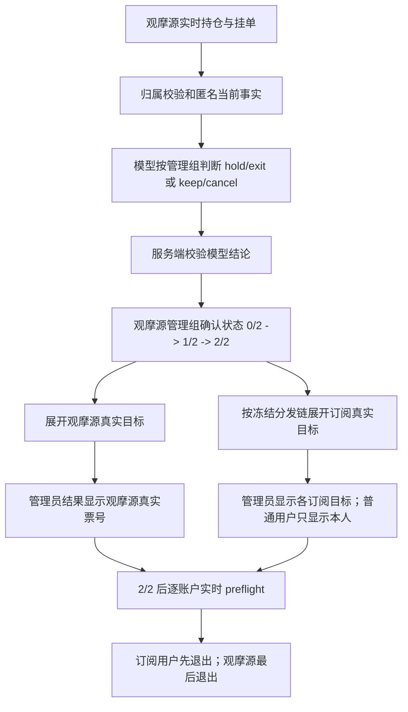

# 平台观摩源持仓管理、真实票号映射与仓位暴露修复方案

## 1. 文档状态

- 类型：修复与优化实施方案，核心修复已实施并完成自动化验证
- 基线分支：`main`
- 基线提交：`2b4c174d9d192d05cb5fafe5995e411e38dc91a2`
- 编写日期：2026-08-18
- 关联现象：普通平台 AI 信号无法关联平仓；信号 `#13575` 建议平仓但显示“票号待同步”和 `0/2`；模型无法看见观摩源当前各笔订单手数，难以判断是否继续加仓
- 适用范围：平台策略自动推理、观摩源持仓/挂单管理、订阅分发执行、信号详情展示、管理员完整平仓

本次实施只修改代码与测试，不执行数据库写入、真实订单操作、服务重启或部署。

## 2. 需求定稿

### 2.1 模型判断对象

1. 平台策略模型只判断该策略绑定观摩源账号中，当前实时存在、Magic 正确且能够精确归属到该平台策略的持仓与挂单。
2. 订阅用户的持仓、挂单、票号、账户、余额、权益和个人风控不得进入模型输入，也不得改变模型结论。
3. 历史 outcome、已消失订单、人工订单、其他策略订单不得恢复成模型管理组。
4. 模型只回答当前订单是否仍符合行情：
   - 持仓：`hold | exit`；
   - 挂单：`keep | cancel`；
   - 新开仓/加仓仍通过现有 `position_action` 表达。

### 2.2 当前订单事实

每笔观摩源持仓向模型提供：

- 方向；
- 实际开仓价；
- 当前价；
- 当前止损；
- 当前止盈；
- 当前手数；
- 开仓时间。

每笔观摩源挂单向模型提供：

- 挂单方向和类型；
- 触发价；
- 当前止损；
- 当前止盈；
- 当前手数；
- 创建时间。

明确不再把以下内容作为持仓管理模型判断事实：

- 原始结构化入场逻辑；
- 原始止损、原始分层止盈；
- 原始失效条件；
- 订阅用户任何订单事实；
- 账户余额、权益、保证金；
- 金额浮盈亏。

原始论点、原始保护价和失效条件继续保留在数据库中用于审计、历史追溯和复盘，但不再序列化进本轮持仓管理模型上下文。

### 2.3 手数和浮盈亏结论

- **需要传观摩源订单手数。** 多笔同向订单时，模型必须知道单笔与合计暴露，才能区分“已有轻量试探仓，可以考虑加仓”和“同方向暴露已经过多，应 `hold_no_add`”。
- **不能让模型返回绝对新订单手数。** 模型仍只输出 `observe | probe | light | standard` 仓位档位；最终手数由独立风控、用户净值、止损风险和合约规格计算。
- **不传金额浮盈亏。** 浮盈亏容易让模型产生沉没成本、回本或止盈偏差，而且不同账户币种不可直接比较。开仓价、当前价、方向和保护价已经足够表达市场位置。
- 服务端可以提供不含账户价值的确定性汇总：持仓数量、合计手数、加权平均开仓价、挂单数量、挂单合计手数。模型不自行计算聚合值。

### 2.4 退出与真实票号

1. 模型输出仍只包含管理组标识和 `exit/cancel` 判断，不包含任何用户或票号。
2. 模型结果通过校验后，服务端按当前观摩源管理组展开两类私有执行目标：
   - 观摩源真实持仓/挂单；
   - `origin_signal_id -> auto_signal_deliveries -> order_intents -> signal_outcomes` 对应的订阅用户真实持仓/挂单。
3. 信号详情中的管理结果必须展示已经解析出的真实订单号：
   - 管理员查看平台信号时，显示观摩源目标和各订阅目标的账号标识、昵称、真实票号、确认进度、任务状态及排除原因；
   - 普通订阅用户查看时，只显示自己的真实票号和状态；
   - 不得把其他订阅用户身份或票号返回普通用户。
4. 没有生成执行目标时显示明确状态，例如“未找到该信号对应的当前持仓”或“订单归因尚未完成”，不再统一显示误导性的“票号待同步”。

### 2.5 连续确认

自动持仓管理的确认主状态属于“观摩源管理组”，不属于某个订阅用户：

- 第一个相邻闭合 K 线窗口判断 `exit`：该观摩源管理组从 `0/2` 增加为 `1/2`；
- 下一个实际相邻闭合 K 线窗口再次判断 `exit`：增加为 `2/2`，进入退出执行；
- 任一后续有效 `hold`：清零为 `0/2`，并结束尚未发送的旧退出候选；
- 同一 inference、同一快照、同一闭合 K 线重复落库不得 `+1`；
- 跨真实闭合 K 线缺口、合同版本不一致、证据不可用不得拼接为第二次确认；
- 订阅目标是否在线、是否已同步票号不影响观摩源管理组本轮 `+1`，但会影响该目标能否进入最终执行。

各用户任务继承观摩源管理组的 `1/2` 或 `2/2`，不再各自形成互相漂移的模型确认计数。达到 `2/2` 后仍需对每个目标分别执行实时校验。

确认计数只在平台全局自动持仓管理开启且本轮来自 `automatic_scheduler` 时累计。订阅用户自己的执行模式不参与组级计数：它只决定该用户在组级达到 `2/2` 后是自动执行、仅展示还是被安全跳过。平台全局处于 display-only 时，模型建议可以展示，但不得伪装成已经 `+1`。

## 3. 当前实现与差距

### 3.1 已符合要求的部分

- `reference-portfolio.js` 已从观摩源 Bridge 实时读取持仓和挂单，并按系统 Magic、品种和 outcome 归属筛选。
- `position-management.js` 已把模型可见组和私有 `_targets` 分开，私有目标不会被 JSON 序列化给模型。
- 平台订阅执行目标已经使用 delivery、order intent、outcome 的冻结链路解析，并在歧义时失败关闭。
- 两次退出确认已有 inference、snapshot、闭合 K 线相邻性和合同版本校验。
- worker 已在执行前按账户重新读取真实终端库存，并校验票号、方向、Magic、品种和手数。

### 3.2 必须修复的差距

#### R1：观摩源只作为模型事实，没有成为退出目标

`resolvePositionManagementExecutionTargets()` 明确排除 `source_user_ids`，只返回订阅 delivery。结果是模型即使判断观摩源持仓应退出，也可能没有任何 evaluation/task，信号详情只能显示 `0/2` 和空票号。信号 `#13575` 属于这一表现。

#### R2：确认计数依赖每个 outcome

现有 evaluation/task 按目标 outcome 分别记录连续次数。目标缺失、迟到、订阅变化或票号归因延迟时，同一模型管理组可能出现不同确认次数，不符合“模型判断观摩源当前持仓”的业务语义。

#### R3：普通平台 AI 信号的管理员关联平仓被来源常量限制

`admin-system-position-targets.js` 只接受 `ai_signals.source = admin_strategy_dispatch`。普通平台策略自动信号即使拥有完整观摩源 outcome 和订阅 lineage，也无法使用关联完整平仓。

#### R4：票号展示把“无执行目标”误写成“待同步”

前端在 `target_ticket` 为空时无条件显示“票号待同步”，无法区分未生成目标、归因冲突、实时订单已消失和短暂对账中。

#### R5：模型看不到真实仓位暴露

观摩源实时事实与模型白名单都没有 `volume`，平台参考组合也没有全组合方向汇总。模型只能知道存在多少事实，不能可靠判断当前同方向总暴露。

#### R6：旧审计字段仍进入模型管理上下文

`core_entry_reason`、`original_stop_loss`、`original_take_profits` 仍在模型组或订单事实白名单中，与本次“只依据当前订单参数和行情判断”的需求不一致。

## 4. 目标链路



模型输入、模型判断、确认状态、目标映射和真实执行必须保持五层分离。票号只能出现在服务端结果映射和执行层，不能出现在模型输入或模型原始输出。

## 5. 修复设计

### 5.1 精简并补全观摩源模型事实

修改 `server/routes/ai/reference-portfolio.js`：

1. 为 position 和 pending fact 增加经数值校验的 `volume`。
2. 继续仅保留当前 Bridge 中存在且能关联到当前平台策略 outcome 的订单。
3. 不加入 `profit`、`swap`、`commission`、`balance`、`equity`、ticket、login 或 user 字段。
4. 在完整观摩源组合上确定性计算 `exposure_summary`，按 `buy/sell` 分开，至少包含：
   - `position_count`；
   - `position_volume`；
   - `weighted_average_entry`；
   - `pending_count`；
   - `pending_volume`。
5. 汇总必须基于完整当前组合计算，再与轮转选择的管理组一起传入；不能只统计本轮因上下文预算入选的部分。

修改 `server/routes/ai/position-management.js` 和 `server/routes/ai/llm.js`：

1. `terminalFact()` 与模型 fact 白名单加入 `volume`。
2. 模型 group 白名单移除 `core_entry_reason`、`original_stop_loss`、`original_take_profits` 和与原始入场逻辑有关的字段。
3. 当前 `entry_price/trigger_price/current_price/actual_stop_loss/actual_take_profit/volume/time` 保留。
4. 提示词说明：手数只表示观摩源当前策略订单的匿名暴露；模型可据此决定 `allow_add/hold_no_add`，但不得返回绝对手数或推测任何用户账户。
5. 更新 `AGENTS.md` 的长期边界：允许平台模型读取“观摩源当前策略系统订单的手数与匿名汇总”，仍禁止订阅手数、账户价值和盈亏。

### 5.2 建立观摩源管理组确认主状态

复用现有 evaluation/task 表，不新增第二套模型判断：

1. 每个 position management group 选定观摩源 source outcome 作为确认主记录。
2. `recordAutomaticPositionEvaluation()` 只根据该 source outcome 和本轮模型判断计算组级 `confirmation_count`。
3. 前一记录查询必须限定同一：
   - `strategy_id`；
   - `management_group_id`；
   - source outcome；
   - 自动调度来源；
   - 当前合同版本。
4. 继续复用现有相邻真实闭合 K 线、不同 inference/task/snapshot 校验。
5. 第一次有效 `exit` 即持久化 `1/2`，不再因为订阅目标为空、票号暂缺或用户模式解析为空而降级成 display-only。
6. `hold` 在组级写入 reset evidence，并结束所有尚未发送的关联目标候选。
7. 组级是否允许累计由平台全局自动持仓管理开关决定；各订阅用户 execution mode 只在目标任务激活和执行时应用，不能反向改变组级模型判断。

为避免并发重复增加，组级 evaluation 插入和候选推进必须在事务中使用唯一幂等键或行锁。重复处理同一 `decision_signal_id + management_group_id + closed_bar_time` 返回已有结果，不新增次数。

### 5.3 同一结论展开观摩源和订阅真实目标

调整 `resolvePositionManagementExecutionTargets()`：

1. 从不可序列化的 `_targets` 中取出本轮已经通过观摩源实时组合校验的 source outcome。
2. source target 必须完整校验：平台策略、绑定观摩源、strategy ID、management group、thesis、symbol、direction、Magic、账户归属和当前 outcome 状态。
3. 订阅目标继续通过冻结分发链查询，不以账号或票号猜测关系。
4. 对 `(user_id, trading_account_id, outcome_id, ticket)` 去重，防止观摩源被某条异常 delivery 重复加入。
5. 返回目标时标记 `target_role = source | subscriber`。
6. 执行顺序固定为订阅目标优先，观摩源最后；某个订阅目标失败不允许把其他订单替代为执行目标。
7. 即使当前没有订阅目标，观摩源 source target 仍必须形成 `1/2` 和后续可执行任务。

达到 `2/2` 后，为每个当前合法目标创建或推进独立任务，但所有任务使用同一个组级确认计数和同一组 decision evidence。目标在执行前仍按自己的终端实时状态校验。

观摩源 source 目标按平台全局自动管理权限执行；订阅目标继续遵守各自用户的 execution mode、账户归属和 Bridge 状态。某个用户为 display-only 时，只展示该用户真实票号与“仅展示”状态，不发送命令，也不阻断其他合法目标。

### 5.4 普通平台 AI 信号支持关联平仓

将 `admin-system-position-targets.js` 从“管理员手动策略分发专用解析器”泛化成“平台策略系统持仓解析器”：

1. 保留 `admin_strategy_dispatch` 现有路径和兼容响应。
2. 新增普通平台自动信号来源路径，要求：
   - 策略 scope 为 platform；
   - 信号策略与观摩源绑定一致；
   - source outcome 当前唯一映射到管理员所选观摩源真实持仓；
   - 系统 Magic、账户归属、symbol、direction、volume 全部一致。
3. 订阅目标继续按普通自动分发 lineage 解析，不复用只属于管理员分发表的 target。
4. 预览、预览哈希、二次确认、幂等和“订阅先、观摩源后”执行顺序保持不变。
5. 手工点击“平仓当前持仓”继续是只处理当前观摩源单笔的独立危险操作，不与关联批量平仓混淆。

### 5.5 推理结果展示真实订单与本轮 `+1`

后端信号详情返回两层数据：

- 管理组结论：`management_group_id`、action、reason、`confirmation_count`、`required_confirmations`、本轮 effect；
- 私有目标列表：角色、允许展示的用户标识、交易账户、真实 ticket、映射状态、任务状态、排除原因。

管理员响应可包含所有目标；普通用户响应只包含本人。建议目标结构：

```json
{
  "management_group_id": "group_xxx",
  "action": "exit",
  "confirmation_count": 1,
  "required_confirmations": 2,
  "inference_effect": "confirmation_incremented",
  "targets": [
    {
      "target_role": "source",
      "user_label": "观摩源",
      "ticket": "737898809",
      "mapping_status": "mapped",
      "task_status": "CANDIDATE"
    }
  ]
}
```

前端展示规则：

- `0/2 -> 1/2`：显示“本轮退出判断成立，连续确认 +1（1/2）”；
- `1/2 -> 2/2`：显示“连续确认 +1，已达到 2/2，进入退出处理”；
- `hold -> 0/2`：显示“本轮继续持有，退出确认已清零”；
- 每个真实目标单独一行显示账号/昵称、角色、票号和状态；
- `mapping_status = missing`：显示“未找到当前订单”，不是“票号待同步”；
- `mapping_status = reconciling`：只有确有未完成的 outcome 对账时才显示“订单号正在对账”；
- `mapping_status = excluded`：显示稳定中文排除原因；
- 超过界面承载数量时折叠为“已映射 N 笔”，默认优先显示观摩源和异常目标。

### 5.6 加仓与重复订单的强制边界

仅向模型提供 volume 不能保证模型永远遵守策略。强制限制必须落在模型之外：

1. 保留 `position_action=allow_add` 才允许有同向持仓时新增订单的现有门禁。
2. 保留并加强提交前的实时重复挂单检查，覆盖同品种、同方向、同 entry method、相近价格和有效状态，不能只依赖上一轮信号记录。
3. 不从自由文本提示词猜测“最多几笔”。如果策略需要硬性数量限制，应在现有 `strategy_policy_json` 中增加可选的通用执行约束，例如：
   - `max_same_direction_positions`；
   - `max_same_direction_pending_orders`；
   - `max_same_direction_total_volume`；
   - `min_add_price_distance_atr`；
   - `min_add_interval_bars`。
4. 这些约束由策略编译器校验、服务端执行、模型只读参考；默认不为旧策略凭空设置数值，也不解析策略自然语言推断数值。
5. 加仓仍最多使用 `probe` 档，最终用户手数继续由独立风险系统计算。

该部分需要在实施前确认每个策略采用的具体约束值。未配置的字段保持现有兼容语义，但实时重复订单硬去重始终启用。

## 6. 实施阶段

### 阶段 A：模型事实合同

1. 补充观摩源 position/pending volume。
2. 计算全量匿名 exposure summary。
3. 移除模型管理上下文中的原始入场、原始保护价和失效条件。
4. 更新模型提示、投影白名单、合同版本和长期项目边界。

验收门槛：模型输入只包含观摩源当前策略订单的匿名行情事实和 volume；不出现订阅信息、票号、金额盈亏或账户价值。

### 阶段 B：组级连续确认

1. 将 source outcome 作为管理组确认主记录。
2. 实现同闭合 K 线幂等和相邻闭合 K 线 `+1`。
3. 让 `hold` 统一重置组及关联未执行候选。
4. 保留合同升级、bar gap 和证据失败关闭。

验收门槛：类似 `#13575` 的第一次有效 exit 必须显示 source 真实票号和 `+1（1/2）`，不能再显示 `0/2`。

### 阶段 C：目标解析和执行

1. 将观摩源加入私有执行目标。
2. 保留订阅 delivery lineage 并标记 target role。
3. 组级达到 `2/2` 后生成每个目标的任务。
4. worker 按订阅先、观摩源后执行，并逐目标实时校验。

验收门槛：任一用户只会操作该原始信号真实分发产生、当前仍存在且身份完全匹配的订单。

### 阶段 D：普通 AI 关联平仓与结果 UI

1. 泛化管理员平台系统持仓归因。
2. 信号详情新增管理组和私有目标两层结构。
3. 管理员显示所有合法目标；普通用户只显示本人。
4. 替换“票号待同步”的模糊兜底。
5. 增加本轮 `+1`、重置和达到 `2/2` 的明确文案。

验收门槛：普通平台 AI 信号的观摩源系统持仓可以预览关联平仓；信号详情能按权限核对真实票号和确认进度。

### 阶段 E：确定性加仓保护

1. 加强实时重复挂单门禁。
2. 扩展通用策略结构化执行约束和校验器。
3. 在 scheduler 写入 order intent 前执行 fail-closed 校验。
4. 记录命中约束、当前数量、当前总手数和阈值，但不把用户私有暴露写入共享信号。

验收门槛：模型违反结构化最大持仓/挂单约束时，不产生 order intent 或 Bridge 下单命令，页面显示明确的系统拒绝原因。

## 7. 测试矩阵

### 7.1 模型输入隔离

- 观摩源两笔同向持仓：每笔 volume 正确，汇总数量、总手数和加权开仓价正确。
- 观摩源一笔持仓加一笔挂单：两种事实和汇总分开。
- 订阅用户存在不同 volume、profit 或 ticket：模型 JSON 中完全不存在。
- 人工单、其他策略 Magic、已消失历史 outcome：不进入模型组或汇总。
- 原始失效条件、原始 SL/TP、原始结构化入场不进入模型管理上下文。
- 管理组轮转超过容量时，exposure summary 仍反映完整观摩源组合。

### 7.2 连续确认

- 第一次自动 `exit`：source 组 `1/2`，本轮 effect 为 incremented。
- 同 signal、同 snapshot 或同闭合 bar 重放：仍为 `1/2`。
- 下一实际相邻闭合 bar 再次 `exit`：`2/2`。
- 下一轮 `hold`：清零并结束未执行候选。
- 跨 bar gap、旧合同、证据不可用：新建 `1/2` 或保持失败关闭，不能直接 `2/2`。
- 订阅目标为零或票号暂未归因：source 仍正常 `+1`。
- 第二轮才出现订阅目标：继承组级 `2/2` 后仍须通过实时 preflight 才能执行。

### 7.3 目标和执行

- source-only：生成观摩源目标和任务。
- source + 两个订阅目标：三者票号均正确，执行顺序为订阅优先、source 最后。
- 一个订阅目标已平仓：安全跳过并修正 outcome，不替换为其他订单。
- 票号、账户归属、Bridge generation、symbol、direction、Magic、volume 任一不符：该目标失败关闭。
- 重复 delivery/outcome 或歧义 lineage：排除并记录原因，不猜测目标。
- netting 账户存在竞争归因：禁止自动批量平仓。

### 7.4 权限和展示

- 管理员信号详情可见 source 和全部订阅目标的允许展示身份与真实票号。
- 订阅用户只见自己的目标，响应中不包含其他用户字段。
- 无目标、对账中、已消失和排除四种状态文案准确。
- 第一次 exit 明确显示“连续确认 +1（1/2）”。
- 目标列表过长时折叠，不影响异常项和 source 的可见性。

### 7.5 加仓硬门禁

- 有同向持仓但模型未返回 `allow_add`：继续以 `existing_position_no_add` 拒绝。
- 命中同位置/近价格重复挂单：即使模型返回交易信号也不创建新命令。
- 达到结构化最大持仓数、挂单数或总手数：执行层拒绝。
- 未达到限制且模型返回 `allow_add`：进入普通独立风控，最终手数不使用观摩源 volume。
- 普通开仓、反向互锁、挂单取消和强制风险退出路径无回归。

## 8. 数据、兼容与迁移

- 模型合同需要升级版本，旧合同 evaluation 继续只作为审计历史，不能参与新合同第二次确认。
- 组级确认优先复用现有 evaluation/task 表；实施时若现有唯一键无法表达组级幂等，只允许增加向前兼容的唯一索引或组状态表，不修改历史记录语义。
- `strategy_policy_json` 已存在，可扩展通用执行约束，无需新增策略主表列；旧策略缺少新字段时保持兼容。
- 信号详情新增字段只能追加，保留现有 `ticket/target_ticket/task` 兼容字段一个发布周期。
- 现有管理员手动策略分发完整平仓路径必须保持兼容。

## 9. 发布、观测与回滚

### 9.1 发布前

1. 运行相关 `node --check`。
2. 运行 `reference-portfolio`、`llm`、`position-management`、worker、scheduler、signal presentation、管理员持仓保护等定向测试。
3. 运行完整 `npm test`。
4. 浏览器验证管理员和普通订阅用户两种权限视图。
5. 复核静态资源 build key，避免公网继续加载旧“票号待同步”逻辑。

### 9.2 生产自然样本验收

只读观察自然发生的观摩源持仓，不为验收主动创建真实订单：

- 模型输入含正确 volume 和匿名汇总；
- 第一次 exit 显示 source 票号和 `1/2`；
- 第二次相邻 exit 显示 `2/2`；
- 各目标真实票号与终端一致；
- 订阅目标先处理，source 后处理；
- 普通用户看不到其他用户身份和票号。

### 9.3 回滚条件

出现以下任一情况停止发布或回滚代码：

- 模型输入出现订阅用户、账户、ticket、金额盈亏、余额或权益；
- 同一闭合 K 线重复把确认次数增加两次；
- 不同管理组或不同 source outcome 共用确认计数；
- 真实票号映射串到其他用户、策略或信号；
- source 在订阅目标之前退出，导致订阅目标失去可验证来源；
- 模型 volume 被当作用户最终下单手数；
- 普通用户接口泄露其他用户目标；
- 结构化约束误伤退出、撤单等降低风险操作。

代码回滚不得删除已经生成的 evaluation、task、event 或订单审计记录。

## 10. 第一轮复审：需求覆盖、现有复用与设计克制

### 检查结论

- 已覆盖普通平台 AI 信号关联平仓、`#13575` 空票号、观摩源自动判断、真实票号展示、连续确认 `+1`、手数输入、浮盈亏取舍和多单加仓保护。
- 模型仍只判断观摩源，不读取订阅用户；真实票号仅在模型后端映射层出现。
- 没有新增第二套模型调用、按订阅用户重复推理或让模型决定实际平仓票号。
- 直接把所有订阅任务继续作为独立确认主状态会造成计数漂移，不符合需求，因此改为观摩源组级确认。
- 直接解析策略自由文本生成硬限制不可靠且不可审计，因此采用可选结构化约束。

### 第一轮调整

1. 将最初“每个目标分别 `+1`”调整为“观摩源管理组统一 `+1`，各目标继承”。
2. 将“给模型浮盈亏”调整为只给开仓价、当前价和 volume，避免金额盈亏偏差。
3. 将“管理员页面显示票号”细化为管理员全目标、普通用户仅本人，补足权限边界。
4. 将模糊“票号待同步”拆分为 mapped、reconciling、missing、excluded 四种状态。

第一轮结论：方案复用现有 reference portfolio、lineage、evaluation/task 和 worker，没有引入按用户重复推理，设计范围可控。

## 11. 第二轮复审：兼容、并发、异常恢复与连带 Bug

### 检查结论

- **兼容性**：信号详情采用追加字段并保留旧 ticket 字段；管理员手动分发来源继续兼容。
- **数据与迁移**：优先复用现有表；若需要唯一键，只允许向前兼容迁移。策略执行约束复用现有 `strategy_policy_json`。
- **并发与幂等**：组级确认必须由 `decision_signal_id + management_group_id + closed_bar_time` 唯一约束或锁保护；同一推理重放不得重复 `+1`。
- **异常恢复**：票号归因延迟不阻断组级确认，但绝不允许在没有实时唯一目标时发送命令；对账完成后可以补充目标映射。
- **时间语义**：继续使用当前行情窗口的实际相邻闭合 K 线，不用固定分钟差或浏览器时间。
- **安全**：订阅用户仍逐账户 preflight；管理员全目标数据只在管理员授权响应中返回；退出操作不受新增加仓上限阻断。
- **模型职责**：volume 只支持暴露判断，绝对手数仍由风控计算；结构化硬限制只阻止执行，不改写模型原始结论。
- **轮转**：全组合 exposure summary 必须在轮转前计算，否则模型可能低估未入选组的总暴露。

### 第二轮调整

1. 增加“第二轮才出现的订阅目标”场景：它可以继承组级 `2/2`，但必须重新完成 lineage 和实时 preflight，不能沿用旧票号。
2. 明确 source 退出顺序必须最后，防止订阅目标处理期间失去观摩源状态参照。
3. 明确 `hold` 要结束所有未发送的关联候选，避免 Bridge 恢复后执行过期退出。
4. 增加模型合同升级隔离，旧 evaluation 不得作为新合同第二次确认。
5. 增加普通用户响应字段泄露测试和管理员长目标列表折叠要求。

第二轮结论：调整后未发现阻止实施的兼容、并发、幂等、权限或执行安全问题。该方案可以进入实施阶段；实施前只需确定各平台策略的结构化最大持仓/挂单约束具体数值。

## 12. 剩余风险

- 当前没有在本地真实多账户 MT4/MT5 环境完成 source + 多订阅目标的自然成交验收，自动化测试不能替代生产自然样本。
- 经纪商 netting 模式可能把多次入场合并为一个 position，必须以实时 position identity 和唯一 outcome 归因为准，不能用展示行数猜测。
- 目标在第一次和第二次确认之间可能变化；组级确认可以继续，但最终执行只能使用达到 `2/2` 时重新解析并实时验证的目标。
- 策略未配置结构化最大持仓/挂单约束时，只能保证重复订单硬去重和 `allow_add` 门禁，不能从自然语言承诺中安全推断绝对上限。
- 增加 volume 会略微增大模型上下文；全组合汇总和现有容量轮转测试必须防止超预算回归。

## 13. 实施记录（2026-08-18）

- 已完成阶段 A-D：观摩源实时 volume、全组合匿名暴露、当前事实模型合同、观摩源组级确认、source + subscriber 私有目标、普通平台信号关联平仓、真实票号权限展示及紧凑结果 UI。
- 已保留并验证现有 `allow_add` 门禁和提交前实时重复挂单检查。
- 阶段 E 的可选结构化绝对上限尚未为任何策略启用：当前没有经确认的 `max_same_direction_positions`、`max_same_direction_pending_orders`、`max_same_direction_total_volume`、最小 ATR 距离或最小间隔数值，系统不会从自然语言提示词猜测并写入硬限制。
- 本次没有新增数据库迁移；组级确认复用现有 evaluation/task 表，并通过当前合同版本与唯一键保持幂等和旧合同隔离。
