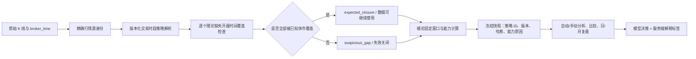

# 公网信号连续观望与行情时段连续性详细修复方案

## 1. 文档状态

- 文档类型：正式实施方案
- 当前状态：已完成两轮独立复审，可进入实施
- 方案日期：2026-08-13
- 本地基线：`main` / `733605f699a8d312852a80711193d52c1140ea5c`
- 公网运行目录：`/www1/wwwroot/aurum-ai`
- 公网核对提交：`733605f699a8d312852a80711193d52c1140ea5c`
- 本方案只定义后续修复，不授权立即修改公网配置、回放信号、重跑模型、修改历史信号或执行交易。

## 2. 问题与已确认事实

### 2.1 用户可见问题

管理员账号最近连续出现“观望 / 方向不明确”，容易被理解为：

1. 前端把正常方向显示错了；
2. 模型请求失败后由系统统一降级为观望；
3. 缠论始终无法识别任何方向；
4. 策略门槛过高，系统永远不会产生可执行信号。

### 2.2 公网只读核对结果

截至 2026-08-13 约 15:36（北京时间）的只读证据为：

- 管理员账号最近 381 条交付信号连续为 `hold`；
- 最近一次非观望为信号 `#23210`，时间 `2026-08-11 09:24:47`，类型 `buy_limit`；
- 最近 300 条信号关联的模型任务全部为 `succeeded`，`finish_reason=stop`；
- 最近 300 条 `decision_json` 均没有 `normalization_info`，不是结构校验失败或服务器强制降级造成的观望；
- 最近信号的模型正文明确引用 H1/H4 方向不清晰、M15 确认不足、M5 无触发等原因。

因此，当前问题不是单纯的前端显示错误，也不是模型调用失败。模型确实在当前证据下返回了观望。

### 2.3 行情连续性误判

公网最近固定窗口的只读复算结果：

| 周期 | 固定窗口 | 当前结果 | 主要原因 |
| --- | ---: | --- | --- |
| M5 | 800 | `suspicious_gap` | 3 个跨日维护缺口被判异常 |
| M15 | 1000 | `suspicious_gap` | 11 个跨日维护缺口被判异常 |
| H1 | 1200 | `suspicious_gap` | 53 个跨日维护缺口被判异常 |
| H4 | 800 | `suspicious_gap` | 1 个跨复活节及周末的长缺口未被完整识别 |

M5/M15/H1 最近一处缺口都对应终端服务器每天约 `00:00-01:00` 的维护停盘：

- M5：`23:55 -> 01:00`，理论缺少 12 根；
- M15：`23:45 -> 01:00`，理论缺少 4 根；
- H1：`23:00 -> 01:00`，理论缺少 1 根。

当前严格连续性实现只显式认可周末和少量固定节假日。遇到可能的每日维护窗口时，代码主动返回 `daily_session_policy_missing`，因此：

```text
正常维护停盘
  -> suspicious_gap
  -> cache_internal_gap_unresolved=true
  -> data_complete=false
  -> segment_direction_usable=false
  -> 中枢、进入段、背驰能力继续关闭
  -> 模型更倾向观望
```

### 2.4 不应误修的缠论与策略现状

每日维护误判不是全部原因。在维护缺口进入固定窗口之前，部分信号仍然满足以下状态：

- M15/H1/H4 有可用线段方向，但没有跨窗口确认的线段级中枢；
- H1 常偏空、H4 常偏多，周期职责之间存在真实方向冲突；
- `structure_anchor_bootstrap_pending` 与 `no_confirmed_center` 长期出现；
- M5 偶尔具有有效中枢、进入段和背驰能力，但高周期条件仍不满足策略要求。

这些状态可能是合法的市场和策略结果，也可能包含稳定 ID、跨窗口共识或锚点推进问题。没有完成可重复的冻结快照回放前，不得直接降低以下安全门槛：

- 固定目标窗口及相邻验证窗口；
- 跨窗口严格多数；
- 三个不同已收盘 K 线快照的时序确认；
- 中枢、进入段和背驰的能力分离；
- 策略定义的周期职责及入场条件。

## 3. 修复目标与非目标

### 3.1 修复目标

1. 正确区分正常维护、周末、节假日、复合休市和真实缺 K；
2. 实时自动分析、手动分析、模型比较、日复盘、月复盘共用同一套连续性判定；
3. 对没有明确时段策略、时钟不可信或仅部分被休市覆盖的缺口继续失败关闭；
4. 冻结每次推理实际使用的时段策略 ID、版本和哈希，保证重试与历史回放不漂移；
5. 建立可重复的缠论冻结快照诊断，证明高周期无中枢/锚点待确认究竟是否正确；
6. 将“数据不可用”“结构未确认”“周期方向冲突”“风险或策略条件未满足”在界面上分开解释；
7. 修复后保持历史信号、历史快照、原始 K 线和既有锚点不可变。

### 3.2 明确非目标

- 不以增加买卖信号数量为验收目标；
- 不自动放宽策略正文或缠论确认规则；
- 不把所有跨日缺口统一忽略；
- 不根据历史频繁缺口自动学习后直接授予“正常休市”权威；
- 不回写或重新解释已有 `ai_signals`、`inference_snapshots`；
- 不自动删除、重建或批量修正 `chan_structure_anchors`；
- 不把 Bridge 自动更新维护窗口配置复用为市场交易时段配置；两者语义不同。

## 4. 总体设计



核心原则是：**只有显式、版本化、与当前行情源精确匹配的策略，才能把缺口认定为正常休市。**

## 5. 阶段 A：冻结生产证据与建立只读诊断基线

### 5.1 新增只读连续性审计脚本

建议新增：

- `scripts/audit-market-session-continuity.mjs`

输入：

- `source_id` 或已授权的平台行情源身份；
- 标准品种；
- 周期；
- 开始/结束时间或最近 N 根；
- 候选时段策略文件。

输出仅包含：

- K 线数量、首尾时间；
- 重复开盘时间；
- 每个缺口的 UTC、终端服务器时间、缺失根数；
- 旧版分类、新版候选分类；
- 每个理论缺失开盘时间对应的休市规则；
- 未覆盖的最小时间范围；
- 策略 ID、版本、哈希。

脚本必须只读，不调用模型、不创建任务、不触发 Bridge 交易命令、不写 Redis/MySQL。

### 5.2 冻结当前对照样本

实施时记录但不提交客户正文或账号信息：

- 一组正常每日维护缺口；
- 一组普通交易时段真实缺 K；
- 一组周末缺口；
- 一组节假日与周末相连的复合缺口；
- 最近一个有明确 M5 中枢但 H1/H4 无中枢的冻结推理快照；
- 最近一个所有周期因连续性降级的冻结推理快照。

仓库测试只能使用脱敏的合成 K 线，不直接提交公网价格、账号、信号正文或模型输出。

### 5.3 阶段验收

- 同一份 K 线在重复运行中产生完全相同的缺口清单；
- 审计脚本不产生任何数据库写入；
- 当前 M5/M15/H1 维护缺口可被明确定位为 `daily_session_policy_missing`；
- 当前 H4 长缺口可显示哪些理论开盘时间属于每日维护、节假日、周末，哪些仍未覆盖。

## 6. 阶段 B：版本化交易时段策略引擎

### 6.1 新模块与职责

建议新增：

- `server/routes/ai/market-session-policy.js`

并重构：

- `server/routes/ai/market-session-calendar.js`

职责拆分：

| 模块 | 职责 |
| --- | --- |
| `market-session-policy.js` | 读取、校验、规范化、精确匹配策略并计算哈希 |
| `market-session-calendar.js` | 根据冻结策略逐个判断缺失开盘时间是否属于已知休市 |
| `platform-market-data.js` | 解析当前行情源身份并调用统一分类器 |
| `period-market-evidence.js` | 用同一策略和同一分类器检查复盘区间 |

### 6.2 配置方式

首版使用独立环境配置，不新增数据库表：

```text
AI_MARKET_SESSION_POLICY_MODE=off|audit|enforce
AI_MARKET_SESSION_POLICIES_JSON=[...]
```

原因：

- 时段策略属于部署环境和经纪商配置，不应把公网特定 `source_id` 或账号写进迁移；
- 配置在进程启动时一次性校验并冻结，避免请求过程中配置漂移；
- `audit` 可在不改变交易证据的前提下比较 v2/v3；
- `enforce` 才让 v3 结果参与能力门禁；
- 将来如果需要后台管理，再单独设计带权限、版本和审计日志的配置表，不能在本次核心修复中临时拼接。

通用配置结构建议：

```json
{
  "policy_id": "broker-metals-session",
  "version": 1,
  "platform": "mt5",
  "broker_server": "必须精确匹配的服务器名",
  "symbols": ["XAUUSD"],
  "clock_basis": "broker_time",
  "daily_closures": [
    { "weekdays": [1, 2, 3, 4, 5], "from": "00:00", "to": "01:00", "reason": "daily_maintenance" }
  ],
  "weekly_closures": [],
  "holiday_closures": [],
  "dst_transitions": []
}
```

示例只描述结构，实施前必须依据当前经纪商官方交易时间和公网只读 K 线交叉确认具体值。

### 6.3 匹配与安全规则

1. 首版只允许 `platform + broker_server + standard_symbol` 精确匹配；
2. 不允许正则、模糊服务器名或全局通配符；
3. 多条策略同时匹配时启动失败，不允许静默选择；
4. `audit/enforce` 模式下 JSON、日期、时间、星期或区间非法时启动失败；
5. 不支持的品种、未知服务器、未知平台或不可信时钟继续失败关闭；
6. 规范化配置计算 SHA-256，形成 `policy_id + version + policy_hash`；
7. 环境配置变更必须重启进程，进程运行期间策略对象不可变。

### 6.4 历史时间语义

不能用“当前 UTC 偏移”解释数月前的 H1/H4 数据。新版优先使用每根 K 线已经保存的：

- `open_time_utc_msc`；
- `broker_time`。

对缺口两端分别推导历史终端偏移：

```text
historical_offset = broker_time_as_local_epoch - open_time_utc_msc
```

规则：

- 两端偏移一致时，使用该历史偏移枚举缺失开盘时间；
- 两端偏移发生变化时，只有策略内存在对应 DST 转换规则才允许继续；
- 偏移非法、变化不明或 `broker_time` 与 UTC 不一致时返回 `unknown_session`；
- 当前终端偏移只作为近期数据缺少可解析 `broker_time` 时的受限兜底，不能覆盖历史证据。

### 6.5 复合休市覆盖

旧分类器用单一 `classification` 描述整个缺口，无法正确表达：

```text
每日维护 -> 节假日 -> 周末
```

新版必须逐个枚举理论缺失开盘时间：

1. 每个开盘时间都至少命中一个显式休市规则，整个缺口才是 `expected_closure`；
2. 同一缺口命中多种规则时返回 `composite_closure`；
3. 返回去重后的 `components`，例如 `daily_maintenance/holiday/weekend`；
4. 只要有一个理论开盘时间未覆盖，整个缺口仍为 `suspicious_gap`；
5. 同时返回最小 `uncovered_ranges`，便于排查而不是只给笼统错误；
6. 重复开盘时间始终是异常，不能被休市策略覆盖。

### 6.6 兼容字段

保留现有消费者依赖的：

- `status: ok|suspicious_gap`；
- `continuity_status`；
- `continuity_reason`；
- `expected_closures`；
- `suspicious_gaps`。

新增：

- `continuity_engine_version`；
- `continuity_policy_id`；
- `continuity_policy_version`；
- `continuity_policy_hash`；
- `continuity_policy_match`；
- `closure_components`；
- `uncovered_ranges`。

真实缺 K 且策略本身可用时，应给出稳定原因 `market_open_bars_missing`，避免当前 H4 出现“有异常但 `continuity_reason=null`”的不可解释状态。

### 6.7 阶段验收

- 公网候选策略在审计模式下把 M5/M15/H1 已确认维护缺口全部识别为正常维护；
- H4 跨每日维护、节假日和周末的缺口只有在每个缺失开盘时间均被覆盖时才通过；
- 人工在维护窗口外删除一根合成 K 线，必须保持 `suspicious_gap`；
- 未配置、配置歧义、时钟未知、DST 不明时必须失败关闭；
- 不修改任何原始 K 线。

## 7. 阶段 C：统一所有分析与复盘调用链

### 7.1 实时和平台行情

修改 `server/routes/ai/platform-market-data.js`：

1. 用当前 `sourceIdentity()` 的平台、服务器、标准品种解析唯一策略；
2. 缓存窗口、补洞后的新窗口、精确复盘范围、用户 fallback 全部传入同一冻结策略；
3. 只有真实异常缺口才触发内部补洞；正常休市不重复请求 Bridge；
4. `market_meta` 写入策略身份、版本、哈希和覆盖详情；
5. `cache_internal_gap_unresolved` 只表示真实未覆盖缺口或无法确认的策略，不再表示已确认维护休市。

### 7.2 日复盘与月复盘

修改 `server/routes/ai/period-market-evidence.js`：

1. `readStored()` 同时读取 `broker_time`；
2. 选择行情源时保留平台和精确 `source_key`，禁止只按相同 `broker_server` 合并不同平台或账号的时段证据；
3. `assessReviewCandleCoverage()` 改为复用新版逐开盘时间覆盖检查；
4. 区间端点、内部缺口与实时窗口共享同一策略；
5. 复盘冻结证据中记录策略身份与分类结果；
6. 连续性未知时允许普通交易复盘继续，但 Chan 诊断和 Chan 记忆继续受现有证据门禁限制。

### 7.3 自动、手动和比较任务

修改/核对：

- `server/routes/ai/strategy.js`
- `server/routes/ai/inference-snapshots.js`
- 手动分析任务与模型比较的冻结快照调用处

要求：

- 新任务首次构建快照时冻结 `policy_id/version/hash`；
- 同一任务重试、恢复和历史比较必须复用冻结后的连续性结果；
- 策略配置或时段策略在任务执行中变化时，不重算已经冻结的输入；
- 新任务使用新策略版本，并自然产生不同的 snapshot/input hash；
- 历史信号页面继续展示原决策，不用新策略重解释旧信号。

### 7.4 缓存与并发

- Redis 仍只缓存原始已收盘 K 线，不缓存“已判定正常”的永久结论；
- 连续性分类按当前任务冻结策略计算；
- 策略配置在进程内不可变，因此同一进程并发请求结果一致；
- `audit` 模式可以同时计算 v2/v3，但只能记录差异，不能改变能力门禁；
- `enforce` 模式只使用 v3，禁止出现一条路径用 v2、另一条路径用 v3。

## 8. 阶段 D：缠论高周期不收敛专项诊断

### 8.1 先诊断，后决定是否改算法

建议新增：

- `scripts/diagnose-chan-frozen-snapshot.mjs`

脚本对一个冻结任务或脱敏快照输出每个周期：

- 请求/收到/已收盘 K 线数；
- 连续性策略及缺口分类；
- 目标窗口与三个验证窗口；
- 每个窗口的线段数、线段方向、线段稳定 ID；
- 每个窗口的线段级中枢核心 ID 和进入段 ID；
- 跨窗口支持数、验证窗口数和严格多数结果；
- 最近三根已收盘 K 线快照的时序锚点身份；
- 持久化锚点的匹配、错配或回退原因；
- 最终 `evidence_capabilities` 与 reason codes。

脚本默认只读，并使用统一的 `parseSnapshotJson()` 读取普通 JSON 或 `gzip-base64:` 快照。

### 8.2 判定矩阵

| 复算证据 | 结论 | 处理 |
| --- | --- | --- |
| 三个验证窗口确实没有相同中枢核心 | 市场结构未确认 | 不改算法，只改善解释 |
| 中枢核心相同，但稳定 ID 因窗口起点变化而漂移 | 稳定身份缺陷 | 修复稳定 ID，并增加窗口平移回归 |
| 三个窗口支持严格多数，但结果仍 `no_confirmed_center` | 共识选择缺陷 | 修复 `selectConsensusCenters()` |
| 连续三根已收盘快照身份相同，锚点仍不推进 | 时序锚点缺陷 | 修复 bootstrap/persist 条件或身份传递 |
| H1 与 H4 方向可靠但相反 | 合法周期冲突 | 不改算法，由策略决定观望 |
| 修复连续性后仍无中枢 | 合法结构状态或独立算法问题 | 按上述矩阵继续，不降低门槛 |

### 8.3 受保护行为

无论诊断结果如何，都不得：

- 把笔级中枢替代线段级中枢；
- 将候选线段或形成中背驰升级为已确认；
- 把 `structure_anchor_bootstrap_pending` 描述成“市场没有结构”；
- 因为连续观望就降低跨窗口多数或三根已收盘确认；
- 自动覆盖或清空既有可信锚点；
- 用当前 K 线回写历史信号。

### 8.4 阶段验收

- 同一冻结快照重复诊断输出相同哈希和结构摘要；
- 能明确指出每个周期是数据缺失、线段不稳定、无中枢、锚点待确认还是周期冲突；
- 若发现算法缺陷，必须用最小合成 fixture 稳定复现后再修改；
- 若没有算法缺陷，阶段 D 可以以“不修改缠论算法”结束。

## 9. 阶段 E：观望原因可解释化

### 9.1 服务端确定性诊断

不要求模型新增容易漂移的自由文本枚举。由服务端根据冻结输入、模型结果和约束处理生成：

```json
{
  "decision_diagnostics_version": 1,
  "decision_origin": "model|schema_normalized|constraint_engine",
  "contributing_reasons": [
    "market_data_unreliable",
    "structure_unconfirmed",
    "timeframe_direction_conflict",
    "strategy_entry_conditions_unmet",
    "risk_constraint"
  ],
  "affected_timeframes": ["H1", "H4"]
}
```

规则：

- 该字段只解释，不改变 `signal_type`；
- 可以同时有多个原因，不伪造唯一主因；
- 原因必须来自冻结证据或明确的服务端归一化/约束结果；
- 不把模型自由文本关键词当作权威判断；
- 新信号写入 `decision_json`，不新增数据库列；
- 旧信号没有该字段时保持兼容。

### 9.2 前端展示

在 AI 分析师信号卡和详情中使用中文状态标签：

- 行情连续性无法确认；
- 缠论结构尚未确认；
- 高周期方向存在冲突；
- 入场条件尚未满足；
- 风控或策略约束阻止执行；
- 模型主动观望。

界面保留模型原分析，但不能再把所有情况都压缩成“方向不明确”。技术代码放在折叠详情中，不直接暴露给普通用户。

## 10. 测试方案

### 10.1 单元测试

重点扩展：

- `tests/ai/platform-market-data.test.js`
- 新增 `tests/ai/market-session-policy.test.js`
- `tests/ai/period-review.test.js` 或对应 period market evidence 测试
- `tests/ai/chan.test.js`
- `tests/ai/inference-snapshots.test.js`
- `tests/ai/strategy.test.js`
- `tests/ai/signal-presentation.test.js`
- `tests/ai/frontend-governance.test.js`

必须覆盖：

1. M5/M15/H1 每日维护缺口精确通过；
2. 维护窗口外只缺一根仍失败；
3. 每日维护 + 节假日 + 周末的复合覆盖；
4. 复合缺口只有部分覆盖时失败；
5. H4 长缺口不会因“跨周末”就整体通过；
6. 未知服务器、品种、时钟或策略版本失败关闭；
7. 历史偏移一致、合法 DST 转换和未知偏移变化；
8. 重复开盘时间始终异常；
9. 实时与复盘对同一 K 线给出完全一致的分类；
10. 正常休市不触发 Bridge 补洞，真实缺口仍触发并在失败后保持 unresolved；
11. 策略 ID/版本/哈希进入冻结快照和 input hash；
12. 任务重试复用冻结结果，不读取新策略；
13. 修复连续性后不会自动把无中枢升级为可入场；
14. 观望解释标签与模型、schema 归一化、约束引擎来源一致；
15. 前端兼容旧信号且不显示英文内部代码。

### 10.2 必要验证命令

实施后至少执行：

```powershell
node --check server/routes/ai/market-session-policy.js
node --check server/routes/ai/market-session-calendar.js
node --check server/routes/ai/platform-market-data.js
node --check server/routes/ai/period-market-evidence.js
node --check server/routes/ai/inference-snapshots.js
node --check server/routes/ai/strategy.js

npx vitest run tests/ai/market-session-policy.test.js tests/ai/platform-market-data.test.js
npx vitest run tests/ai/chan.test.js tests/ai/inference-snapshots.test.js tests/ai/strategy.test.js
npx vitest run tests/ai/period-review.test.js tests/ai/signal-presentation.test.js tests/ai/frontend-governance.test.js
npm test
git diff --check
```

### 10.3 真实环境验证

Mocks 不能证明公网时段正确。部署前后必须用公网只读 K 线完成：

- 最近至少 30 天 M5/M15；
- 最近至少 90 天 H1；
- 当前固定窗口完整范围的 H4；
- 至少一次真实每日维护边界；
- 至少一个节假日/周末复合缺口；
- 至少一个明确发生在开市时段的真实缺 K 或合成测试。

## 11. 发布、观察与回滚

### 11.1 发布顺序

1. 本地实现与全量测试；
2. 部署代码但设置 `AI_MARKET_SESSION_POLICY_MODE=audit`；
3. 启动时校验配置，观察 v2/v3 差异，不改变交易能力；
4. 用只读审计脚本核对公网固定窗口；
5. 确认没有隐藏开市时段真实缺 K 后，改为 `enforce` 并重启；
6. 核对 `/health`、启动日志、运行提交与静态资源版本；
7. 等待新信号自然生成，不补跑错过周期；
8. 跨过一次真实每日维护窗口后再次复核。

### 11.2 分阶段观察

- 立即：新快照不再把已确认每日维护标成 unresolved；
- M5 三根已收盘后：观察 M5 锚点时序条件；
- M15 三根已收盘后：观察 M15；
- H1 三根已收盘后：观察 H1；
- H4 三根已收盘后：观察 H4；
- 24 小时后：确认跨日维护分类稳定；
- 7 天后：统计真实异常缺口、正常休市、结构未确认和周期冲突的分布。

以上等待时间只用于观察锚点条件，不承诺相应周期一定形成中枢或交易信号。

### 11.3 成功标准

成功不以“买卖信号变多”为准，而以以下条件同时成立为准：

1. 已确认每日维护和节假日不再降级数据能力；
2. 开市时段真实缺 K 继续失败关闭；
3. 实时、手动、比较和复盘分类一致；
4. 每个新快照能证明使用了哪一个时段策略版本；
5. 观望可以区分数据、结构、周期冲突、策略和风险原因；
6. 缠论安全门槛没有被无证据放宽；
7. 历史信号和原始行情未被改写。

### 11.4 回滚

如出现以下任一情况立即回滚到 `audit` 或 `off`：

- 开市时段真实缺 K 被识别为正常休市；
- 同一 K 线在实时与复盘中分类不同；
- 配置匹配到错误行情源；
- 策略变更导致运行中任务重算输入；
- 新版出现异常交易放行或能力越权。

回滚操作只需要恢复模式并重启，不需要数据库回滚。原始 K 线、历史信号和锚点均保持原样。

## 12. 实施批次与提交边界

建议拆为四个单一职责批次：

1. `feat(ai): add versioned market session policy engine`
   - 策略解析、历史时间、复合休市、审计脚本和单元测试；
2. `fix(ai): unify continuity evidence across inference and reviews`
   - 平台行情、fallback、冻结快照、日/月复盘统一接线；
3. `fix(ai): correct Chan consensus or anchor evidence`（仅诊断证明存在缺陷时创建）
   - 不允许和时段策略修复混在同一个提交；
4. `feat(ai): explain hold signal evidence states`
   - 服务端诊断和前端中文展示。

每个批次都必须独立通过定向测试；部署只使用已经完整通过全量测试的最终提交。

## 13. 第一轮方案复审：需求、边界与最小改动

### 13.1 核对内容

- 是否真正解释了“最近全部方向不明确”；
- 是否把前端、模型失败、数据连续性和策略结构分开；
- 是否复用现有 `market_meta`、冻结快照、固定窗口和能力门禁；
- 是否存在为了增加信号而降低安全要求；
- 是否把配置、核心算法和观测混成一次大改。

### 13.2 第一轮发现

1. 只增加固定 `00:00-01:00` 例外会过度针对当前现象，不能支持不同经纪商、DST 和节假日；
2. 同时调整时段分类和缠论门槛，会使信号变化无法归因；
3. 自动从历史缺口学习并直接生效，可能把长期数据采集故障误学为休市；
4. 仅修实时 `inspectRateContinuity()` 会让日/月复盘继续使用不同语义；
5. 用信号数量作为成功标准会诱导不安全的规则放宽。

### 13.3 第一轮调整

- 改为精确行情源匹配的版本化策略；
- 缠论算法进入独立诊断阶段，未经证明不修改；
- 自动学习仅允许形成候选审计报告，不能成为权威；
- 实时、fallback、比较和复盘强制复用统一分类器；
- 成功标准改为数据分类正确、真实缺口仍阻断和原因可解释。

### 13.4 第一轮结论

调整后覆盖了当前公网误判，也保留了自动交易失败关闭边界。方案没有通过降低策略要求来制造交易信号，符合最小安全改动原则。

## 14. 第二轮方案复审：兼容、时间、并发、恢复与连带风险

### 14.1 核对内容

- 历史 DST 与当前时区偏移是否混用；
- 每日维护、节假日和周末连接时能否组成完整休市；
- 旧任务重试时策略版本是否漂移；
- 是否需要数据库迁移或历史回填；
- Redis 缓存、Bridge 补洞和复盘来源是否会产生双重语义；
- 错误配置、进程重启和回滚是否安全；
- 是否引入跨账号、跨平台或跨行情源污染。

### 14.2 第二轮发现与修订

1. **发现：**只使用当前 `timezone_offset_minutes` 会错误解释 H1/H4 历史窗口。

   **修订：**优先从每根 K 线的 `broker_time + open_time_utc_msc` 推导历史偏移；DST 变化必须由显式规则覆盖。

2. **发现：**单个 `classification` 无法覆盖“每日维护 + 节假日 + 周末”的 H4 长缺口。

   **修订：**逐个理论缺失开盘时间验证，全部覆盖才通过，并返回复合组件和未覆盖区间。

3. **发现：**如果模型任务恢复时读取最新环境配置，同一个 task 会改变输入。

   **修订：**首次构建快照冻结策略 ID、版本、哈希和分类结果；重试只使用冻结快照。

4. **发现：**把公网行情源 ID 或服务器配置写进 migration 会制造环境耦合。

   **修订：**核心修复不新增表、不写环境特定数据；使用严格校验的部署配置和 `audit/enforce` 模式。

5. **发现：**复盘当前会按相同 `broker_server` 合并来源，存在跨平台/账号证据混合风险。

   **修订：**连续性策略与来源选择必须保留 `platform/source_key` 精确身份；不能只凭服务器名合并。

6. **发现：**原始 Redis 缓存不含策略版本，若缓存的是分类结果会产生旧结论。

   **修订：**Redis 继续只保存原始 K 线；分类在任务冻结时根据当前不可变策略计算。

7. **发现：**部署后立即看到 H4 仍为锚点待确认，可能被误判为修复失败。

   **修订：**观察窗口按不同周期的三根已收盘 K 线拆分，并明确“没有中枢时不会产生锚点”。

### 14.3 剩余风险

- 经纪商交易时间和节假日安排会变化，策略版本需要持续维护；
- H4 固定窗口覆盖较长历史，必须为窗口内全部特殊休市提供明确规则，否则仍会安全失败；
- 公网实盘只能在真实维护边界后证明端到端行为，单元测试和历史复算不能完全替代；
- 修复连续性后，信号仍可能因合法的 H1/H4 冲突或无确认中枢继续观望；
- 如果后续需要在后台编辑策略，必须另行增加权限、审计、版本发布和并发控制，不能直接把环境 JSON 暴露为普通表单。

### 14.4 第二轮结论

第二轮发现的时间语义、复合休市、任务漂移和来源混合问题均已纳入方案。当前版本具备明确的实施边界、测试门禁、灰度方式和无数据回写回滚路径，可以进入实现阶段。
