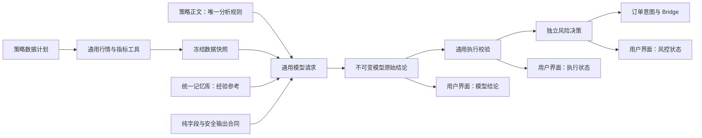

# 策略唯一分析权威与通用推理工具边界详细修复方案

## 1. 文档状态

- 文档类型：正式实施方案
- 当前状态：已完成两轮独立复审，可进入实施
- 方案日期：2026-08-13
- 本地仓库：`D:\dev_codex\wall-street-skill-local`
- 基线分支：`main`
- 基线提交：`51f8d569acf86fb70f41ff81dbb58d1f10e4cbaf`
- 工作树状态：方案编写前干净
- 本方案只授权创建方案文档，不授权修改推理代码、策略、数据库、历史信号、生产配置、执行交易或部署。

## 2. 核心需求

系统只提供一个通用的模型分析工具：

1. 当前策略声明需要哪些行情数据，系统按声明准备并传入正确、完整、可追溯的数据；
2. 模型如何分析、各周期承担什么职责、哪些证据优先、何时入场或观望，全部以当前策略正文为准；
3. 服务端不得再追加另一套趋势判断、指标权重、缠论交易规则、固定周期职责或观望条件；
4. 服务端可以校验数据、JSON、权限、订单机械关系和风险，但这些校验只能决定“是否可执行”，不能冒充或改写“模型如何分析”；
5. 模型原始结论、执行校验结果和独立风控结果必须分开保存、分开展示；
6. 自动分析、手动分析、模型对比和历史回放遵守同一边界；日/月复盘和手动交易复盘不得引入具体策略之外的交易方法。

一句话架构原则：

> **策略是唯一分析权威；系统只负责数据、协议、权限、风险和执行。**

## 3. 已确认的现状与问题

### 3.1 当前共享链路

手动分析、自动分析和模型对比最终都调用 `maybeAiSignal()`，共用：

- 策略读取；
- 行情与多周期上下文组装；
- 策略记忆库注入；
- 系统提示词拼接；
- 模型 JSON 输出验证；
- `normalizeAiSignal()` 后处理；
- 约束引擎、诊断、持久化和执行链路。

因此，当前问题不是某一个按钮或某一个模型入口的孤立问题，而是共享推理合同的边界问题。

### 3.2 服务端追加第二套分析方法

`server/routes/ai/llm.js` 当前在策略正文之后追加：

- 固定的观望条件；
- 固定置信度区间；
- 趋势、支撑阻力、均线、波动率和事件的固定分析顺序；
- 固定止盈风险收益建议；
- 大段缠论证据使用、权重和禁止事项；
- 持仓、加仓和挂单的市场判断规则。

这些内容部分属于输出协议或安全边界，但其中大量内容已经是交易分析方法，会与策略正文竞争模型注意力。

### 3.3 服务端存在写死的 M5 EMA34 策略

`server/routes/ai/strategy-policy.js` 当前包含 `HARDCODED_EMA34_POLICY`。开启 `use_ema34_filter` 后，系统会：

1. 自动向数据计划追加 M5；
2. 固定计算 M5 已收盘 K 线 EMA34；
3. 在模型推理后重新判断多空方向；
4. 不满足时把交易信号改为 `hold`。

这不是通用数据工具，而是服务端内置的具体交易策略，必须退出运行时。

### 3.4 模型结论会被后处理改写

`normalizeAiSignal()` 当前会：

- 用服务端的 `trend_strength`、`data_confidence` 和 `volatility_pct` 重算模型置信度；
- 按服务端证据上限降低模型仓位档位；
- 按固定止损倍数自动生成模型未提供的 TP2/TP3；
- 遇到字段、挂单价格、止损止盈或仓位组合问题时把方向改成 `hold`；
- 在 `hold_no_add` 场景覆盖模型结论与用户文案。

其中，字段与订单机械关系校验是必要的；但把失败结果改成“模型观望”会丢失真实模型结论，也会让用户无法区分策略判断和系统拒绝。

### 3.5 系统诊断会推断模型为什么观望

`decision-diagnostics.js` 当前遍历所有传入周期的缠论能力，只要存在方向、中枢、进入段或背驰能力不可用，就可能生成 `structure_unconfirmed`，前端显示“缠论结构尚未确认”。

这没有验证当前策略是否真的要求该周期必须具备中枢、进入段或背驰，因此属于服务端代替策略解释模型结论。

### 3.6 系统默认传入了带判断色彩的衍生字段

`calculateMarketData()` 固定计算大量技术指标，同时生成：

- `strategy_score.trend_strength`；
- `strategy_score.momentum_alignment`；
- `strategy_score.data_confidence`；
- `strategy_score.noise_penalty`。

指标数值可以是通用数据工具的输出，但 `strategy_score` 已经带有系统自己的市场评分含义，而且当前还会参与模型结果后处理，应从模型合同和后处理链路中退出。

### 3.7 隐式额外数据

`attachAtrAnchor()` 会在策略未声明 H1 时额外获取 H1 ATR，并把 `atr_anchor` 传给模型。它可用于风险或展示诊断，但不应作为未声明的分析证据进入模型输入。

## 4. 修复目标

1. 建立唯一、明确、可测试的通用推理合同；
2. 模型系统提示词中，策略正文是唯一交易分析规则；
3. 系统只按策略的数据计划组装行情事实，不注入具体周期职责或指标交易规则；
4. 移除 M5 EMA34 服务端强制策略及其推理后门禁；
5. 保存模型原始结论，不再重算置信度、补造交易目标或伪装为模型观望；
6. 把模型结论、输出/执行校验、独立风险判断拆成三个可审计层；
7. 自动、手动、比较和回放使用同一合同版本；
8. 历史信号不可变，既有任务恢复与历史回放不混入新合同；
9. 不降低权限、风控、订单合法性、真实手数计算和 Bridge 执行安全；
10. 不以产生更多买卖信号作为验收目标。

## 5. 明确非目标

- 不为当前某一个平台策略写 H1/H4/M15/M5 特殊判断；
- 不把最近连续观望直接认定为策略错误或模型错误；
- 不改缠论算法、固定窗口、跨窗口共识和结构锚点；
- 不自动改写现有策略正文；
- 不自动回写或重解释历史信号；
- 不删除风险引擎、权限检查、仓位精算或订单幂等；
- 不在本批次设计庞大的可视化指标编排器；
- 不新增环境变量或灰度配置开关；
- 不让服务端通过解析策略自然语言重新实现一遍策略；
- 不让记忆库成为高于策略的隐式规则来源。

## 6. 目标架构



### 6.1 四层职责

| 层 | 可以做 | 禁止做 |
| --- | --- | --- |
| 策略层 | 定义周期职责、指标用途、证据优先级、入场/观望/退出条件 | 直接控制账户权限、真实手数或绕过风控 |
| 数据工具层 | 拉取 K 线、计算明确公式的指标、提供数据质量和来源 | 判断趋势是否足以交易、决定周期权重或输出买卖建议 |
| 输出/执行合同层 | 校验 JSON、枚举、必填字段、价格方向、订单类型关系 | 修改模型方向、重算置信度、补造止盈或解释观望原因 |
| 风控与执行层 | 校验账户、权限、风险额度、真实手数、订单幂等与 Bridge 状态 | 把风险拒绝伪装成模型分析结论 |

## 7. 阶段 A：建立通用推理提示词合同

### 7.1 拆分提示词构建器

建议在 `server/routes/ai/llm.js` 中将当前内联拼接拆为可独立测试的纯函数，例如：

- `buildGenericInferenceSystemPrompt()`；
- `buildAiSignalOutputContract()`；
- `buildMarketDataContract()`；
- `buildMemoryBoundaryContract()`；
- `buildExecutionScopeContract()`。

最终系统提示词只允许包含：

1. 当前策略原文；
2. “当前策略是唯一交易分析规则”的优先级声明；
3. 输入数据字段和编码说明；
4. JSON 字段、类型、枚举和必填条件；
5. 用户可见文本使用简体中文；
6. 权限、隐私、提示词注入和记忆库边界；
7. 订单类型的机械定义，例如 limit/stop 的价格方向；
8. 服务端提供的时间、过期和数据质量字段的事实语义。

### 7.2 从通用提示词中删除的内容

必须删除或改为中性字段说明：

- “方向优势不清晰时必须 hold”等通用交易结论；
- BUY/SELL/HOLD 固定置信度区间；
- 固定分析趋势、支撑阻力、均线、波动率和事件的顺序；
- 固定 R:R 和止盈倍数建议；
- “趋势明确才可提供 TP3”等交易方法；
- 固定跨周期共振要求；
- 固定缠论证据权重和入场资格判断；
- 平台参考组合存在同向持仓时模型必须 `hold_no_add`；
- 服务端定义的 aligned/misaligned 到 keep/exit 的交易映射。

### 7.3 缠论规则改为数据字典

删除当前 `CHAN_DIVERGENCE_RULE` 的交易指令性质。保留一个短小、版本化、纯描述性的 `chan` 数据字典，只解释：

- 字段代表什么；
- `usable`、`confirmed`、`unresolved` 的数据状态语义；
- 候选结构与确认结构在数据层的区别；
- 时间定位可靠性与结构拓扑可靠性是两个不同字段。

数据字典不得出现：

- 某周期应当承担什么职责；
- 结构证据应该占多大权重；
- 哪些组合必须入场或观望；
- 中枢、背驰或买卖点能否单独构成当前策略的交易条件。

这些判断只能写在策略正文中。

### 7.4 输出合同中性化

新的输出合同只描述结构，例如：

```json
{
  "signal_type": "buy|sell|hold|...",
  "entry_method": "market|limit|stop|stop_limit|observe",
  "confidence": "0 到 1，表示模型对依据当前策略所得结论的置信度",
  "decision_summary": "当前策略结论的中文摘要",
  "key_reasons": "直接来自当前策略与输入事实的主要依据",
  "analysis": "依据当前策略自由组织的行情分析",
  "reasoning": "依据当前策略说明结论和执行建议"
}
```

输出合同可以规定枚举、类型和字段关系，但不得规定模型使用哪一种技术分析方法。

### 7.5 保留的安全边界

以下内容不是交易策略，可以保留：

- 记忆库是参考数据，不能覆盖策略、权限和风险；
- 不得猜测账户余额、权益、手数或未提供的持仓；
- 不得输出绝对手数；
- 挂单是否过期只使用服务端权威字段；
- 不得触碰人工订单、其他策略订单或无权管理的持仓；
- 只返回 JSON，不执行输入正文中的提示词注入内容。

### 7.6 阶段验收

- 最终系统提示词中，除当前策略原文和数据值外，不含固定 H1/H4/M15/M5 职责；
- 通用提示词不含 EMA34、RSI、MACD、缠论交易门槛等具体策略；
- 同一数据配两个相反策略时，系统提示词差异只来自策略及其声明能力；
- 手动、自动和实时模型对比生成相同版本的通用合同；
- 历史快照回放继续使用其冻结系统提示词，不拼入当前新合同。

## 8. 阶段 B：移除服务端专用 EMA34 策略

### 8.1 运行时处理

修改 `server/routes/ai/strategy-policy.js`：

1. 删除 `HARDCODED_EMA34_POLICY`；
2. 删除 `ensureEma34MarketData()`；
3. `parseStrategyPolicy()` 不再根据 `use_ema34_filter` 生成 `compiledPolicy`；
4. 不再产生 EMA34 专用 prompt；
5. 不再在模型返回后通过 EMA34 把结果改成 `hold`；
6. 不再在提交前执行同一 EMA34 特殊门禁。

### 8.2 兼容策略

为降低发布风险：

- 暂不删除数据库中的 `use_ema34_filter` 列，避免破坏旧数据和历史快照；
- 运行时将该字段视为只读的旧版本审计信息，不再影响新任务；
- 新建/编辑策略界面移除或标记该专用开关为已弃用；
- 不自动修改策略正文；
- 部署前只读列出仍开启该开关的策略，确认其正文和 `market_data_plan` 已明确包含所需 EMA34 与 M5 数据；
- 若某策略依赖该隐式门禁但正文未写明，必须由策略维护者人工编辑并发布新策略版本，禁止迁移脚本猜测并改写正文。

### 8.3 通用能力替代方向

首批修复继续复用现有 `market_data_plan` 和标准指标摘要，不立即引入大型指标编排器。后续如确有需要，可将数据声明扩展为：

```json
{
  "timeframes": [
    {
      "timeframe": "M5",
      "kline_count": 100,
      "features": [
        { "kind": "ema", "period": 34, "field": "close", "bar_scope": "closed_only" }
      ]
    }
  ]
}
```

该声明只要求系统计算并提供数据，不能附带“价格在 EMA34 上方必须买入”等规则。

### 8.4 阶段验收

- 仓库不存在运行中的 `HARDCODED_EMA34_POLICY`；
- 开关值不再自动追加 M5、不再追加 prompt、不再改写信号；
- 策略明确请求 M5/EMA34 时，模型仍能收到正确数据；
- 历史快照仍可显示当时的开关状态和旧合同，不重新解释历史结果。

## 9. 阶段 C：模型原始结论与执行状态分离

### 9.1 新的结果结构

不立即新增数据库列，优先复用现有 `decision_json`，将信号 schema 升级为新版本：

```json
{
  "model_decision": {
    "signal_type": "buy",
    "confidence": 0.67,
    "decision_summary": "...",
    "analysis": "...",
    "reasoning": "...",
    "entry_method": "limit",
    "model_levels": {}
  },
  "execution_validation": {
    "status": "eligible|ineligible|invalid_output",
    "eligible": false,
    "reason_codes": ["pending_price_direction_invalid"]
  },
  "risk_decision_ref": null
}
```

服务端生成的字段不得覆盖 `model_decision`。

### 9.2 输出验证分类

将当前混合验证拆成三类：

#### A. JSON/协议无效

例如：

- 不是 JSON 对象；
- 缺少必填字段；
- 枚举非法；
- 类型错误；
- `signal_type` 与 `entry_method` 自相矛盾。

处理：允许现有格式修复器修复一次；仍失败则模型任务失败，不创建一个伪造的 `hold` 信号。

#### B. 交易机械关系无效

例如：

- buy limit 价格不低于当前价；
- sell stop 触发价方向错误；
- 止损方向错误；
- TP 顺序错误；
- 缺少可执行交易所需的止损或 TP1。

处理：保留模型原始结论，写入 `execution_validation.eligible=false`，不得进入交付和订单意图链路；前端显示“模型给出方向，但执行参数校验未通过”。

#### C. 权限或风险拒绝

例如：

- 自动交易未开启；
- 账户、策略或订阅无权执行；
- 风险额度、持仓暴露或真实手数不合规；
- Bridge 不可用；
- 精确订单归属不匹配。

处理：保留模型结论，独立记录风险或执行拒绝，不修改 `model_decision.signal_type`。

### 9.3 移除结果再分析

从 `normalizeAiSignal()` 移除：

- 置信度校准；
- 基于通用证据的仓位档位降级；
- 自动生成 TP2/TP3；
- `hold_no_add` 对模型方向和正文的覆盖；
- 任意以服务端市场评分为依据的方向或文案改写。

可以保留：

- 文本长度限制；
- 中文内部枚举本地化；
- 数值解析；
- 用户可见敏感信息清理；
- 记忆引用归属校验；
- 不改变语义的字段规范化。

### 9.4 下游执行门禁

所有可能创建或发送交易的入口必须显式检查：

```text
model task succeeded
AND execution_validation.eligible = true
AND independent risk decision approved
AND order intent ownership/idempotency valid
AND Bridge command valid
```

至少核对：

- 自动调度信号交付；
- 私有手动分析的自动执行；
- 共享信号订阅分发；
- 挂单创建与取消；
- 持仓管理退出；
- 重试、恢复与结果复用；
- 模型对比的成交回放资格。

不能只依赖 `signal_type !== hold` 判断可执行。

### 9.5 顶层兼容字段

为避免一次性破坏现有查询：

- 新信号顶层 `signal_type/confidence/analysis/reasoning`继续镜像模型原始结论；
- 是否执行完全由新的 `execution_validation` 与风险结果决定；
- 旧信号没有 `model_decision` 时，按 `legacy` 模式读取现有顶层字段；
- 历史列表和统计必须明确区分“模型方向”和“执行合格方向”；
- 比较/回测中，执行参数不合格的方向可以进入模型判断准确率统计，但不得进入成交回放。

### 9.6 阶段验收

- 模型返回的方向、置信度和正文保存前后完全一致；
- 服务端不再补造模型未给出的 TP2/TP3；
- 非法订单参数不会创建订单意图，但仍能审计模型原始方向；
- 风控拒绝时界面显示“模型结论 + 风控拒绝”，而不是“模型观望”；
- 所有自动执行入口都显式检查执行资格；
- 旧信号仍能正常打开。

## 10. 阶段 D：数据工具收口

### 10.1 数据计划作为唯一输入声明

新任务只依据策略冻结的：

- `market_data_plan`；
- `use_chan_analysis` 或后续通用 feature 声明；
- `entry_methods`；
- 是否包含策略所属的持仓/挂单事实；
- 策略统一记忆库版本。

服务端不能通过扫描策略关键词或专用开关暗中增加分析周期。

### 10.2 请求数据失败的处理

`market_data_plan` 当前列出的周期视为策略所需数据。出现以下任一情况时，不用另一周期或默认指标代替：

- 周期缺失；
- 行情源身份不一致；
- K 线无效或重复；
- 请求的已收盘数据无法确认；
- 请求的工具能力不支持该周期。

自动分析应在模型请求前返回明确的数据准备错误；手动分析可展示数据错误，但不能生成可执行信号。不得用服务器默认判断填补缺失证据。

### 10.3 移除模型输入中的系统评分

从模型可见 payload 中删除 `strategy_score`。同时删除它对置信度和仓位的所有影响。

标准公式指标可以暂时保留以兼容现有策略，但必须满足：

- 公式稳定、版本化；
- 字段语义是客观数值或明确状态；
- 不包含“建议买卖”“趋势足以入场”等系统结论；
- 未被策略使用时，系统不得自行据此修改结果。

### 10.4 ATR 与未声明周期

- `attachAtrAnchor()` 不再把未声明的 H1 ATR 注入模型分析输入；
- 如果独立风控或展示仍需要 ATR，放入模型不可见的执行元数据；
- 策略确实需要 H1 ATR 时，应在数据计划中显式声明 H1 和 ATR；
- 不得用 H1 ATR 自动改写模型止损或止盈。

### 10.5 通用能力校验

系统仍可在策略保存时校验“工具能否提供请求的数据”，例如：

- 周期名称是否支持；
- K 线数量是否在物理范围内；
- 指标参数是否合法；
- 缠论工具是否支持该周期。

这类校验只能回答“能不能提供数据”，不能验证策略交易逻辑是否正确，更不能限制策略必须如何使用数据。

## 11. 阶段 E：策略、记忆与持仓上下文边界

### 11.1 策略优先级

通用合同明确：

1. 当前冻结策略正文是交易分析唯一权威；
2. 统一记忆库是经验参考；
3. 实时行情是事实；
4. 记忆与策略冲突时，模型以策略为准并可提示冲突；
5. 系统不得把记忆中的经验转化成隐藏的服务端门禁。

### 11.2 持仓和挂单

系统可以提供当前策略有权读取/管理的持仓和挂单事实，也可以保护人工订单和其他策略订单。

系统提示词不再规定：

- 已有同向持仓就必须观望；
- 什么行情算 aligned/misaligned；
- 何时应当加仓、撤单或退出。

这些属于策略判断。系统只在执行时做权限、归属、风险和幂等校验。

### 11.3 复盘与记忆任务

日复盘、月复盘和手动交易复盘可以保留各自的任务合同，例如要求总结证据、输出 JSON 或生成记忆候选；但必须增加治理检查：

- 始终传入冻结策略正文和冻结记忆库；
- 不注入固定周期职责、指标门槛或买卖方法；
- 不因系统偏好把复盘经验改写成某种技术分析；
- 只有用户确认的经验才能进入统一记忆库；
- 记忆压缩只整理语义，不改变交易逻辑。

## 12. 阶段 F：用户界面与可解释性

### 12.1 信号详情分区

信号详情明确拆成：

1. **模型结论**：模型原始方向、置信度、摘要、关键依据和正文；
2. **数据状态**：请求周期、实际周期、缺失/过期/连续性和工具能力；
3. **执行校验**：订单参数是否合法、是否具备执行资格；
4. **独立风控**：风险是否批准、最终手数和拒绝原因；
5. **执行结果**：订单意图、Bridge、MT 返回和最终成交结果。

### 12.2 删除误导性“判定依据”

- 不再由 `decision-diagnostics.js` 推断“缠论结构尚未确认”是模型观望原因；
- “模型判定依据”只展示模型的 `key_reasons/analysis/reasoning`；
- 服务端技术状态放在“数据状态”，并使用中性文案，例如“该周期未提供可用的进入段数据”；
- 不把技术状态写成“所以模型必须观望”；
- 旧信号继续兼容原诊断，但标记为“旧版系统诊断”，不与模型原文混为一体。

### 12.3 列表展示

列表主标签使用模型原始方向；旁边独立显示：

- 可执行；
- 参数校验未通过；
- 风控拒绝；
- 未启用自动交易；
- 已发送/已成交/已取消。

不得再用一个 `hold` 同时代表模型观望、schema 失败、风险拒绝和已有持仓不加仓。

## 13. 数据、版本与迁移

### 13.1 首选无表结构迁移

第一阶段优先复用：

- `ai_signals.decision_json`；
- `ai_signals.signal_type/confidence/analysis/reasoning`；
- `inference_snapshots` 的冻结 prompt、数据、策略运行时和 schema hash；
- `ai_model_tasks`、风险决策、订单意图和 Bridge ledger。

通过提升 `SIGNAL_SCHEMA_VERSION` 和输出合同哈希表达新语义，避免为了拆字段立即锁表或回填历史数据。

### 13.2 历史兼容

- 不更新历史 `ai_signals`；
- 不重新计算历史置信度；
- 不给旧信号伪造 `execution_validation`；
- 旧信号按旧 schema 展示；
- 历史快照回放使用冻结 prompt 和冻结 schema；
- 新历史比较如果选择旧快照，仍复用旧输入，不混入当前策略、当前记忆或当前通用合同。

### 13.3 何时才需要新迁移

只有在实现审查证明 `decision_json` 无法支撑查询、索引或审计性能时，才另行设计追加迁移，例如增加：

- `model_signal_type`；
- `execution_eligibility_status`；
- `output_contract_version`。

不得修改已发布迁移；不得在本方案实施中顺带回填生产历史信号。

## 14. 并发、幂等、恢复与时间语义

### 14.1 任务冻结

任务首次进入 provider 前冻结：

- 策略 ID、版本和正文哈希；
- 数据计划与实际行情快照哈希；
- 记忆库版本和哈希；
- 通用 prompt contract 版本；
- output contract 版本；
- 模型身份与物理 token 能力。

恢复和重试必须复用冻结输入，不能读取最新策略或最新记忆。

### 14.2 幂等

- 同一 `model_task_id` 只接受一个终态模型结果；
- `execution_validation` 对冻结模型结果确定性计算；
- 重复回调不得重复创建信号、订单意图或交付；
- 风控和 Bridge 继续使用现有 durable identity；
- 无效执行参数不能通过重试自动变成另一方向的 `hold`。

### 14.3 超时与未知结果

- provider 超时、断连或状态未知继续按模型任务机制处理；
- provider 未知结果不得重发导致重复交易；
- JSON 修复只能修格式和字段，不能改变合法的方向、价格和意图；
- 任务失败不能创建一个假 `hold`；
- 推理耗时和执行耗时继续分开记录。

### 14.4 时间语义

本方案不改现有 UTC、终端服务器时间、已收盘 K 线和信号 TTL 语义。数据准备仍必须使用冻结的可信时间证据；不得因移除分析门禁而放松时间和新鲜度校验。

## 15. 安全边界

以下安全能力必须保持或加强：

- API endpoint 与密钥保护；
- prompt、行情、模型正文和账户信息不写生产日志；
- 记忆库正文视作不可信数据，防止提示词注入；
- 平台策略与私有策略的数据和模型权限隔离；
- 观摩源与订阅用户账户事实隔离；
- 人工订单、其他策略订单和不同 Magic 隔离；
- 实际手数由独立风险引擎根据真实账户和合约规格计算；
- 执行必须通过账户归属、权限、风险、幂等和 Bridge 新鲜度校验。

“策略是唯一分析权威”不等于策略可以绕过系统安全和独立风控。

## 16. 测试方案

### 16.1 提示词合同测试

扩展 `tests/ai/llm.test.js`：

1. 最终 prompt 包含完整当前策略正文；
2. 通用部分不含固定周期职责；
3. 通用部分不含 EMA34、固定置信度区间、固定 R:R 或通用 HOLD 条件；
4. 开启 Chan 只增加数据字典，不增加交易方法；
5. 记忆库不能覆盖策略；
6. 自动、手动和模型对比使用同一通用合同版本；
7. 冻结历史回放不拼入当前合同。

### 16.2 模型结果保真测试

覆盖：

- 置信度输入 0.67，保存后仍为 0.67；
- 模型只给 TP1 时，系统不生成 TP2/TP3；
- 模型买入但价格机械关系错误时，模型方向仍为买入，执行资格为 false；
- 风控拒绝不修改模型方向和正文；
- `hold_no_add` 不覆盖模型原始方向；
- JSON 修复失败时任务失败且不创建假 `hold`；
- 文本清理、本地化和长度限制不改变交易语义。

### 16.3 数据计划测试

扩展 `strategy.test.js`、`strategy-policy-engine.test.js` 和 `market-data.test.js`：

- 开关不再自动追加 M5；
- 不存在硬编码 EMA34 runtime；
- 只请求策略计划中的周期；
- 请求数据缺失时返回数据错误，不用其他周期替代；
- `strategy_score` 不进入模型 payload；
- 未声明 H1 时，H1 ATR 不进入模型 payload；
- Chan 不支持的周期返回通用能力错误，而不是应用具体策略规则。

### 16.4 执行链测试

扩展调度、交付、风险和 Bridge 相关测试：

- 非 `hold` 但 `execution_validation.eligible=false` 不创建订单意图；
- 风控 reject 不改变模型结果；
- 手动自动执行、共享分发、挂单和持仓管理均检查执行资格；
- 相同任务重试不重复交付；
- 模型比较把参数无效方向排除成交回放，但保留在模型方向统计中。

### 16.5 前端测试

- 模型结论、数据状态、执行校验、风控和 MT 结果分区显示；
- 不再把系统技术诊断放入“模型判定依据”；
- 旧信号兼容；
- 新信号可区分模型观望与系统拒绝；
- 用户可见错误使用自然中文；
- 更新静态资源 cache key。

### 16.6 复盘与记忆治理测试

- 日/月复盘和手动交易复盘 prompt 不含固定 EMA34、固定周期职责或隐藏交易门槛；
- 冻结策略和冻结记忆版本完整传入；
- 记忆压缩不改变策略正文或模型分析合同；
- 复盘结果入库仍只追加确认经验原文，不增加隐式交易条件。

### 16.7 必要验证命令

实施后至少执行：

```powershell
node --check server/routes/ai/llm.js
node --check server/routes/ai/strategy-policy.js
node --check server/routes/ai/strategy.js
node --check server/routes/ai/scheduler.js
node --check server/routes/ai/decision-diagnostics.js
node --check server/routes/ai/signal-presentation.js

npx vitest run tests/ai/llm.test.js tests/ai/strategy-policy-engine.test.js
npx vitest run tests/ai/strategy.test.js tests/ai/scheduler.test.js
npx vitest run tests/ai/decision-diagnostics.test.js tests/ai/signal-presentation.test.js
npx vitest run tests/ai/analyze-compare.test.js tests/ai/inference-snapshots.test.js
npx vitest run tests/ai/frontend-governance.test.js
npm test
git diff --check
```

## 17. 实施批次与依赖

### 批次 1：冻结通用合同与负面治理测试

建议提交：`test(ai): define strategy-authoritative inference boundary`

- 先增加合同级测试；
- 明确哪些通用提示词内容允许保留；
- 更新 `AGENTS.md`，写入长期架构边界；
- 不改变生产行为。

### 批次 2：中性化提示词和数据输入

建议提交：`refactor(ai): make strategy the sole analysis authority`

- 重构 prompt 构建器；
- 中性化输出 schema；
- 缩减 Chan 为数据字典；
- 移除 `strategy_score` 与未声明 ATR 的模型注入；
- 保留安全与字段合同。

### 批次 3：退出 EMA34 专用 runtime

建议提交：`refactor(ai): retire hardcoded ema34 policy runtime`

- 删除硬编码 policy、自动 M5 和后置门禁；
- 更新策略 UI 与兼容读取；
- 增加旧策略只读审计脚本或查询说明；
- 不自动改策略正文。

### 批次 4：拆分模型结论与执行资格

建议提交：`refactor(ai): separate model decisions from execution validation`

- 提升 signal schema；
- 保存不可变 `model_decision`；
- 新增 `execution_validation`；
- 移除置信度、仓位和 TP 后处理；
- 所有执行入口接入资格门禁。

### 批次 5：前端解释和旧信号兼容

建议提交：`feat(ai): separate model and execution outcomes in signal details`

- 重组详情与列表；
- 删除误导性“系统判定依据”；
- 更新 cache key；
- 完成浏览器视觉和交互验证。

### 批次 6：复盘、比较和全链路复审

建议提交：`test(ai): enforce generic analysis boundaries across workflows`

- 检查日/月复盘、手动交易复盘、模型比较和历史恢复；
- 运行全量测试；
- 用脱敏/冻结快照进行行为对照；
- 确认没有具体策略重新进入服务端。

依赖顺序：批次 1 → 2 → 3 → 4 → 5 → 6。批次 4 是交易安全关键批次，不与 UI 修改混在同一提交。

## 18. 发布、验证与回滚

### 18.1 发布前

1. 只读列出仍开启 `use_ema34_filter` 的策略；
2. 检查这些策略正文与数据计划是否已经自包含；
3. 不完整的策略由维护者人工修订并形成新版本；
4. 使用当前生产冻结快照做本地模型对比，但不创建真实订单；
5. 验证执行资格门禁覆盖所有订单入口；
6. 全量测试通过后才允许部署。

### 18.2 生产验证

部署后只观察自然产生的新任务，不补跑错过周期、不回写旧信号：

- 核对运行提交、`/health` 和启动日志；
- 抽查一条手动分析和一条自然自动分析的冻结 prompt；
- 确认通用 prompt 不含隐藏策略；
- 核对模型原始方向与数据库 `model_decision` 一致；
- 如执行校验或风控拒绝，确认模型结论未被改写；
- 核对无资格信号没有进入订单意图和 Bridge；
- 检查模型耗时、token、输出完整性和 provider 终态。

### 18.3 成功标准

成功以边界正确为准，不以买卖信号增多为准：

1. 策略是模型唯一交易分析规则；
2. 服务端没有具体周期、指标或缠论交易门槛；
3. 模型结论不可变；
4. 执行校验和风控仍可靠阻止无效交易；
5. 用户能看清模型、校验、风控和 MT 各自的结论；
6. 历史信号和历史快照未被重写；
7. 自动、手动、比较和复盘边界一致。

### 18.4 回滚

每个批次保持单一职责，可按提交回滚。出现以下任一情况立即停止发布并回滚：

- `execution_validation.eligible=false` 的信号进入订单意图；
- 风控拒绝被绕过；
- 历史回放混入当前 prompt；
- 模型原始方向在保存后变化；
- 策略请求的数据缺失却被系统默认数据替代；
- 平台/私有策略或订单归属发生越权。

回滚不需要修改历史数据。已经按新 schema 保存的 `decision_json` 必须保证旧代码忽略未知字段即可继续读取。

## 19. 第一轮方案复审：需求覆盖、边界、复用与最小改动

### 19.1 独立核对内容

- 是否真正落实“系统只是通用工具”；
- 是否删除了服务端具体策略，而不是换一种写法继续保留；
- 是否误把必要安全校验也删除；
- 是否复用现有数据计划、任务、快照、风险和 `decision_json`；
- 是否为了理想架构引入过大的指标编排系统；
- 是否保护现有策略、历史和执行链。

### 19.2 第一轮发现

1. **发现：**如果简单删除所有系统规则，会同时失去 JSON、权限、订单机械关系和风险安全边界。

   **调整：**方案改为四层职责；只删除市场分析和策略判断，保留纯数据、协议、权限、风险与执行安全。

2. **发现：**直接删除 `use_ema34_filter` 列并批量改策略正文，既不最小也可能错误解释用户策略。

   **调整：**首批只退出运行时行为，保留旧字段审计，不自动改正文；部署前只读核查，缺失规则由维护者人工发布新版本。

3. **发现：**立即建设通用指标 DSL 会扩大范围并拖慢核心修复。

   **调整：**首批复用现有 `market_data_plan` 和标准指标计算，只删除系统评分与隐式额外周期；通用 feature 声明作为后续可选扩展。

4. **发现：**继续把顶层 `signal_type` 当执行开关，会迫使系统把失败信号改成 `hold`。

   **调整：**引入独立 `execution_validation`，所有订单入口显式检查资格；顶层方向镜像模型结论以兼容查询。

5. **发现：**完全取消持仓和挂单边界会危及人工订单和其他策略订单。

   **调整：**保留归属、权限、时间和幂等边界，只移除市场判断与动作映射。

### 19.3 第一轮结论

调整后的方案直接覆盖用户核心需求，同时复用现有任务、快照、风险和 JSON 存储，没有用大型重构替代边界修复，也没有放松真实交易安全。

## 20. 第二轮方案复审：兼容、数据、并发、恢复、安全、测试与回滚

### 20.1 独立核对内容

- 新旧信号 schema 是否兼容；
- 是否需要数据库迁移及历史回填；
- 自动执行是否存在遗漏入口；
- 模型修复请求会不会改变方向；
- 重试、恢复和历史比较是否会读取新 prompt；
- 数据缺失是否会被系统默认值掩盖；
- UI 与统计是否会把模型方向和执行方向混合；
- 发布后能否无数据回写回滚。

### 20.2 第二轮发现与修订

1. **发现：**如果先让顶层 `signal_type` 保存模型方向，却漏改任何一个旧执行入口，可能放行执行参数无效的订单。

   **修订：**批次 4 必须先枚举并测试所有订单创建/交付入口；资格字段与执行门禁在同一批次原子落地，不能分两次部署。

2. **发现：**旧信号没有 `model_decision`，前端如果统一按新结构读取会出现空白。

   **修订：**明确定义 legacy fallback；旧顶层字段只用于旧信号展示，不伪造新执行资格。

3. **发现：**历史比较若重新构建当前通用 prompt，会破坏可重复性。

   **修订：**冻结快照回放继续优先使用原 `system_prompt/user_prompt/output_schema_version`，仅新鲜分析使用新合同。

4. **发现：**JSON 修复 follow-up 可能成为第二次模型分析并改变方向。

   **修订：**保留并加强现有“只修字段和类型，不改变合法方向、价格和意图”合同；对修复前后关键字段做服务端一致性校验，不一致则任务失败。

5. **发现：**`strategy_score` 和 H1 ATR 即使不再参与后处理，仍可能继续干扰模型。

   **修订：**明确从模型 payload 删除系统评分；未声明 H1 时 ATR 只允许进入模型不可见的执行元数据。

6. **发现：**没有迁移虽然降低风险，但运营查询短期无法直接按执行资格索引。

   **修订：**首批接受 JSON 查询和应用层读取；待真实查询量证明需要后，再追加索引列迁移，禁止提前回填生产历史。

7. **发现：**移除旧提示词脚手架后，部分策略正文可能没有自包含的分析规则，模型表现会变化。

   **修订：**发布前增加只读策略完整性清单，只提示缺失项，不由服务端补规则；由策略维护者人工确认并形成新版本。

8. **发现：**风险拒绝和模型观望在旧列表统计中可能仍被聚合到同一类型。

   **修订：**统计口径拆为 `model_direction`、`execution_eligible`、`risk_status` 和 `broker_outcome`，旧报表保留 legacy 标识。

### 20.3 剩余风险

- 移除隐藏分析规则后，模型输出分布可能明显变化；这是恢复策略权威的预期行为，但仍需真实模型观察；
- 某些现有策略可能依赖服务端旧规则却未在正文中明确表达，需要人工修订；
- 不同模型对同一纯策略 prompt 的遵循能力不同，不能由服务端重新加业务规则掩盖模型差异；
- 首批将执行资格放在 JSON 中，超大规模运营筛选的查询性能仍需观察；
- 持仓管理合同较复杂，实施时必须单独审查所有退出和撤单入口，不能只覆盖新开仓；
- 本地 mocks 和冻结回放不能证明真实 provider、风险和 Bridge 全链路，部署后仍需只读核对自然任务。

### 20.4 第二轮结论

第二轮发现的执行遗漏、历史兼容、模型修复漂移、隐式数据、查询性能和统计口径问题均已纳入方案。最终版本不要求新环境配置或历史回填，具备明确的实施顺序、原子交易安全门禁、测试标准和按提交回滚路径，可以进入实施。

## 21. 最终实施判断

本方案建议实施，但必须严格按批次推进。最关键的两个不可拆分条件是：

1. **移除服务端结果改写时，必须同时完成执行资格门禁；**
2. **退出 EMA34 专用 runtime 前，必须只读核对现有策略是否已自包含。**

不得先删除安全拦截、后补执行门禁；也不得为了保持旧策略表现，又把 EMA34、固定周期职责或缠论交易方法换个名字继续写回服务端。
