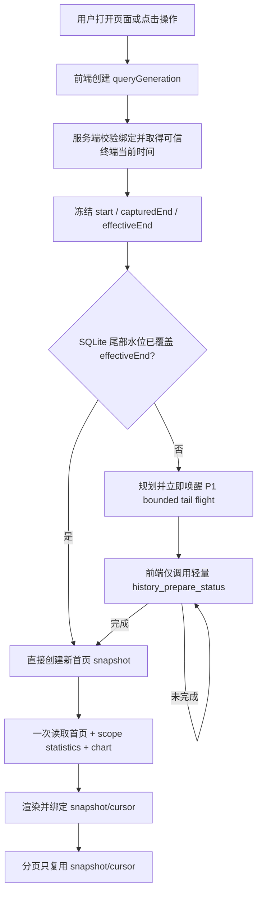

# 交易记录“当前时间冻结、范围快速切换与实时尾部同步”优化方案

> 文档状态：已完成两轮复审，可进入实施
>
> 编写日期：2026-08-11
>
> 适用范围：量见智桥 3.0、本地 SQLite 历史归档、网站 Bridge WebSocket、AI 交易实验室交易记录页面
>
> 方案基线：`dev_codex` / `a3166c6a7d0170b9983db1261ee588dc7b8eaa0d`
>
> 本文只定义实施方案，不授权修改生产数据库、发布 Bridge、部署网站或清理真实历史数据。

## 1. 结论

交易记录页面的性能问题不在 SQLite 查询或 25,897 笔历史记录本身，而在“新查询结束时间已经推进到当前时刻，但普通读取不会立即唤醒尾部同步”这一状态合同。

最终方案采用以下口径：

1. 打开交易记录，以及点击“应用范围”“筛选”“重置”“刷新”时，都创建一次新的查询代次，并从当前绑定的 MT4/MT5 可信终端时钟获取一次当前时间，冻结为本次查询的 `captured_end_utc_msc`。
2. 同一查询代次中的表格、累计统计、图表、分页、自动状态检查和最终响应共用同一个冻结结束点，不允许在重试或翻页时重新读取当前时间。
3. 已封存旧历史只读 SQLite，不重新调用 MT4/MT5 验证，不清除 coverage，不重建旧摘要。
4. 如果 `captured_end_utc_msc` 晚于 SQLite 的 `fresh_through_utc_msc`，只立即规划并唤醒这一小段未封口尾部，不等待 30 秒周期任务，不重新准备整个统计范围。
5. 尾部同步未完成时只读取轻量状态；完成后只读取一次完整首页、范围统计和图表，禁止按 `1/2/5/10` 秒重复下载约 26 KiB 的完整页面。
6. 切换范围后立即清除上一范围的统计、图表、分页和净值汇总，禁止在“全部可用历史”下短暂显示“平台接入后”的 119 笔统计，或反向显示 25,897 笔。
7. 第一页创建新快照；只有后续页才携带同一快照和不透明 cursor。第一页不得复用旧 `history_snapshot_id`。
8. 不新增独立服务、消息队列、远程历史库、管理开关或硬性限速；复用现有 WebSocket、P1 历史任务、单 Archive Worker、SQLite coverage、summary v2 和 snapshot/cursor。

## 2. 与已有方案的关系

本文是以下文档的聚焦补充：

- `docs/bridge-immutable-close-time-platform-priority-history-optimization-plan.md`
- `docs/bridge-history-fast-accurate-final-optimization-plan.md`

继续保留的既有合同：

- 已完整写入 SQLite 的旧历史不再验证。
- 交易列表、范围、筛选、排序、游标和每日聚合统一使用平仓时间。
- “平台接入后”的默认起点来自稳定账号绑定的 `first_connected_at`。
- 用户保存的起点可以早于平台接入时间，但不能早于权威 `query_floor` 和 `2000-01-01` 绝对下限。
- SQLite 仍是本地可重建投影，不替代经纪商真相；新尾部只在 MT4/MT5 可见后写入。
- 单终端历史查询保持单并发，批次上限保持 250，不提高 WebSocket 最大包体。

本文在冲突时取代的旧合同：

1. 图表和上方四项统计不再固定为最近 30 天；它们继续使用用户当前选择的完整统计范围。
2. “应用范围”后的新尾部不得被动等待 30 秒周期任务。
3. `requested_range_complete=false` 时不得继续下载完整首页作为状态探针。
4. 新查询不得继续展示上一查询代次的统计和图表。

## 3. 本地实测基线

测试环境：本地网站 `127.0.0.1:3000`、本地最新 Bridge、已绑定 MT5、管理员真实浏览器会话。

### 3.1 两种统计范围

| 范围 | 权威实际范围 | 记录数 | 完整显示耗时 | 完整 History 响应次数 | 单次 SQLite/Bridge 响应 |
| --- | --- | ---: | ---: | ---: | ---: |
| 全部可用历史 | `2000-01-01 ～ 2026-08-11` | 25,897 | 18.239 秒 | 5 | 22～110 ms |
| 平台接入后 | `2026-07-16 ～ 2026-08-11` | 119 | 28.183 秒 | 6 | 23～30 ms |

### 3.2 已确认的状态特征

慢请求期间 Bridge 返回：

```text
archive_complete=true
summary_status=ready
freshness_state=fresh
requested_range_complete=false
coverage_complete=false
backfill_pending=true
```

一次平台范围请求中：

```text
fresh_through_utc_msc       = 1786435920864
requested_range_end_utc_msc = 1786435931337
尾部差值                     ≈ 10.5 秒
```

旧历史与 summary 已经 ready，仅因为冻结结束点比尾部水位新约 10.5 秒，整个范围被前端视为不可展示。最终要等 30 秒尾部周期任务推进 coverage，再由前端退避重试命中完成状态。

### 3.3 带宽放大

每次完整响应约 25.9～26.9 KiB。当前一次范围切换会重复传输约 128～152 KiB，仅用于检查完整性状态。公网部署后还会叠加 RTT、TLS、反向代理、并发用户和弱网影响。

### 3.4 数据呈现错误

等待期间范围标签已经切换，但上方统计仍保留上一范围的值：

- 选择“全部可用历史”后仍显示 119 笔。
- 选择“平台接入后”后仍显示 25,897 笔。

该问题违反“优化不能导致数据出错”的要求，必须先于纯性能优化修复。

## 4. 目标与非目标

### 4.1 目标

1. 两种范围在 SQLite 已具备旧历史和 summary 时快速完成。
2. 每次用户发起新查询都使用新的可信当前时间作为冻结结束点。
3. 新平仓仍必须先进入 SQLite，再进入列表、统计和图表；不显示推测数据。
4. 旧历史不因查看、筛选、重置、翻页或刷新而重新从 MT4/MT5读取。
5. 尾部刷新只处理 `fresh_through` 到新 `captured_end` 附近的有界窗口。
6. 避免重复完整响应、重复 ticket 映射和错误快照请求。
7. 不降低行情、持仓、挂单和交易命令优先级。

### 4.2 非目标

本次不实施：

- 新远程历史数据库或服务端历史副本。
- 新消息队列、独立同步微服务或第二个 Archive Worker。
- 自动清理、重建或迁移真实 SQLite 历史。
- 提高历史批次上限、MT5 并发数或 WebSocket 最大包体。
- 为性能设置硬性网络限速。
- 给管理员增加性能开关、轮询间隔开关或兼容模式开关。
- 重新定义平仓时间、平台首次接入时间或已保存起点。
- 将统计或图表缩回最近 30 天。

## 5. 权威时间合同

### 5.1 当前时间来源

“当前时间”必须来自当前稳定账号对应的可信终端时间合同：

```text
terminal_instance_id + platform + normalize(broker_server) + login
```

时间转换规则：

1. 优先使用当前 MT4/MT5 已验证服务器时钟及其 UTC 映射。
2. 休市或报价未推进时，允许使用该终端最近一次已验证并持久化的时差。
3. 禁止使用浏览器 `Date.now()` 作为权威结束点。
4. 禁止使用网站服务器本地时区猜测终端时间。
5. 时钟不可验证时失败关闭，页面显示“终端时间未校准，无法建立历史快照”。

### 5.2 两个结束时间字段

每个新查询包含：

```text
captured_end_utc_msc        本次操作取得的可信当前时间
effective_range_end_utc_msc 最终参与查询的半开区间结束点
```

规则：

- `all`、`platform`：`effective_range_end_utc_msc = captured_end_utc_msc`。
- `custom` 且结束日早于当前终端业务日：`effective_range_end_utc_msc` 使用所选结束日下一终端业务日 `00:00:00` 的 UTC 映射，即按半开区间完整包含所选结束日；同时仍保留本次 `captured_end_utc_msc` 作为审计时间。
- `custom` 的结束日是当前终端业务日或为空：最终结束点不得晚于 `captured_end_utc_msc`。
- 所有范围使用 `[start, end)` 半开区间。

### 5.3 查询代次内冻结

以下内容必须在首个服务端响应或快照中冻结：

- 当前稳定账号身份；
- `allowed_range`；
- `system_range`；
- `effective_range`；
- `captured_end_utc_msc`；
- 终端时区偏移和校准状态；
- `history_snapshot_id`；
- `history_revision` 与 `summary_revision`。

自动状态检查、最终数据读取和分页只能比较或复用这些值，不得重新解释日期。

## 6. 用户操作与结束点刷新矩阵

| 操作 | 新查询代次 | 重新取得当前时间 | 新首页快照 | 保留统计起点 | 改变表格平仓筛选 |
| --- | --- | --- | --- | --- | --- |
| 首次打开交易记录 | 是 | 是 | 是 | 是 | 否 |
| 点击“刷新” | 是 | 是 | 是 | 是 | 否 |
| 点击“应用范围” | 是 | 是 | 是 | 使用当前控件值 | 否 |
| 点击“筛选” | 是 | 是 | 是 | 是 | 使用当前筛选值 |
| 点击“重置” | 是 | 是 | 是 | 是 | 清空 |
| 点击图表柱状图 | 否 | 否 | 否 | 是 | 只设置该平仓日 |
| 翻到下一页/上一页 | 否 | 否 | 否 | 是 | 保留 |
| 自动检查同步状态 | 否 | 否 | 否 | 是 | 保留 |
| 浏览器重绘或响应式切换 | 否 | 否 | 否 | 是 | 保留 |

### 6.1 “重置”的精确定义

“重置”只清除：

- 开仓开始/结束时间；
- 平仓开始/结束时间；
- 方向；
- 盈亏；
- 图表柱状下钻选中态；
- 当前页码与续页 cursor。

“重置”不清除：

- 统计范围模式；
- 用户已保存的开始日期；
- 稳定账号的 `first_connected_at`；
- SQLite 历史、coverage 或 summary。

## 7. 最终数据流



## 8. Bridge 尾部同步设计

### 8.1 已封存覆盖与最新尾部分离

Bridge 必须分别表达：

- `archive_complete`：旧历史下限到已封存水位的归档事实；
- `fresh_through_utc_msc`：最近一次成功检查到的尾部结束点；
- `tail_refresh_pending`：新尾部检查正在排队或执行；
- `requested_range_complete`：本次冻结结束点是否已由成功尾部检查覆盖；
- `summary_status`：摘要 generation 是否与 `history_revision` 一致。

启动尾部任务不得把已完成旧 coverage 清空或把 `archive_complete` 改回 false。

### 8.2 尾部任务范围

尾部任务使用现有 sealed cursor、`fresh_through` 和 overlap：

```text
tailStart = max(
  HISTORY_COVERAGE_START,
  latestSealedClose - overlap,
  freshThrough - overlap
)

tailEnd = captured_end_utc_msc
```

约束：

- 只读取最新短窗口。
- overlap 复用现有常量，不新增管理员配置。
- 同 ID 历史保持不可变；重复记录只计 duplicate，不更新旧行。
- 尾部查询成功但没有新平仓时，也必须把 `fresh_through` 推进到 `tailEnd`。
- 没有新 sealed trade 时不推进 `history_revision`；只推进尾部水位和完成状态。
- 有新 trade 时，原始记录、受影响 summary v2 日期和 revision 同事务提交。

### 8.3 调度优先级与合并

- 用户新查询触发的尾部任务使用现有 P1。
- 允许当前正在提交的单个历史批次完成，随后 P1 抢占 P2/P3。
- 相同稳定账号、重叠尾部范围只保留一个 flight；新的结束点只单调扩展现有 flight 的 `range_end`。
- 持仓消失、平仓命令完成、30 秒周期检查和用户查询触发必须合并，禁止重复调用 MT5。
- 30 秒周期任务继续作为兜底，但不再决定用户操作的完成时间。

## 9. 轻量状态合同

### 9.1 最小新增动作

新增一个内部 Bridge 动作：

```text
history_prepare_status_v1
```

它接收服务端已经冻结并校验的范围，幂等执行“确保该尾部范围已有 P1 flight”，随后只返回 SQLite 状态和当前任务，不读取 orders、chart 或完整 statistics。重复调用相同冻结范围只能复用或扩展既有 flight，不能重复创建 MT5 查询。响应目标小于 1 KiB：

```json
{
  "status": "success",
  "history_sync": {
    "requested_range_complete": false,
    "tail_refresh_pending": true,
    "fresh_through_utc_msc": 0,
    "history_revision": 0,
    "summary_revision": 0,
    "summary_status": "ready"
  }
}
```

实际响应继续包含账号隔离和冻结范围校验，但不得包含订单、凭据、完整 cursor 或敏感终端信息。Store 状态读取保持只读；规划副作用只发生在 Core/Session 的既有幂等 planner 中。

### 9.2 为什么不新增推送事件总线

初稿考虑过新增 `history_sync_completed` 推送事件。复审后不采用，原因是：

- 需要扩展 Bridge、服务端连接恢复、订阅重放和前端事件生命周期；
- 断线期间仍需要状态查询兜底；
- 当前问题只需要小于 1 KiB 的本地状态读取；
- 新事件系统不能显著提高数据正确性。

因此首期使用现有 WebSocket 请求响应模型和轻量状态动作。未来只有状态查询成为可测量瓶颈时才单独评估推送。

### 9.3 状态检查节奏

建议：

```text
200 ms → 400 ms → 800 ms → 1,000 ms
```

达到 1 秒后保持 1 秒，仅传输轻量状态。该节奏不是网络限速，不限制 Bridge 工作速度；它只避免浏览器高频空转。

如果用户发起新的查询代次，旧代次立即停止检查。页面离开交易记录 Tab 后停止检查，返回时重新创建当前时间查询。

## 10. 服务端范围与快照合同

### 10.1 新首页请求

浏览器提交：

- `history_scope`；
- 可选 `scope_start_override`；
- 表格筛选；
- `page_size`；
- 用户操作类型，仅用于观测。

浏览器不提交权威 `Date.now()`。服务端在当前绑定和可信终端时钟下解析结束点。

### 10.2 第一页与续页

第一页：

- 不携带旧 `history_snapshot_id`；
- 不携带 cursor；
- 服务端创建新 snapshot；
- 冻结完整范围元数据。

续页：

- 必须同时携带 `history_snapshot_id + cursor`；
- 必须复用原 `captured_end_utc_msc` 和冻结范围；
- 任一字段不匹配时失败关闭；
- 前端只能重新创建第一页，不得把旧 snapshot 填入新范围。

### 10.3 并发与旧响应隔离

前端维护单调递增的 `historyQueryGeneration`。所有响应落地前检查：

```text
generation
stable account identity
scope/effective start
captured end
snapshot id
```

任一不匹配即丢弃，不得覆盖用户后来选择的范围。

## 11. 前端状态与交互

### 11.1 状态机

```text
idle
  -> preparing_time
  -> syncing_tail | loading_snapshot
  -> ready
  -> unavailable
```

不得用同一个 `loading` 布尔值混合范围解析、尾部同步和完整数据读取。

### 11.2 新查询开始时

立即执行：

- 清空 `chartTotalTrades/chartWinRate/chartProfitFactor/chartMaxDD`；
- 销毁或清空旧 chart；
- 清空盈利、信用、入金、提款和结余；
- 清空 pager 和旧 filtered count；
- 表格改为“正在同步截至终端当前时间的平仓记录”；
- 保留筛选控件和保存的范围起点；
- 标记 `aria-busy=true`，状态文字通过 `aria-live` 更新。

禁止把旧统计留在新范围标题下。

### 11.3 完成后

一次性提交 UI：

- 权威实际起止时间；
- 20 条首页明细；
- 完整范围总交易、胜率、盈亏比和最大回撤；
- 完整范围图表；
- 盈利、信用、入金、提款和结余；
- 总记录数和分页；
- 数据截止终端时间。

### 11.4 错误与不可用

- 时钟未验证：不发历史范围请求，显示时钟错误。
- Bridge 离线：保留筛选输入，但不把旧数据标成当前。
- 尾部同步失败：显示稳定错误码和“重试”，不回退浏览器时间。
- status 超时：继续显示“同步中”，允许用户主动重试或离开页面；不显示伪零。
- `history_cursor_invalid`：记录指标并重建第一页；不得无限自动重试。

## 12. ticket 映射与前端带宽

当前每次 History 重试还会重复读取：

- `signal_tickets`；
- `close_signal_tickets`。

优化为：

1. 轻量状态检查不读取任何 ticket 映射。
2. 最终首页只读取一次映射。
3. 按 `accountContextGeneration + history_revision` 缓存映射。
4. 相同 key 的并发请求复用同一个 Promise。
5. 信号执行事件只使相关映射 revision 失效，不清除无关历史 snapshot。

## 13. 文件级实施范围

### 13.1 前端

- `public/ai/app.js`
  - 新查询代次与状态机；
  - 操作触发矩阵；
  - 清除旧范围呈现；
  - 轻量 status 检查；
  - 第一页/续页 snapshot 规则；
  - ticket 映射去重。
- `public/ai/index.html`
  - 状态文案和无障碍属性；
  - 更新静态资源 cache key。
- `public/ai/styles.css`、`public/ai/responsive.css`
  - 仅在现有组件无法表达同步状态时增加最小样式；不重做页面布局。

### 13.2 网站服务端

- `server/bridge-ws.js`
  - 权威终端当前时间冻结；
  - status 动作代理与范围绑定；
  - 第一页/续页严格合同；
  - 稳定错误码和观测字段。
- `server/bridge-v3/business-adapter.js`
  - 仅在 capability 白名单需要时增加 `history_prepare_status_v1`；
  - 不放宽任意字段转发。

### 13.3 Bridge native

- `bridge/native/apps/bridge-core/src/lib.rs`
  - 新 capability 和 prepare/status 路由；
  - 缺失尾部时立即规划 P1，而非等待周期任务。
- `bridge/native/crates/bridge-terminal-session/src/lib.rs`
  - bounded tail 唤醒和重叠 flight 合并；
  - 无新记录时推进 `fresh_through`。
- `bridge/native/crates/bridge-store/src/lib.rs`
  - 只读 status；
  - 保持旧 coverage；
  - tail waterline 与 revision 事务语义。

### 13.4 预计不需要修改

- MySQL schema 和 `server/migrations.js`；
- MT5 Worker 的历史数据结构；
- MT4 EA 协议；
- 统计字段和 summary v2 schema；
- 账户首次接入时间存储。

若实施中发现必须新增持久化字段，应停止该阶段并单独复审，不得顺带修改生产数据库。

## 14. 能力兼容

新 Bridge capability：

```text
history_prepare_status_v1
```

服务端行为：

- 新 Bridge：使用立即尾部准备和轻量状态读取。
- 旧 Bridge：保持旧 history 路径并明确标记 `history_prepare_status_unsupported`，不得假装已经使用优化链路。
- 页面可回退为旧“统计准备中”，但不得显示上一范围统计。
- capability 不匹配不得放宽 cursor、范围或身份校验。

本地验收只针对当前最新 Bridge；发布验收必须分别检查兼容服务端和新 Bridge。

## 15. 可观测性

每个新查询记录以下非敏感指标：

- `trigger`：enter/apply/filter/reset/refresh；
- `scope`；
- `tail_gap_msc`；
- `tail_job_planned` 与合并结果；
- `status_check_count`；
- `time_to_first_table_ms`；
- `time_to_statistics_ms`；
- `full_response_count`；
- `response_bytes`；
- `history_revision/summary_revision`；
- `history_cursor_invalid_count`；
- 稳定错误码。

日志禁止记录完整订单、账号凭据、snapshot/cursor 全文或交易备注。

## 16. 分阶段实施

### 阶段 A：前端正确性边界

1. 新查询立即清除旧范围统计、图表和 pager。
2. 增加 query generation，隔离旧响应。
3. 第一页不再发送旧 snapshot。
4. 明确操作触发矩阵和 custom end 行为。

验收：即使 Bridge 继续使用旧链路，也不能再出现范围与旧统计错配或第一页快照错误。

### 阶段 B：轻量状态与可信当前时间

1. 服务端冻结权威终端当前时间。
2. 增加 `history_prepare_status_v1` capability。
3. Bridge Store 提供小于 1 KiB 的只读状态。
4. 服务端绑定当前账号、范围和 capability。

验收：状态检查不返回 orders、statistics 或 chart。

### 阶段 C：立即 bounded tail

1. 新查询发现尾部缺口时规划 P1。
2. 合并重叠 flight 并立即 wake。
3. 无新记录时推进 fresh-through。
4. 不改变已 sealed coverage 和 history revision。

验收：新查询不再等待 30 秒周期任务。

### 阶段 D：前端状态检查与最终单次读取

1. 使用轻量状态节奏等待。
2. ready 后只调用一次完整 History。
3. ticket 映射复用和去重。
4. 离开 Tab、账号切换和新查询时取消旧检查。

验收：一次范围操作完整 History 响应不超过一次。

### 阶段 E：完整验证

1. Rust Store/Session/Core 测试。
2. MT5 Worker 回归测试。
3. Node Bridge 路由和 adapter 测试。
4. 前端范围、筛选、分页和 stale response 测试。
5. 本地最新 Bridge 真机浏览器测试。
6. 25,897 笔与 119 笔两种范围性能复测。

## 17. 测试方案

### 17.1 Rust 确定性测试

- 已覆盖旧范围 + 10 秒尾部缺口只创建 bounded P1。
- 新结束点扩展现有 flight，不重复创建任务。
- 尾部无新记录仍推进 `fresh_through`。
- 尾部无新记录不推进 `history_revision`。
- 新 trade 原始行、summary 日期和 revision 同事务提交。
- tail job 不清空旧 coverage。
- prepare/status action 幂等合并 P1，且不扫描 history rows。
- 30 秒周期任务与用户 P1 合并。

### 17.2 服务端测试

- 当前时间来自可信终端时间，不来自浏览器。
- all/platform 的 effective end 等于本次 captured end。
- custom 历史日期保持显式 end，同时审计本次 captured end。
- 第一页拒绝旧 snapshot；续页要求 snapshot + cursor。
- status 响应与当前 binding、范围、账号一致。
- 旧 capability 返回稳定 unsupported。
- 时钟不可验证失败关闭。

### 17.3 前端测试

- enter/apply/filter/reset/refresh 创建新 generation。
- chart drilldown、pagination、automatic status 不创建新 generation。
- 新 generation 立即把上一范围统计改为 `--`。
- 旧 generation 响应不能覆盖新范围。
- pending 阶段不请求 ticket maps 或完整 History。
- ready 后只请求一次完整 History。
- 重置保留统计范围和保存起点。
- 全部/平台/自定义日期及 custom today 边界。
- 第一页无 snapshot，续页有 snapshot + cursor。
- `history_cursor_invalid` 只进行一次安全第一页恢复。

### 17.4 本地浏览器验收

分别执行：

1. 首页进入交易记录。
2. 平台接入后 → 全部可用历史。
3. 全部可用历史 → 平台接入后。
4. 筛选、重置、应用范围、刷新。
5. 点击柱状图，再翻页。
6. 快速连续切换范围。
7. Bridge 断线、重连和时钟不可验证。

抓取：DOM 可见时间、WebSocket action、响应大小、console 错误和最终统计。

## 18. 性能验收门槛

### 18.1 本地最新 Bridge

| 指标 | 目标 |
| --- | ---: |
| SQLite 已覆盖、无需尾部检查时表格 P95 | `< 500 ms` |
| SQLite 已覆盖、无需尾部检查时统计/图表 P95 | `< 700 ms` |
| 存在小尾部缺口时完整页面 P95 | `< 2 s` |
| 单次范围操作完整 History 响应 | `≤ 1` |
| 单次轻量 status 响应 | `< 1 KiB` |
| `history_cursor_invalid` | `0` |
| 上一范围统计短暂显示 | `0 次` |

### 18.2 数据结果

以本次本地账号为基线：

- 全部可用历史：25,897 笔；
- 平台接入后：119 笔；
- 上方四项统计、资金汇总、图表和分页必须与修改前最终 ready 状态一致；
- 优化不得通过缩短范围、隐藏交易或读取旧统计达标。

如果测试期间产生新平仓，应冻结测试结束点并按该结束点重新建立对照，不得把正常新增误判为统计回归。

## 19. 回滚

本方案预计不需要数据库迁移，回滚按代码层进行：

1. 前端可回退轻量 status 流程，但必须保留“清除旧范围数据”和“第一页不复用 snapshot”两项正确性修复。
2. 服务端可停止调用新 capability，旧 Bridge 路径继续工作。
3. Bridge 可停止用户 P1 尾部唤醒，30 秒周期兜底仍保留。
4. 不删除 SQLite coverage、summary v2 或已归档历史。
5. 不恢复重复完整页面轮询作为长期方案；仅可作为短期诊断回退，并明确标记性能退化。

回滚触发条件：

- 新平仓可见性变差；
- revision 或 summary 不一致；
- 历史命令影响行情/交易 p95 超过 10%；
- 账号或范围隔离失败；
- cursor/snapshot 错误率上升。

## 20. 第一轮复审：需求覆盖、最小改动与过度设计

### 20.1 检查内容

第一轮逐项核对：

- 用户要求每次新操作取得当前时间；
- 同一次查询不能因重试不断改变结束点；
- 全部与平台范围都要快速；
- 旧历史以 SQLite 为准；
- 优化不能显示错误或过期范围数据；
- 图表和上方统计继续使用完整统计范围；
- 是否复用了现有 Bridge 能力；
- 是否引入不必要的新服务、配置或并发。

### 20.2 初稿发现的问题

1. 如果直接在浏览器执行 `Date.now()`，会破坏终端时间语义并产生时钟漂移。
2. 如果每次自动重试都重新获取当前时间，范围永远向前移动，snapshot 无法稳定。
3. 如果只缩短前端轮询间隔，仍会重复下载完整 26 KiB 页面，治标不治本。
4. 如果仅展示 SQLite 旧 snapshot 而不立即检查尾部，虽然快但会引入最多约 30 秒滞后。
5. 如果新增完整推送事件总线，需要处理订阅恢复、重放和断线兜底，超过当前问题所需。
6. 如果通过第二个 Archive Worker 并行 MT5 查询提速，会威胁实时命令优先级。
7. 如果点击图表和翻页也重新获取当前时间，会污染统计范围和 cursor。
8. 如果新范围继续保留旧统计，数据标签与内容不一致。

### 20.3 已做调整

- 当前时间改为服务端基于可信终端时钟一次性冻结。
- 明确定义查询代次和操作触发矩阵。
- 使用轻量 status 动作，不新增事件总线。
- 新查询立即触发 bounded P1 tail，兼顾实时性和速度。
- 保持单 Worker、250 批次和现有优先级。
- 图表下钻和分页复用冻结范围。
- 新查询立即清空旧范围呈现。
- 不新增管理员开关、配置表或数据库迁移。

第一轮结论：调整后的方案覆盖需求，改动集中在现有前端、Bridge WebSocket、Core/Session/Store；没有用大规模架构重构解决一个尾部调度和状态读取问题。

## 21. 第二轮复审：兼容、并发、时间、异常与连带 Bug

### 21.1 兼容与数据

- capability 明确区分新旧 Bridge，旧客户端不会收到无法理解的字段。
- 旧 SQLite coverage 和 summary 继续读取，不需要 destructive migration。
- all/platform/custom 起点合同不变。
- 完整范围图表和累计统计不被缩短。
- 资金事件继续按自身事件时间处理，不混入 trade close-time 排序。

### 21.2 并发与幂等

- 用户快速重复点击通过 generation 隔离旧响应。
- 相同账号重叠 tail flight 合并并单调扩展结束点。
- 无新交易的 tail 不推进 history revision。
- 新交易仍按 immutable key 去重，重复和冲突不能覆盖旧记录。
- P1 只在批次边界抢占，不中断进行中的 MT5 调用。

### 21.3 时间与快照

- 当前时间只在新查询开始时获取一次。
- 重试、状态检查和分页不移动结束点。
- custom 历史结束日不会被当前时间覆盖。
- 终端时钟不可验证时不回退浏览器时间。
- 第一页和续页 snapshot 规则消除当前偶发 `history_cursor_invalid`。

### 21.4 异常恢复

- Bridge 离线或 status 失败不显示伪零和上一范围统计。
- 页面离开后停止状态检查，返回时重新取得当前时间。
- 连接恢复后创建新 generation，不继续使用断线前 snapshot。
- Archive Worker 崩溃按既有持久化 job 恢复，不重扫 sealed archive。

### 21.5 安全与授权

- 每次请求继续校验当前有效 binding、用户授权和唯一终端路由。
- 稳定账号历史连续不等于跨用户公开。
- status 不返回交易明细、凭据或完整 cursor。
- 本方案不修改交易权限、订阅、策略或自动分析设置。

### 21.6 第二轮发现并修正的问题

第二轮最初发现：若“应用范围”直接复用 `force_refresh=true` 的现有完整 History 动作，虽然会立即唤醒尾部，但仍会先返回一次约 26 KiB 的 incomplete 页面，随后再返回完整页面，带宽仍重复。

最终调整为：新增单一幂等轻量 prepare/status capability，把“确保尾部任务并读取状态”和“读取完整首页”拆开；只有 status ready 后才读取完整页面。该调整避免重复大响应，同时没有新增服务、第二个动作或持久化表。

第二轮结论：调整后在兼容、数据、并发、幂等、异常恢复、时间语义、安全、测试和回滚方面形成闭环，可进入实施。

## 22. 剩余风险

静态方案无法消除以下真实端风险，必须在实施后实测：

1. MT4/MT5 刚平仓后，终端历史源自身可能短暂不可见；页面必须继续显示同步状态，不得猜测记录。
2. MT4 可查询历史取决于终端“账户历史”可见范围，不能宣称券商全量完整。
3. 极端多笔同毫秒平仓仍依赖现有复合 cursor 和边界 overlap 正确去重。
4. 未来多年跨度账号的完整范围图表可能包含大量业务日；本次 25,897 笔响应约 27 KiB，暂不为未出现的图表瓶颈增加采样服务。
5. 旧 Bridge 回退路径仍可能较慢，但必须明确标记 capability 不支持；本地最新 Bridge 验收不受其影响。

## 23. 最终验收清单

- [ ] 首次进入交易记录取得一次可信终端当前时间。
- [ ] 应用范围、筛选、重置、刷新分别取得新的可信当前时间。
- [ ] 自动状态检查、图表下钻和分页不改变结束点。
- [ ] all/platform 使用当前冻结结束点，custom 正确处理历史结束日和当天上限。
- [ ] 新查询立即清空上一范围统计、图表、资金汇总和分页。
- [ ] 已 sealed 旧历史不触发 MT4/MT5 验证。
- [ ] 小尾部缺口立即创建或合并 P1 tail，不等待 30 秒周期任务。
- [ ] 无新记录时推进 fresh-through 且不推进 history revision。
- [ ] 状态检查响应小于 1 KiB，不返回完整 History。
- [ ] ready 后完整 History 只读取一次。
- [ ] ticket mappings 不在状态检查中重复读取。
- [ ] 第一页无旧 snapshot，续页必须 snapshot + cursor。
- [ ] `history_cursor_invalid` 为 0。
- [ ] 全部历史与平台接入后本地 P95 达标。
- [ ] 25,897 与 119 笔基线统计结果保持一致。
- [ ] 上方统计、资金汇总、完整范围图表与修改前最终 ready 结果一致。
- [ ] 行情、持仓、挂单和交易命令 p95 不劣化超过 10%。
- [ ] Rust、MT5 Worker、Node/Vitest 和真实本地浏览器验收全部通过。
