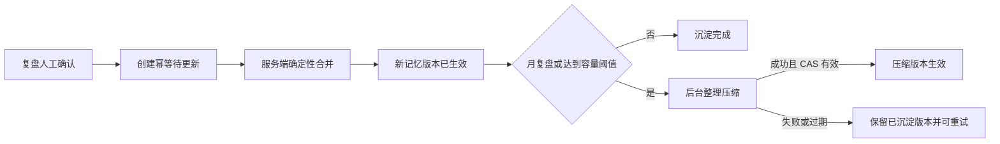

# 统一策略记忆库纠正修复方案

## 1. 方案结论

本方案修复统一策略记忆库上线后发现的四类问题：

1. 月复盘已经确认、待更新和压缩任务也显示成功，但新经验没有进入当前记忆库。
2. 自动分析虽然实际传入了记忆库，但注入日志没有关联信号、推理快照和模型任务。
3. 实时模型对比、手动交易复盘等策略相关模型调用尚未统一注入记忆库。
4. 旧记忆迁移产生的原始“适用条件 JSON”和“迁移来源”仍进入模型上下文，既无运行时筛选作用，也可能误导分析。

修复采用以下原则：

- **持久沉淀与模型压缩分离。** 已确认复盘先由服务端确定性合并到当前记忆库并形成不可变版本；压缩只能整理已经安全落库的内容，不能决定新经验是否被保存。
- **压缩失败不回滚沉淀。** 月度整理失败时，已确认经验仍留在当前库，任务可重试，但不得显示为经验丢失。
- **不再保存机器化适用条件正文。** 删除记忆正文中的原始适用条件 JSON 和迁移来源标记；真正必要的适用边界写成自然语言经验。
- **策略相关的当前推理统一注入。** 手动分析、自动分析、实时模型对比、日/月复盘、手动交易复盘和记忆压缩都使用对应策略的完整记忆库；历史回放只能使用原始推理快照，不注入当前记忆。
- **不修改策略。** 记忆与策略冲突仍只累计证据；至少 3 个不同、已确认复盘指向同一冲突后才提醒人工检查策略。

本方案是对 `docs/unified-strategy-memory-library-plan.md` 已实施部分的纠正补充，只替换其中有缺陷的“待更新与压缩一次完成”合同，不恢复短期记忆、长期记忆或按需检索。

## 2. 已确认的故障证据

### 2.1 月复盘出现假成功

本地数据库当前存在完整复现：

- 月复盘：`period_review_cases.id = 1201`，周期 `2026-07`。
- 已批准版本：`period_review_versions.id = 39`。
- 派生任务：`period_review_derivation_jobs.id = 16`，状态 `succeeded`。
- 待合并更新：`strategy_memory_pending_updates.id = 1`，包含 15 条月复盘经验，状态 `merged`。
- 月度压缩任务：`strategy_memory_compression_jobs.id = 2`，状态 `succeeded`，结果版本为 `3`。
- 当前记忆库已升为 v3，但 v2 与 v3 的 `content_hash` 都是 `045626252e9234c061dfcf9d43cb8af72e216e1765d643c88f8616df7131cc42`，正文完全相同。
- 当前正文仍只有旧系统迁移的 3 条平台经验，未包含待更新记录 #1 的月复盘内容。

故障根因：

- 压缩模型只需返回 `content_text`，没有返回或证明已纳入哪些待更新。
- 服务端只验证输出类型和字符数，不验证新经验是否被保留。
- 应用压缩结果时，无条件把冻结的待更新 ID 标为 `merged`，然后把压缩任务标为 `succeeded`。

因此，该状态是服务端数据完整性缺陷，不是前端缓存或刷新延迟。

### 2.2 自动分析注入日志缺少归属

本地 `strategy_memory_injection_logs` 已记录 10 次 `auto_inference`，证明自动分析读取了记忆库版本；但 10 条记录的：

- `signal_id` 全部为空；
- `inference_snapshot_id` 全部为空；
- `model_task_id` 全部为空。

代码在更新关联时引用了错误变量 `modelTask`，实际持久任务对象为 `modelTaskTracker`。异常被记录后继续运行，因此不影响模型请求，却破坏了后续审计链路。

### 2.3 模型调用覆盖不完整

已核实的当前覆盖：

| 模型调用 | 当前是否使用完整记忆库 | 修复目标 |
|---|---:|---|
| 手动行情分析 | 是 | 保持并补强日志断言 |
| 自动分析 | 是 | 修复信号、快照、任务关联 |
| 日复盘生成 | 是 | 保持冻结版本 |
| 月复盘分块与汇总 | 是 | 保持整月同一冻结版本 |
| 记忆压缩 | 是 | 改为只压缩已落库正文 |
| 实时模型对比 | 否 | 注入当前完整记忆库并冻结版本 |
| 手动交易复盘 | 否 | 注入当前完整记忆库并冻结版本 |
| 历史模型回放 | 不应注入当前记忆 | 使用原推理快照；保持历史可重现性 |
| 模型保存验证、连接测试 | 无策略上下文 | 不注入记忆库 |

### 2.4 “适用条件”是旧系统迁移残留

当前正文中的以下内容来自迁移 181：

```text
适用条件：{"applicable_when": ...}
迁移来源：platform_item #12
```

统一记忆库运行时不再按这些字段筛选条目，每次请求直接传入完整正文。因此原始 JSON 没有检索作用，却会增加上下文、放大旧行情标签的影响，并让模型误以为它们是当前硬约束。

## 3. 修复后的权威状态模型

### 3.1 两阶段沉淀

确认日/月复盘后的状态必须分为两个独立阶段：

1. **确定性沉淀阶段**
   - 从已批准复盘版本生成规范化记忆文本。
   - 事务锁定策略记忆库和待更新记录。
   - 服务端按固定 Markdown 边界把更新原文合并到当前库。
   - 创建新修订版本并记录来源复盘 case/version。
   - 只有当前库 CAS 成功后，才能把待更新标为 `merged` 并填写真实 `merged_revision_id`。

2. **可选整理阶段**
   - 月复盘每次都排队整理；日复盘仅在容量阈值触发时排队。
   - 输入只使用已经成为当前版本的完整记忆库，不再携带尚未落库的待更新作为“希望模型记得合并”的旁路输入。
   - 压缩结果失败、超限、无效或供应商状态未知时，当前库保持在已沉淀版本。
   - 压缩成功且 CAS 未变化时再创建一个 `monthly_review_compression` 或 `capacity_compression` 版本。

状态关系：



### 3.2 容量边界

普通追加后的组合文本若不超过 `capacity_chars`：

- 直接确定性追加并生成版本；
- 月复盘随后异步压缩；
- 日复盘按阈值决定是否压缩。

若“当前库 + 待更新原文”会超过容量：

1. 不把超限正文切换为当前运行时版本。
2. 模型只压缩**旧的当前库**，目标字符数为：

   `floor(capacity_chars * compression_target_ratio) - 待更新正文字符数 - 固定章节开销`

3. 服务端把压缩后的旧库与待更新原文确定性拼接。
4. 最终组合文本通过容量校验后，才原子切换并把待更新标为已合并。
5. 待更新正文自身已超过可用容量时安全失败，要求人工整理；不得截断或宣称成功。

这样即使模型完全忽略新经验，服务端仍会把新经验逐字加入最终版本。

### 3.3 无变化结果

- 没有待更新的人工压缩，如果输出哈希等于源哈希，任务可标记为 `succeeded_noop`，但不创建重复版本。
- 有待更新时不得通过“源哈希不变”完成沉淀；新版本必须包含服务端追加的更新块，并记录来源。
- 压缩任务的成功只表示整理成功；复盘沉淀成功由待更新和目标修订的持久关系判断，不能用压缩任务状态代替。

## 4. 记忆内容格式与适用条件处理

### 4.1 新正文格式

新增复盘经验使用可读 Markdown，并保留稳定来源标题：

```markdown
## 2026-07 月复盘确认经验

- 当缠论结构不可靠时，应转为观望，不得强行输出方向信号。
- 突破入场必须等待 K 线收盘确认，避免追逐假突破。
```

标题只用于人工阅读、去重和审计，不参与运行时检索。

### 4.2 取消机器化适用条件

从当前记忆正文和后续压缩合同中取消：

- `applicable_when` 原始 JSON；
- `avoid_when` 原始 JSON；
- `迁移来源：platform_item #...` 等内部表名和 ID；
- 要求压缩模型“保留适用条件”的旧提示。

仍应保留自然语言条件，例如：

- “当 H1 结构不可靠且 H4 也无法提供有效方向证据时，应观望。”
- “突破 K 线尚未收盘确认时，不追单。”

结构化 `applicability` 可继续存在于月复盘分块证据中，用于区分互相矛盾的市场环境和验证模型输出；但它不写入运行时记忆正文，也不作为条目检索条件。

### 4.3 来源与审计

来源信息保留在数据库字段中，而不是传给模型的正文中：

- `source_period_case_id`；
- `source_period_review_version_id`；
- `source_refs_json`；
- 修订的 `source_type/source_id/source_metadata_json`；
- 审计日志中的操作者、修复批次和原因。

## 5. 数据库与迁移策略

### 5.1 不修改迁移 181

迁移 181 已在本地数据库执行。即使当前代码尚未发布，也不应通过修改已经执行的迁移正文来修复数据，因为这会造成不同环境同一迁移 ID 对应不同结构或数据语义。

新增幂等纠正迁移 `182_strategy_memory_merge_integrity`，仅添加必要的状态/索引/审计能力，不直接批量重写用户记忆正文。

建议新增或扩展字段：

- `strategy_memory_compression_jobs.result_content_hash`：记录模型整理结果哈希。
- `strategy_memory_compression_jobs.result_validation_status`：`pending | accepted | rejected | noop`。
- `strategy_memory_compression_jobs.result_validation_json`：记录目标、源哈希、最终哈希、字符数及失败原因，不保存秘密或完整提示词。
- `strategy_memory_library_revisions.source_metadata_json` 继续记录纳入的待更新 ID 和来源复盘版本，不新增第二套运行时内容。

如果实现评审证明现有字段足以表达全部状态，可以减少新字段；但不得通过复用 `succeeded` 同时表达“复盘已经沉淀”和“压缩请求完成”。

### 5.2 幂等与并发

- 待更新仍以 `strategy_id + update_kind + source_period_review_version_id` 去重。
- 确定性沉淀事务必须锁定当前库行、待更新行和目标策略状态。
- 当前库更新继续比较 `version_no + content_hash`。
- 修订版本号在同一事务内生成。
- 月度压缩以已沉淀的新版本为源版本；人工编辑导致源版本变化时标记 `stale`，不覆盖人工内容。
- worker 重启、租约过期或模型状态未知不能重复应用同一结果。

## 6. 现有本地错误数据修复

该步骤会修改本地数据库，只能在代码修复、测试通过并获得明确执行授权后进行。不得把它放进应用启动迁移。

### 6.1 受控修复对象

首个明确对象：

- 复盘 case `1201`；
- 批准版本 `39`；
- 待更新 `1`；
- 错误压缩任务 `2`；
- 错误结果修订 `3`；
- 当前策略 `1`、当前库 v3。

### 6.2 修复前置断言

执行脚本必须先以 dry-run 验证：

- case 1201 仍为 `approved`，批准版本仍为 39；
- 待更新 #1 的内容哈希仍为预期值；
- 待更新 #1 仍指向修订 #3；
- 压缩任务 #2 仍指向修订 #3；
- 当前库仍为 v3，且 v2/v3 哈希相同；
- 当前库正文仍未包含待更新 #1 的规范化来源标记和内容；
- 策略归属、scope 和 owner 没有变化。

任一断言不成立立即停止，不猜测新的目标。

### 6.3 修复操作

通过专用服务或脚本在单一事务内：

1. 读取当前库 v3 和待更新 #1 原文。
2. 清理当前正文中的旧“适用条件 JSON”和“迁移来源”行，但保留三条经验文本。
3. 追加 `2026-07 月复盘确认经验` 章节和待更新 #1 的 15 条内容。
4. 创建新的 `corrective_memory_merge` 修订 v4，来源元数据写明 case 1201、version 39、pending update 1、原错误 revision 3/job 2。
5. CAS 切换当前库到 v4。
6. 将待更新 #1 的 `merged_revision_id` 从 3 改为真实修订 4，保留原始创建时间。
7. 为压缩任务 #2 写入纠正审计状态或验证记录；不得删除任务、修订 3 或历史响应。
8. 写入审计日志，说明这是对“遗漏待更新却错误成功”的纠正，不伪装成人工编辑。

修复后再根据月度整理规则从 v4 创建新的压缩任务；即使该压缩失败，v4 仍是有效当前版本。

### 6.4 全库扫描

修复脚本还应提供只读扫描模式，查找所有潜在同类异常：

- 压缩任务带非空 `pending_update_ids_json` 且状态为成功；
- 结果修订哈希等于源内容哈希；
- 待更新状态为 `merged`，但目标修订的来源元数据没有该更新；
- 当前正文找不到确定性来源章节；
- 同一待更新被多个结果修订宣称合并。

扫描只生成报告。除 case 1201 外，其他对象必须逐项核实后另行授权，不做批量猜测修复。

## 7. 模型调用接入修复

### 7.1 统一上下文加载器

抽取一个策略模型上下文加载器，统一返回：

- 权威策略正文和策略版本；
- 当前记忆库全文、版本和哈希；
- 允许的操作者和策略 scope；
- 可选的注入日志 ID；
- 冻结上下文摘要，用于模型任务和重启恢复。

各调用点不得自行拼出部分记忆或退回旧短期/长期检索。

### 7.2 手动与自动分析

- 保持完整正文作为不可信用户数据传入，不放进高优先级系统指令。
- 自动分析关联日志改用 `modelTaskTracker.taskId`。
- 信号和推理快照成功持久化后必须更新注入日志；更新失败要形成可观测告警和可恢复关联任务，不能只有普通文本日志。
- 新增数据库级回归，确认一条成功自动信号能关联同一 `signal_id`、`inference_snapshot_id` 和 `inference_task_id`。

### 7.3 实时模型对比

- 在同一次对比开始时冻结一份策略和记忆库版本。
- 所有参与模型使用同一份记忆库，避免不同模型因并发读取到不同版本而失去可比性。
- 对比 checkpoint 保存记忆库版本和哈希。
- 实时对比记入 `usage_kind = model_compare_live` 的注入日志。

### 7.4 历史模型回放

- 如果原推理快照已经包含统一记忆库，则直接复用原始 `user_prompt`，不重新加载当前库。
- 老快照没有记忆库时保持没有记忆，不进行事后补注入。
- checkpoint 明确标记来源为 `original_snapshot`，防止 UI 把历史回放误解为当前记忆效果。

### 7.5 手动交易复盘

- 两阶段分析在任务开始时冻结同一个策略和记忆库版本。
- 反事实分析和结果复盘都传入该冻结版本。
- 记忆仅作为经验参考，当前策略、成交事实和风控规则优先。
- 手动交易复盘确认继续不自动写入策略记忆，除非产品另行明确授权；本次只补齐读取上下文。

## 8. 周期复盘与前端状态修复

### 8.1 后端返回真实沉淀状态

周期复盘详情增加聚合状态，至少区分：

- `approval_confirmed`：复盘已确认；
- `memory_update_queued`：待更新已创建；
- `memory_applying`：正在确定性合并；
- `memory_applied`：真实修订已成为当前库；
- `compression_queued` / `compression_running`：后台整理中；
- `compression_failed_memory_preserved`：整理失败，但经验已保存；
- `completed`：沉淀完成，若要求月度整理则整理也已结束；
- `failed`：确定性沉淀失败，尚未进入当前库。

聚合状态必须从待更新、真实修订、当前库和压缩任务联合推导，不能只读取 `period_review_derivation_jobs.status`。

### 8.2 前端文案

- 点击“确认并沉淀经验”后显示“复盘已确认，记忆正在写入”，不能立刻提示完成。
- 确定性写入成功、月度整理进行中时显示“经验已写入，正在整理记忆库”。
- 整理失败时显示“经验已保存，整理失败，可重试”，不能显示经验丢失。
- 只有当前库真实修订已关联该复盘版本时显示“经验已沉淀”。
- 移除“平台记忆候选”“个人记忆体系”等旧文案，统一使用“策略记忆库”。
- 记忆库页面显示最近来源复盘、真实修订版本、待处理数量和整理状态，便于用户核对确认操作的结果。

## 9. 冲突提醒保持的边界

- 继续只累计人工批准日/月复盘产生的 `strategy_conflicts`。
- 同一批准版本重试不得重复计数。
- 至少 3 个不同批准复盘命中同一稳定冲突键后，才进入 `attention_required`。
- 模型输出的普通经验差异或 `conflict_groups` 不等同于“记忆与策略冲突”。
- 系统不自动修改策略，也不把记忆正文变成更高优先级规则。
- 本地当前冲突表为 0 条；最近批准月复盘是旧输出格式且没有 `strategy_conflicts`，不应补造冲突证据。

## 10. 实施批次

### 批次 A：沉淀完整性状态机

修改范围预计包括：

- `server/routes/ai/strategy-memory-library.js`
- `server/routes/ai/strategy-memory-compression.js`
- `server/routes/ai/period-review.js`
- `server/migrations.js`
- 对应服务与状态机测试

完成标准：

- 服务端确定性合并后才把待更新标为 `merged`。
- 月度压缩失败不丢失已确认经验。
- 带待更新的任务无法产生“旧哈希 + 已合并”的假成功。
- 无变化人工压缩不制造重复版本。

### 批次 B：调用覆盖与审计关联

修改范围预计包括：

- `server/routes/ai/scheduler.js`
- `server/routes/ai/strategy.js`
- `server/routes/ai/manual-trade-review.js`
- 模型对比 checkpoint 和注入日志相关测试

完成标准：

- 自动信号关联真实记忆日志、信号、快照和模型任务。
- 实时模型对比的全部模型使用同一冻结库版本。
- 手动交易复盘的两个阶段使用同一冻结库版本。
- 历史回放不加载当前记忆。

### 批次 C：正文清理与界面收口

修改范围预计包括：

- 记忆正文生成和压缩提示合同；
- `public/ai/app.js`
- `public/ai/index.html`
- 前端状态和文案测试；
- 静态资产缓存键。

完成标准：

- 当前模型上下文不再出现原始 applicability JSON 和内部迁移来源。
- 页面不再显示个人/平台分层记忆旧概念。
- 月复盘确认后的每个真实后台阶段都有准确状态。

### 批次 D：受控数据修复

- 新增 dry-run 默认的专用修复脚本。
- 先扫描并输出精确对象、旧/新哈希、预计版本和行数。
- 获得执行授权后只修复通过全部断言的 case 1201 链路。
- 不删除复盘、待更新、压缩任务、错误修订或模型任务。

### 批次 E：本地端到端验收

- 重启本地 3000 端口服务。
- 使用非交易路径生成或选取测试复盘，确认一条月复盘经验真实进入记忆库。
- 触发月度整理并检查失败保护、版本和来源关联。
- 执行一次手动分析、自动分析、实时模型对比和手动交易复盘的上下文审计。
- 浏览器检查复盘详情和记忆库页面，不执行真实订单。

## 11. 测试与验收矩阵

### 11.1 服务单元测试

- 日复盘追加在容量内：正文、版本、来源、待更新状态一致。
- 月复盘追加在容量内：先产生沉淀版本，再产生整理任务。
- 当前库接近容量：模型只压缩旧库，最终结果由服务端追加新更新。
- 模型返回空文本、旧文本、超限文本或无效 JSON：待更新不丢失、不虚假完成。
- 人工编辑与压缩竞态：压缩结果变为 `stale`，不覆盖人工版本。
- worker 重试与租约恢复：同一更新最多应用一次。
- 无待更新且哈希不变：成功 no-op，不新增修订。

### 11.2 真实 MySQL 合同测试

Mocks 不能证明事务结果形状和实际外键/唯一键行为。增加隔离数据库或事务回滚型集成测试：

- 创建测试策略、记忆库、批准复盘和待更新；
- 执行确定性沉淀和压缩失败路径；
- 验证当前库、修订、待更新和任务状态的原子一致性；
- 验证自动信号注入日志关联真实信号与快照；
- 测试结束只清理测试命名空间，不触碰真实策略和历史。

### 11.3 模型调用合同测试

- 手动分析、自动分析、实时对比、日/月复盘、手动交易复盘均断言完整记忆正文及版本。
- 比较多个模型时断言哈希一致。
- 历史回放断言不读取当前库。
- 保存模型、连接测试等无策略调用断言不加载记忆。

### 11.4 前端与浏览器

- 确认后先显示排队/写入状态。
- 已写入、整理中、整理失败但经验保留、全部完成状态准确。
- 记忆页能看到对应复盘来源和新版本。
- 无旧短期/长期/候选/适用条件文案。
- 处理版本冲突、失败重试、页面刷新和长时间轮询。
- 更新静态资源缓存键，验证实际服务的 HTML 引用新键。

### 11.5 回归命令

实施时至少执行：

```powershell
node --check server/routes/ai/strategy-memory-library.js
node --check server/routes/ai/strategy-memory-compression.js
node --check server/routes/ai/period-review.js
node --check server/routes/ai/scheduler.js
node --check server/routes/ai/strategy.js
node --check server/routes/ai/manual-trade-review.js
node --check public/ai/app.js

npx vitest run tests/ai/strategy-memory-library.test.js `
  tests/ai/strategy-memory-compression.test.js `
  tests/ai/period-review.test.js `
  tests/ai/analyze-compare.test.js `
  tests/ai/manual-trade-review-static.test.js `
  tests/ai/llm.test.js `
  tests/ai/frontend-governance.test.js

npm test
```

当前审查基线中，记忆/复盘等 5 个定向文件共 158 项通过；扩大到 `llm.test.js` 后存在 1 条与缠论提示词措辞有关的现存断言失败。实施前应把它记录为基线并判断是测试过时还是提示词回归，不得把它误算成记忆修复造成的新失败。

## 12. 上线与回滚

### 12.1 上线顺序

1. 停止新的记忆压缩任务领取，但不终止已提交且状态未知的供应商请求。
2. 部署纠正迁移和兼容读取代码。
3. 部署新的确定性沉淀与压缩 worker。
4. 验证表结构、worker 恢复和当前库不变量。
5. 启用周期复盘派生。
6. 最后执行经授权的本地/目标环境数据修复脚本。

### 12.2 回滚条件

出现以下任一情况立即停止新的派生和压缩：

- 已确认更新再次出现 `merged` 但无法对应真实当前修订；
- 当前库版本或哈希出现倒退；
- 人工编辑被后台结果覆盖；
- 同一复盘版本生成多个有效沉淀版本；
- 模型输入被静默截断；
- 自动分析无法读取当前策略记忆库。

代码回滚不得删除新修订或重新启用旧短期/长期运行时。已沉淀的新版本继续保留，必要时只暂停后台 worker。

## 13. 第一轮复审：数据完整性与最小改动

### 复审结论

- 原实现的根本错误不是模型压缩质量，而是让模型决定待更新是否被持久保存。
- 仅增加 `incorporated_update_ids` 输出字段不能解决问题，因为模型可以返回 ID 但仍遗漏正文。
- 仅检查新旧哈希不同也不充分，因为模型可以修改旧文本却仍遗漏新经验。
- 因此必须由服务端确定性拼接待更新，模型只能压缩旧库或整理已经生效的完整库。

### 第一轮调整

- 把最初考虑的“要求模型返回已纳入 ID”降级为审计元数据，不作为内容完整性的唯一证明。
- 容量不足路径改为“先压缩旧库、再由服务端追加新更新”，避免临时切换超限库，也保证新更新不丢失。
- 无变化人工压缩改为 no-op，不再为相同哈希创建空版本。
- case 1201 的纠正改为专用脚本和严格前置断言，不放进迁移或应用启动流程。

### 第一轮剩余风险

- 服务端逐字保留复盘更新会留下近义重复；这是数据不丢失优先于即时去重的有意取舍，后续整理可以压缩。
- 极端情况下单次批准更新本身可能超过可用容量；必须安全失败并要求人工编辑，不能自动截断。

## 14. 第二轮复审：调用语义、兼容性与用户体验

### 复审结论

- “每次模型请求使用记忆库”必须限定为有明确策略上下文的当前分析/复盘任务；连接测试和模型保存验证没有策略，不应注入。
- 历史回放注入当前记忆会污染可重现性，因此必须使用原始快照，这是必要例外，不是遗漏。
- 手动交易复盘读取记忆并不等于批准后写入记忆；本次只补读取，避免未经产品确认扩大沉淀来源。
- 月复盘确认、记忆落库和月度整理是三个用户可感知状态，不能继续用一个 `succeeded` 标签概括。

### 第二轮调整

- 实时模型对比改为整个批次冻结一份库版本，保证模型间公平比较。
- 周期复盘详情增加真实记忆应用状态，前端只有在当前修订能追溯到批准版本后才显示“已沉淀”。
- 结构化 applicability 只留在复盘证据中，不进入运行时记忆正文；自然语言条件继续保留。
- 自动分析注入日志关联失败从普通日志提升为可观测、可恢复的数据完整性事件。
- 明确不修改已执行迁移 181，使用新的纠正迁移和应用服务修复。

### 第二轮剩余风险与实施判定

- 完整记忆库每次注入仍会增加请求大小和延迟，这是单一总库需求的固有成本；通过容量治理和压缩解决，不恢复按需检索。
- 压缩是有损整理，即使新经验先安全落库，未来压缩仍可能弱化细节。应保留全部不可变版本、来源元数据、人工回滚和真实模型验收。
- 当前工作树包含大量未提交修改，实施时必须按文件和功能边界审查 diff，不能回退或覆盖无关工作。
- 真实订单、生产数据库修复、发布和部署均不在本方案自动授权范围内，需要分别确认。

在完成批次 A 至 C、通过定向/全量测试和真实 MySQL 合同验证后，代码修复可进入本地端到端验收；数据修复必须再次取得明确执行授权。
